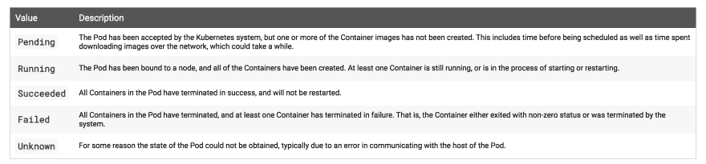

# 什么是 Kubernetes 豆荚？

> 原文:[https://dev.to/adipolak/what-are-kubernetes-pods-25jb](https://dev.to/adipolak/what-are-kubernetes-pods-25jb)

Pod 是一组一个或多个容器，例如 Docker。尽管 Kubernetes 被定义为一个容器编排器，但理解这一点很重要。它不直接运行容器。
相反，它将一个或多个容器包装到一个更高层次的结构中，即 *pod* 。

该组共享存储和网络，以及如何运行容器的规范。一个 Pod 的内容总是在一个共享的上下文中协同定位、协同调度和运行。

Pod 内的容器共享一个 IP 地址和端口空间。他们可以通过本地主机找到彼此。它们还可以使用标准的进程间通信(IPC)相互通信，比如 [POSIX 共享内存](https://www.geeksforgeeks.org/posix-shared-memory-api/)。

不同 pod 中的容器具有不同的 IP 地址，并且在没有特殊配置的情况下不能通过 IPC 进行通信。因此，他们将使用 Pod IP 地址。

Pod 内的应用程序还可以访问共享的[卷](https://dev.to/adipolak/kubernetes-storage-config-simplified-3fhn)，这些卷被定义为 Pod 的一部分，可以挂载到每个应用程序的文件系统中。

就 Docker 而言，Pod 被建模为一组具有共享名称空间和共享文件系统卷的 Docker 容器。

豆荚不耐用，有一个生命周期:

1.  豆荚被创造出来
2.  分配了唯一 ID (UID)的 pod
3.  单元被安排到节点(直到重新开始删除)

阶段状态是生命周期的一部分:

### 参考消息

*   如果某个节点在超时后失效，则计划删除该节点的 pod。
*   UID 为的 Pod 可以替换为相同的 Pod，如果需要，可以使用相同的名称，但使用新的 UID。

### ...这是一个总结！

这是 Kubernetes 豆荚在 3 分钟内！这是 Kubernetes [Bitesize 系列](https://dev.to/adipolak/kubernetes-in-bitesize-2blm)的一部分。

[T2】](https://i.giphy.com/media/l0MYOUI5XfRk4LLWM/giphy.gif)

资源:
[kubernetes . io](https://kubernetes.io/docs/concepts/workloads/pods/pod/)
[分步教程](https://dev.to/adipolak/kubernetes-and-virtual-kubelet-in-a-nutshell-gn4)