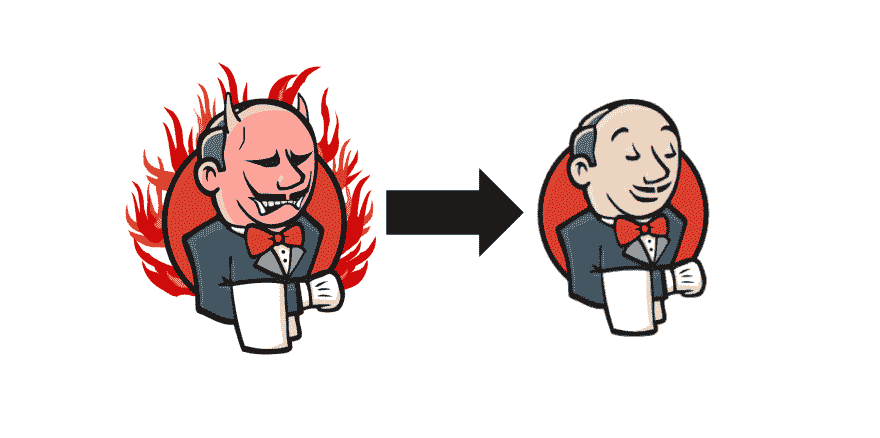
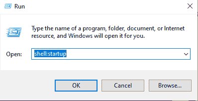
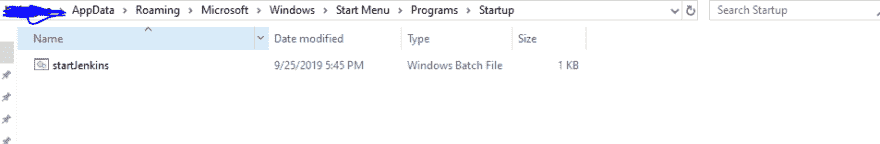
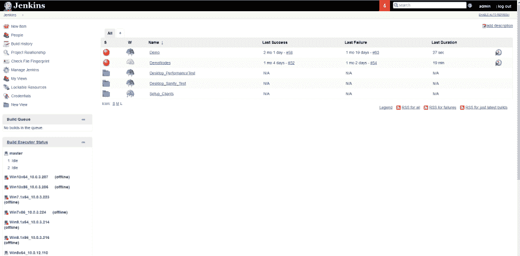

# 设置 Jenkins 在 windows 重新启动后自动启动

> 原文:[https://dev . to/cuongld 2/setup-Jenkins-to-auto start-after-windows-restart-reboot-1le 2](https://dev.to/cuongld2/setup-jenkins-to-autostart-after-windows-restart-reboot-1le2)

大家好

最近，我需要设置 Jenkins 作为在不同操作系统上对浏览器进行自动化测试的实现。

其中一个问题是，当我重启主节点时，Jenkins 也会重启，但几乎所有的作业和构建都会重启。

如果你遇到了这个问题，我有一个解决办法。

[T2】](https://res.cloudinary.com/practicaldev/image/fetch/s--cz-QEP5I--/c_limit%2Cf_auto%2Cfl_progressive%2Cq_auto%2Cw_880/https://thepracticaldev.s3.amazonaws.com/i/omjud895u23hyucwf696.png)

我不是自动运行 jenkins.xml 中的 Jenkins like 配置，而是在 windows 自动重启后运行批处理文件。

我们需要做两件事。

1.禁用 jenkins.xml 中 jenkins 的自动运行

在我的例子中，jenkins.xml 位于 C:\Program Files (x86)\Jenkins 中

jenkins.xml 文件是这样的:

```
<service>
  <id>Jenkins</id>
  <name>Jenkins</name>
  <description>This service runs Jenkins automation server.</description>
  <env name="JENKINS_HOME" value="%BASE%"/>
  <!--
    if you'd like to run Jenkins with a specific version of Java, specify a full path to java.exe.
    The following value assumes that you have java in your PATH.
  -->
  <executable>%BASE%\jre\bin\java</executable>
  <arguments>-Xrs -Xmx256m -Dhudson.lifecycle=hudson.lifecycle.WindowsServiceLifecycle -jar "%BASE%\jenkins.war" --httpPort=8080 --webroot="%BASE%\war"</arguments> 
```

您需要像这样清除参数值

2.创建批处理文件:

在我的例子中，它看起来像:

```
 cd\
cd C:\Program Files (x86)\Jenkins
java -Dhudson.util.ProcessTree.disable="true" -Dhudson.model.DirectoryBrowserSupport.CSP="sandbox allow-scripts; default-src 'none'; img-src 'self' data: ; style-src 'self' 'unsafe-inline' data: ; script-src 'self' 'unsafe-inline' 'unsafe-eval' ;" -jar jenkins.war 
```

打开记事本应用程序->保存 file.bat 如上

然后将 bat 文件放入启动文件夹

点击窗口图标->运行->键入 shell:启动->运行

[T2】](https://res.cloudinary.com/practicaldev/image/fetch/s--8OHRY2hz--/c_limit%2Cf_auto%2Cfl_progressive%2Cq_auto%2Cw_880/https://thepracticaldev.s3.amazonaws.com/i/d93ofsv4i1r2d1i57jej.PNG)

把蝙蝠文件放到那个文件夹里。

[T2】](https://res.cloudinary.com/practicaldev/image/fetch/s--ZWm00uSi--/c_limit%2Cf_auto%2Cfl_progressive%2Cq_auto%2Cw_880/https://thepracticaldev.s3.amazonaws.com/i/29s4ttjjuyy9hoglol46.PNG)

下次你重启 windows 时，jenkins 也会重启。

[T2】](https://res.cloudinary.com/practicaldev/image/fetch/s--sMg7JEiR--/c_limit%2Cf_auto%2Cfl_progressive%2Cq_auto%2Cw_880/https://thepracticaldev.s3.amazonaws.com/i/jbj0bhr9zhx0mgv70ksp.PNG)

希望这能帮到你。对未来做一个简单的说明。

注意:如果你觉得这个博客对你有帮助，想表达你的感激之情，请随时访问:

[T2】](https://www.buymeacoffee.com/dOaeSPv)

这将有助于我贡献更多有价值的内容。