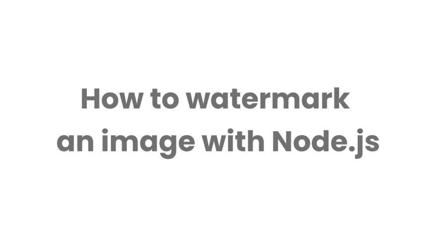

# 如何用 Node.js 给图像加水印

> 原文：<https://dev.to/muhajirdev/how-to-watermark-an-image-with-node-js-4n64>

[](https://res.cloudinary.com/practicaldev/image/fetch/s--sj4oRczg--/c_limit%2Cf_auto%2Cfl_progressive%2Cq_auto%2Cw_880/https://hashnode.imgix.net/res/hashnode/image/upload/v1569411659931/o29o1SXQQ.png%3Fw%3D1600%26h%3D840%26fit%3Dcrop%26crop%3Dentropy%26auto%3Dformat%26q%3D60)

这将是一个非常简单的教程。

首先，让我们创建一个 node.js 项目

## 创建 Node.js 项目

```
mkdir jimp-watermark-demo
cd jimp-watermark-demo 
```

<svg width="20px" height="20px" viewBox="0 0 24 24" class="highlight-action crayons-icon highlight-action--fullscreen-on"><title>Enter fullscreen mode</title></svg> <svg width="20px" height="20px" viewBox="0 0 24 24" class="highlight-action crayons-icon highlight-action--fullscreen-off"><title>Exit fullscreen mode</title></svg>

```
npm init 
```

<svg width="20px" height="20px" viewBox="0 0 24 24" class="highlight-action crayons-icon highlight-action--fullscreen-on"><title>Enter fullscreen mode</title></svg> <svg width="20px" height="20px" viewBox="0 0 24 24" class="highlight-action crayons-icon highlight-action--fullscreen-off"><title>Exit fullscreen mode</title></svg>

只需按下`Enter`、`Enter`、`Enter`...

```
npm install --save jimp 
```

<svg width="20px" height="20px" viewBox="0 0 24 24" class="highlight-action crayons-icon highlight-action--fullscreen-on"><title>Enter fullscreen mode</title></svg> <svg width="20px" height="20px" viewBox="0 0 24 24" class="highlight-action crayons-icon highlight-action--fullscreen-off"><title>Exit fullscreen mode</title></svg>

打开你最喜欢的编辑器。在我的例子中，它是 Visual Studio 代码。所以我可以输入

```
code . 
```

<svg width="20px" height="20px" viewBox="0 0 24 24" class="highlight-action crayons-icon highlight-action--fullscreen-on"><title>Enter fullscreen mode</title></svg> <svg width="20px" height="20px" viewBox="0 0 24 24" class="highlight-action crayons-icon highlight-action--fullscreen-off"><title>Exit fullscreen mode</title></svg>

在终点站。

创建一个文件，命名为`index.js`。

## 编写代码

这是工作代码。

```
const Jimp = require("jimp");

const ORIGINAL_IMAGE =
  "http://www.defence.gov.au/ADimg/news_events/whiteRibbon.jpg";

const LOGO = "https://upload.wikimedia.org/wikipedia/en/thumb/9/9f/Australian_Defence_Force_Academy_coat_of_arms.svg/1200px-Australian_Defence_Force_Academy_coat_of_arms.svg.png";

const LOGO_MARGIN_PERCENTAGE = 5;

const FILENAME = "test.jpg";

const main = async () => {
  const [image, logo] = await Promise.all([
    Jimp.read(ORIGINAL_IMAGE),
    Jimp.read(LOGO)
  ]);

  logo.resize(image.bitmap.width / 10, Jimp.AUTO);

  const xMargin = (image.bitmap.width * LOGO_MARGIN_PERCENTAGE) / 100;
  const yMargin = (image.bitmap.width * LOGO_MARGIN_PERCENTAGE) / 100;

  const X = image.bitmap.width - logo.bitmap.width - xMargin;
  const Y = image.bitmap.height - logo.bitmap.height - yMargin;

  return image.composite(logo, X, Y, [
    {
      mode: Jimp.BLEND_SCREEN,
      opacitySource: 0.1,
      opacityDest: 1
    }
  ]);
};

main().then(image => image.write(FILENAME)); 
```

<svg width="20px" height="20px" viewBox="0 0 24 24" class="highlight-action crayons-icon highlight-action--fullscreen-on"><title>Enter fullscreen mode</title></svg> <svg width="20px" height="20px" viewBox="0 0 24 24" class="highlight-action crayons-icon highlight-action--fullscreen-off"><title>Exit fullscreen mode</title></svg>

现在尝试运行

```
node index.js 
```

<svg width="20px" height="20px" viewBox="0 0 24 24" class="highlight-action crayons-icon highlight-action--fullscreen-on"><title>Enter fullscreen mode</title></svg> <svg width="20px" height="20px" viewBox="0 0 24 24" class="highlight-action crayons-icon highlight-action--fullscreen-off"><title>Exit fullscreen mode</title></svg>

在你的终端里。

它将创建`test.jpg`。这就是结果。

## 好的，好的。慢点。我不明白。代码是做什么的？

```
const Jimp = require("jimp");

const ORIGINAL_IMAGE =
  "http://www.defence.gov.au/ADimg/news_events/whiteRibbon.jpg";

const LOGO = "https://upload.wikimedia.org/wikipedia/en/thumb/9/9f/Australian_Defence_Force_Academy_coat_of_arms.svg/1200px-Australian_Defence_Force_Academy_coat_of_arms.svg.png";

const LOGO_MARGIN_PERCENTAGE = 5;

const FILENAME = "test.jpg"; 
```

<svg width="20px" height="20px" viewBox="0 0 24 24" class="highlight-action crayons-icon highlight-action--fullscreen-on"><title>Enter fullscreen mode</title></svg> <svg width="20px" height="20px" viewBox="0 0 24 24" class="highlight-action crayons-icon highlight-action--fullscreen-off"><title>Exit fullscreen mode</title></svg>

这部分很简单。我们正在导入`jimp`并定义一些常量。

接下来我们定义一个异步函数`main`。我们希望它是异步的，因为我们希望在代码内部执行`async/await`。`async/await`只能在函数内部工作。

```
const [image, logo] = await Promise.all([
    Jimp.read(ORIGINAL_IMAGE),
    Jimp.read(LOGO)
  ]); 
```

<svg width="20px" height="20px" viewBox="0 0 24 24" class="highlight-action crayons-icon highlight-action--fullscreen-on"><title>Enter fullscreen mode</title></svg> <svg width="20px" height="20px" viewBox="0 0 24 24" class="highlight-action crayons-icon highlight-action--fullscreen-off"><title>Exit fullscreen mode</title></svg>

在这里，我们使用`jimp`从一个 url 读取图像。`Jimp.read`结果是一个`Promise`。我们想平行读取这些图像。所以，我们用`Promise.all`。`Promise.all`也会产生`Promise`。所以我们使用`await`来等待结果，然后我们将结果分配给`image`和`logo`

```
logo.resize(image.bitmap.width / 10, Jimp.AUTO); 
```

<svg width="20px" height="20px" viewBox="0 0 24 24" class="highlight-action crayons-icon highlight-action--fullscreen-on"><title>Enter fullscreen mode</title></svg> <svg width="20px" height="20px" viewBox="0 0 24 24" class="highlight-action crayons-icon highlight-action--fullscreen-off"><title>Exit fullscreen mode</title></svg>

我们想把标志尺寸调整得更小。我们希望 logo 的宽度是图片的 10%，我们只给了高度`AUTO`。

```
const xMargin = (image.bitmap.width * LOGO_MARGIN_PERCENTAGE) / 100;
const yMargin = (image.bitmap.width * LOGO_MARGIN_PERCENTAGE) / 100;

const X = image.bitmap.width - logo.bitmap.width - xMargin;
const Y = image.bitmap.height - logo.bitmap.height - yMargin; 
```

<svg width="20px" height="20px" viewBox="0 0 24 24" class="highlight-action crayons-icon highlight-action--fullscreen-on"><title>Enter fullscreen mode</title></svg> <svg width="20px" height="20px" viewBox="0 0 24 24" class="highlight-action crayons-icon highlight-action--fullscreen-off"><title>Exit fullscreen mode</title></svg>

这只是标志的位置。我们希望将徽标放在右下角。

```
return image.composite(logo, X, Y, [
    {
      mode: Jimp.BLEND_SCREEN,
      opacitySource: 0.1,
      opacityDest: 1
    }
  ]);
}; 
```

<svg width="20px" height="20px" viewBox="0 0 24 24" class="highlight-action crayons-icon highlight-action--fullscreen-on"><title>Enter fullscreen mode</title></svg> <svg width="20px" height="20px" viewBox="0 0 24 24" class="highlight-action crayons-icon highlight-action--fullscreen-off"><title>Exit fullscreen mode</title></svg>

在这里，我们将这两个图像合成在一起。

```
main().then(image => image.write(FILENAME)); 
```

<svg width="20px" height="20px" viewBox="0 0 24 24" class="highlight-action crayons-icon highlight-action--fullscreen-on"><title>Enter fullscreen mode</title></svg> <svg width="20px" height="20px" viewBox="0 0 24 24" class="highlight-action crayons-icon highlight-action--fullscreen-off"><title>Exit fullscreen mode</title></svg>

最后我们将结果写入`test.jpg`

就是这样。
希望对你有帮助:)