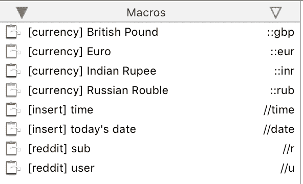
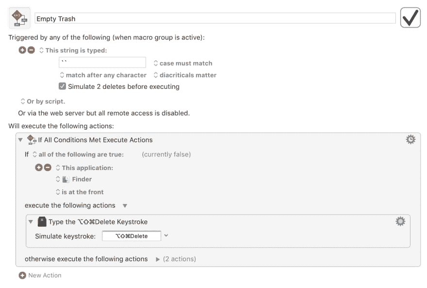
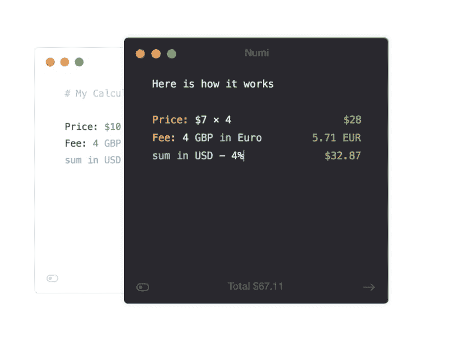

# 成为 Mac 超级用户

> 原文:[https://dev.to/osirissgfx/become-a-mac-power-user-12jo](https://dev.to/osirissgfx/become-a-mac-power-user-12jo)

好了，这里是我使用的一些东西，不用说，它们让很多任务变得更顺利，本质上——为一些简单的任务减少很多额外的点击，大多数时候你甚至不认为它们可以改进。

# 键盘大师

首先，我想谈谈键盘大师，这是我开始写这篇博客的主要原因之一。

这不是一个免费的应用程序，有点贵，我希望有更多的应用程序支持，但话说回来..它完成了它的工作，如果你喜欢 AppleScript，它可以做得更多。就我个人而言，我没有使用过 AppleScript，但是如果你想要一些资源——去[这里](https://www.macworld.co.uk/feature/mac-software/how-to-applescript-tutorial-3623522/)或者[这里](https://github.com/trending/applescript)。

好了，先不说这个，我先从一些最简单的开始。我不会提到你可以像这样对人脸进行宏操作

[T2】](https://res.cloudinary.com/practicaldev/image/fetch/s--yXa1eCxs--/c_limit%2Cf_auto%2Cfl_progressive%2Cq_auto%2Cw_880/https://alexobreja.files.wordpress.com/2019/04/screen-shot-2019-04-25-at-2.51.05-pm-e1556201685554.png)

因为那是不专业的ಠ_ಠ，但是我要谈谈这些:

[T2】](https://res.cloudinary.com/practicaldev/image/fetch/s--BZ6dTPkd--/c_limit%2Cf_auto%2Cfl_progressive%2Cq_auto%2Cw_880/https://alexobreja.files.wordpress.com/2019/04/screen-shot-2019-04-25-at-2.52.38-pm.png)

货币宏用于在您需要时插入特殊的货币字符，这样您就不用每次都在键盘上搜索它们了——非常好！它只是通过用字符本身替换一个类型化的触发字符串来工作。使其防哑；我在触发字前面加了`::`以免不小心搞砸了。

时间和日期的插入是一样的，我改变了一点语法(不知道为什么，我想这样更容易记住..).它的作用是根据您的系统插入当前时间/日期。有时候很有用。

现在作为一个 reddit 的铁杆用户(help)，很多时候你想通过链接访问一些特定的子编辑和/或用户，因为这样更容易。为了节省时间，这个列表中的最后两个宏用`reddit.com/r/`代替了`//r`，然后你只需写下你需要的任何东西。我不知道我用了多少次了，习惯它非常容易，以至于你不知道你以前是怎么做的。

### 清空垃圾箱宏

[T2】](https://res.cloudinary.com/practicaldev/image/fetch/s--dHIi2HlR--/c_limit%2Cf_auto%2Cfl_progressive%2Cq_auto%2Cw_880/https://alexobreja.files.wordpress.com/2019/04/screen-shot-2019-04-25-at-3.12.06-pm.png)

这是我最喜欢的一个。它的工作方式是切换到 finder，使用热键清空垃圾箱，然后在几毫秒内切换回你正在使用的任何应用程序。第二条指令用于您的活动应用程序是 finder 本身的情况，它不必在任何地方切换窗口。

还有很多这样的宏，我没有在这个列表中提到，也许不那么令人兴奋，但我会在这篇文章的底部链接这些宏以供下载。

# 奇观

[T2】](https://res.cloudinary.com/practicaldev/image/fetch/s--wyoJlRZT--/c_limit%2Cf_auto%2Cfl_progressive%2Cq_auto%2Cw_880/https://alexobreja.files.wordpress.com/2019/04/screen-shot-2019-04-25-at-4.17.36-pm.png)

非常有用的应用程序，我希望这是预建在系统中，但我们去那里..这是一个免费的应用程序，你可以在这里下载，这是一个窗口管理应用程序，我不能没有它，因为多任务处理。

telegraph 是一个简单的工具，可以让你不用鼠标就能轻松地组织你的窗口。这个界面非常简单，但很实用，允许你为不同的功能设置快捷方式，也可以选择你希望这个应用程序如何运行。

在这一点上，没有真正的理由不一直保持眼镜开放，作为一个免费的开源应用程序，你永远不会看到任何弹出窗口或恼人的升级销售，也不会阻塞你的记忆。**用吧！**

# 阿尔弗雷德

另一个生产力应用程序，它基本上取代了苹果的 Spotlight，带有更多的自定义操作来提高你的效率。它有免费版，也有付费版，还有更多的功能。点击查看[。](https://www.alfredapp.com/)

一些一般特征包括:

*   全系统文件搜索
*   网络搜索
*   书签
*   内置计算器*(我将在另一段中详细讨论)*
*   剪贴板历史
*   片段
*   工作流程
*   等等，等等，等等

为什么我最喜欢使用这个应用程序，除了它的高度可定制的功能，是工作流，让你与其他应用程序互动，并直接从阿尔弗雷德的搜索栏做很多任务。

### 提醒

我使用的提醒工作流程(向 [*致敬*](https://github.com/surrealroad) 超现实之路)只是在苹果的提醒应用中创建新提醒的一种好方法。
要使用脚本，你只需在 Alfred 中键入`r [some text]`，就像你与 Siri 对话一样(有时由于环境限制或诸如此类的原因，你无法使用 Siri)。您也可以在文本中包含时间和日期，并让 Alfred 为该特定时间设置提醒。你可以在 GitHub [repo](https://github.com/surrealroad/alfred-reminders) 上找到更多信息。

### 链接

这是一个非常简单的工作流程，它会根据您在 Alfred 中键入的关键字打开一个给定的链接。下面也会链接下来。

### Numi

[T2】](https://res.cloudinary.com/practicaldev/image/fetch/s--3Uj6GriQ--/c_limit%2Cf_auto%2Cfl_progressive%2Cq_auto%2Cw_880/https://alexobreja.files.wordpress.com/2019/04/screen-shot-2019-04-25-at-4.22.05-pm-1.png)

Numi 是一个很好的工作流，基本上是计算器的扩展版本，能够做更多的事情，如:

*   单位换算
*   时区转换
*   数字转换(十六进制、二进制、八进制、十六进制)
*   货币
*   变量
*   功能
*   等等等等

*更多@[numi docs](https://numi.io/docs/)T3】*

请注意，为了让工作流工作，您仍然需要 Numi 应用程序，这将我们带到本文的最后但并非最不重要的部分。

# Numi

如上所述， [Numi](https://numi.io/) 是一个非常有用的应用程序，如果你正在进行大量的计算，或者只是需要一个简单的应用程序，允许你在同一个工作空间进行大量的转换和计算，有一个干净漂亮的用户界面。该应用程序是免费的(在我写这篇文章的时候)，但它很快就会变成付费的，所以如果你真的像我一样喜欢它，一定要预订一个 Numi 许可证。

# 结论

这个列表可能会扩大，这取决于你使用什么工具，你需要一个漂亮和快速的工作流程，但我只想分享一些我基本上每天都在使用的东西，在很多情况下都很有帮助。如果你有一些我没有提到的有用的宏(我肯定有很多)，欢迎在 twitter 上@我。

GLHF.