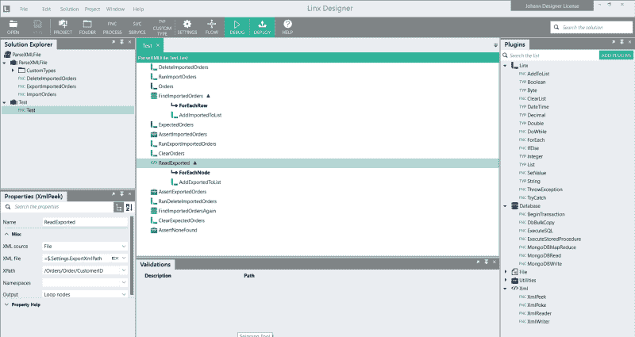
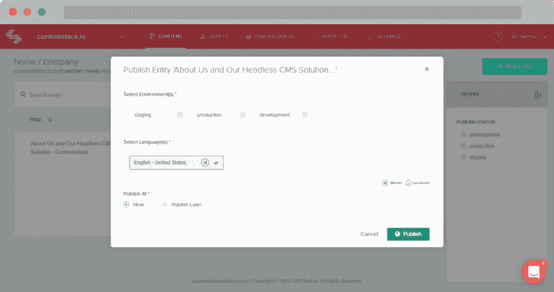
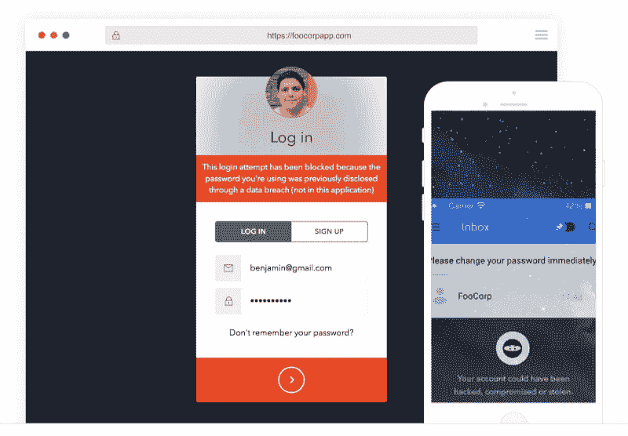
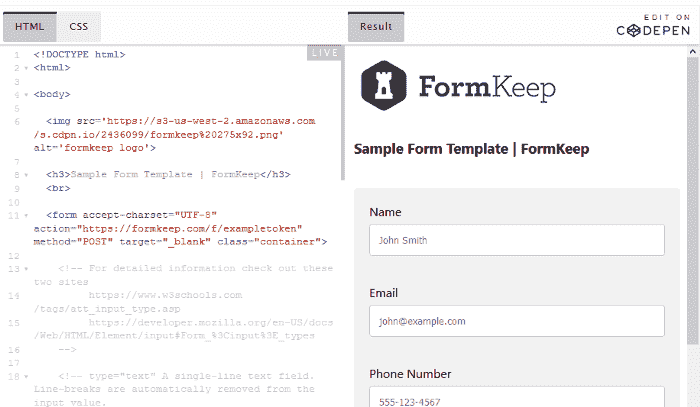
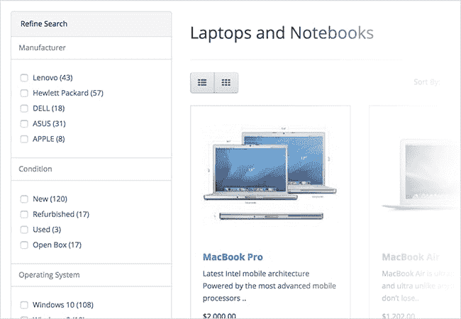

# 最适合 BaaS

> 原文：<https://dev.to/linxsoftware/best-for-baas-15p9>

### *六款加速后端开发的一流工具*

如果您在 IT 开发领域工作过一段时间，您可能会发现有许多日常任务占用了您大量的时间。您经常在时间紧迫和/或预算有限的情况下工作。您可能已经构建了几个库来处理各种任务，或者甚至已经建立了一些可靠的框架来加速您的过程。

然而，通常每一个都需要大量的编码。后端即服务(BaaS)工具的发展使得将许多常规任务转换成一系列模块或插件成为可能，这些模块或插件使得只需编写很少的代码，或者在某些情况下根本不用编写代码，就可以执行高级开发任务。这些工具的用途和范围很广；一些处理一些非常具体的任务，而另一些几乎可以作为完整的开发环境

在本文中，我们将了解一些非常有用的 BaaS 平台，它们可以让您更快地将项目投入生产，并使您作为开发人员的生活变得更加轻松。我们将从大的方面开始，然后展示同样有用的单一用途工具的例子。这些工具可以单独工作，也可以一起工作，这取决于开发项目的目的和需求。

## Linx

低代码应用开发和自动化
[https://linx.software/](https://linx.software/?utm=dz)

Linx 是一个非常强大的低代码 IDE，旨在能够轻松地创建和部署自动化应用程序。它有助于通过易于使用的拖放界面无缝连接许多预构建的组件、数据库和各种微服务和工具。

除了简单地插入不同的工具来相互协作，它还允许用户完成许多标准编程任务，包括大量的预建函数、循环和条件语句。可以从菜单中选择应用程序和数据库，并将其拖放到您的开发环境中，而无需编写任何代码。你只需要知道你的业务逻辑，配置几个模块，然后你就可以开始运行了，把你的开发时间缩短到以前的一小部分。

Linx 最好的特性之一是它能够自动化许多过程，比如触发事件、调用各种服务以及从数据库中读取和写入事务。它还使得通过 API 连接到许多外部 web 服务变得容易。借助包含 SQL 数据库和文件存储的 Linx 应用服务器，您只需点击一下鼠标，就可以将工作流和软件部署到云中，从而实现相对无缝的开发和部署。

**适用于(最佳用例)**

如果您有许多预构建的模块，并且需要快速做出更改，但是不愿意花费必要的时间来创建新的工作流，那么 Linx 非常有用。即使使用框架开发，通常创建新模块也需要编写一些代码；Linx 有助于消除这种必要性。

它非常适合需要定期对应用程序进行大量更改的组织。易用性使得业务分析师能够在根本不需要编写任何代码的情况下进行许多高级别的更改。

**利弊**

这对于业务系统分析师来说非常有用，他们可能希望能够进行更改、测试工作流和/或在不同的配置中部署现有的开发工具，而不需要必要的编码工作。

虽然它与 ETL 和业务流程管理工具有一些相似之处，但它比许多为特定任务设计的工具更灵活。虽然它本身不是一个 API 管理工具，但是它可以很好地与许多 API 集成，特别是那些应用程序开发过程中需要的 API。

**定价**

Linx 应用设计器 IDE:免费

Linx 应用服务器:149 美元/月及以上。

* * *

## 内容堆栈

无头 CMS
[https://www.contentstack.com/](https://www.contentstack.com/)

Contentstack 是一个完全无头的 API 驱动的内容管理系统，专门为企业级组织设计。

对于希望将用户创建的内容与现有系统集成的公司，使用远程托管的 headless CMS 可以快速无缝地开发和发布内容。

除了需要安装一个沉重的本地内容管理系统来托管你的网站上的内容，ContentStack，由于其强大的 API，使内容能够迅速和一致地立即部署到任何媒体格式。

对于具有高度结构化的内容部署需求的组织来说，它支持创建多种环境，包括从开发、测试、试运行到生产，并提供了基于时间安排的自动化内容发布选项。Contentstack 具有内置的审批工作流设计，并提供了简化版本控制的功能，包括执行快速回滚的能力。

**适用于(最佳用例)**

Contentstack 是拥有大量内容的大型在线企业的理想解决方案，这些企业需要由多个用户在多个平台上频繁更新，例如在线新闻机构或出版公司。

**利弊**

它的优势在于它的灵活性和力量。它是为公司环境特别是复杂的内容部署协议而精心设计的。然而，对于较小的组织来说，它有点贵，所以对于预算较低的公司来说可能有点超出范围。

**定价**

3500 美元/月

* * *

## Auth0

认证即服务平台
[https://auth0.com/](https://auth0.com/)

管理用户凭证非常耗时。像设置一组基本的身份验证规则、确保用户的身份、确保会话设置正确以便准确管理访问这样简单的事情就够麻烦的了。但是，如果您有一大群跨一大群应用程序的用户，而这些应用程序都需要协调呢？这足以让任何开发人员抓狂。您需要您的用户能够登录、保持登录、被识别，同时保持他们的凭证安全。最重要的是，您不想激怒您的用户，所以您希望实现单点登录和轻松访问。

Auth0 提供了一个通用的认证和授权平台，它可以跨多种设备工作，而不需要通常所需的大规模开发。

**适用于(最佳用例)**

从小型企业和组织到大型企业级运营，Auth0 都有帮助。它非常适合小型情况，但是可以轻松扩展到需要双重认证，并且符合国际隐私法规。

**利弊**

Auth0 可以省去几个月的工作，并且可以快速干净地实现。它将连接到几乎任何技术堆栈，提供强大的安全性，高度可定制，并提供快速可靠的性能。

缺点很少，因为基础级是免费的。您可以为增加的日志保留、更多的社交身份提供商、定制、企业级单点登录等支付更多费用。

**定价**

开发商计划从每月 13 美元到 745 美元不等。

* * *

## 保持表单

[https://formkeep.com/](https://formkeep.com/)
表单处理服务

Formkeep 是一个简单的 BaaS 工具，用于处理表单后端数据处理。管理表单的后端可能有点耗时，而且肯定不好玩。通常情况下，您需要做一切事情，从确保它正常工作到确保提供正确的数据类型，包括具有正确数据类型的必填字段，以及处理垃圾邮件提交。虽然这些都不难，但可能很耗时，尤其是当您需要在一个站点上有多个表单时。

Post 数据存储在云中，将提供报告和数据管理功能，并允许集成多种格式的应用程序。输出可以通过 API 提交到电子邮件、数据库或其他 web 服务。

**适用于(最佳用例)**

Formkeep 是前端设计者的理想选择，他们不希望担心处理后端。能够快速创建许多表单，无需花费大量时间来确保处理工作正常进行。

**利弊**

很好用。虽然不是免费的，但成本相对较低。

**定价**

每月 4.99 美元(1 张表格)及以上。

* * *

## 开放式购物车

电子商务平台
[https://www.opencart.com/](https://www.opencart.com/)

Opencart 是一个免费、开源的电子商务平台。它提供了许多商业电子商务工具的特性。由于它的内部结构，它是高度可配置的，范围几乎是无限的:您可以与无限数量的类别、产品和制造商合作。

它提供对 20 多种不同支付网关的访问，完全符合 PCI，并支持多种货币和语言。它还附带了一个强大的仪表板，用于管理具有不同角色的多个用户和监控事务。

要使用它，需要下载它，将其安装在您的服务器上，并对其进行配置。

**适用于(最佳用例)**

对于那些想要一个健壮的电子商务解决方案的公司来说，Opencart 是非常好的，这个解决方案可以与许多现成的解决方案相媲美，但是不希望被固定在一个千篇一律的框架中。它非常强大，可以很好地为那些希望从零开始为他们的在线业务建立一个坚实的电子商务背景的公司工作，而不必重新发明轮子。

**利弊**

从积极的一面来看，没有软件的前期成本，也很少需要持续维护。它的扩展能力和灵活性使它成为非常好的选择。然而，由于它是免费的，所以没有任何支持。所有托管、安装、配置和维护都是用户的责任。

也就是说，他们有一个相关的云服务“OpenCloud ”,人们可以按照与使用相关的价格购买。

**定价**

软件:免费。基于云的:每月 30-190 美元*

* * *

## 结论

与其依赖于从头开始编写应用程序的各个方面，不如利用这些高级工具来处理许多业务关键型功能。

This is really only a small set of useful BaaS tools that exist which can help improve your development processes, and there are many other high-quality tools that can help improve your processes however these are some of the best that we’ve found. You can’t go wrong with any of these options.

帖子[加速后端开发的最佳 BaaS 工具](https://linx.software/baas-tools/)首先出现在 [Linx](https://linx.software) 上。