# 用红色节点验证电话号码

> 原文:[https://dev . to/vonagedev/verify-phone-numbers-with-node-red-39 b5](https://dev.to/vonagedev/verify-phone-numbers-with-node-red-39b5)

在[之前的教程](https://www.nexmo.com/blog/tag/node-red)中，您已经了解了 Nexmo SMS 和语音 API，您已经习惯了发送和接收消息和呼叫，并且希望您也有机会在 Node-RED 中尝试和体验定制这些体验。

> 有兴趣了解更多关于 Node-RED 的信息吗？我们在 Vonage 校园有一整个会议专门讨论这个问题，我们的第一次客户和开发者会议将于 10 月 29 日至 30 日在旧金山举行。参加是免费的，所以[现在就请求您的邀请](https://web.cvent.com/event/9bba9ffb-c9b5-4022-a9b8-3a8184c70aa8/register)！

在本教程中，我们将查看[验证 API](https://developer.nexmo.com/verify/overview) ，并探索一种验证用户电话号码的简便方法。

许多应用程序上的用户只有一个电话号码，以使过程尽可能简单，他们需要在以后使用该标识符进行身份验证。

因此，让我们看看如何做到这一点，以及确保没有重复的帐户，并确保用户确实可以通过他们提供的电话号码联系到。

## [](#prerequisites)先决条件

开始之前，您需要一些东西:

*   安装在您机器上的 [Node.js](https://nodejs.org/en/) 和 [Node-RED](https://nodered.org/docs/getting-started/installation)
*   Nexmo 帐户–[如果您还没有，请免费创建一个帐户](https://dashboard.nexmo.com/sign-up?utm_source=DEV_REL&utm_medium=nexmoblog&utm_campaign=verify-nodered)

### [](#getting-your-credentials)领取证件

为了与 Verify API 交互，您需要注意一些事情。一旦你创建了一个 Nexmo 账户，进入[仪表盘](https://dashboard.nexmo.com)找到你的 API 密匙和密码。稍后，您将使用这些凭证通过 API 进行身份验证。

### [](#setting-up-your-nodered-editor)设置你的节点-红色编辑器

首先，你需要[安装](https://nodered.org/docs/getting-started/installation)运行时和编辑器。这可以在您的本地机器、单板计算机(例如 Raspberry Pi)上完成，也可以在许多云托管选项上完成。

这个例子将使用您的本地机器，所以一旦您已经全局安装了 Node-RED，在您的终端中键入下面的命令开始。

```
$ node-red 
```

然后，您可以通过将浏览器指向 [http://localhost:1880](http://localhost:1880) 来访问 Node-RED 编辑器。

打开编辑器后，您需要安装 Nexmo 节点。你可以在*管理调色板*菜单下，通过搜索`node-red-contrib-nexmo`包并点击安装来完成。

[T2】](https://res.cloudinary.com/practicaldev/image/fetch/s--ZcEB9vj1--/c_limit%2Cf_auto%2Cfl_progressive%2Cq_66%2Cw_880/https://www.nexmo.com/wp-content/uploads/2019/09/install-nexmo-nodered.gif)

接下来，对`node-red-dashboard`包重复上一步。

重新启动 Node-RED 后，您现在应该看到所有的 Nexmo 和 Dashboard 节点出现在屏幕的左侧，在节点面板的其他默认节点中。

## [](#user-interface)用户界面

对于本教程，您需要一个简单的用户界面来收集用户输入。有几种方法可以做到这一点，包括编写自己的 HTML 和 CSS，但更快的替代方法是使用节点-红色仪表板节点。

#### [](#what-youll-need)你需要什么:

*   收集用户的**电话号码**的文本字段
*   收集 **PIN 码**的文本字段
*   一个**取消验证**按钮
*   一个**给我打电话**按钮——这将给用户一个在 SMS 上请求打电话的选项，作为接收 PIN 码的一种方式。

通过*从剪贴板*导入下面的片段来加速这个过程，或者自己试验一下仪表板节点。

```
[{ "id": "463e8e92.d82a78", "type": "tab", "label": "Verify Demo", "disabled": false, "info": "" }, { "id": "fb7955ef.0e5fd8", "type": "ui\_form", "z": "463e8e92.d82a78", "name": "", "label": "Verify your phone number:", "group": "91563061.fc448", "order": 1, "width": 0, "height": 0, "options": [ { "label": "eg. 447401234567", "value": "number", "type": "text", "required": true }], "formValue": { "number": "" }, "payload": "", "submit": "Send me a code", "cancel": "delete", "topic": "", "x": 430, "y": 140, "wires": [[] ] }, { "id": "b60bf0b2.9a839", "type": "ui\_button", "z": "463e8e92.d82a78", "name": "", "group": "91563061.fc448", "order": 2, "width": "0", "height": "0", "passthru": false, "label": "Call me", "tooltip": "", "color": "", "bgcolor": "", "icon": "", "payload": "", "payloadType": "str", "topic": "", "x": 520, "y": 580, "wires": [[] ] }, { "id": "b182a10d.c8f08", "type": "ui\_button", "z": "463e8e92.d82a78", "name": "", "group": "91563061.fc448", "order": 3, "width": 0, "height": 0, "passthru": false, "label": "Cancel Verification", "tooltip": "", "color": "", "bgcolor": "red", "icon": "", "payload": "", "payloadType": "str", "topic": "", "x": 550, "y": 760, "wires": [[] ] }, { "id": "a2251664.3ba2f", "type": "comment", "z": "463e8e92.d82a78", "name": "Start Verification - Collect phone number to be verified", "info": "", "x": 520, "y": 80, "wires": [] }, { "id": "7185f18d.87142", "type": "comment", "z": "463e8e92.d82a78", "name": "Check if received code matches the generated one", "info": "", "x": 510, "y": 280, "wires": [] }, { "id": "7f30e.60359cf28", "type": "comment", "z": "463e8e92.d82a78", "name": "Next Verification - Escalate to TTS Call", "info": "", "x": 610, "y": 520, "wires": [] }, { "id": "c46fa301.4eb0d8", "type": "comment", "z": "463e8e92.d82a78", "name": "Cancel Verification", "info": "", "x": 550, "y": 700, "wires": [] }, { "id": "ab7fb094.d7d1f8", "type": "ui\_form", "z": "463e8e92.d82a78", "name": "", "label": "Check code:", "group": "91563061.fc448", "order": 4, "width": 0, "height": 0, "options": [{ "label": "Enter the PIN code you received", "value": "code", "type": "text", "required": true }], "formValue": { "code": "" }, "payload": "", "submit": "submit", "cancel": "delete", "topic": "", "x": 390, "y": 340, "wires": [[] ] }, { "id": "91563061.fc448", "type": "ui\_group", "z": "", "name": "Verify Demo Input Fields", "tab": "fdce8e2a.f4364", "disp": false, "width": "8", "collapse": false }, { "id": "fdce8e2a.f4364", "type": "ui\_tab", "z": "", "name": "Verify Demo", "icon": "dashboard", "disabled": false, "hidden": false }] 
```

当你准备好了，你的编辑器应该是这样的:

[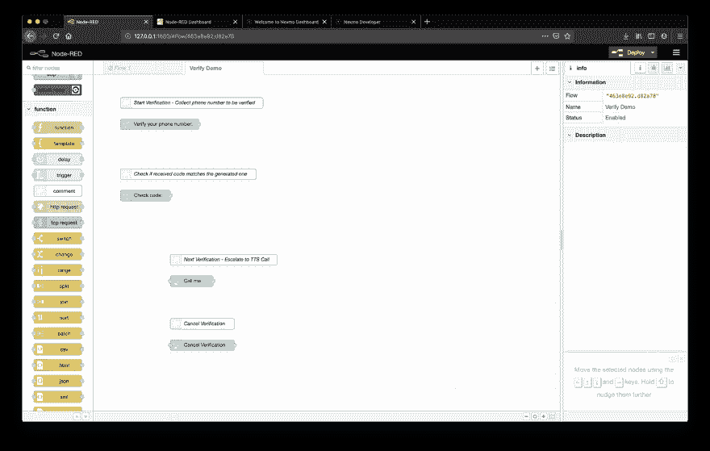](https://res.cloudinary.com/practicaldev/image/fetch/s--zrrevuqS--/c_limit%2Cf_auto%2Cfl_progressive%2Cq_auto%2Cw_880/https://www.nexmo.com/wp-content/uploads/2019/09/verify-ui-template.png)

要查看您的用户界面，请导航至`http://127.0.0.1:1880/ui`。

[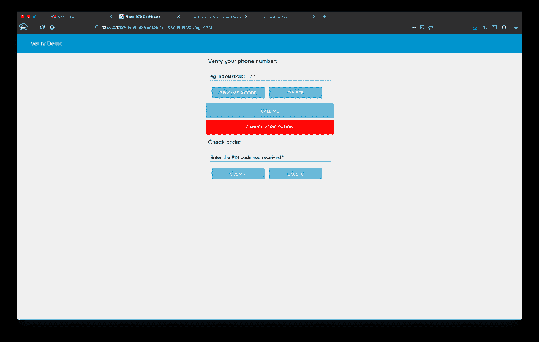T5】](https://res.cloudinary.com/practicaldev/image/fetch/s--UoTecMV1--/c_limit%2Cf_auto%2Cfl_progressive%2Cq_auto%2Cw_880/https://www.nexmo.com/wp-content/uploads/2019/09/verify-ui.png)

## [](#verifying-your-user)验证您的用户

一旦我们收集了用户的电话号码，我们就可以通过向 Verify API 发送一个验证请求来开始验证过程。

### [](#start-verification)开始验证

要开始验证，您需要一个 **`sendverify`** 节点连接到获取用户电话号码的表单。默认情况下，这将在短信中向用户的电话号码发送一个简短的自定义文本和一个 PIN 码，然后是两次文本到语音转换电话呼叫，以防他们未能提交收到的代码。

双击打开 **`sendverify`** 节点属性。在那里，您会发现需要填写的三个必填字段:`Nexmo Credentials`、`To {}`和`Brand {}`。

注意标签旁边的`{}`，这意味着这些字段将支持 [Mustache 模板](https://mustache.github.io/)，并且您将能够动态地传递值。

从`Nexmo Credentials`下拉菜单中选择*添加新的 nexmobasic* 并点击编辑按钮。然后会提示您提供您的`API Key`和`API Secret`来使用 Verify API 进行身份验证——这两个都可以在您的 [Nexmo 仪表板](https://dashboard.nexmo.com)中找到。

完成后，点击**添加**。现在，在`Nexmo Credentials`标签旁边，您会看到一个[配置节点](https://nodered.org/docs/user-guide/editor/sidebar/config)，这将存储您的凭证。

接下来，您必须将用户的电话号码输入到`To {}`字段。如果您导入了上面的 UI 片段，这将是`{{msg.payload.number}}`，因为我们在第一个 **`form`** 节点中指定了输入值将在`msg.payload`的`number`键中收集。您可以通过打开 **`form`** 节点属性并选择不同的`Name`来改变这一点。

最后，您可以在`Brand {}`下个性化验证请求短信正文，帮助用户识别您的公司或应用名称。它采用一个 18 个字符的字母数字字符串，该字符串将被附加到 Verify API 生成的 PIN 号之前。

例如:“您的 Acme Inc PIN 是…”

[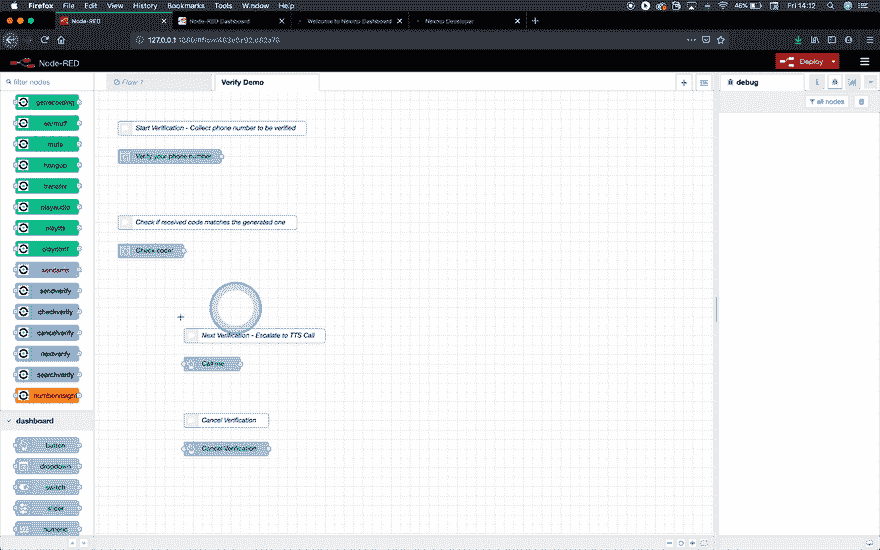T2】](https://res.cloudinary.com/practicaldev/image/fetch/s--l_uZrOCr--/c_limit%2Cf_auto%2Cfl_progressive%2Cq_66%2Cw_880/https://www.nexmo.com/wp-content/uploads/2019/09/verify-sendverify-config.gif)

**`sendverify`** 节点输出从 Nexmo 接收的 API 响应，包含一个`request_id`和一个`status`参数。在[验证 API 参考](https://developer.nexmo.com/api/verify#verify-request)中找到更多关于状态代码的信息。

`request_id`将用于所有后续步骤，因此我们必须让当前流中的所有其他节点都可以访问它。为此，将一个 **`change`** 节点连接到 **`sendverify`** ，打开其节点属性并将`flow.request_id`设置为`msg.payload.request_id`。

[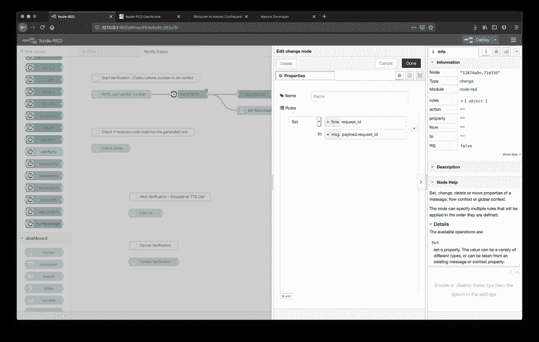T2】](https://res.cloudinary.com/practicaldev/image/fetch/s--uNA0jIst--/c_limit%2Cf_auto%2Cfl_progressive%2Cq_auto%2Cw_880/https://www.nexmo.com/wp-content/uploads/2019/09/verify-set-requestid.png)

为了更深入地了解正在发生的事情，您还可以将一个 **`debug`** 节点连接到 **`sendverify`** 。这样，您可以在调试侧栏中跟踪 API 响应。

### [](#check-pin-code)检查 PIN 码

该请求已被 Nexmo 成功接受，您的用户已收到一个验证码，并已通过相应的表格提交。成功？差不多了。

现在我们必须弄清楚提交的代码是否确实是由 Verify API 生成和发送的代码。

对于这一步，我们需要 **`checkverify`** 节点，它将把用户提供的*请求 ID* 和*代码*作为输入，比较两者，然后将 API 响应输出到`msg.payload`。

将它拖到您的工作区后，将其连接到捕获用户提交的 PIN 码的表单，然后在它后面连接一个 **`debug`** 节点，以查看调试侧栏中的响应对象。

打开 **`checkverify`** 节点属性。从`Nexmo Credentials`下拉菜单中选择由 **`sendverify`** 创建的配置节点，在`Request ID {}`字段中填入`{{flow.request_id}}`，并将用户提交的代码传递到`Code {}`字段中。

如果您导入了上面的 UI 片段，这将是`{{msg.payload.code}}`，因为我们在第二个 **`form`** 节点中指定了输入值将在`msg.payload`的`code`键中收集。你可以通过打开 **`form`** 节点属性并选择不同的`Name`来改变这一点。

[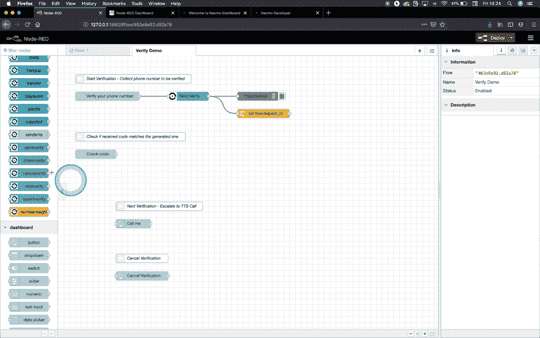T2】](https://res.cloudinary.com/practicaldev/image/fetch/s--Dx4AXyr7--/c_limit%2Cf_auto%2Cfl_progressive%2Cq_66%2Cw_880/https://www.nexmo.com/wp-content/uploads/2019/09/verify-checkverify.gif)

恭喜你。 [](https://res.cloudinary.com/practicaldev/image/fetch/s--h1R0Lv02--/c_limit%2Cf_auto%2Cfl_progressive%2Cq_auto%2Cw_880/https://s.w.oimg/core/emoji/11.2.0/72x72/1f389.png) 您的验证流程已启动并运行，请前往`http://localhost:1880/ui`尝试一下！

提交收到的 PIN 代码后，返回到 Node-RED 编辑器，仔细查看 debug 侧栏。

[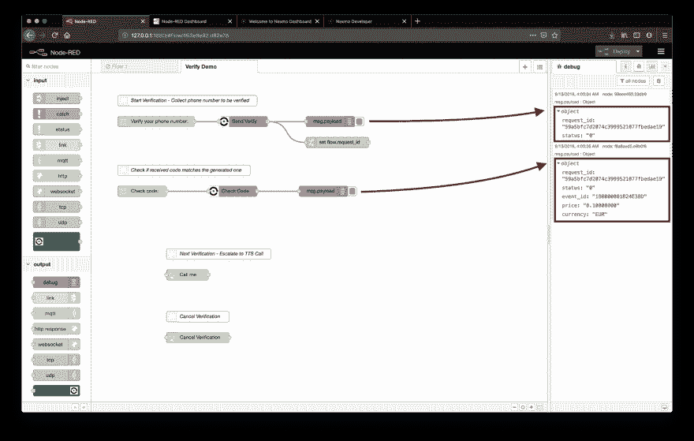T2】](https://res.cloudinary.com/practicaldev/image/fetch/s--gMaxTbXs--/c_limit%2Cf_auto%2Cfl_progressive%2Cq_auto%2Cw_880/https://www.nexmo.com/wp-content/uploads/2019/09/verify-send-check-debug.png)

响应对象将包含关于您的请求的详细信息，包括`status`，它指示请求是否成功。如果用户提交的 PIN 与 Verify API 生成的 PIN 相匹配，`status`的值将为`"0"`。

#### [](#check-verification-status)检查验证状态

虽然已经成功验证了用户的电话号码，但是此刻除了调试侧边栏之外，并没有出现这个事件的迹象。

为了定义验证过程结束后会发生什么，我们可以使用`msg.payload`的`status`属性来区分不同的场景。

您可能想要授予此用户对某个网页或应用程序的访问权限，将成功验证的用户的详细信息存储到数据库中，或者让他们知道结果是什么，并在失败时提示他们再试一次。这真的完全取决于你的用例，以及你为什么首先要验证你的用户。

为了简单起见，我们将评估`status`属性，然后根据它的值让用户知道验证是否成功。如果您想让您的错误消息更加精确，也可以随意为其他[状态代码](https://developer.nexmo.com/api/verify#verifyCheck)添加更多路线。

为此，我们需要:

–一个 **`switch`** 节点来检查`msg.payload.status`

的值–一个 **`notification`** 仪表板节点来通知用户

–两个 **`change`** 节点来准备 **`notification`** 节点将要显示的消息–一个在成功的情况下，一个在尝试失败的情况下。

将这些节点添加到您的工作区，并连接它们，如下图所示。

[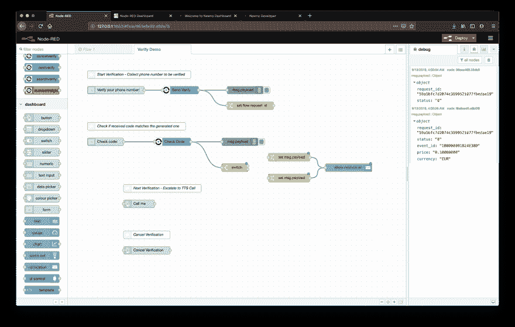T2】](https://res.cloudinary.com/practicaldev/image/fetch/s--dF91tbOG--/c_limit%2Cf_auto%2Cfl_progressive%2Cq_auto%2Cw_880/https://www.nexmo.com/wp-content/uploads/2019/09/verify-checkverify-switch.png)

现在，让我们仔细看看这些节点:

#### [](#-raw-switch-endraw-)`switch`

**`switch`** 节点根据消息的属性值或序列位置路由消息。在这种情况下，我们希望基于`msg.payload.status.`的值创建两条路由

当消息到达时，节点将评估在其节点属性中定义的每个规则，并将消息转发到任何匹配规则的相应输出。

首先，双击 **`switch`** 节点访问其属性。在`Property`字段中，用“状态”替换“有效负载”,这样得到评估的就是`msg.payload.status`。

接下来，我们必须根据它的值定义规则。

点击**添加**按钮添加第二个规则，因为我们将需要两个:

1.  成功:在第一个规则中，从第一个下拉列表中选择“==”，并在旁边的文本字段中写一个“0”；
2.  失败:在第二个规则中，选择“！= "并在它旁边的文本字段中写“0”。这将涵盖验证不成功的所有情况。

[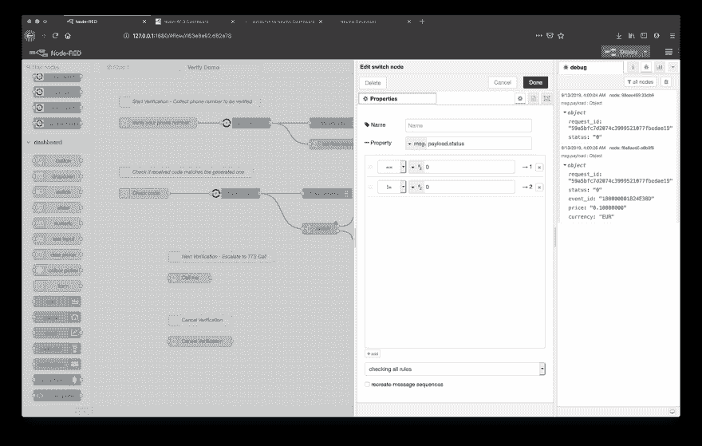T2】](https://res.cloudinary.com/practicaldev/image/fetch/s--sAO1rKwb--/c_limit%2Cf_auto%2Cfl_progressive%2Cq_auto%2Cw_880/https://www.nexmo.com/wp-content/uploads/2019/09/verify-switch-config.png)

注意规则旁边有一个`-> 1`和一个`-> 2`符号。这表明如果第一个语句为真，连接到第一个输出的节点将被触发。在所有其他情况下，连接到第二个输出的那些将被关闭。

#### [](#-raw-notification-endraw-)`notification`

**`notification`** 节点在用户界面上将`msg.payload`显示为弹出通知或*确定/取消*对话框消息。您可以从节点属性的`Layout`下拉列表中选择通知类型，如果是弹出窗口，您还可以配置其位置。

在`Timeout (S)`字段中输入您希望它在用户界面上保持可见的秒数来设置持续时间。

如果您想设置标题，您可以在`Topic`字段中设置，或者在`msg.topic`可用的情况下，它将被用作标题。

可以通过定义边框颜色来进一步定制体验，可以在`Border`字段中定义，也可以在`msg.highlight`中动态传递。

[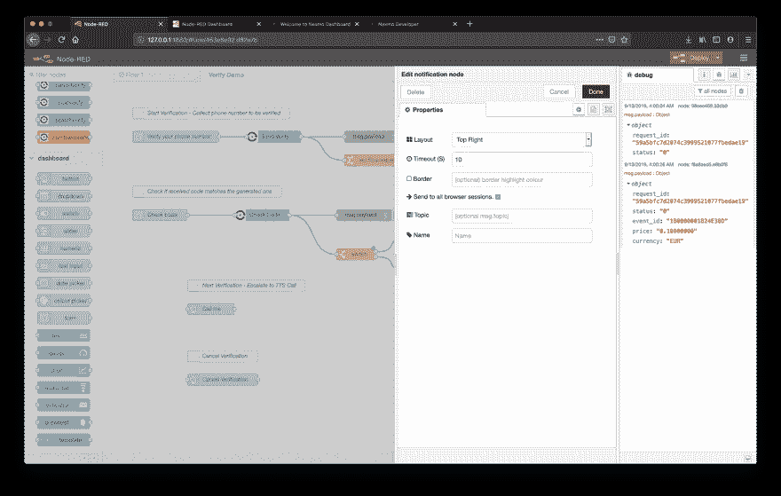T2】](https://res.cloudinary.com/practicaldev/image/fetch/s--ZMrSXy1r--/c_limit%2Cf_auto%2Cfl_progressive%2Cq_auto%2Cw_880/https://www.nexmo.com/wp-content/uploads/2019/09/verify-checkverify-notification.png)

#### [](#-raw-change-endraw-)`change`

在 **`change`** 节点中，我们将使用`Set`操作来指定`msg.payload`和`msg.highlight`的值。

让我们打开第一个 **`change`** 节点的节点属性(确保它连接到 **`switch`** 节点的第一个输出，我们的成功场景)。将`msg.payload`设置为“验证成功！”，点击**添加**按钮定义第二条规则，并将`msg.highlight`设置为“绿色”。

[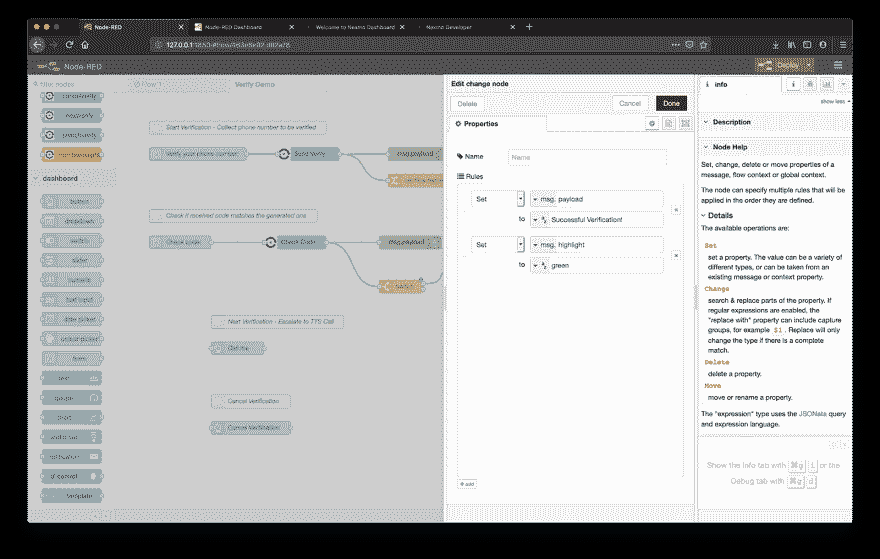T2】](https://res.cloudinary.com/practicaldev/image/fetch/s--c5AHVdeb--/c_limit%2Cf_auto%2Cfl_progressive%2Cq_auto%2Cw_880/https://www.nexmo.com/wp-content/uploads/2019/09/verify-success-change.png)

对第二个 **`change`** 节点重复相同的步骤，但这次给出`msg.payload`“验证失败！”值，并将`msg.highlight`设置为“红色”。另外，确保它连接到 **`switch`** 节点的第二个输出。

[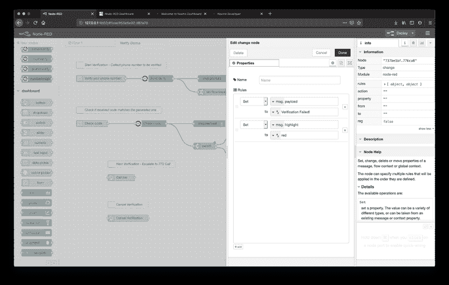T2】](https://res.cloudinary.com/practicaldev/image/fetch/s--JJrqTIZ4--/c_limit%2Cf_auto%2Cfl_progressive%2Cq_auto%2Cw_880/https://www.nexmo.com/wp-content/uploads/2019/09/verify-fail-change.png)

点击**展开**再试一次！现在，当验证过程完成时，您将看到一个弹出窗口显示结果！

### [](#next-verification)下一次验证

一旦验证过程开始，Nexmo 将尝试三次向提交的电话号码发送 PIN 码:一条 SMS 消息和两次文本到语音转换(TTS)电话呼叫。

有时候打电话是更好的选择，无论是出于可访问性的原因还是纯粹的个人偏好。让我们的用户选择另一种交付方式总是一件好事，所以让我们看看如何实现一个按钮，将验证过程立即升级为 TTS 呼叫。

在提供的流程模板中，找到 **Call Me** 按钮，并在其中连接一个 **`nextverify`** 节点。打开 **`nextverify`** 节点属性，从下拉菜单中选择您的`Nexmo Credentials`，在`Request ID {}`字段填写`{{flow.request_id}}`。

您可能还想考虑添加一个 **`debug`** 节点，以便在您的终端获得更多的洞察力，并添加一个 **`change`** 节点，后跟一个 **`notification`** 节点，以便让用户知道正在发生什么——就像您在上一步中所做的那样，但它是完全可选的。

[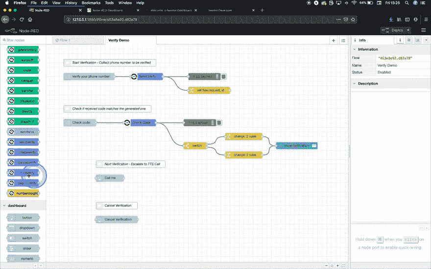T2】](https://res.cloudinary.com/practicaldev/image/fetch/s--EDfB1flR--/c_limit%2Cf_auto%2Cfl_progressive%2Cq_66%2Cw_880/https://www.nexmo.com/wp-content/uploads/2019/09/verify-nextverify.gif)

### [](#cancel-verification)取消验证

在一个理想的世界里，我们会停在这里，但总会有事情发生，不是吗？您在填写表格时犯了一个错误，并点击了提交-现在改变主意并点击**删除**已经太晚了，验证已经开始。

你可能认为你可以耐心等待，一旦失败就再试一次。是的，那也可以，但是这不是一个理想的方法。除了给你的用户带来令人沮丧的体验之外，想想那个可怜的不知情的灵魂，除了最初的验证信息之外，他还在凌晨 2 点接到了两个电话。哎呀。

幸运的是，有一种快速简单的方法来实现**取消验证**按钮。

如果您导入了提供的 UI 片段，您需要做的就是将一个 **`cancelverify`** 节点连接到**取消验证**按钮的输出中，打开 **`cancelverify`** 节点属性，从下拉菜单中选择您的`Nexmo Credentials`，并在`Request ID {}`字段中填入`{{flow.request_id}}`。

您还可以添加一个 **`debug`** 节点来查看调试侧栏中的响应对象，并添加一个 **`change`** 节点，后跟一个 **`notification`** 节点来让用户知道它已被成功取消。

[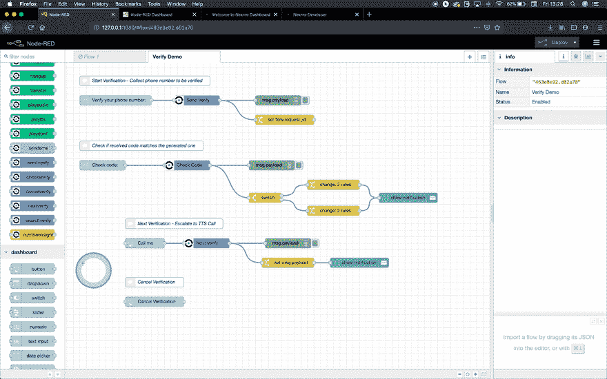T2】](https://res.cloudinary.com/practicaldev/image/fetch/s--VSntHHCD--/c_limit%2Cf_auto%2Cfl_progressive%2Cq_66%2Cw_880/https://www.nexmo.com/wp-content/uploads/2019/09/verify-cancelverify.gif)

现在点击**展开**按钮并测试它！请记住，要使取消请求有效，必须在提交电话号码至少 30 秒后发起。仍然有足够的时间来避免 TTS 呼叫被启动！

瞧啊！有了安全防护装置，您现在可以在晚上睡得更香了——所有您将要验证的毫无戒心的陌生人也是如此。干得好！

[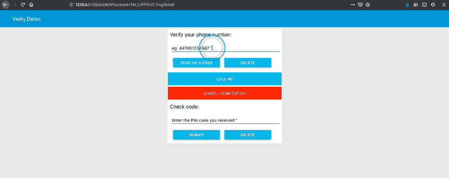T2】](https://res.cloudinary.com/practicaldev/image/fetch/s--uP7jV1i---/c_limit%2Cf_auto%2Cfl_progressive%2Cq_66%2Cw_880/https://www.nexmo.com/wp-content/uploads/2019/09/verify-flow.gif)

### [](#extra-credit-search-verification)额外积分-搜索验证

您已经可以在 debug 侧栏中跟踪验证过程的流程，因为从 Nexmo API 接收的每个返回对象都由一个 debug 节点记录，它提供了对正在发生的事情的有价值的洞察。

有时调试区域会变得有点拥挤，很难找到您要找的信息。除此之外，您可能希望在事件之间检查您的验证，而不必为了等待另一个返回对象弹出而等待下一个事件发生。它可能已经完成了，但是您不能完全确定它是失败了还是成功完成了。

好消息是，有一个 **`searchverify`** Nexmo 节点可以处理所有这些问题。比方说，当被一个 **`inject`** 节点触发时，它将输出关于由`request_id`标识的过去或当前验证请求的所有可用信息。

向您的工作区添加一个 **`searchverify`** 节点，将其连接在一个 **`inject`** 和一个 **`debug`** 节点之间。在 **`searchverify`** 节点属性中，从下拉菜单中选择您的`Nexmo Credentials`，并在`Request ID {}`字段中填入`{{flow.request_id}}`以获得当前验证的详细信息。您也可以在该字段中粘贴一个特定的`request_id`，以防您想要检查在当前验证之前发生的验证。

现在，当你在调试侧边栏中查看你的应用程序时，你会注意到每次你点击编辑器中的 **`inject`** 节点的按钮时，它都会返回一个对象，其中包含有问题的请求的所有可用细节。仔细查看响应字段，并前往 [Nexmo API 参考](https://developer.nexmo.com/api/verify#verifySearch)了解更多关于它们的信息。

[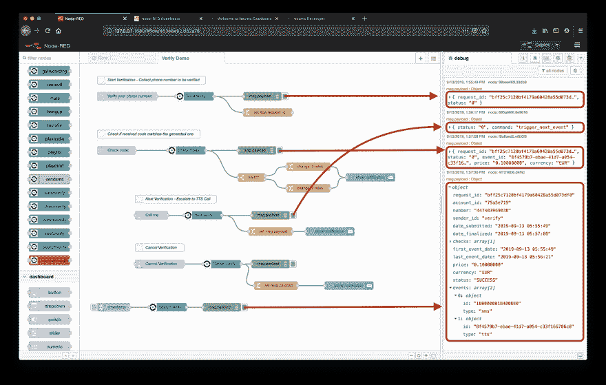T2】](https://res.cloudinary.com/practicaldev/image/fetch/s--aOnsOomP--/c_limit%2Cf_auto%2Cfl_progressive%2Cq_auto%2Cw_880/https://www.nexmo.com/wp-content/uploads/2019/09/verify-searchverify.png)

### [](#where-next)下一步去哪里？

*   Nexmo 验证 [API 引用](https://developer.nexmo.com/api/verify#verify-request)
*   验证[文件](https://developer.nexmo.com/verify/overview)

尝试另一个教程:

–[如何使用 Node-RED](https://dev.to/nexmo/how-to-stream-audio-into-a-call-with-node-red-1c1m)

–[如何使用 Node-RED](https://dev.to/nexmo/how-to-make-text-to-speech-phone-calls-with-node-red-2nfj)

–[如何使用 Node-RED](https://dev.to/nexmo/how-to-receive-phone-calls-with-node-red-3ihc)

–[发布 Nexmo Node-RED 包](https://www.nexmo.com/blog/2019/02/21/nexmo-node-red-package-dr/)

–[如何使用 Node-RED](https://dev.to/nexmo/how-to-send-sms-messages-with-node-red-2l2o)
发送短信