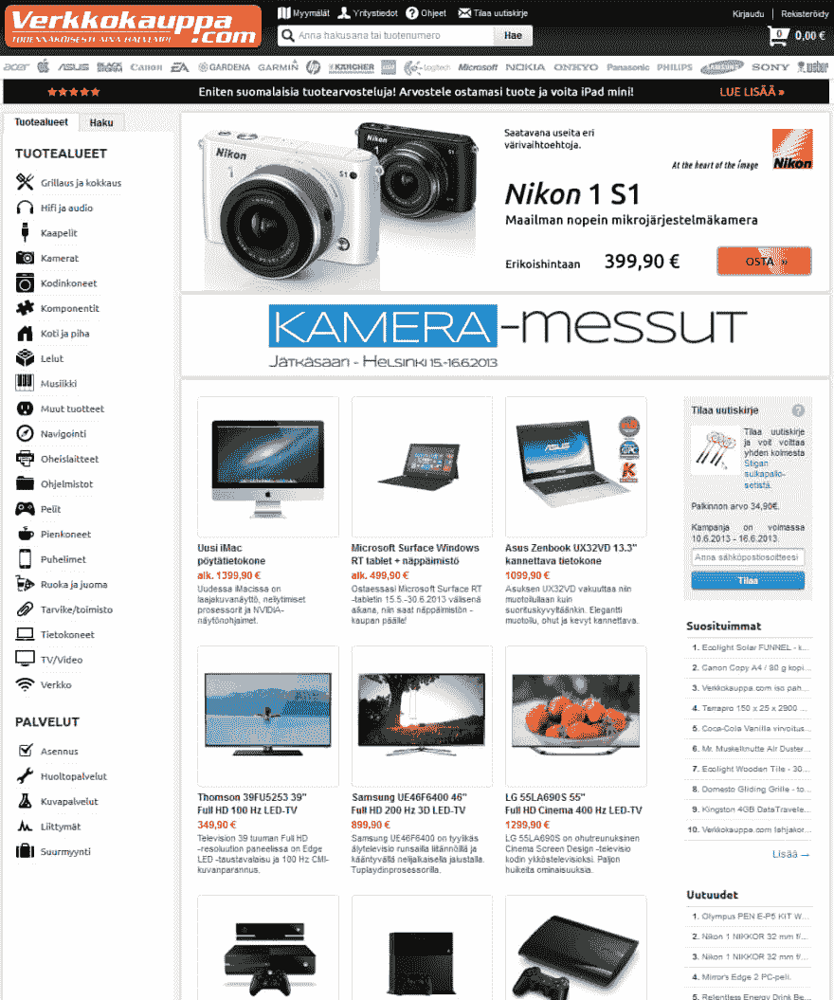
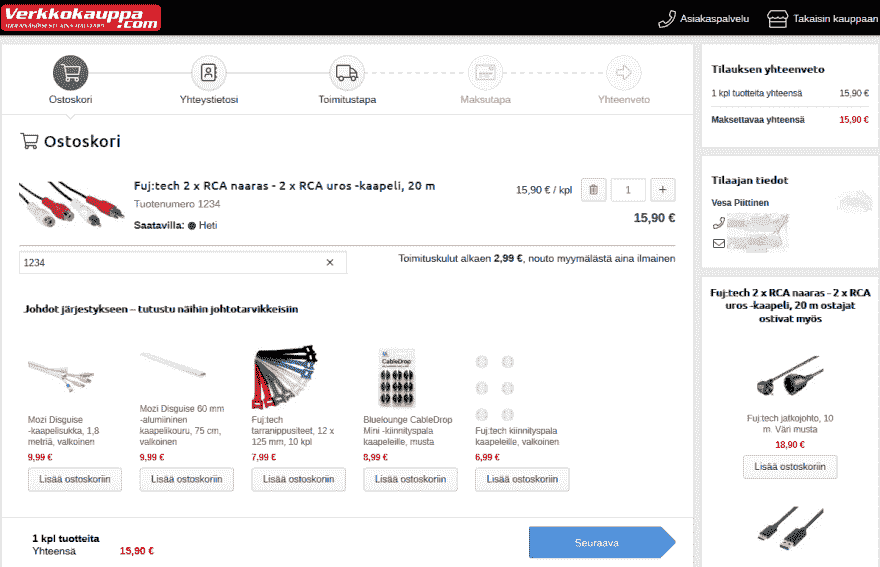
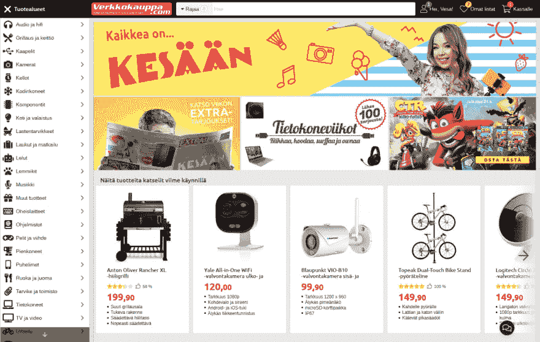

# SPA 五年之旅

> 原文：<https://dev.to/verkkokauppacom/the-five-year-journey-to-spa-57g1>

Verkkokauppa.com 是芬兰领先的电子商务网站。这家全渠道零售公司过去主要专注于消费电子产品，但近年来已扩展到各种其他产品类别。自公司 1992 年成立以来，一直保持着稳定的增长。

我是 2013 年加入这个行列的，是一名前端开发者。那时，公司正在采用敏捷开发，并正在告别黑暗的旧时代，那时开发人员更多地作为个人工作，直接从管理层接收功能请求和 bug 报告。旧的文化非常依赖直觉，用最少的资源做最多的事情——当公司足够小的时候，这很好，但是一旦定制软件以这种方式发展了十多年，这就不好了！随着更多的开发人员被雇佣来更好地控制软件，一个明显的转变已经开始发生。

公司的名字 Verkkokauppa 很简单，因为它意味着电子商务。与此相反，有一点奇怪的是，没有团队或个人完全致力于“web”的开发，这是面向客户的电子商务网站所谓的内部。2013 年 6 月，网络团队最终成立，并接管了面向客户的网站。

## 遗留问题

经典网站，我们称之为现已停产的网站，是基于 PHP 的，非常像 2013 年之前的大多数网站:针对台式机和笔记本电脑的固定布局，HTML 渲染的服务器端，提供一些 jQuery 片段，如在客户端浏览产品图片等功能。但是没有像 Ajax 这样真正的 Web 2.0 特性:将产品添加到购物车会导致一个单独的 HTML 页面。从这个意义上说，这个网站非常过时，技术落后于潮流五年。

传统 web 还有其他主要问题:到处都被业务逻辑所困扰，包括向客户输出最终 HTML 之前的最后视图。这当然是旧的做事方式的结果:没有时间去关心抽象。

小组很清楚，这种情况不能再继续下去了。我们采取了一些措施来改善这种情况:对团队来说，其中一件事就是建立对外部特性请求的抵抗力。这使得我们有时间考虑抽象，这样我们就可以开始处理 API，从而能够将业务逻辑从视图层移走。

在最初的几个月里，团队做了很多改进:首先是 Ajax cart，我们用 AngularJS 做了它，获得了一些经验。我们还实现了全页面缓存，优化了 JavaScript，引入了 HTML5，并修复了 SEO 问题。很多以前做不了的工作。

尽管存在这些问题，甚至在网络团队修复它们之前，这个网站是当时你在芬兰能找到的最好的网站。然而，有一个事实:你不能通过保持你目前的标准来保持最好，你必须思考如何在未来成为最好的。

## 从最小的努力到心态的品质

作为一个团队，我们开始思考如何处理网站的未来。为了从业务方面帮助我们的重点，我们有一个明确的愿望:我们希望在移动领域变得强大。2013 年，手机在芬兰还不是一件大事。然而，我们有一个强有力的假设，即它将是重要的，因为世界上其他地方的迹象都指向移动增长的趋势。

手机有很多可能的方式:我们可以为手机做一个独立的网站。好的一面是，你可以相对较快地做到这一点。糟糕的是维护:你必须维护两个不同的网站，我们真的没有人手来做这件事，也不能指望增长得足够快，让它变得可信。

但是在 2014 年初有新技术的消息:Node.js 和 React。这些技术承诺了使用单一语言 JavaScript 编写我们的服务器和客户端代码并在两种环境中重用它的可能性。此外，React 提供了 JSX，因此我们可以“用 JavaScript 编写 HTML”。没有很多编码人员，这听起来是件好事:我们可以更专注于完成工作，而花更少的时间来尝试语言的不匹配，以适应技术挑战。

还有一个响应式的想法:创建一个移动的第一站点，可以适应每个设备。我们中没有人以前做过那件事。有了所有这些可变因素，人们可能会认为采用这么多新事物太冒险了。

你知道什么！我们决定基于 Node.js 和 React 构建一个全新的网站。这项工作始于我们的结账流程，这使得为它创建一个独立的应用程序在技术上成为可能。2014 年春天，一场巨大的重构开始了。在夏天，我用 React 编写了一个 POC，使用的是 checkout API 的一个非常早期的版本。随着事情的发展...概念验证成为最终产品。

## 成功与失败

结帐过程的一个好处是它不需要被搜索引擎索引。这意味着我们可以在某个地方放一个 HTML 页面，然后添加 JavaScript。这是我们第一次真正的水疗。

然而，很明显，我们没有足够的开发人员投入更多的精力来开发基于 Node.js 的新应用。企业希望在 2014 年底拥有一个手机网站。因此，招募了一些外部帮助来让基于 React 的 Node.js 应用作为 MVP 运行。

好消息是:我们确实让网站运行起来了。

坏消息:团队和外部的帮助相处不好，所以他们在网站上线后很快就被释放了。

沟通没有起作用:Node 应用程序是用 CoffeeScript 和一些我们从未要求的其他技术选项编写的。这导致项目停滞了好几个月，因为在收银台应用程序开发期间，没有人有时间学习 CoffeeScript。

在这一点上，我们有两个结帐过程:一个是移动的，另一个是传统网络中的旧结帐过程。在 2015 年上半年，我们努力将所有必需的功能添加到新的结账应用程序中，采用响应式设计，以便我们可以为所有用户替换旧的结账。

6 月，重要的一天到来了:我们逐渐将每个人都转移到新的收银台。我们得到了一个惊喜:转化率上升了！尽管 React 存在一些问题，但我们的新结账应用做得很好。那时文档和约定还在形成中，所以我们犯了很多错误。但是应用程序本身已经取得了巨大的成功！

## 更正

未来响应网站的故事并不精彩。除了作为通用应用程序之外，没有在架构级别上考虑允许实施 SPA。这个组合很硬！没有考虑到这一点，也没有现成的路由解决方案。因此，我们不得不在很长一段时间内忽略 SPA，尽管我们希望最终实现它。

在 checkout 之后，我开始了我的暑假，我带着一个目标回到工作中:删除 CoffeeScript。有一些反对它的评论，但不管怎样，我做了大部分的重构。这很糟糕，持续了几个月，事情并不总是顺利，但在年底，我们告别了 CoffeeScript。那时，我们也引进了巴贝尔，最终也让 JSX 来到了新的场地。

如果我们有测试的话，重构会容易得多，但是像往常一样，我们没有足够的资源来正确地进行测试，外部的帮助也没有在这方面下功夫。测试本来可以节省很多！CoffeeScript 源代码中的一个典型错误是在更深的范围内意外重用变量。你不能在 CS 中声明变量，所以当你实际上只有一个变量时，很容易认为你在不同的作用域中有两个或更多的变量。

好消息是重构是值得的:在代码熟悉了 JavaScript 和一些新的 ES6 之后，开发速度加快了！

## 古典网络的终结

2016 年 11 月，我们向所有用户发布了新的响应式网站。但是我们只听说在发售前两三个月左右会出现这种情况！是的，考虑到今年年初网站的大部分内容仍然是移动的，很多重要的功能都丢失了，这是相当紧张的。我们又一次得到了外部的帮助，但是这一次我们确实相处得很好。

2016 年的主要发展之一是 Redux。我们在结账应用程序中使用了它，性能有了显著的提高。旧代码向组件传递了太多的属性，而 Redux 不再需要这样做。我们不喜欢 Flux，所以我们依赖于 React 提供的小状态管理工具——直到很久以后我们才知道上下文 API！没有特设或渲染道具模式。

随着我们也选择了 React Router，更新到新工具和不断重构的趋势仍在继续。有人可能会认为花在重构上的时间是从新功能中扣除的，但随着事情变得简单、设计得更好、更易于使用，我们又把时间赚了回来。

但是时间表！当我们向所有用户推出新网络，告别传统网络时，很多事情都可能出错。一切照常进行，但这很可怕，因为 2016 年黑色星期五开始在芬兰流行。尽管存在各种危险，新网站还是像之前的结账应用一样成功。

## 暴风雨后的平静

像往常一样，在一个大的发布之后，我们确实不得不为功能丰富的开发和目标的完成付出代价。在 2017 年上半年，人们非常关注解决问题。一些人辞职了，另一些人在公司内部交换了团队，Web 团队花了一段时间才拿回数据。

因此，没有发生太多的事情来改善 SPA 的进度...直到 React 路由器 4 发布，这是一个大的！我们在 10 月份对其进行了重构，随后在 11 月份很快推出了 React 16。我们现在有了一些允许 SPA 完成的技术，但是我们遇到了一个新的阻碍:GDPR。很多事情需要考虑，并在 2018 年 5 月前完成。

我们做了一些持续的工作来提高性能。2017 年，我们的黑色星期五并没有像我们希望的那样顺利，因此我们的年度重点已经转移到确保性能上，以确保人们可以从我们这里购买，即使他们中的许多人同时访问了该网站。这终于开始让我们明白，我们应该花时间在水疗上。2018 年夏季假期结束后，我们终于有机会完成在整个网站上启用 SPA 的梦想。

## 通用单页 App

为什么 SPA 这么棒？在这一点上，我们已经有了一个伟大的通用 JavaScript 应用程序，我们已经尽可能地优化了 React 引导时间。和...这还不够。

当你以传统方式从一个 HTML 页面转到另一个页面时，你会完全失去客户端上下文。所有的东西都被卸载然后重新加载，然后 React 需要水合，接下来是所有必要的业务逻辑...是很多。

SPA 跳过了大部分这种浪费:你只需要启动一次应用程序，然后通过 API 调用得到你需要的东西，而不是请求一个 HTML 页面。这种性能提升在手机等有限的设备上最为明显:当你去掉不必要的工作时，你甚至可以在手机上获得爽快而快速的体验。

在 2018 年底，我们达到了目标:所有页面最终都可以作为 SPA 加载。这很好:尽管加大了营销力度，通常会带来更多不购买的人，从而降低转化率，但我们并没有看到这种降低。相反，转化率是一样的，甚至更好。

这花了大约五年时间，但我们现在已经有了一个梦想成真的电子商务网站。它做许多困难的事情，并设法把它们做好。当然还有进一步改进的空间，但最重要的是我们没有落后于竞争对手，他们在过去的两三年里已经大大改进了他们的网站。

但是他们的工作还不够！

与 2013 年网络团队开始工作时不同，我们不再落后于技术趋势五年。我们拥有的很多东西都是尖端的。为了达到这一点，我们已经做了很多工作，尽管我们还有事情要做...我们是芬兰最好的。