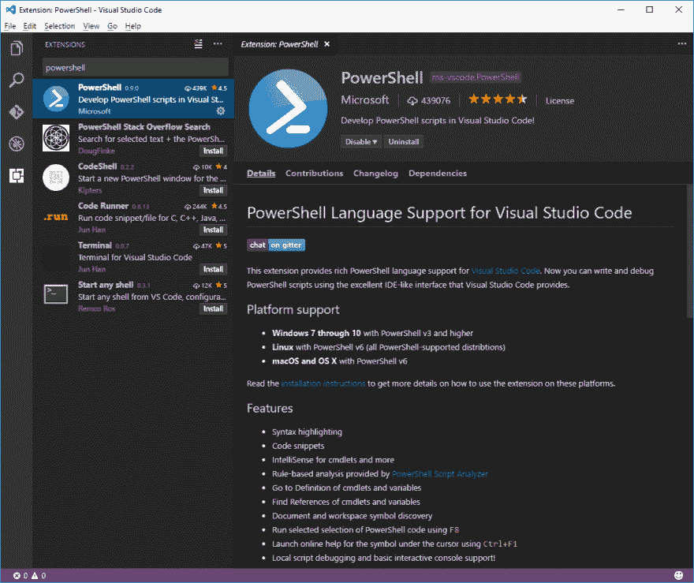
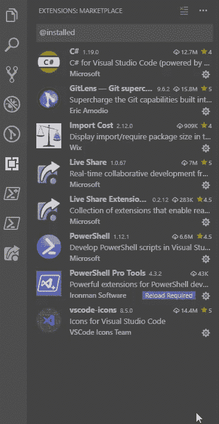

# 如何像专业人士一样使用带有 Visual Studio 代码的 PowerShell

> 原文：<https://dev.to/kasuken/how-to-use-powershell-with-visual-studio-code-like-a-pro-475b>

无论您是开发人员还是 it 专业人员，有时肯定都要与 Powershell 打交道。几年来，我一直将 PowerShell 脚本开发成 PowerShell ISE。
效果很好，但是看起来很“老”。
从很多年开始，差不多四年，我开始用 [Visual Studio 代码](https://code.visualstudio.com/)编辑各种文件，包括 PowerShell 文件。
原因真的很简单:Visual Studio 代码比 PowerShell IDE 更强大。我告诉你原因。

## 平台支持

PowerShell Core 受 Linux、OSx 和 Windows 支持，您可以在所有这些版本中使用 Visual Studio Code extension for PowerShell。
在 Windows 上也可以 PowerShell v3 及更高版本。

要在这些平台上安装 PowerShell Core，您可以直接按照 Microsoft 网站上的安装说明进行操作:

*   [在 Linux 上安装 PowerShell 内核](https://docs.microsoft.com/en-us/powershell/scripting/install/installing-powershell-core-on-linux?view=powershell-6)
*   [在 macOS 上安装 PowerShell 内核](https://docs.microsoft.com/en-us/powershell/scripting/install/installing-powershell-core-on-macos?view=powershell-6)
*   [在 Windows 上安装 PowerShell Core](https://docs.microsoft.com/en-us/powershell/scripting/install/installing-powershell-core-on-windows?view=powershell-6)

## 安装分机

启动 Visual Studio 代码，按**Ctrl+P**(Mac 上的 **Cmd+P** )。
编辑器打开一个侧栏扩展，选中 PowerShell 扩展。
点击**安装**，然后**重新加载**。

[](https://res.cloudinary.com/practicaldev/image/fetch/s--SUBh2iG---/c_limit%2Cf_auto%2Cfl_progressive%2Cq_auto%2Cw_880/https://docs.microsoft.com/en-us/powershell/docs-conceptuimg/vscode.png%3Fview%3Dpowershell-6)

## 为您的会话选择 PowerShell 版本

您可以在计算机上并行安装 PowerShell Core 和 PowerShell Vx。
如果你必须为你的脚本选择一个特定的版本，你可以打开命令面板( **Ctrl+Shift+P** 或者 **Cmd+Shift+P** 在 Mac 上)并编写**PowerShell:Show Session Menu**。
现在，您可以从下拉列表中选择正确的 PowerShell 版本。

您还可以从编辑器右下角的绿色 PowerShell 图标中选择 PowerShell 版本。
如果你点击它，同样的命令托盘会出现在顶栏上。

## 示例脚本

现在，您已经准备好使用 PowerShell 和 Visual Studio 代码了。
如果你想尝试一些示例脚本，你可以点击菜单**文件- >打开文件夹**或者快速点击 **Ctrl+K Ctrl+O** 并导航到这个文件夹:

```
C:\Users\<USERNAME>\.vscode\extensions\ms-vscode.PowerShell-<VERSION>\examples 
```

<svg width="20px" height="20px" viewBox="0 0 24 24" class="highlight-action crayons-icon highlight-action--fullscreen-on"><title>Enter fullscreen mode</title></svg> <svg width="20px" height="20px" viewBox="0 0 24 24" class="highlight-action crayons-icon highlight-action--fullscreen-off"><title>Exit fullscreen mode</title></svg>

您可以直接从 PowerShell 终端键入以下命令打开代码:

```
code  (Get-ChildItem  $Home\.vscode\extensions\ms-vscode.PowerShell-*\examples)[-1] 
```

<svg width="20px" height="20px" viewBox="0 0 24 24" class="highlight-action crayons-icon highlight-action--fullscreen-on"><title>Enter fullscreen mode</title></svg> <svg width="20px" height="20px" viewBox="0 0 24 24" class="highlight-action crayons-icon highlight-action--fullscreen-off"><title>Exit fullscreen mode</title></svg>

## 针对 PowerShell 文件的特定配置

在命令面板中( **Ctrl+Shift+P** 或 **Cmd+Shift+P** 在 Mac 上)编写**打开设置(JSON)** 。
现在你可以不用漂亮的用户界面就能看到你的喜好。
您可以在这里添加一些专门针对 PowerShell 的附加设置。

```
 "powershell.integratedConsole.focusConsoleOnExecute": false,
  "powershell.integratedConsole.showOnStartup": false,
  "[powershell]": {
    "editor.renderWhitespace": "all",
    "editor.renderControlCharacters": true,
    "files.trimTrailingWhitespace": true,
    "files.encoding": "utf8bom",
    "files.autoGuessEncoding": true,
    "editor.tabCompletion": "on"
  } 
```

<svg width="20px" height="20px" viewBox="0 0 24 24" class="highlight-action crayons-icon highlight-action--fullscreen-on"><title>Enter fullscreen mode</title></svg> <svg width="20px" height="20px" viewBox="0 0 24 24" class="highlight-action crayons-icon highlight-action--fullscreen-off"><title>Exit fullscreen mode</title></svg>

因为您已经添加了语言名称，所以这些行为不会影响其他语言。

## 如何调试 PowerShell 脚本

从 1.9 版本开始，你可以调试单个文件，而不需要打开包含脚本的文件夹。
因此，你可以在 VS 代码中打开一个. ps1 文件，设置一个断点(用鼠标点击工具条或按 F9 键到代码行)，然后按 F5 键启动一个调试会话。
快速简单。

还有另一种调试 PowerShell 文件的方法，可以为调试体验增加一些额外的功能。
例如，您可以选择是在交互式会话中调试脚本，还是在 PC 上运行的 PowerShell 主机进程中调试脚本。

您可以按照以下简单步骤创建调试配置文件:

*   打开包含脚本的文件夹
*   打开调试侧栏，点击右上角的齿轮图标。
*   当然是选择名为“PowerShell”的环境。

现在，Visual Studio 代码使用您的调试设置在您的目录中创建了一个名为 *launch.json* 的文件。
你可以把内容替换成这个 JSON:

```
{
  "version": "0.2.0",
  "configurations": [
      {
          "type": "PowerShell",
          "request": "launch",
          "name": "PowerShell Launch (current file)",
          "script": "${file}",
          "args": [],
          "cwd": "${file}"
      },
      {
          "type": "PowerShell",
          "request": "attach",
          "name": "PowerShell Attach to Host Process",
          "processId": "${command.PickPSHostProcess}",
          "runspaceId": 1
      },
      {
          "type": "PowerShell",
          "request": "launch",
          "name": "PowerShell Interactive Session",
          "cwd": "${workspaceRoot}"
      }
  ]
} 
```

<svg width="20px" height="20px" viewBox="0 0 24 24" class="highlight-action crayons-icon highlight-action--fullscreen-on"><title>Enter fullscreen mode</title></svg> <svg width="20px" height="20px" viewBox="0 0 24 24" class="highlight-action crayons-icon highlight-action--fullscreen-off"><title>Exit fullscreen mode</title></svg>

您可以通过以下链接找到有关调试的其他信息:

*   [在 Visual Studio 代码中调试 PowerShell 脚本–第 1 部分](https://devblogs.microsoft.com/scripting/debugging-powershell-script-in-visual-studio-code-part-1/)
*   [在 Visual Studio 代码中调试 PowerShell 脚本–第 2 部分](https://devblogs.microsoft.com/scripting/debugging-powershell-script-in-visual-studio-code-part-2/)

## 命令浏览器和模块浏览器

如果你喜欢 PowerShell ISE，你肯定会喜欢命令浏览器栏。
使用 VS 代码的 PowerShell 扩展，你会有同样的体验，打开命令面板( **Ctrl+Shift+P** 或者 **Cmd+Shift+P** 在 Mac 上)，输入“PowerShell 命令浏览器”。

Visual Studio 代码中没有“本机”模块资源管理器，但您可以安装另一个名为“PowerShell Pro Tools”的扩展来实现这一功能。你需要一个许可密钥，但是模块浏览器是免费的。

*   [PowerShell Pro 工具扩展](https://marketplace.visualstudio.com/items?itemName=ironmansoftware.powershellprotools)

[](https://res.cloudinary.com/practicaldev/image/fetch/s--YVMxwhrT--/c_limit%2Cf_auto%2Cfl_progressive%2Cq_66%2Cw_880/https://ironmansoftware.com/wp-content/uploads/2019/04/updateGif.gif)

## PowerShell 的代码片段

为了更有效率，你必须在更短的时间内编写更多的代码(不仅仅是这样)。Visual Studio 代码支持代码片段，添加特定语言的代码片段非常容易。
从命令面板中( **Ctrl+Shift+P** 或 **Cmd+Shift+P** 在 Mac 上)键入**片段**并选择**配置用户片段**然后选择 **PowerShell** 。
现在你可以粘贴下面的 JSON 文件和一些代码片段了。你也可以添加你的片段。