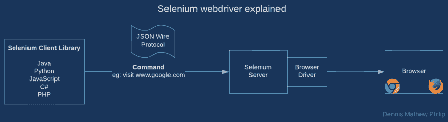
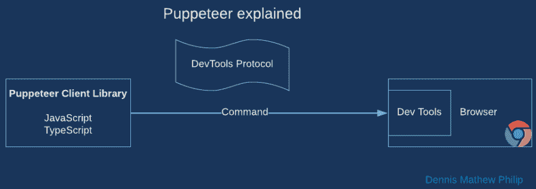
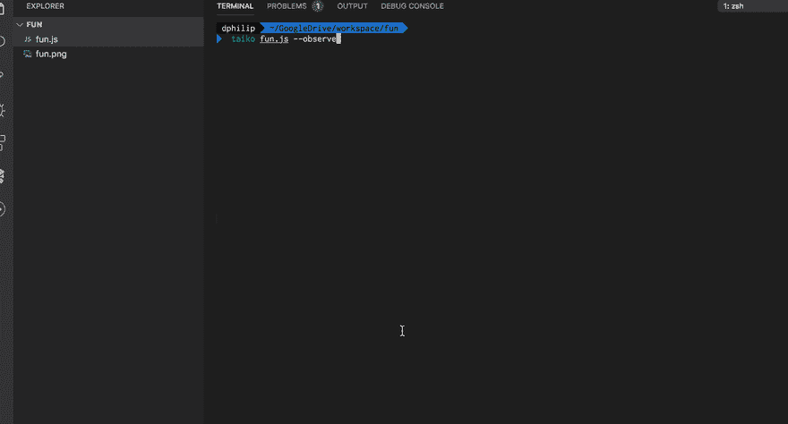

# 自动化端到端测试变得简单

> 原文：<https://dev.to/dennismphil/automated-end-to-end-tests-made-easy-180m>

是时候为您的下一个应用程序添加一些端到端测试了。今天我有一个新的浏览器自动化工具来分享。

这是从大量使用 JavaScript 作为开发语言的团队的角度写的。我评估了几个用于端到端应用程序测试的浏览器自动化框架，并想分享一下当前工具领域的一些东西。

> 端到端测试也称为功能测试或快乐路径测试，它在软件发布之前或之后自动进行健全性或抽查。

我需要选择一个考虑到易于开发，长期可维护性，测试框架集成。让我们探索一些有趣的球员。

1.  美好的过去**硒**
2.  基于 Chromium 的浏览器自动化 API **木偶师**
3.  最被炒作的**柏树**
4.  太鼓(Taiko)——街区里的新小子(如果你没听说过这个没关系。我也没有)

**TL；DR；**我最终选择了 **Taiko** 的❤️美丽的 API，它就像魔法一样工作！

## 1\. Selenium ❌

硒建于 2004 年。Selenium 的主要问题是它的体系结构。

在每次运行中表现不同的系统，也称为*剥落*，是 Selenium 分层架构的主要问题。让我们看看为什么硒测试是片状的。

[](https://res.cloudinary.com/practicaldev/image/fetch/s--t_EO6rlK--/c_limit%2Cf_auto%2Cfl_progressive%2Cq_auto%2Cw_880/https://thepracticaldev.s3.amazonaws.com/i/dhm24gl3szbzg900vsmk.png)

在图中，很明显命令必须经过多层。驱动程序是在浏览器外部构建的，这导致驱动浏览器是“盲目的”,没有关于命令是否已经成功执行的反馈。

## 2。木偶师

从 2004 年快进，14 年后，谷歌发布了 1.0 版的木偶师。

[](https://res.cloudinary.com/practicaldev/image/fetch/s--YMEfB_mi--/c_limit%2Cf_auto%2Cfl_progressive%2Cq_auto%2Cw_880/https://thepracticaldev.s3.amazonaws.com/i/235rtuuwvx5mo59aphrg.png)

从上图中您会注意到，控制器和浏览器之间的层更少了。这是现代端到端测试框架之间的关键区别。

> Puppeteer 是一个节点库，它提供了一个高级 API 来控制 headless Chrome 或 DevTools 协议上的 Chrome。

这是强大的。它使用 DevTools 协议，这是 Chrome 开发者工具用来与浏览器交互的底层协议。

一个代码示例:

```
const browser = await puppeteer.launch();

const page = await browser.newPage();
await page.goto('https://example.com');

console.log(await page.content());
await page.screenshot({path: 'screenshot.png'});

await browser.close(); 
```

Enter fullscreen mode Exit fullscreen mode

然而，它是面向浏览器自动化的，端到端的 web 应用程序测试只是其中之一。这意味着您必须明确地等待页面加载，断言您关心的事情，这将很快使编写和维护测试变得不那么有趣。

## 3。赛普拉斯❌

Cypress 用自己独特的架构实现了浏览器的自动化。Cypress 选择了一条更少人走过的艰难道路，从浏览器内部运行测试，并将操作传递给外部节点进程，这使得测试非常有效。

它带有烘烤的电子。很多时候，我发现非常简单的测试在默认情况下可以在 electron 中运行，但是在 Chrome 或 Chrome 无头环境中却无法运行。

> 好评如潮，市场营销，播客演讲，漂亮的文档，然而，它没有达到你所期望的高期望值。

我给了它足够的能量，希望它能工作。非常希望这能成功。然而，意识到它有危险的浏览器代理模块，当在公司代理环境中运行时无法设置重定向，最恼人的限制是，如果你在一个域中，你不能访问另一个域。

> 每个测试仅限于访问一个超级域。

因此，如果你有一个登录页面在另一个领域的应用程序，准备哭吧😭。哭得那么大声，柏树队都听到了。我希望这些改变在未来。我放弃了。

## 4\. Taiko ✅

太鼓是 ThoughtWorks 的。也是硒诞生的地方。它照耀着✨.

> 它闪耀着❤️美丽的 API。

给我看一些代码...

```
await openBrowser();
await goto("google.com");
await write("Dennis Mathew Philip");
await click("Google Search"); 
```

Enter fullscreen mode Exit fullscreen mode

您会注意到没有等待元素出现。没有 CSS 选择器。识别输入字段是明智的。

[](https://res.cloudinary.com/practicaldev/image/fetch/s--v_6KJ2cu--/c_limit%2Cf_auto%2Cfl_progressive%2Cq_66%2Cw_880/https://thepracticaldev.s3.amazonaws.com/i/khdun8onqsyu9nb9qiua.gif)

✅漂亮的文档
✅集成 Jest 和其他流行的测试框架
✅不需要明确的等待。少码
✅无头而慈友善

它还有一个 REPL，使开发变得轻而易举。

来自 Taiko 团队的简单 gif:

[](https://res.cloudinary.com/practicaldev/image/fetch/s--r5YYDq2J--/c_limit%2Cf_auto%2Cfl_progressive%2Cq_66%2Cw_880/https://thepracticaldev.s3.amazonaws.com/i/6we9xmgb7pwjvh1s8135.gif)

我喜欢用太鼓。我从编写端到端测试中获得了乐趣。我希望你也能。

# 得出结论...

端到端测试提高了您发布软件的信心。我们比较了一些免费和开源的端到端测试解决方案——Selenium、Puppeteer、Cypress 和 Taiko。这里写的观点就是我所经历的。仔细考虑您的用例，选择最适合您的工具。浏览器自动化工具是很强大的。负责任地使用。

如果您的 web 应用程序没有至少一个功能测试，那么今天就开始吧。

请在这里找到我的其他作品:

1.  [自动更新节点依赖关系](https://dev.to/dennismphil/automate-your-node-dependency-updates-4aga)
2.  [使用 SVG 的单边圆角矩形](https://medium.com/@dennismphil/one-side-rounded-rectangle-using-svg-fb31cf318d90)
3.  [Visual Studio 代码—调试模式](https://medium.com/@dennismphil/debugging-node-js-using-visual-studio-code-c30e5eeb9e38)
4.  我希望 TypeScript 成功。
5.  我的笔记本电脑里有什么？
6.  [CoffeeScript 最受欢迎的特性即将在 JavaScript 中出现](https://medium.com/@dennismphil/coffeescripts-most-loved-feature-soon-in-javascript-b2f6740c2dc7)