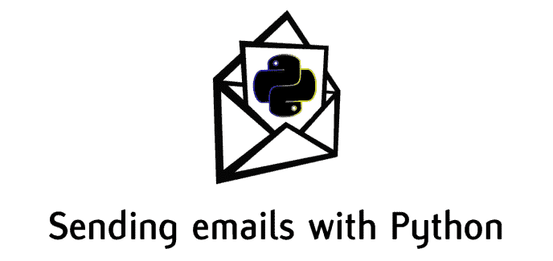
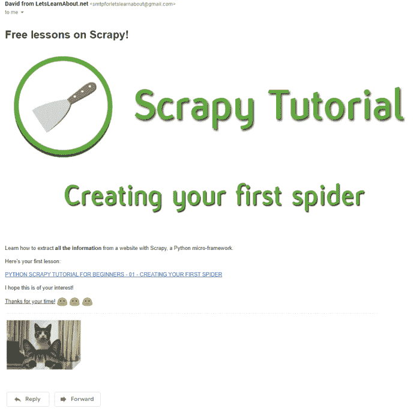
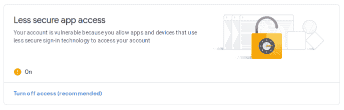
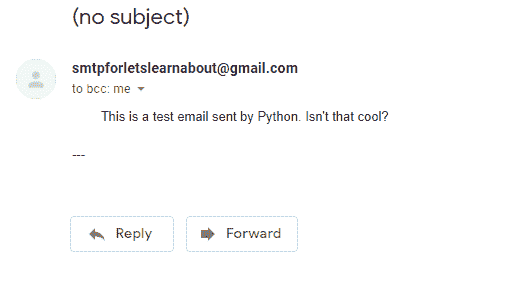
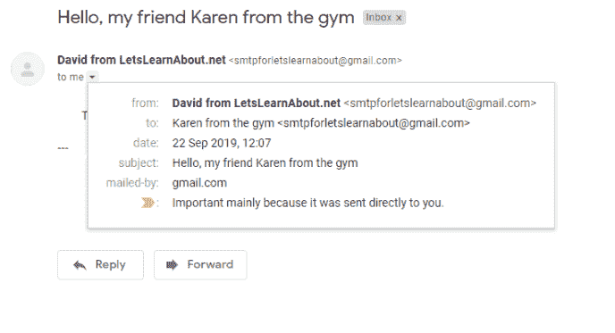
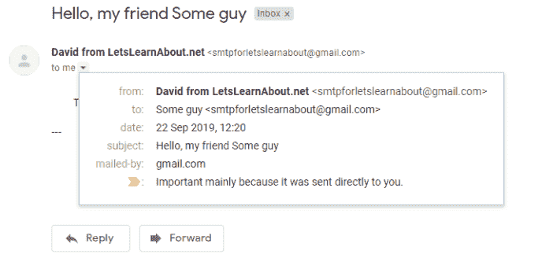
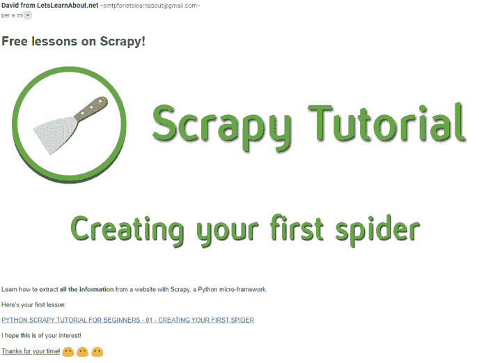
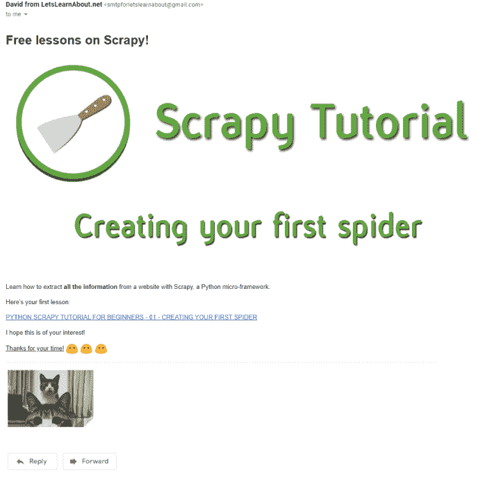

# 如何只用 Python 发送带有附件的漂亮电子邮件(是的，还有猫的照片)

> 原文:[https://dev . to/davidmm 1707/how-to-send-beautiful-email-with attachments-yes-cat-pics-too-use-only-python-4l9e](https://dev.to/davidmm1707/how-to-send-beautiful-emails-with-attachments-yes-cat-pics-too-using-only-python-4l9e)

原帖:[https://letslearnabout . net/tutorial/how-to-send-beautiful-email-with-attachments-use-only-python/](https://letslearnabout.net/tutorial/how-to-send-beautiful-emails-with-attachments-using-only-python/?preview=true&_thumbnail_id=1485)

# 如何只用 Python 发送带有附件的漂亮邮件(是的，还有猫的照片)

[T2】](https://res.cloudinary.com/practicaldev/image/fetch/s--m70c5Ss---/c_limit%2Cf_auto%2Cfl_progressive%2Cq_auto%2Cw_880/https://i1.wp.com/letslearnabout.net/wp-content/uploads/2019/09/image-30.png%3Ffit%3D688%252C325%26ssl%3D1)

你知道你可以用 Python 发邮件吗？不仅如此，您还可以发送附加文件！

除了大多数人使用的黑白背景纯文本，你还可以用 HTML 文件发送电子邮件，给你的电子邮件添加一些味道，就像这样:

[T2】](https://res.cloudinary.com/practicaldev/image/fetch/s--ODEK5CRD--/c_limit%2Cf_auto%2Cfl_progressive%2Cq_auto%2Cw_880/https://i0.wp.com/letslearnabout.net/wp-content/uploads/2019/09/image-36.png%3Fw%3D688%26ssl%3D1)

在短短几分钟内，您将学习如何创建一个 SMTP 服务器，使用 Python 向一系列客户、学生、朋友发送电子邮件

在本视频中，您将学习如何:

*   向一个人发送一封电子邮件
*   添加信息，如您的姓名、收件人姓名或主题，使其更像人类
*   向多人发送一封电子邮件
*   使用 HTML 制作一封漂亮的电子邮件
*   在我们发送的电子邮件中附加文件

[https://www.youtube.com/embed/m9ojKEBYCvQ](https://www.youtube.com/embed/m9ojKEBYCvQ)

* * *

### [](#setting-up-everything)设置一切

我们将使用 Gmail 帐户发送电子邮件。首先，创建一个 gmail 帐户(或使用您自己的帐户)，并在您的帐户中启用“不太安全的应用程序访问”。可以在这里做:[https://myaccount.google.com/u/0/security?hl=en&pli = 1](https://myaccount.google.com/u/0/security?hl=en&pli=1)

[T2】](https://res.cloudinary.com/practicaldev/image/fetch/s--UdewxF-k--/c_limit%2Cf_auto%2Cfl_progressive%2Cq_auto%2Cw_880/https://i2.wp.com/humberto.io/img/emails/less-secure.png%3Fw%3D688%26ssl%3D1)

之后，你就大功告成了！用 Python 创建一个环境(我用的是 pipenv，so _ pipenv shell)_ 就万事俱备了！

* * *

### [](#simple-one-to-one-email-sender)简单，一对一的邮件发送

让我们首先创建一个简单的脚本，从您的帐户向其他人发送一封电子邮件(我使用 pipenv，所以我用 *pipenv* _ shell_ 创建了一个):

[T2】](https://res.cloudinary.com/practicaldev/image/fetch/s--hdNKj1Xb--/c_limit%2Cf_auto%2Cfl_progressive%2Cq_auto%2Cw_880/https://i2.wp.com/letslearnabout.net/wp-content/uploads/2019/09/image-32.png%3Fw%3D688%26ssl%3D1)

创建一个 python 文件，例如 *email_server.py* ，并编写:

```
import smtplib, ssl

# User configuration
sender_email = YOUR_EMAIL
receiver_email = RECEIVER_EMAIL
password = input('Please, type your password:n')

# Email text
email_body = '''
    This is a test email sent by Python. Isn't that cool?
''' 
```

<svg width="20px" height="20px" viewBox="0 0 24 24" class="highlight-action crayons-icon highlight-action--fullscreen-on"><title>Enter fullscreen mode</title></svg> <svg width="20px" height="20px" viewBox="0 0 24 24" class="highlight-action crayons-icon highlight-action--fullscreen-off"><title>Exit fullscreen mode</title></svg>

smtp 是一个 Python 模块，我们将使用它来创建一个 smtp(简单邮件传输协议)会话对象，它将发送我们想要的任何电子邮件。 *ssl* 模块提供对 TLS(传输层安全性)的访问，帮助我们提高安全性。

然后，我们将添加一些变量，如发件人和收件人的电子邮件，提示用户输入电子邮件密码和电子邮件正文。将大写的值替换为您的值。出于测试的目的，我使用相同的电子邮件。

完成配置后，让我们编写发送电子邮件的函数:

```
print("Sending the email...")
try:
        # Creating a SMTP session | use 587 with TLS, 465 SSL and 25
        server = smtplib.SMTP('smtp.gmail.com', 587)
        # Encrypts the email
        context = ssl.create_default_context()
        server.starttls(context=context)
        # We log in into our Google account
        server.login(sender_email, password)
        # Sending email from sender, to receiver with the email body
        server.sendmail(sender_email, receiver_email, email_body)
        print('Email sent!')
except Exception as e:
        print(f'Oh no! Something bad happened!n {e}')
finally:
        print('Closing the server...')
        server.quit() 
```

<svg width="20px" height="20px" viewBox="0 0 24 24" class="highlight-action crayons-icon highlight-action--fullscreen-on"><title>Enter fullscreen mode</title></svg> <svg width="20px" height="20px" viewBox="0 0 24 24" class="highlight-action crayons-icon highlight-action--fullscreen-off"><title>Exit fullscreen mode</title></svg>

该功能将:

*   创建 smtplib。SMTP 实例。我们使用 gmail，所以我们使用主机*smtp.gmail.com*和端口 *587* 发送邮件。您可以通过使用其他提供商(如 hotmail)的主机和端口来使用它们。
*   使用 _starttl_s 方法加密电子邮件。
*   登录我们的谷歌电子邮件账户
*   使用发件人电子邮件向收件人电子邮件发送电子邮件，而邮件只是一个纯文本。
*   使用 try，除了捕获所有错误并最终关闭 SMTP 实例。

现在运行代码，您将收到您的电子邮件！

[T2】](https://res.cloudinary.com/practicaldev/image/fetch/s--hdNKj1Xb--/c_limit%2Cf_auto%2Cfl_progressive%2Cq_auto%2Cw_880/https://i2.wp.com/letslearnabout.net/wp-content/uploads/2019/09/image-32.png%3Fw%3D688%26ssl%3D1)

但是我们在这里不仅仅是发送一封电子邮件。我们可以自己做！

现在，让我们向一个列表发送多封电子邮件。

* * *

### [](#sending-emails-to-a-list-of-people)向列表中的人发送电子邮件

要发送多封电子邮件，我们只需要在这里和那里做一些调整。让我们的电子邮件更加个性化，在邮件中添加主题和发件人信息:

[T2】](https://res.cloudinary.com/practicaldev/image/fetch/s--nkRyi-dI--/c_limit%2Cf_auto%2Cfl_progressive%2Cq_auto%2Cw_880/https://i0.wp.com/letslearnabout.net/wp-content/uploads/2019/09/image-33.png%3Fw%3D688%26ssl%3D1)

首先，让我们写更多类似人类的电子邮件:

```
import smtplib, ssl
from email.mime.text import MIMEText # New line
from email.utils import formataddr  # New line

# User configuration
sender_email = YOUR_EMAIL
sender_name = YOUR NAME  # New line
password = input('Please, type your password:n')    

receiver_email = RECEIVER_EMAIL
receiver_name = RECEIVER_NAME  # New line 
```

<svg width="20px" height="20px" viewBox="0 0 24 24" class="highlight-action crayons-icon highlight-action--fullscreen-on"><title>Enter fullscreen mode</title></svg> <svg width="20px" height="20px" viewBox="0 0 24 24" class="highlight-action crayons-icon highlight-action--fullscreen-off"><title>Exit fullscreen mode</title></svg>

添加带有“# New line”注释的行。我们正在导入 MIMEText(多用途互联网邮件扩展)来配置我们的电子邮件和 a _formataddr_helper 方法。

在第一次打印之后，在*之前，尝试*，添加以下配置:

```
# Configurating user's info
msg = MIMEText(email_body, 'plain')
msg['To'] = formataddr((receiver_name, receiver_email))
msg['From'] = formataddr((sender_name, sender_email))
msg['Subject'] = 'Hello, my friend ' + receiver_name 
```

<svg width="20px" height="20px" viewBox="0 0 24 24" class="highlight-action crayons-icon highlight-action--fullscreen-on"><title>Enter fullscreen mode</title></svg> <svg width="20px" height="20px" viewBox="0 0 24 24" class="highlight-action crayons-icon highlight-action--fullscreen-off"><title>Exit fullscreen mode</title></svg>

现在，我们创建一个 MIMEText 实例，email_body 作为纯文本，我们将“收件人”文本设置为收件人姓名和电子邮件，“发件人”文本设置为我们的姓名和电子邮件，主题设置为“你好，我的朋友姓名”。

最后，将 *sender.sendmail* 方法修改为:

```
server.sendmail(sender_email, receiver_email, msg.as_string()) 
```

<svg width="20px" height="20px" viewBox="0 0 24 24" class="highlight-action crayons-icon highlight-action--fullscreen-on"><title>Enter fullscreen mode</title></svg> <svg width="20px" height="20px" viewBox="0 0 24 24" class="highlight-action crayons-icon highlight-action--fullscreen-off"><title>Exit fullscreen mode</title></svg>

再次发送电子邮件:

[T2】](https://res.cloudinary.com/practicaldev/image/fetch/s--LkDC5O19--/c_limit%2Cf_auto%2Cfl_progressive%2Cq_auto%2Cw_880/https://i0.wp.com/letslearnabout.net/wp-content/uploads/2019/09/image-34.png%3Fw%3D688%26ssl%3D1)

很好，现在有更少的垃圾信息了。让我们把这封 100%正常的、非伪造的电子邮件发送给一组人:

```
# receiver_email = RECEIVER_EMAIL
# receiver_name = RECEIVER_NAME

receiver_emails = [RECEIVER_EMAIL_1, RECEIVER_EMAIL_2, RECEIVER_EMAIL_3]
receiver_names = [RECEIVER_NAME_1, RECEIVER_NAME_2, RECEIVER_NAME_3] 
```

<svg width="20px" height="20px" viewBox="0 0 24 24" class="highlight-action crayons-icon highlight-action--fullscreen-on"><title>Enter fullscreen mode</title></svg> <svg width="20px" height="20px" viewBox="0 0 24 24" class="highlight-action crayons-icon highlight-action--fullscreen-off"><title>Exit fullscreen mode</title></svg>

因为我们要迭代接收者的电子邮件和姓名，所以在 _ receiver _ names _ 变量下面的代码前面加上这个 for-loop，并标记该代码，使其属于该循环:

```
for receiver_email, receiver_name in zip(receiver_emails, receiver_names):
    print("Sending the email...")
    # Configurating user's info
    msg = MIMEText(email_body, 'plain')
    ... 
```

<svg width="20px" height="20px" viewBox="0 0 24 24" class="highlight-action crayons-icon highlight-action--fullscreen-on"><title>Enter fullscreen mode</title></svg> <svg width="20px" height="20px" viewBox="0 0 24 24" class="highlight-action crayons-icon highlight-action--fullscreen-off"><title>Exit fullscreen mode</title></svg>

这应该是您现在的代码:

```
import smtplib
import ssl
from email.mime.text import MIMEText  # New line
from email.utils import formataddr  # New line

# User configuration
sender_email = YOUR_EMAIL
sender_name = YOUR NAME
password = input('Please, type your password:n')

receiver_emails = [RECEIVER_EMAIL_1, RECEIVER_EMAIL_2, RECEIVER_EMAIL_3]
receiver_names = [RECEIVER_NAME_1, RECEIVER_NAME_2, RECEIVER_NAME_3]

# Email text
email_body = '''
    This is a test email sent by Python. Isn't that cool?
'''

for receiver_email, receiver_name in zip(receiver_emails, receiver_names):
    print("Sending the email...")
    # Configurating user's info
    msg = MIMEText(email_body, 'plain')
    msg['To'] = formataddr((receiver_name, receiver_email))
    msg['From'] = formataddr((sender_name, sender_email))
    msg['Subject'] = 'Hello, my friend ' + receiver_name
    try:
        # Creating a SMTP session | use 587 with TLS, 465 SSL and 25
        server = smtplib.SMTP('smtp.gmail.com', 587)
        # Encrypts the email
        context = ssl.create_default_context()
        server.starttls(context=context)
        # We log in into our Google account
        server.login(sender_email, password)
        # Sending email from sender, to receiver with the email body
        server.sendmail(sender_email, receiver_email, msg.as_string())
        print('Email sent!')
    except Exception as e:
        print(f'Oh no! Something bad happened!n {e}')
    finally:
        print('Closing the server...')
        server.quit() 
```

<svg width="20px" height="20px" viewBox="0 0 24 24" class="highlight-action crayons-icon highlight-action--fullscreen-on"><title>Enter fullscreen mode</title></svg> <svg width="20px" height="20px" viewBox="0 0 24 24" class="highlight-action crayons-icon highlight-action--fullscreen-off"><title>Exit fullscreen mode</title></svg>

运行代码，你的电子邮件将被发送到 3 个不同的电子邮件地址！

在这里，我们发送一封电子邮件给 3 个不同的人，但你可以发送给数百名你的学生，追随者，博客读者等！还有…

…他们会收到一封难看的电子邮件。

我答应你用 Python 发送漂亮的电子邮件，可以吸引人们到任何你想要的地方。所以我们走吧！

* * *

### [](#sending-beautiful-emails-with-html)用 HTML 发送精美邮件

这很简单。现在我们以电子邮件正文的形式发送一个字符串，对吗？

相反，我们将发送一个包含 HTML 代码的字符串。

首先，让我们创建我们的 HTML 文件。使用代码编辑器，如 VS Code 或 Atom，或者使用在线编辑器创建它，如。

保存成 HTML 文件(我的是*email.html*)。

现在，将 *email_body* 放入:

```
# Email body
email_html = open('email.html')
email_body = email_html.read() 
```

<svg width="20px" height="20px" viewBox="0 0 24 24" class="highlight-action crayons-icon highlight-action--fullscreen-on"><title>Enter fullscreen mode</title></svg> <svg width="20px" height="20px" viewBox="0 0 24 24" class="highlight-action crayons-icon highlight-action--fullscreen-off"><title>Exit fullscreen mode</title></svg>

用新线路替换旧线路:

```
# msg = MIMEText(email_body, 'plain') # Old line
msg = MIMEText(email_body, 'html') # New line 
```

<svg width="20px" height="20px" viewBox="0 0 24 24" class="highlight-action crayons-icon highlight-action--fullscreen-on"><title>Enter fullscreen mode</title></svg> <svg width="20px" height="20px" viewBox="0 0 24 24" class="highlight-action crayons-icon highlight-action--fullscreen-off"><title>Exit fullscreen mode</title></svg>

运行代码，结果如下:

[T2】](https://res.cloudinary.com/practicaldev/image/fetch/s--pklY50oQ--/c_limit%2Cf_auto%2Cfl_progressive%2Cq_auto%2Cw_880/https://i2.wp.com/letslearnabout.net/wp-content/uploads/2019/09/image-35.png%3Fw%3D688%26ssl%3D1)

很酷，对吧？

但是，如果我们还想发送发票、pdf、excel 文件、视频或其他文件呢？

* * *

### [](#add-files-to-your-emails-the-mandatory-catgif-example)将文件添加到您的电子邮件中——强制性的 cat.gif 示例

为了添加文件，我们将发送多个部分，而不是发送一个对象，即 HTML。一个是 HTML，另一个是 gif。为此，请添加以下内容:

```
import smtplib, ssl
from email.mime.text import MIMEText
from email.utils import formataddr
from email.mime.multipart import MIMEMultipart # New line
from email.mime.base import MIMEBase # New line
from email import encoders # New line

....
# Email body
email_html = open('email.html')
email_body = email_html.read()

filename = 'cat.gif' # New line 
```

<svg width="20px" height="20px" viewBox="0 0 24 24" class="highlight-action crayons-icon highlight-action--fullscreen-on"><title>Enter fullscreen mode</title></svg> <svg width="20px" height="20px" viewBox="0 0 24 24" class="highlight-action crayons-icon highlight-action--fullscreen-off"><title>Exit fullscreen mode</title></svg>

记得在文件夹中添加一个名为“cat.gif”的文件，或者用自己的文件替换它。

将 _msg = MIMEText(email_body，' html ')_ 创建替换为:

```
 msg = MIMEMultipart()
    msg['To'] = formataddr((receiver_name, receiver_email))
    msg['From'] = formataddr((sender_name, sender_email))
    msg['Subject'] = 'Hello, my friend ' + receiver_name

   msg.attach(MIMEText(email_body, 'html')) 
```

<svg width="20px" height="20px" viewBox="0 0 24 24" class="highlight-action crayons-icon highlight-action--fullscreen-on"><title>Enter fullscreen mode</title></svg> <svg width="20px" height="20px" viewBox="0 0 24 24" class="highlight-action crayons-icon highlight-action--fullscreen-off"><title>Exit fullscreen mode</title></svg>

这将创建正文的第一部分，带有 HTML 的部分，现在让我们添加附件:

```
try:
            # Open PDF file in binary mode
            with open(filename, "rb") as attachment:
                            part = MIMEBase("application", "octet-stream")
                            part.set_payload(attachment.read())

            # Encode file in ASCII characters to send by email
            encoders.encode_base64(part)

            # Add header as key/value pair to attachment part
            part.add_header(
                    "Content-Disposition",
                    f"attachment; filename= {filename}",
            )

            msg.attach(part)
        except Exception as e:
                print(f'Oh no! We didn't found the attachment!n{e}') 
```

<svg width="20px" height="20px" viewBox="0 0 24 24" class="highlight-action crayons-icon highlight-action--fullscreen-on"><title>Enter fullscreen mode</title></svg> <svg width="20px" height="20px" viewBox="0 0 24 24" class="highlight-action crayons-icon highlight-action--fullscreen-off"><title>Exit fullscreen mode</title></svg>

这将:

*   加载附加的文件
*   编码它
*   将其作为附件添加到标题中
*   将该部分添加到 MIMEMultipart
*   如果找不到文件，抛出一个错误。

用我的代码检查你的代码:

```
import smtplib
import ssl
from email.mime.text import MIMEText
from email.utils import formataddr
from email.mime.multipart import MIMEMultipart  # New line
from email.mime.base import MIMEBase  # New line
from email import encoders  # New line

# User configuration
sender_email = YOUR_EMAIL
sender_name = YOUR_NAME
password = input('Please, type your password:n')

receiver_emails = [RECEIVER_EMAIL_1, RECEIVER_EMAIL_2, RECEIVER_EMAIL_3]
receiver_names = [RECEIVER_NAME_1, RECEIVER_NAME_2, RECEIVER_NAME_3]

# Email body
email_html = open('email.html')
email_body = email_html.read()

filename = 'cat.gif'

for receiver_email, receiver_name in zip(receiver_emails, receiver_names):
        print("Sending the email...")
        # Configurating user's info
        msg = MIMEMultipart()
        msg['To'] = formataddr((receiver_name, receiver_email))
        msg['From'] = formataddr((sender_name, sender_email))
        msg['Subject'] = 'Hello, my friend ' + receiver_name

        msg.attach(MIMEText(email_body, 'html'))

        try:
            # Open PDF file in binary mode
            with open(filename, "rb") as attachment:
                            part = MIMEBase("application", "octet-stream")
                            part.set_payload(attachment.read())

            # Encode file in ASCII characters to send by email
            encoders.encode_base64(part)

            # Add header as key/value pair to attachment part
            part.add_header(
                    "Content-Disposition",
                    f"attachment; filename= {filename}",
            )

            msg.attach(part)
        except Exception as e:
                print(f'Oh no! We didn't found the attachment!n{e}')
                break

        try:
                # Creating a SMTP session | use 587 with TLS, 465 SSL and 25
                server = smtplib.SMTP('smtp.gmail.com', 587)
                # Encrypts the email
                context = ssl.create_default_context()
                server.starttls(context=context)
                # We log in into our Google account
                server.login(sender_email, password)
                # Sending email from sender, to receiver with the email body
                server.sendmail(sender_email, receiver_email, msg.as_string())
                print('Email sent!')
        except Exception as e:
                print(f'Oh no! Something bad happened!n{e}')
                break
        finally:
                print('Closing the server...')
                server.quit() 
```

<svg width="20px" height="20px" viewBox="0 0 24 24" class="highlight-action crayons-icon highlight-action--fullscreen-on"><title>Enter fullscreen mode</title></svg> <svg width="20px" height="20px" viewBox="0 0 24 24" class="highlight-action crayons-icon highlight-action--fullscreen-off"><title>Exit fullscreen mode</title></svg>

运行代码…现在附件在邮件里了！

[T2】](https://res.cloudinary.com/practicaldev/image/fetch/s--3va8jlME--/c_limit%2Cf_auto%2Cfl_progressive%2Cq_auto%2Cw_880/https://i0.wp.com/letslearnabout.net/wp-content/uploads/2019/09/image-37.png%3Fw%3D688%26ssl%3D1)

* * *

### [](#conclusion)结论

编写代码，让你发送一封电子邮件到你的电子邮件列表，有附件文件，比枯燥的纯黑色文本白色背景的公式更有吸引力，是很容易的。

虽然这是一个只有一个文件的脚本，但是你可以很容易地将它合并到一个实际的 Python 框架中(Flask，Django…)web app，你实际在用的另一个程序或者改进当前的一个来执行更多的功能。

使用 Python 创建和发送电子邮件从未如此简单！

* * *

[我的 Youtube 教程视频](https://www.youtube.com/channel/UC9OLm6YFRzr4yjlw4xNWYvg?sub_confirmation=1)

[Github 上的最终代码](https://github.com/david1707/automated_emails)

[在 Twitter 上联系我](https://twitter.com/DavidMM1707)

[阅读更多教程](https://letslearnabout.net/category/tutorial/)