# 使用 React、GraphQL 和 8base 构建一个带身份验证的 hackernews 克隆

> 原文:[https://dev . to/nabe NDU 82/build-a-hacker news-clone-with-authentic ation-using-react-graph QL-and-8 base-238m](https://dev.to/nabendu82/build-a-hackernews-clone-with-authentication-using-react-graphql-and-8base-238m)

我浏览了一篇文章，发现了 10 个 JS 开发者可以制作的很酷的网络应用。其中一个是非常受欢迎的黑客新闻网站。虽然布局非常简单，但是你可以学到所有好的东西，比如 API 调用来显示文章，创建文章和验证。

我在考虑使用我新发现的 GraphQL 知识，使用 Apollo client、yoga 和 Prisma 来创建它。但后来我发现了 8base，它允许不用后端代码就可以非常容易地开发前端应用程序。一切都由 8base 处理，我们只需要编写一些 GraphQL 查询和变体来与之交互。

我的文章是基于从 8base 官方博客上的[同](https://blog.8base.com/building-a-hackernews-clone-using-react-graphql-and-8base-data-9c1aaff1de9a)了解到的。

让我们通过 npx create-react-app hacker news-react 创建一个新的 react 项目。
转到目录并启动 npm

这将在 [http://localhost:3000/](http://localhost:3000/) 启动我们的样板 react 项目

让我们先快速创建我们的后端，然后我们会回来完成我们的前端。

转到 8base 网站[https://www.8base.com/](https://www.8base.com/)并创建您的免费帐户。当您进入仪表板时，单击左侧的数据库图标。然后点击**新建表格**。

这里创建一个表**帖子**，有三个字段 **url** 、**描述**和**投票**。字段 *url* 和*描述*将为**文本**并将包含所有默认设置。
但*的票数*将会是**的数字**并使默认值为 0。

[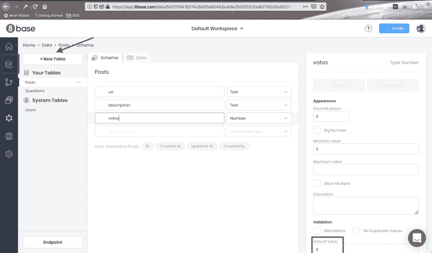 ](https://res.cloudinary.com/practicaldev/image/fetch/s--eizFx8hx--/c_limit%2Cf_auto%2Cfl_progressive%2Cq_auto%2Cw_880/https://cdn-images-1.medium.com/max/2880/1%2AkqJ0t68s8STxNzlS3a-vxg.png) *主要设置*

之后，单击左下方的端点，将打开一个包含该端点的弹出窗口。复制它，因为我们稍后将从前端使用它。

[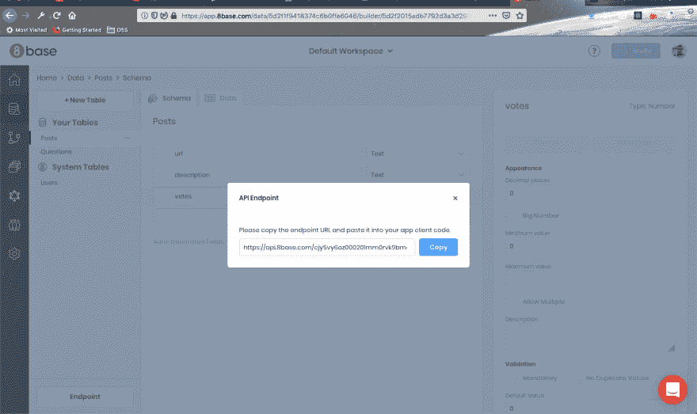](https://res.cloudinary.com/practicaldev/image/fetch/s--1MHVLoRi--/c_limit%2Cf_auto%2Cfl_progressive%2Cq_auto%2Cw_880/https://cdn-images-1.medium.com/max/2880/1%2Am_NYruqT5tYDU4nKuPV7fg.png)T3】API 端点

我们将给予任何人完全的访问权限来创建一个职位，并看到它。我们将在本文的后面部分添加身份验证。所以，去设置->角色->客人

[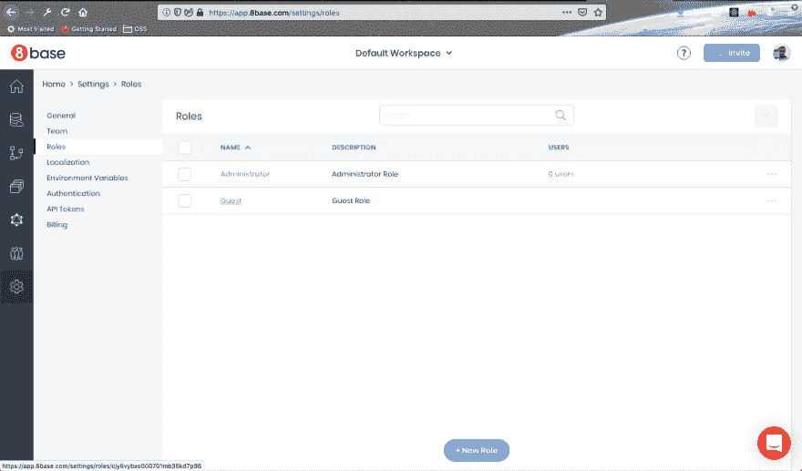 ](https://res.cloudinary.com/practicaldev/image/fetch/s--8NeDpiSP--/c_limit%2Cf_auto%2Cfl_progressive%2Cq_auto%2Cw_880/https://cdn-images-1.medium.com/max/2880/1%2ADYgyjH_g8eyfEuLCM2NgNQ.png) *给予访问*

这里我们将给出如下的访问。

[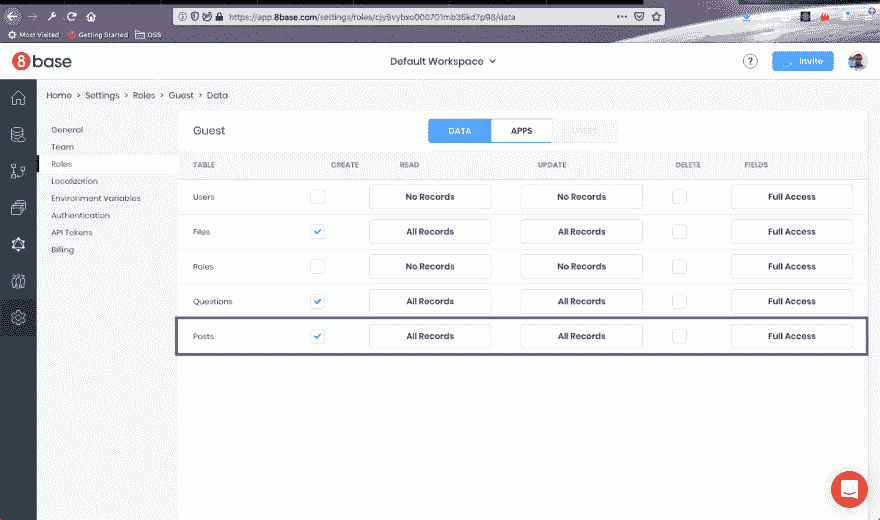 ](https://res.cloudinary.com/practicaldev/image/fetch/s--BL43g8Ez--/c_limit%2Cf_auto%2Cfl_progressive%2Cq_auto%2Cw_880/https://cdn-images-1.medium.com/max/2880/1%2Al9k6RL9k_gu0t3hx6xtLqg.png) *完全访问*

进入仪表板后，我们还将创建一些帖子。这将使我们能够直接编写一个查询，并显示在前端的职位。

再次前往数据->文章->数据并添加一些行。

[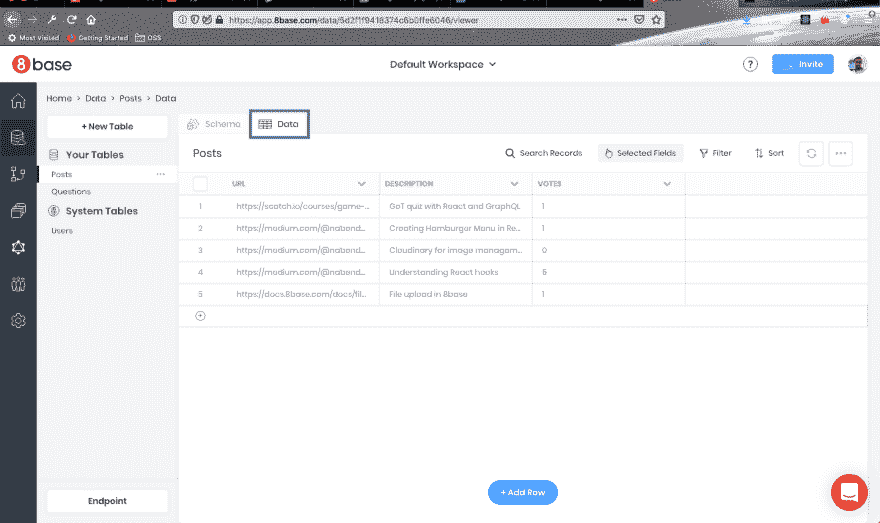 ](https://res.cloudinary.com/practicaldev/image/fetch/s--mXtjwg6X--/c_limit%2Cf_auto%2Cfl_progressive%2Cq_auto%2Cw_880/https://cdn-images-1.medium.com/max/2880/1%2AkMFepbqIoPX55gFXv42aaA.png) *输入数据*

让我们首先通过 npm
在我们的项目中安装所有需要的包

```
 npm install apollo-boost graphql react-apollo graphql-tag @8base/react-sdk date-fns react-router-dom 
```

[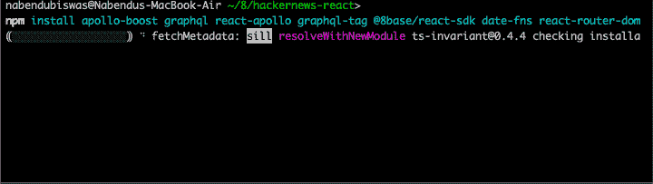 ](https://res.cloudinary.com/practicaldev/image/fetch/s--79ICTUVY--/c_limit%2Cf_auto%2Cfl_progressive%2Cq_auto%2Cw_880/https://cdn-images-1.medium.com/max/2000/1%2AJMyl7KO3a0R_9McZrLICVA.png) * npm 安装*

打开代码编辑器并打开 index.js

[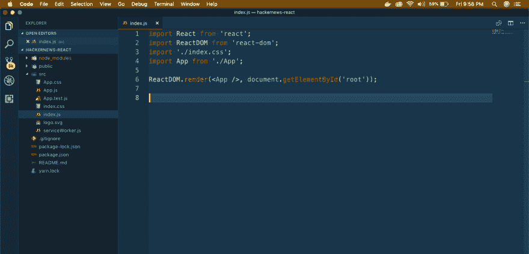 ](https://res.cloudinary.com/practicaldev/image/fetch/s--eX0bjRyO--/c_limit%2Cf_auto%2Cfl_progressive%2Cq_auto%2Cw_880/https://cdn-images-1.medium.com/max/2880/1%2A-14OCUu9sSv-IfMA64QAzQ.png) *默认*

这里我们将首先导入 ApolloProvider 和 ApolloClient。然后添加带有我们从仪表板上获得的端点的客户端。最后，我们将包装我们的整个组件。

[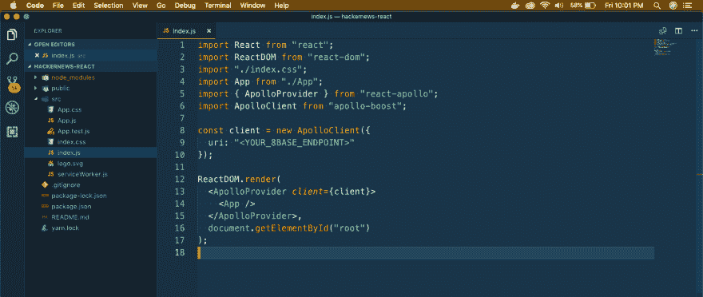 ](https://res.cloudinary.com/practicaldev/image/fetch/s--Zkk2RJeh--/c_limit%2Cf_auto%2Cfl_progressive%2Cq_auto%2Cw_880/https://cdn-images-1.medium.com/max/2880/1%2Al-RTL_7sqjHER8mVM8DMig.png) *更新 index.js*

是时候去掉默认的 react 样板主页，向我们的项目添加一些 React 路由器逻辑了。这只是一个基本的 react 路由器代码，用于在 react 中实现路由。

打开 App.js，用下面的代码替换旧代码。

[ ](https://res.cloudinary.com/practicaldev/image/fetch/s--kytz2DRD--/c_limit%2Cf_auto%2Cfl_progressive%2Cq_auto%2Cw_880/https://cdn-images-1.medium.com/max/2878/1%2AjuyeK9jmQ_0rIW1bjPWQ5g.png) * New App.js*

接下来更新 App.css 以包含基本样式。

[](https://res.cloudinary.com/practicaldev/image/fetch/s--OFYoFqyB--/c_limit%2Cf_auto%2Cfl_progressive%2Cq_auto%2Cw_880/https://cdn-images-1.medium.com/max/2880/1%2Agt_Gwq9ieJ9F0ESSk2aiRA.png)T3】app . CSS

现在是时候创建 Header 组件了。在 src 中创建一个名为 components 的文件夹。在里面创建另一个文件夹标题。

在其中创建两个文件`index.js`和`index.css`

将以下代码放在 index.js 中

我们只是使用了一些基本的导航 div，稍后我们将对其进行样式化。

[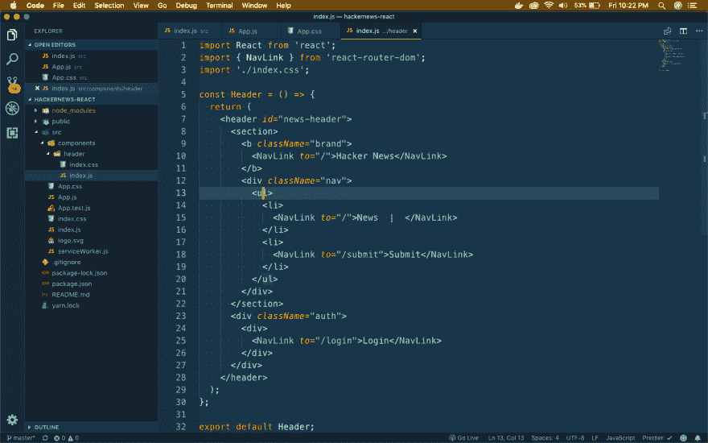](https://res.cloudinary.com/practicaldev/image/fetch/s--X7qmYNWG--/c_limit%2Cf_auto%2Cfl_progressive%2Cq_auto%2Cw_880/https://cdn-images-1.medium.com/max/2880/1%2AH1WK1KYp8flLLt6i6mITfA.png)T3】index . js

现在，让我们在 src 目录中创建一个 router.js 文件

[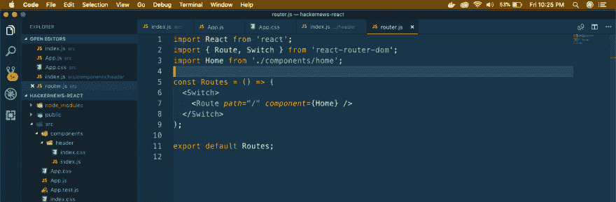 ](https://res.cloudinary.com/practicaldev/image/fetch/s--iN2WfIdQ--/c_limit%2Cf_auto%2Cfl_progressive%2Cq_auto%2Cw_880/https://cdn-images-1.medium.com/max/2880/1%2A_FswDLANbqeMKAI_KGIbOQ.png) * router.js*

我们现在需要创建 Home 组件，它将在用户转到根目录时显示。同样，在组件内部创建另一个文件夹 home。

在其中创建两个文件，分别为 index.js 和 index.css

将以下代码放在 index.js 中

[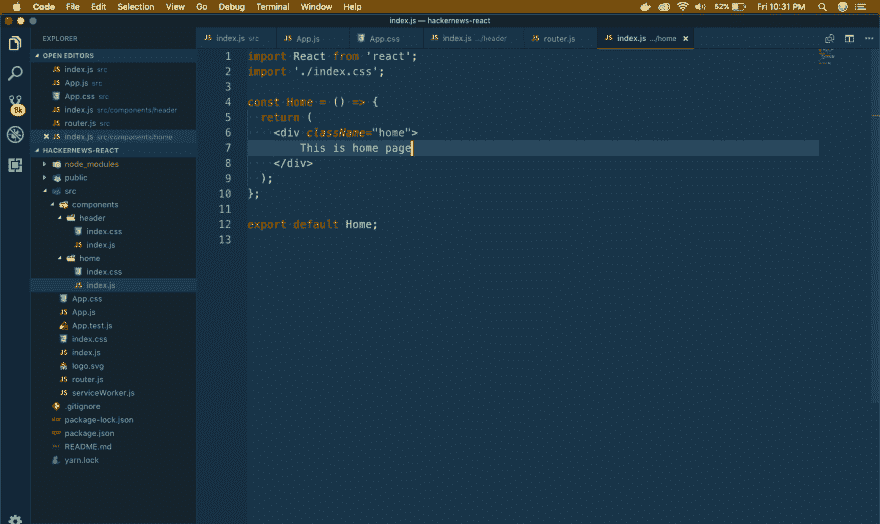 ](https://res.cloudinary.com/practicaldev/image/fetch/s--Sv27MQCw--/c_limit%2Cf_auto%2Cfl_progressive%2Cq_auto%2Cw_880/https://cdn-images-1.medium.com/max/2880/1%2AY9n6pHcjwwV7LPy0rJ2vrQ.png) *首页*

最后，我们的本地主机将显示一些内容。如果你早点注意到，它总是出错。

[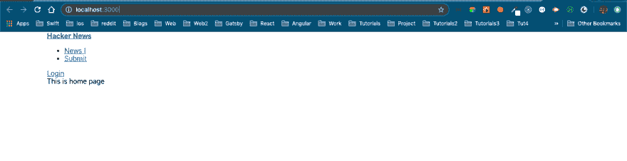 ](https://res.cloudinary.com/practicaldev/image/fetch/s--zTbipQj7--/c_limit%2Cf_auto%2Cfl_progressive%2Cq_auto%2Cw_880/https://cdn-images-1.medium.com/max/2880/1%2ADJWf8tdbMIYBKac7ejl8zg.png) *基本布局*

现在，让我们给这个丑陋的网站，一些 hackernews 牛逼的风格。

打开 header 文件夹中的 index.css，首先将其添加为根 id news-header

```
#news-header {
background: #ff6600;
display: flex;
justify-content: space-between;
padding: 3px 5px;
margin-top: 7px;
} 
```

这将改变我们的标题如下。

[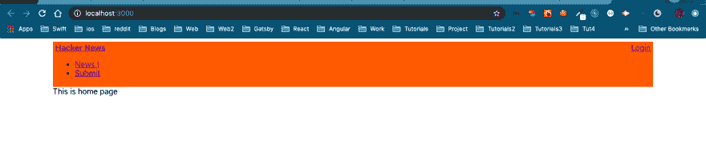 ](https://res.cloudinary.com/practicaldev/image/fetch/s--lfta8i4m--/c_limit%2Cf_auto%2Cfl_progressive%2Cq_auto%2Cw_880/https://cdn-images-1.medium.com/max/2880/1%2ARnEeck6Yo_e--Owd6kBEHg.png) *表头先改*

接下来，我们将向部分添加另一个 flexbox

```
#news-header section {
display: flex;
align-items: center;
} 
```

这将导致以下结果。

[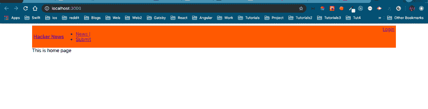 ](https://res.cloudinary.com/practicaldev/image/fetch/s--Pm37YIo1--/c_limit%2Cf_auto%2Cfl_progressive%2Cq_auto%2Cw_880/https://cdn-images-1.medium.com/max/2880/1%2A8aSlJOiLkIEolsB3fPGLVg.png) *另一个 Flexbox*

由于所有导航链接都是锚定标签，所以它们给出了蓝色的超链接。接下来我们将根据这两条规则删除它们。

```
#news-header a {
text-decoration: none;
color: black;
font-size: 14px;
text-transform: lowercase;
}

.brand a {
text-transform: capitalize !important;
margin-right: 8px;
} 
```

这将导致以下结果。

[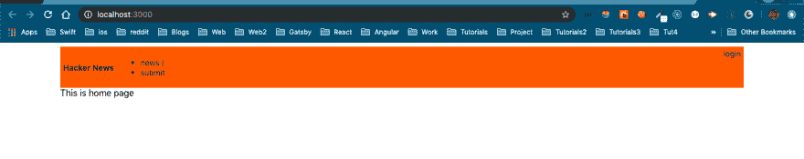 ](https://res.cloudinary.com/practicaldev/image/fetch/s--iM6KG4WF--/c_limit%2Cf_auto%2Cfl_progressive%2Cq_auto%2Cw_880/https://cdn-images-1.medium.com/max/2880/1%2ALfYZTlenSMTfhoklqHaAOg.png) *锚标签移除*

让我们删除 ul 和 li 的默认样式，并在 flexbox 中转换 ul。

```
#news-header .nav ul {
display: flex;
list-style: none;
padding-left: 0;
margin: 0;
}

.nav li {
margin-right: 5px;
} 
```

这将导致我们最终的标题变化。

[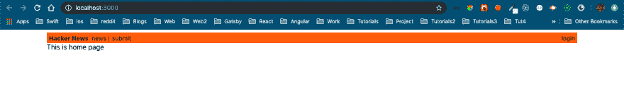 ](https://res.cloudinary.com/practicaldev/image/fetch/s---HJlDH6C--/c_limit%2Cf_auto%2Cfl_progressive%2Cq_auto%2Cw_880/https://cdn-images-1.medium.com/max/2880/1%2AIQCHK-QJacbqFCUWkFiLwA.png) *表头修改*

接下来，让我们向 Home 组件的 index.css 添加一些 css。

```
.home{
background: #f6f6ef;
padding: 5px 2px 15px;
} 
```

这将使我们的应用程序，黑客新闻的外观。

[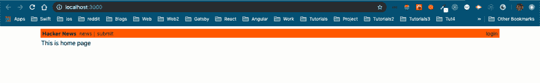](https://res.cloudinary.com/practicaldev/image/fetch/s--b1GOF0BS--/c_limit%2Cf_auto%2Cfl_progressive%2Cq_auto%2Cw_880/https://cdn-images-1.medium.com/max/2880/1%2AWChMY_jC8ocF80Mbko46BA.png)*hacker news look*

我们现在将创建我们的 PostList 组件，在那里我们将使用 GraphQL 完成所有的工作，并显示来自我们后端的数据。

同样，在组件内部创建另一个文件夹后列表。在其中创建两个文件 index.js 和 index.css

将以下代码放在 index.js 中

[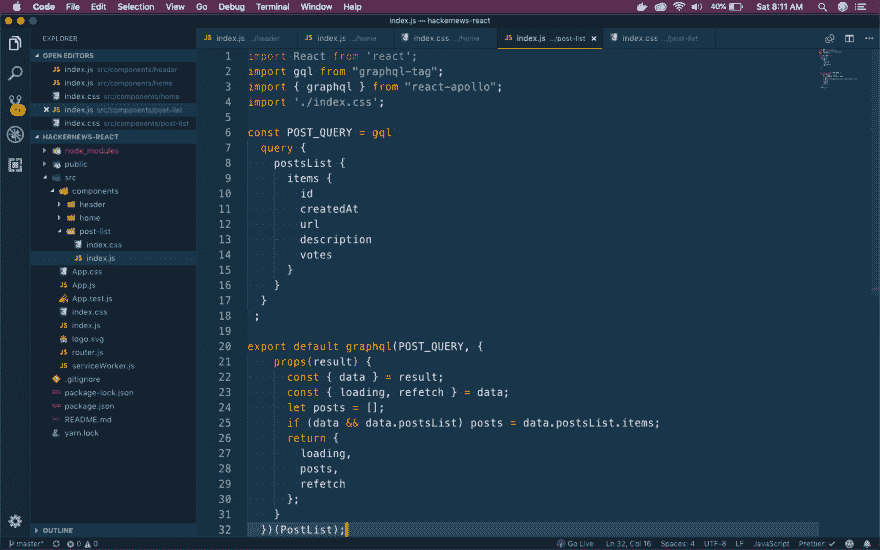 ](https://res.cloudinary.com/practicaldev/image/fetch/s--KBbUhHaq--/c_limit%2Cf_auto%2Cfl_progressive%2Cq_auto%2Cw_880/https://cdn-images-1.medium.com/max/2880/1%2ALJBMqEDWpUMgla8iOe3bhA.png) *后列表*

这里我们首先导入文件中所需的 gql 和 graphql。然后，我们编写 GraphQL 查询来获取帖子。这里的 url、描述和投票是我们创建的，id 和 createdAt 是由 8base/GraphQL 自动生成的。

我们还可以通过在 8base 提供的 GraphQL playground 中测试来检查查询是否有效。

[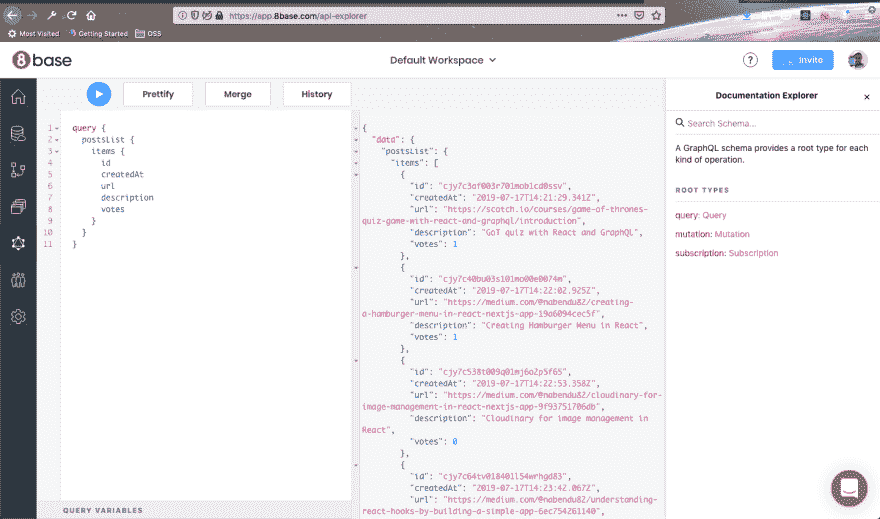 ](https://res.cloudinary.com/practicaldev/image/fetch/s--JSKC3UFB--/c_limit%2Cf_auto%2Cfl_progressive%2Cq_auto%2Cw_880/https://cdn-images-1.medium.com/max/2880/1%2AMCz1pIM76RAW4EP1gGOsrw.png) * GraphQL 游乐场*

我们在 GraphQL playground 中执行了查询，但是如何在代码中做同样的事情。对于该部分，我们使用 GraphQL 高阶组件(HOC)。在那里，我们传递两个参数——查询字符串 POST_QUERY 和一个对象，我们通过该对象将道具传递给组件。

这里是 result.data，我们首先将它存储在数据变量中。如果我们进一步挖掘，那么 data.postsList.items 包含我们所有帖子的数组。我们将它存储在一个 posts 变量中。

让我们使用从 graphql()获得的 loading、posts、refetch 变量。

我们将为此创建一个 React 功能组件后置列表。这里，我们显示了加载…如果进行了数据库查询。完成后，我们将使用 map 来浏览阵列帖子并对其进行控制。

[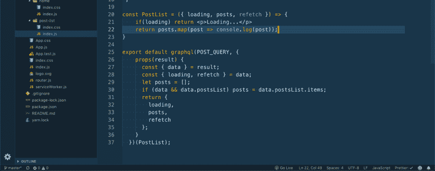 ](https://res.cloudinary.com/practicaldev/image/fetch/s--iwMy3fW0--/c_limit%2Cf_auto%2Cfl_progressive%2Cq_auto%2Cw_880/https://cdn-images-1.medium.com/max/2880/1%2AuXG4XnibVAfcMVa4OHvbsA.png) *后置列表功能组件*

让我们将 PostList 组件添加到 Home 组件中，以便使用它。

[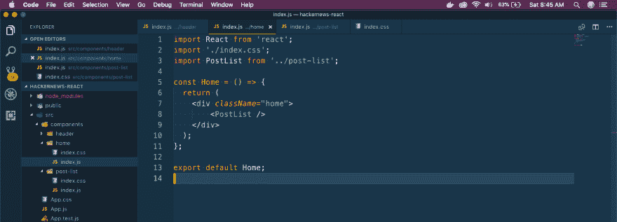 ](https://res.cloudinary.com/practicaldev/image/fetch/s--LiC-rP0V--/c_limit%2Cf_auto%2Cfl_progressive%2Cq_auto%2Cw_880/https://cdn-images-1.medium.com/max/2880/1%2A9doaFyvkFDYnydWEIW2hpA.png) *家居组件*

现在，去 [http://localhost:3000/](http://localhost:3000/) 打开你的控制台。你将从 8base 数据库中得到所有的文章。

[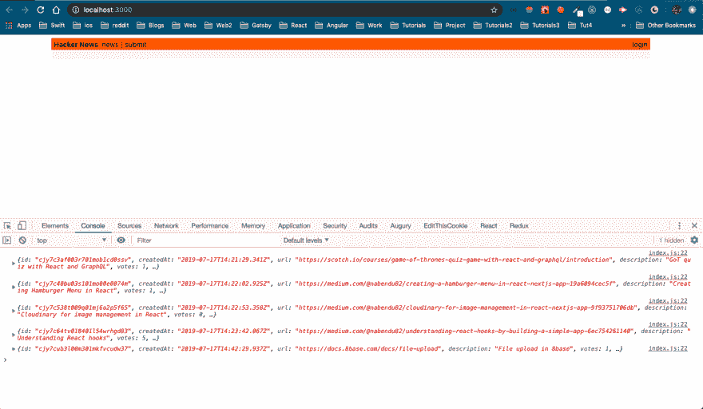 ](https://res.cloudinary.com/practicaldev/image/fetch/s--uvfRiQAy--/c_limit%2Cf_auto%2Cfl_progressive%2Cq_auto%2Cw_880/https://cdn-images-1.medium.com/max/2874/1%2A1eH9fYKuXqZWGDZ8we_08w.png) *获取数据*

现在，让我们显示从 GraphQL 数据库中获得的数据。我们将为它创建一个单独的组件。

同样，在组件内部创建另一个文件夹 post-item。在其中创建两个文件 index.js 和 index.css

将以下代码放在 index.js 中

这里，我们使用一个简单的 React 功能组件，并使用 url、描述、投票、创建日期来显示单个帖子。

[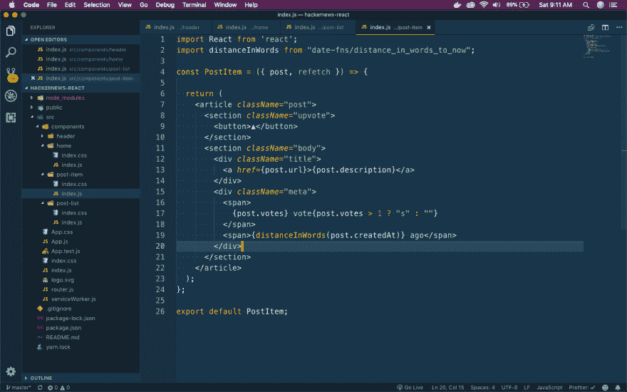](https://res.cloudinary.com/practicaldev/image/fetch/s--f4shq-Q_--/c_limit%2Cf_auto%2Cfl_progressive%2Cq_auto%2Cw_880/https://cdn-images-1.medium.com/max/2880/1%2AIOK-lfFb6m-0ZmeyUmKh2g.png)T3】PostItem

现在，在 PostList 组件中使用这个 PostItem 代替 console.log。

[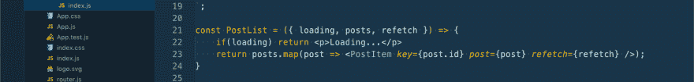 ](https://res.cloudinary.com/practicaldev/image/fetch/s--KA5TFCrk--/c_limit%2Cf_auto%2Cfl_progressive%2Cq_auto%2Cw_880/https://cdn-images-1.medium.com/max/2880/1%2A8h2l6zLNU0Rme0-WWZtdSw.png) * PostItem 导入*

现在，当我们进入 [http://localhost:3000/](http://localhost:3000/) 时，所有的帖子都会显示出来。

[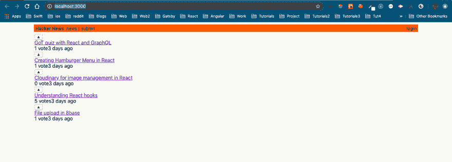 ](https://res.cloudinary.com/practicaldev/image/fetch/s--cPRslsa4--/c_limit%2Cf_auto%2Cfl_progressive%2Cq_auto%2Cw_880/https://cdn-images-1.medium.com/max/2880/1%2AjTUBPrAGlbFGADPSgTgpJg.png) *帖子显示*

它看起来有点丑，不像黑客新闻里的帖子。所以，是时候给出一些风格了。

打开 PostItem 组件的 index.css 并添加此样式。我们在顶级文章中使用 Flexbox，其余的样式只是字体变化。

[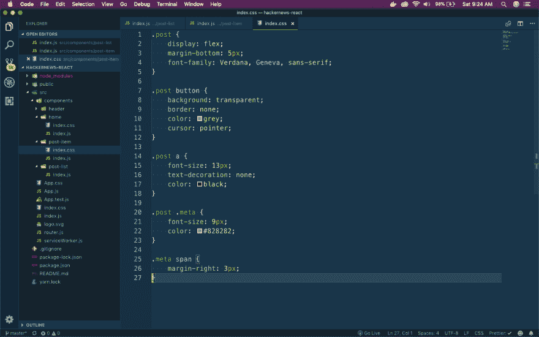 ](https://res.cloudinary.com/practicaldev/image/fetch/s--_mFHJuDJ--/c_limit%2Cf_auto%2Cfl_progressive%2Cq_auto%2Cw_880/https://cdn-images-1.medium.com/max/2880/1%2A2hbEYP8jiBdczahzI4UZhg.png) *只是一些款式*

现在，当去 [http://localhost:3000/](http://localhost:3000/) 我们得到了这种美。

[ ](https://res.cloudinary.com/practicaldev/image/fetch/s--mjw3XNUb--/c_limit%2Cf_auto%2Cfl_progressive%2Cq_auto%2Cw_880/https://cdn-images-1.medium.com/max/2880/1%2A53PRxeQM5eM6zRWqEbnzEQ.png) *朴树美女*

现在，我们能够显示所有帖子，让我们创建通过前端提交帖子的能力。

为此，我们必须编写突变，但 8base 提供了许多内置突变。我们可以检查我们是否有一个提交我们的表格。

去你的 8base GraphQL 游乐场，点击突变。

[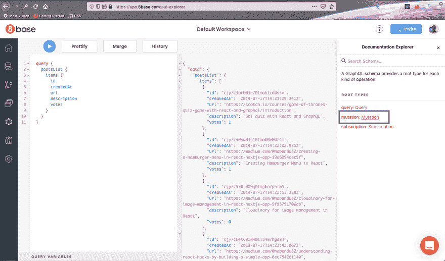 ](https://res.cloudinary.com/practicaldev/image/fetch/s--5TX1gi4d--/c_limit%2Cf_auto%2Cfl_progressive%2Cq_auto%2Cw_880/https://cdn-images-1.medium.com/max/2876/1%2AMpC3_JTPabemQZmMjyMKAw.png) *突变*

接下来，向下滚动列表，您会发现一个后创建变异。我们可以看到它接受 PostCreateInput 并返回一个帖子

[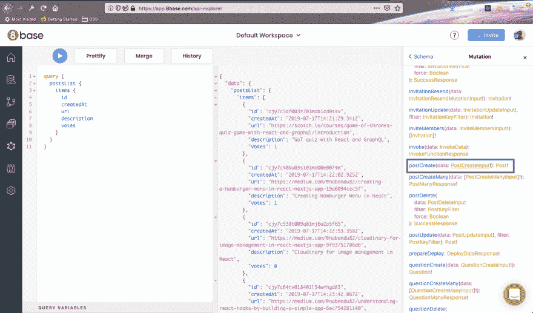 ](https://res.cloudinary.com/practicaldev/image/fetch/s--9w2HOzcr--/c_limit%2Cf_auto%2Cfl_progressive%2Cq_auto%2Cw_880/https://cdn-images-1.medium.com/max/2880/1%2AIyerUq1wH7vlaA08BYzOUA.png) *后期制作*

同样，在组件内部创建另一个文件夹 submit。在里面创建一个 index.js 文件，这一次我们将做一些内联样式。

把下面的代码放进去。这里有一个简单的表单，有两个字段用于 url 和描述。

有一点需要注意，我们在表单中使用了最新的钩子特性，而不是旧的基于类的方法。你可以在这里了解更多关于使用状态钩子的信息。

[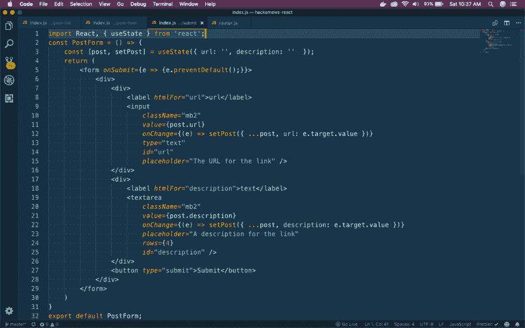 ](https://res.cloudinary.com/practicaldev/image/fetch/s--UBR7A_r9--/c_limit%2Cf_auto%2Cfl_progressive%2Cq_auto%2Cw_880/https://cdn-images-1.medium.com/max/2880/1%2ARhRo0JWLEA9IOJATK8xRWA.png) *简单形式*

我们还需要在 router.js 文件中为 PostForm 创建一个路由

[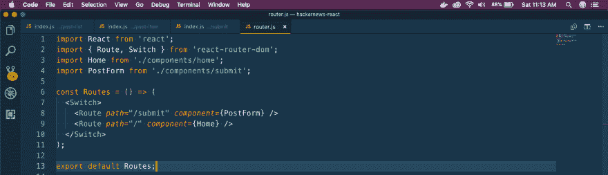 ](https://res.cloudinary.com/practicaldev/image/fetch/s--aO07COIy--/c_limit%2Cf_auto%2Cfl_progressive%2Cq_auto%2Cw_880/https://cdn-images-1.medium.com/max/2878/1%2AQGXZqNY5TWLBQCxVbvGDQw.png) * router.js*

这样做之后，转到[http://localhost:3000/submit](http://localhost:3000/submit)，你会看到这个表单。它肯定需要一些造型。

[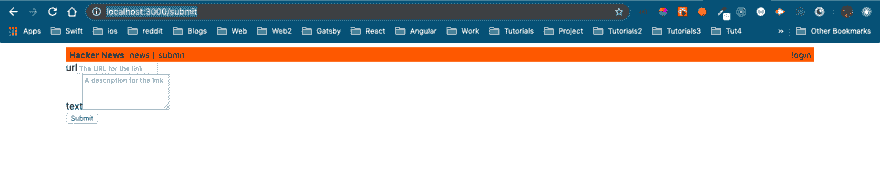 ](https://res.cloudinary.com/practicaldev/image/fetch/s--VJeZy5Ad--/c_limit%2Cf_auto%2Cfl_progressive%2Cq_auto%2Cw_880/https://cdn-images-1.medium.com/max/2880/1%2AqR0TVHI1SEqr5dxhHXzD0A.png) *丑小鸭*

首先，我们将为整个表单添加一个带有填充的框。

[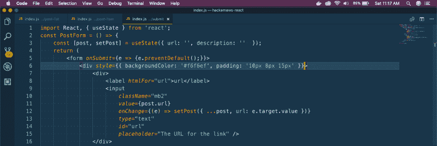 ](https://res.cloudinary.com/practicaldev/image/fetch/s--ulr4CqEp--/c_limit%2Cf_auto%2Cfl_progressive%2Cq_auto%2Cw_880/https://cdn-images-1.medium.com/max/2880/1%2ALgoISV7_Ka5AK376qf2FaQ.png) *添加方框*

这将导致下面的结果。

[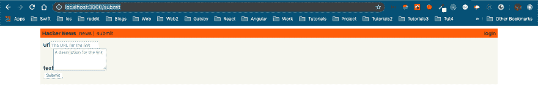 ](https://res.cloudinary.com/practicaldev/image/fetch/s--pgXctBI5--/c_limit%2Cf_auto%2Cfl_progressive%2Cq_auto%2Cw_880/https://cdn-images-1.medium.com/max/2880/1%2AyEoadowd2OToRprspSWMAQ.png) *盒子*

接下来，我们将为包装元素的 div 以及每个标签添加样式。

[ ](https://res.cloudinary.com/practicaldev/image/fetch/s--c9-RUJxE--/c_limit%2Cf_auto%2Cfl_progressive%2Cq_auto%2Cw_880/https://cdn-images-1.medium.com/max/2880/1%2AZiGIub-kzKtD4W3zVF8vOA.png) * div 和标签样式*

最后，我们将为输入添加一些样式。

[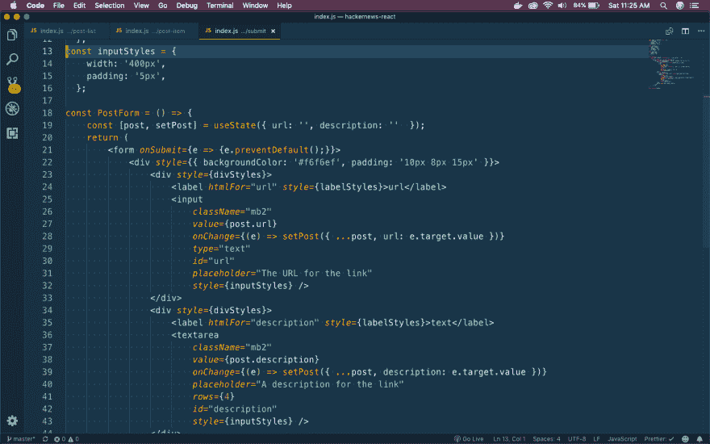 ](https://res.cloudinary.com/practicaldev/image/fetch/s--lrUhOi19--/c_limit%2Cf_auto%2Cfl_progressive%2Cq_auto%2Cw_880/https://cdn-images-1.medium.com/max/2880/1%2AUCEyfeALPp6PvGLqOWdyAQ.png) *输入风格*

这将完成我们的 PostForm 组件的样式。

[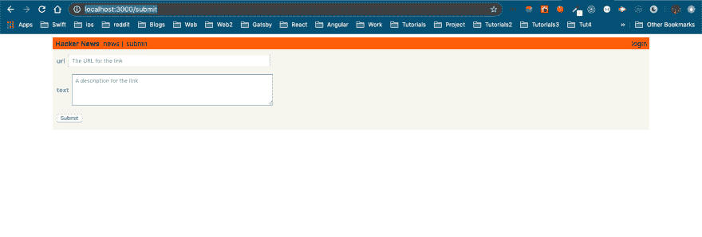 ](https://res.cloudinary.com/practicaldev/image/fetch/s--w69mK1zu--/c_limit%2Cf_auto%2Cfl_progressive%2Cq_auto%2Cw_880/https://cdn-images-1.medium.com/max/2880/1%2AetpTbVM-f2uUaEjQVh0yAw.png) *后置成分*

现在，我们将向组件添加突变，以便向 8base 数据库添加值。首先添加后创建突变。

[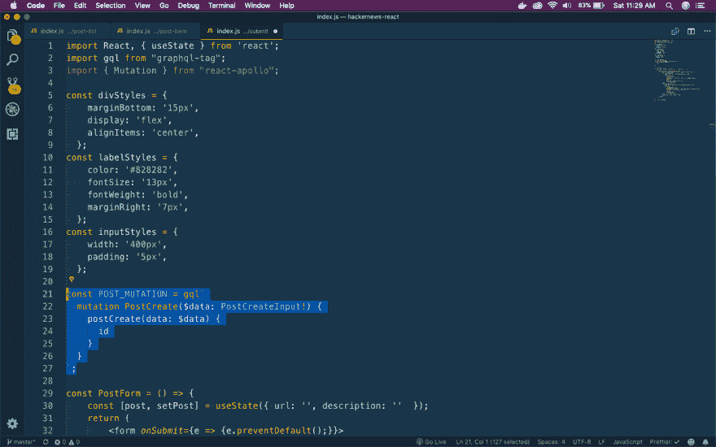 ](https://res.cloudinary.com/practicaldev/image/fetch/s--LToBLBZD--/c_limit%2Cf_auto%2Cfl_progressive%2Cq_auto%2Cw_880/https://cdn-images-1.medium.com/max/2880/1%2AcZH0oDr_4el7G7x9OAr1zA.png) *突变*

接下来，和 GraphQL 突变一样，我们将用突变包装整个组件。

[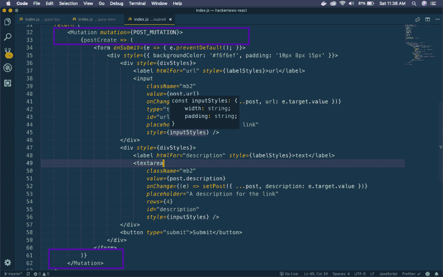 ](https://res.cloudinary.com/practicaldev/image/fetch/s--vP90UTSV--/c_limit%2Cf_auto%2Cfl_progressive%2Cq_auto%2Cw_880/https://cdn-images-1.medium.com/max/2880/1%2AD1zMiTB2jDq9OEI5Mem0oA.png) *变异包皮*

接下来，我们将在 FormSubmit 上添加一个函数，这个函数将在我们提交表单时被调用。这里我们采用 post 对象，它包含 url 和描述，并使用这些数据调用 createPost 函数。

在获得成功的响应(将有一个 id)后，我们将从 react-router 使用 history . push(“/”)返回到根 url。

[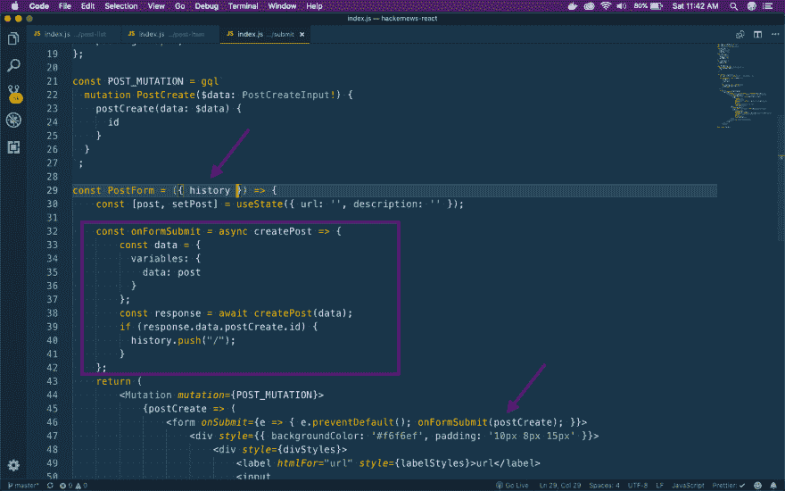 ](https://res.cloudinary.com/practicaldev/image/fetch/s--QeitjIF5--/c_limit%2Cf_auto%2Cfl_progressive%2Cq_auto%2Cw_880/https://cdn-images-1.medium.com/max/2880/1%2AA49vO7XYQPN2A_kgfoyW3w.png) *表单提交*

我们可以通过去[http://localhost:3000/submit](http://localhost:3000/submit)新建一个帖子然后提交来测试。提交后，它会将我们带回到主页。

[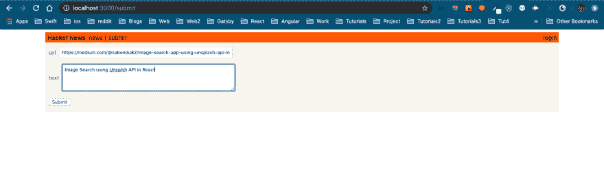 ](https://res.cloudinary.com/practicaldev/image/fetch/s--37ZS7vg8--/c_limit%2Cf_auto%2Cfl_progressive%2Cq_auto%2Cw_880/https://cdn-images-1.medium.com/max/2880/1%2A8hje7UEMdzQBBe5WOAuK-A.png) *使用提交*

现在，我们将更新应用程序中的投票功能。我们有一个由 8base 提供的更新后突变来做完全相同的事情。

打开 PostItem 的组件，我们将跟随相同的歌曲和舞蹈，我们在 PostForm 组件中做了。

首先让我们添加 import 语句和变量 VOTE_MUTATION，它将具有更新后的变异。

[ ](https://res.cloudinary.com/practicaldev/image/fetch/s--Kj5PiyGx--/c_limit%2Cf_auto%2Cfl_progressive%2Cq_auto%2Cw_880/https://cdn-images-1.medium.com/max/2880/1%2AS9kZ4dnL8ikpzFT0gKcp2A.png) *更新后突变*

接下来，我们将添加 upVotePost 函数，它将更新 8base 数据库中的投票。

[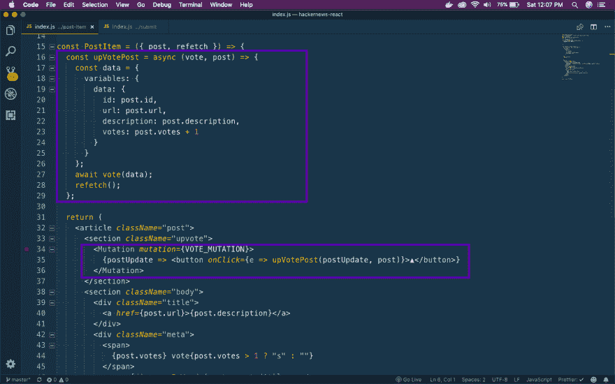 ](https://res.cloudinary.com/practicaldev/image/fetch/s--2nWuD6----/c_limit%2Cf_auto%2Cfl_progressive%2Cq_auto%2Cw_880/https://cdn-images-1.medium.com/max/2880/1%2AFu86DkKM8nYrBfw1zr1Q4w.png) * upVotePost*

现在，我们将轻松地在项目中添加身份验证。我们将使用内置的 8base 认证。点击设置->认证

然后单击身份验证配置文件旁边的+号。

[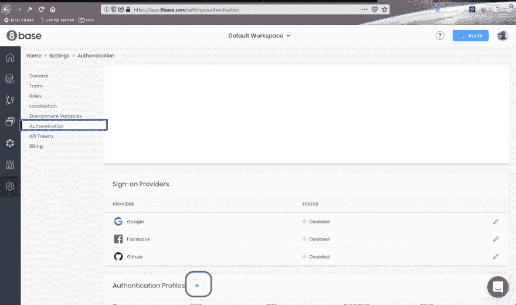 ](https://res.cloudinary.com/practicaldev/image/fetch/s--qiBu6LAb--/c_limit%2Cf_auto%2Cfl_progressive%2Cq_auto%2Cw_880/https://cdn-images-1.medium.com/max/2876/1%2A6KcrWV8ZTrbSRv_HFDZ02g.png) *添加认证*

在下一个弹出窗口中给出一个名称。类型应该是 8base 身份验证。自助注册应该关闭。

扮演客人和管理员。并点击添加配置文件

[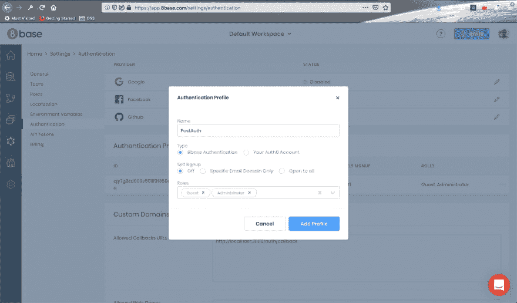 ](https://res.cloudinary.com/practicaldev/image/fetch/s--veE5z0SO--/c_limit%2Cf_auto%2Cfl_progressive%2Cq_auto%2Cw_880/https://cdn-images-1.medium.com/max/2880/1%2APc3ZGHnWQ03mXz96aw0ihA.png) *认证概要*

滚动到页面顶部，你会得到，客户端 ID 和域。我们将在后面的代码中使用它们。

[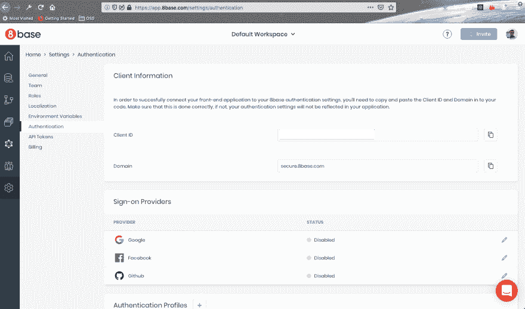 ](https://res.cloudinary.com/practicaldev/image/fetch/s--Ihn8t88Z--/c_limit%2Cf_auto%2Cfl_progressive%2Cq_auto%2Cw_880/https://cdn-images-1.medium.com/max/2868/1%2AufRF0lY6nwZTm5rqlNtpTA.png) *客户端 ID 和域名*

向下滚动并在自定义域中给出以下值

[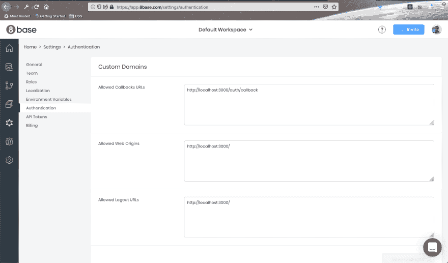 ](https://res.cloudinary.com/practicaldev/image/fetch/s--V8fGqm_Y--/c_limit%2Cf_auto%2Cfl_progressive%2Cq_auto%2Cw_880/https://cdn-images-1.medium.com/max/2880/1%2AhEXO3fLErSCJHYoEHOTcmw.png) *自定义域名*

现在让我们将这些添加到我们的应用程序中。打开根 index.js

在这里，我们添加这些值，并用 AppProvider 包装我们的应用程序组件。

[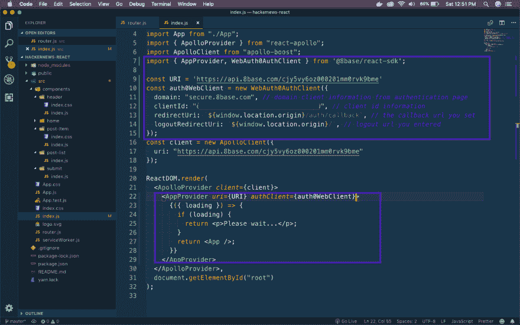 ](https://res.cloudinary.com/practicaldev/image/fetch/s--dLHGUYte--/c_limit%2Cf_auto%2Cfl_progressive%2Cq_auto%2Cw_880/https://cdn-images-1.medium.com/max/2880/1%2AlYOnf9watzsi7re9yV0-bA.png) * AppProvider*

接下来，我们将创建一个新的组件 login，并在其中创建一个 index.js 文件。我们使用 8base 提供的 withAuth 函数进行登录。

[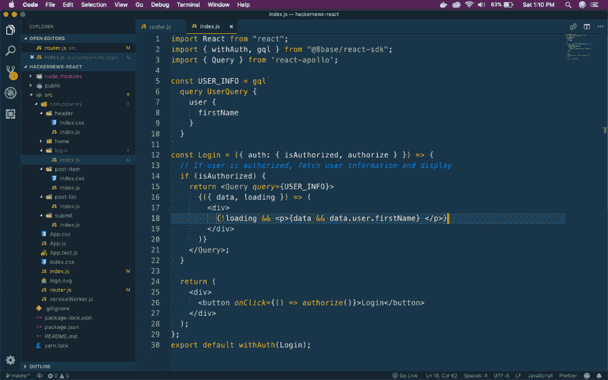 ](https://res.cloudinary.com/practicaldev/image/fetch/s--8WbT_QUu--/c_limit%2Cf_auto%2Cfl_progressive%2Cq_auto%2Cw_880/https://cdn-images-1.medium.com/max/2880/1%2AqVDxfnj1y6IMDuBL3LVoOw.png) *登录组件*

另外，将这个登录组件添加到 router.js 中

[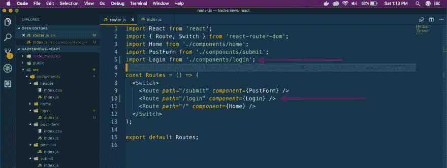 ](https://res.cloudinary.com/practicaldev/image/fetch/s--a1rlumFQ--/c_limit%2Cf_auto%2Cfl_progressive%2Cq_auto%2Cw_880/https://cdn-images-1.medium.com/max/2880/1%2AE4fVuyrlpYI3vUR_tsEPqQ.png) * router.js*

接下来，我们需要创建一个 AuthCallback 组件。在 src 目录中创建一个文件 authCallback.js。你可以从[这里](https://github.com/nabendu82/hackernews-react/blob/master/src/authCallback.js)复制它的内容。

我们还需要将它添加到 router.js 中

[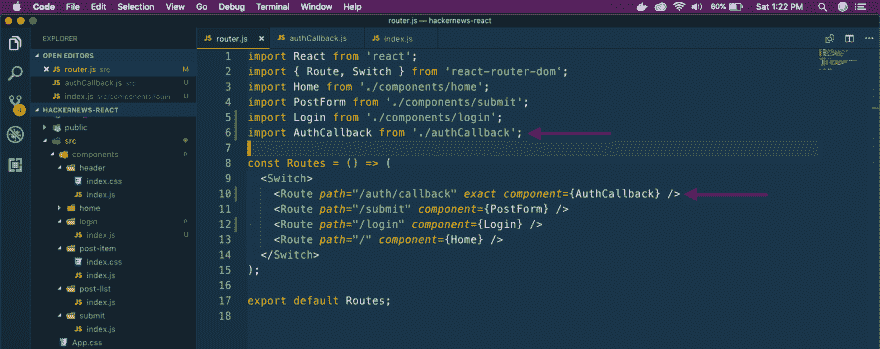 ](https://res.cloudinary.com/practicaldev/image/fetch/s--GCFdV1Uq--/c_limit%2Cf_auto%2Cfl_progressive%2Cq_auto%2Cw_880/https://cdn-images-1.medium.com/max/2880/1%2A93MrpWNmME3bNCN40B7RtA.png) *路由器*

接下来，让我们创建注销机制。我们将在登录组件中创建一个 logout.js 文件。这里我们再次使用由 8base 提供的 withLogout。

[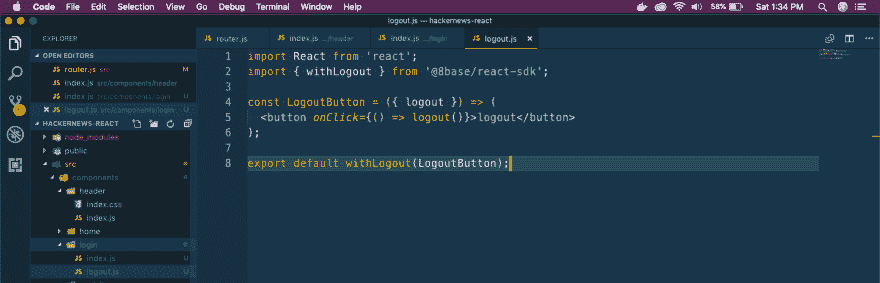](https://res.cloudinary.com/practicaldev/image/fetch/s--H9J1xYLv--/c_limit%2Cf_auto%2Cfl_progressive%2Cq_auto%2Cw_880/https://cdn-images-1.medium.com/max/2880/1%2ALvQqDTAQoxatnHp64DsjtA.png)T3】登出

此外，更新 login.js 以使用这个 LogoutButton

[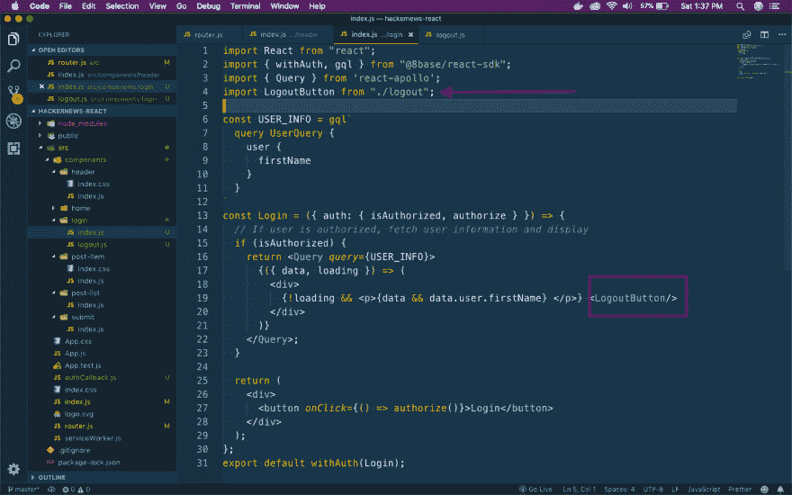 ](https://res.cloudinary.com/practicaldev/image/fetch/s--D6PJoO38--/c_limit%2Cf_auto%2Cfl_progressive%2Cq_auto%2Cw_880/https://cdn-images-1.medium.com/max/2880/1%2AtUgNcwHqw2ul0u__sB5UOw.png) *注销按钮新增*

最后，我们将在 Header 组件中做一个小的更新。

[ ](https://res.cloudinary.com/practicaldev/image/fetch/s--TDRgdpPR--/c_limit%2Cf_auto%2Cfl_progressive%2Cq_auto%2Cw_880/https://cdn-images-1.medium.com/max/2880/1%2A3ZMTYh_IGMy7ntnhMv_dzQ.png) *表头*

现在是测试我们的 web 应用程序进行身份验证的时候了。一旦你点击登录/注销，它会显示一个小的登录按钮。

[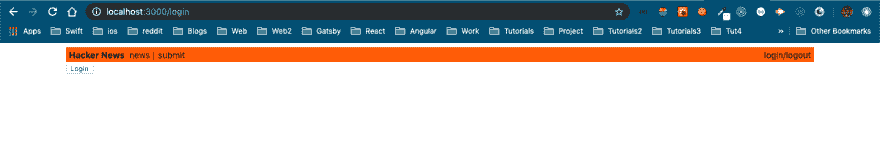 ](https://res.cloudinary.com/practicaldev/image/fetch/s--TLQ6Q0f4--/c_limit%2Cf_auto%2Cfl_progressive%2Cq_auto%2Cw_880/https://cdn-images-1.medium.com/max/2880/1%2AJ4Cjw4_HEjfk8GLdlGadww.png) *登录按钮*

一旦你点击它，你将被带到授权弹出窗口。在这里，您可以登录或注册一个新的电子邮件。

[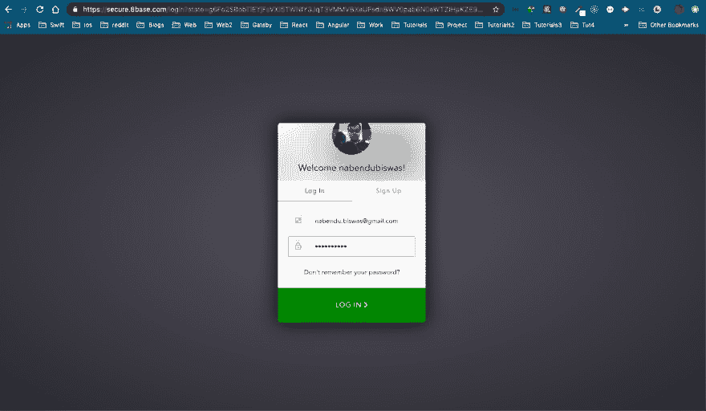 ](https://res.cloudinary.com/practicaldev/image/fetch/s--fVMsWdZi--/c_limit%2Cf_auto%2Cfl_progressive%2Cq_auto%2Cw_880/https://cdn-images-1.medium.com/max/2870/1%2AXNAFcQP6YhUX1bmuF0r6GA.png) *登录*

如果您成功登录，它将重定向到主页。再次单击登录/注销，将显示一个小的注销按钮。

[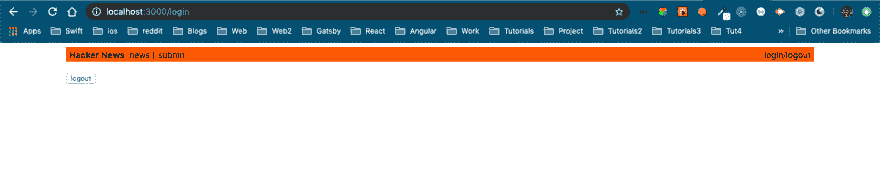](https://res.cloudinary.com/practicaldev/image/fetch/s--1_JEraja--/c_limit%2Cf_auto%2Cfl_progressive%2Cq_auto%2Cw_880/https://cdn-images-1.medium.com/max/2880/1%2ABnPGMOBV_DPPGLuTboDoLg.png)T3】登出

点击它，你会回到主页。

上面的逻辑有两个增强。我不喜欢登录/注销文本。只有用户登录后，提交链接才能打开表单。否则，它应该显示登录按钮。

我找不到解决这个问题的逻辑/方法。因此，我联系了 8base 团队，他们立即回复说要在 App 组件中使用 isAuthorized，并将其作为道具传递给 Header 组件。

所以，我继续做了修改。App.js 的变化

[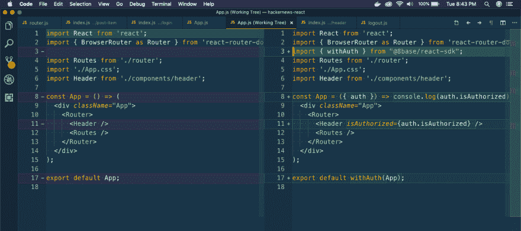 ](https://res.cloudinary.com/practicaldev/image/fetch/s--GtwRa5Ug--/c_limit%2Cf_auto%2Cfl_progressive%2Cq_auto%2Cw_880/https://cdn-images-1.medium.com/max/2880/1%2AS12xkF_hgxw5vg9JDuTZvg.png) * App.js 变化*

并且还更改了在 Header 组件中显示登录或注销、提交的方式。

[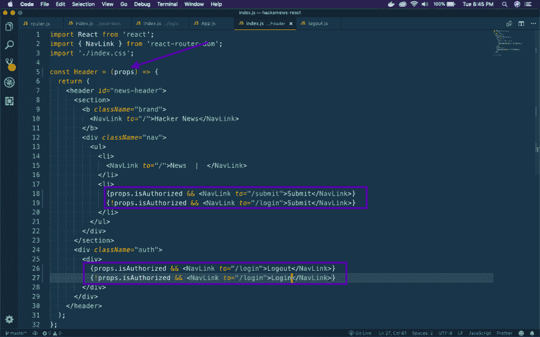 ](https://res.cloudinary.com/practicaldev/image/fetch/s--UswKlJBs--/c_limit%2Cf_auto%2Cfl_progressive%2Cq_auto%2Cw_880/https://cdn-images-1.medium.com/max/2880/1%2AwMaXl_Q-TfjywL21Q_KDrg.png) *表头组件的变化。*

现在，转到 [http://localhost:3000/](http://localhost:3000/) ，如果您已经登录，它将显示注销链接，并且还将提交表单。

[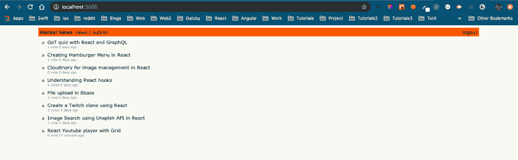 ](https://res.cloudinary.com/practicaldev/image/fetch/s--7WOr4jOu--/c_limit%2Cf_auto%2Cfl_progressive%2Cq_auto%2Cw_880/https://cdn-images-1.medium.com/max/2876/1%2A4Gnzya-GKV3Jr95NfEvJPA.png) * Hackernews 克隆*

这就完成了我们的文章。希望你喜欢。你可以在我的 github 链接[https://github.com/nabendu82/hackernews-react](https://github.com/nabendu82/hackernews-react)中找到完整的代码