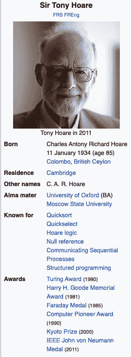

# Android 的十亿美元错误

> 原文：<https://dev.to/jmfayard/android-s-billion-dollar-mistake-327b>

一篇关于*十亿美元的错误*，那些被假定的错误和那些*保持沉默的错误*，以及关于*不要用糟糕的文档误导新开发人员的重要性*的文章。

*   托尼·霍尔是编程英雄🦸
*   [桑德罗迪匈牙利旋转](#the-sandroid-hungarian-mnotation)
*   [定义“错误”一词](#defining-the-word-mistake)
*   [安卓卷饼设计模式🌯](#the-android-burrito-design-pattern-)
*   [崩溃](#crashes)
*   [内存泄漏](#memory-leaks)
*   [即时遗留代码](#instant-legacy-code)
*   [有的](#some)
*   [活动是上下文](#activity-is-context)
*   [成分的遗传🙄](#inheritance-over-composition-)
*   [片段！是上下文🤔](#fragment-is-context-)
*   在 Android 中，一切都需要上下文📱
*   [“犯了错误”😔](#mistakes-were-made-)

# 十亿美元的错误报价

你听说过*十亿美元的错误报价*吗？这是一个很好的例子:

> 我称之为我的十亿美元错误。这是 1965 年零引用的发明。那时，我正在设计第一个面向对象语言(ALGOL W)的引用综合类型系统。我的目标是确保所有引用的使用都是绝对安全的，由编译器自动执行检查。但是我无法抗拒放入空引用的诱惑，仅仅是因为它太容易实现了。这导致了数不清的错误、漏洞和系统崩溃，在过去的四十年里，这可能造成了数十亿美元的痛苦和损失。
> 2009 年伦敦 QCon 上的东尼·霍尔
> https://en.wikipedia.org/wiki/Tony_Hoare T2

## 托尼·霍尔是编程英雄🦸

如果你和我一样，当你第一次听到这句话的时候，你的反应是:“哇。我也犯了很多错误，但通常不会花那么多钱！”。

最近我对此有了更深的思考，我现在认为[东尼·霍尔](https://en.wikipedia.org/wiki/Tony_Hoare)是一个伟大的编程英雄！不仅仅是因为他在十亿美元的错误之外所做的令人印象深刻的工作

不，我的主张是，他还因为公开承担了它的“错误”而伟大！

你认为他是唯一一个犯了十亿美元错误的程序员吗？再想想。IT 部门是巨大的。脸书、谷歌、亚马逊、苹果、微软的市值在 5000 亿到 1 万亿美元之间。任何让他们的估值降低 0.2%的编程错误都是一个价值十亿美元的错误。

不，东尼·霍尔被称为犯了十亿美元错误的人的真正原因是因为**他清楚而公开地将自己的决定描述为一个错误，并通过这样做发出了一个明确的信号，事情必须改变**。

**我的朋友们，这个**对软件行业非常有益，这就是 Kotlin 和其他编程语言在它们的类型系统中内置了[无效安全的原因。它们仍然有`null`，这本身不是问题，但是它被集成到类型系统中*以确保所有引用是绝对安全的，由编译器自动执行检查*。](https://kotlinlang.org/docs/reference/null-safety.html)

东尼·霍尔是真正的男子汉，一个没有自我意识的程序员，他为错误承担责任，这样我们就能认识到错误，我们都应该感谢他。

回到 Android 世界，这里的情况有些不同。在深入探讨之前，我们先从一个简单的例子来说明问题。

## 沙地匈牙利语 mNotation

在 Android 的前 9 年里，世界上大多数 sAndroid mCodebases 都被匈牙利语的[无意义的 mVariant 所困扰。](https://jakewharton.com/just-say-no-to-hungarian-notation/)

它的缺点是，与 Android Studio 中的简单代码高亮规则相比，它没有带来任何好处，而且明显的缺点是，它使得所有内容可读性更差。

当你在 2019 年之前提出这个问题时，你通常会得到两个答案之一:

*   这是现状，所以很好。
*   我们 Android 团队只是说，如果你在 Android 开源项目中贡献代码，就必须遵守这个约定。

但是实际上

*   第一个回答是*错了*。我们知道这一点，因为自从匈牙利记谱法被废除后，没有人抱怨要恢复它。
*   第二个答案是*差*，它属于[非错范畴](https://en.wikipedia.org/wiki/Not_even_wrong)。这种说法本质上是说*和其他人*都错了。那么显而易见的问题是:*为什么？*。因为每个人都在学习 Android 文档和示例，这种惯例无处不在。这正是你应该做的创建一个约定的艰苦而一致的工作。它只是碰巧是一个有害的惯例。

是什么杀死了 2019 年 5 月的 mHungarian 符号？不是承认错误，而是引进科特林。为什么我们要等这么久？

# 安卓的十亿美元错误💣

我们有很多要谈的:迄今为止教授 Android 编程的方式的重大错误，它在实践中造成的损害，在混乱的根源上的短视的早期决定，以及认识到错误以信号通知每个人停止走这条路的好处。但首先，我需要解决我得到的一些反馈，即把 Android 做的事情贴上“错误”的标签太苛刻了。Android 难道不是我们这个时代最大的成功之一吗？

## 定义“错误”一词

Android 显然是一个巨大的商业成功，我并没有相反的说法。Android 和 iPhone 已经成功地对智能手机世界实施了双重垄断，因此接下来发生的事情可能也不是战术上的“错误”。无论如何，我们必须使用 Android 团队提供的任何工具。

我也认为从用户的角度来看，Android 是一个很好的操作系统。你可以更喜欢 iOS，我没意见，但这并不能让 Android 变坏。

在本文的`Context`中，*错误*是指明确地误导开发人员，让他们遭受痛苦和折磨。

我也不认为这是 Android SDK 中唯一的大错误，甚至是 Android SDK 中最重要的错误。

如果你对了解 Android 的不好的部分感到好奇，那么#androiddev Reddit 社区已经整理了一份非常有用的列表，列出了他们认为 Android 中不好的地方。但在这里，我将关注一个有趣的基本错误。

## 安卓卷饼设计图案🌯

安卓的一个悲哀之处在于，官方的安卓样本遵循伊斯雷尔·费勒·卡马乔所谓的[安卓玉米煎饼设计模式](https://speakerdeck.com/rallat/androiddevlikeaprodroidconsf?slide=24):把*的所有东西*都包在~~玉米煎饼里🌯~~一个`GodActivity`和/或`GodFragment`，做*一切*。

官方`camera-samples`就是一个很好的例子。不幸的是，我不能在这里展示它，因为它比我的文章大，但看一眼他的结构就足够了: