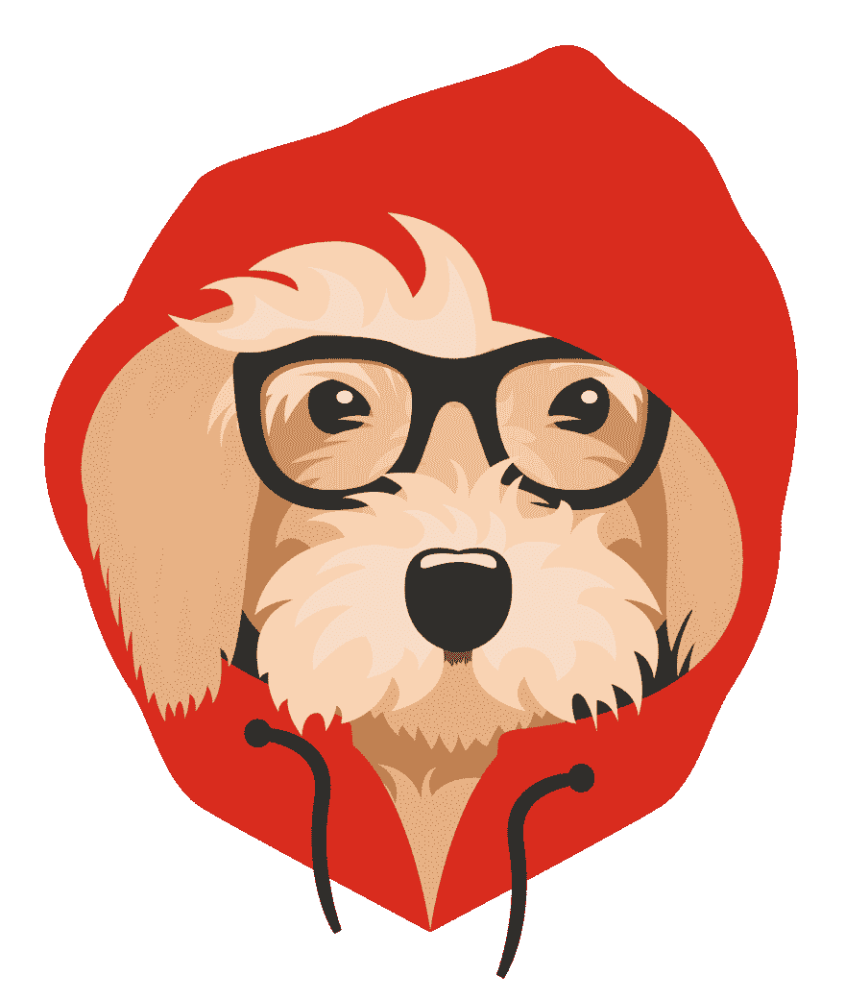

# 夺回你的网址控制权！

> 原文:[https://dev . to/codingcatdev/taking-control-back-of-your-URL-438 a](https://dev.to/codingcatdev/taking-control-back-of-your-url-438a)

# 以小入大

## 什么是网址缩写，我为什么要使用它们？

[https://www.youtube.com/embed/lSX5dPdArZ0](https://www.youtube.com/embed/lSX5dPdArZ0)

> URL shortener 是一个简单的工具，它可以将一个长 URL 转换成你想要的任何 URL。

现在对于 https://ajonp.com 来说，我们有很多合作伙伴，我跟踪他们的反馈，并保持“网络发展”世界的更新。这让我可以为我们所有的“完美的人”提供一站式服务，满足他们的大部分知识需求。

例如我与
 有关系

## [泰勒·麦金尼斯](/tylermcginnis) <button name="button" type="button" data-info="{&quot;className&quot;:&quot;User&quot;,&quot;style&quot;:&quot;full&quot;,&quot;id&quot;:830,&quot;name&quot;:&quot;Tyler McGinnis&quot;}" class="crayons-btn follow-action-button whitespace-nowrap  " aria-label="Follow user: Tyler McGinnis" aria-pressed="false">跟随</button>

[Teaching React, JavaScript and other Web Tech at ui.dev. Former Director at DevMountain. Creator of Udacity's React Nanodegree.](/tylermcginnis)

所以当我说嘿，检查泰勒的惊人的[反应课程](https://link.ajonp.com/tylermcginnis-react)。我更容易记住两件事`tylermcginnis` `react`。所以现在每当我想提到泰勒的课程时，都可以很容易地使用我自己的域名`https://link.ajonp.com/tylermcginnis-react`

## 夺回你的域名！

所以你可能已经注意到我所有的链接都是简单的`link.ajonp.com`，这也让我的品牌比随机的“bit.ly”链接有更好的声誉。是的，他们也提供这种功能，但是价格昂贵！

## 我为什么要转行？

这就是我不得不采取行动的主要原因！！！

我遇到了一个 Slack 的问题(所以也许责任从这里开始),我的用户链接停止了工作。所以我进去对我的旧链接进行了快速编辑，果然我不能改变它。这意味着我现在拥有的 1000 个位置`bit.ly/slack-invite`将不再工作，我无法将其更新回工作状态。

[比特链接 vs 重新链接](https://support.rebrandly.com/hc/en-us/articles/360013225774-Bitly-Links-vs-Rebrandly-Links-)

## 现在最难的部分

现在我必须追踪所有那些漂浮在互联网上的链接，并更新时间...这是我的运气😿

🎥YouTube:t0]https://link . ajonp . com/YouTube
🌎网站: [https://link.ajonp.com/😺](https://link.ajonp.com/%F0%9F%98%BA)
📦github:[https://link . ajonp . com/github](https://link.ajonp.com/github)
🎓课程:[https://link . ajonp . com/lesson](https://link.ajonp.com/lessons)
网络周:[【https://link . ajonp . com/网络周】
💬slack:](https://link.ajonp.com/week-in-web)[https://link . ajonp . com/slack](https://link.ajonp.com/slack)
🐦Twitter:[https://link . ajonp . com/Twitter](https://link.ajonp.com/twitter)

## 你使用网址缩写器吗？

请留言告诉我为什么！