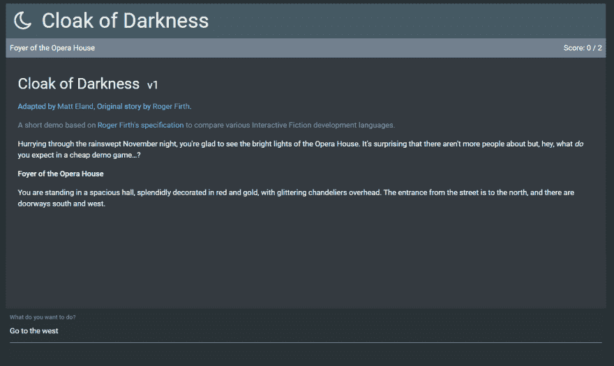
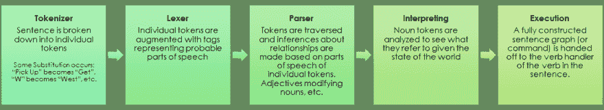
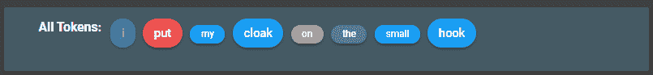
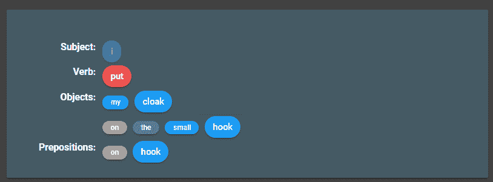
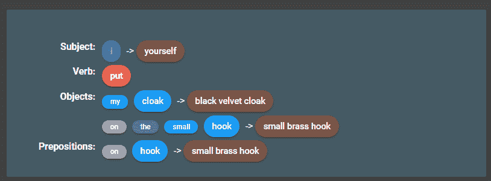
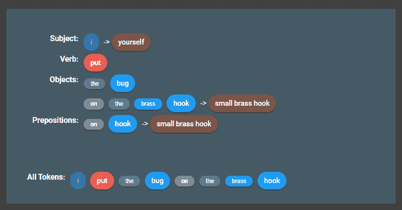

# 用折衷的自然语言处理构建基于文本的游戏

> 原文:[https://dev . to/integerman/building-text-based-games-with-compromise-NLP-jnm](https://dev.to/integerman/building-text-based-games-with-compromise-nlp-jnm)

在本文中，我将带您了解如何使用[折衷 NLP](http://compromise.cool/) JavaScript 库来解释基于文本的冒险游戏中的玩家输入。

# [](#interactive-fiction)互动小说

在基于文本的游戏中，也称为互动小说或 IF，游戏向玩家描述一个房间，然后玩家输入命令，游戏做出响应。

如果你熟悉 Zork，Enchanter，Anchorhead，甚至是巨大的洞穴探险，你已经知道我在说什么了。如果不是，下面是一个虚构游戏的片段:

> **家庭办公室**
> 
> 无论怎么想象，你的家庭办公室都不干净，但自从事故发生后，情况变得更糟了。你告诉自己，疯狂是有方法的，你知道在哪里可以找到任何重要的东西，但即使是你也不得不承认，当你需要让狗远离房间，害怕它撕毁银行文件时，你就有问题了。
> 
> 你的台式电脑在桌子上。它现在看起来正忙于安装重要的系统更新。
> 
> 一组玻璃双门向东通向你的走廊。

`Look at the computer screen`

> 计算机显示一个动画进度指示器，没有任何接近完成的迹象。

`Unplug the computer`

> 现在不行！它正忙于安装重要更新！

希望你能明白。游戏描述了一种情况，玩家键入一个命令，以设计者*希望*预期的方式与环境互动，并有一个有意义的响应。

# [](#angularif)成角状

每当我学习一门新语言时，我几乎总是会用那种语言写一个基于文本的游戏。我小时候就是这样学习建筑、设计和各种语言的细微差别的，对此有一种怀旧的感觉。

因此，几年前，我意识到我从未用 JavaScript 或 TypeScript 做过这些，并着手用 Angular 构建一个基于文本的游戏引擎。虽然随着时间的推移，我对这个项目失去了兴趣，但核心引擎以及它是如何解析事物的却非常有趣。

[T2】](https://res.cloudinary.com/practicaldev/image/fetch/s--35kYMcI1--/c_limit%2Cf_auto%2Cfl_progressive%2Cq_auto%2Cw_880/https://thepracticaldev.s3.amazonaws.com/i/mcoe5ae9154n88d87l3p.png)

Angular IF 使用了 Angular 材质和 Materialize CSS 的自定义变体，但其核心是与旧的黑白文本冒险相同的概念。

用户在`UserInputComponent`中键入一个句子，然后这个句子被发送给`InputService`，后者解释输入并更新故事，发出一个事件`StoryViewComponent`接收并显示给用户。

那么这个游戏是如何理解玩家输入的内容的呢？

# [](#parsing-text-input)解析文本输入

在高层次上，Angular IF 对用户输入执行以下操作:

[T2】](https://res.cloudinary.com/practicaldev/image/fetch/s--A4sufurP--/c_limit%2Cf_auto%2Cfl_progressive%2Cq_auto%2Cw_880/https://thepracticaldev.s3.amazonaws.com/i/pnxrvhaij1d0gjnbvhrs.png)

*   **标记化**将输入文本转化为可以解释的单个单词“标记”
*   使用一个**词法分析器**来获取各个单词词性的上下文信息
*   将标记解析成一个依赖关系网，使句子具有语法意义
*   尽可能用当地环境中的物体来解释句子中的物体
*   **通过将解释后的命令发送给适当的动词处理程序来执行**

在接下来的章节中，我将用一个例句来更详细地说明这些。

# [](#a-sample-scenario)一个示例场景

看看下面的房间描述，重点强调声明的对象:

> **衣帽间**
> 这个*小房间*的*墙壁*明明曾经排列着*挂钩*，虽然现在只剩下一个。出口是一个*门*到*东边*。

我们要解析下面这个短句:

`Put my cloak on the small hook`

在我们看这个是如何分解的之前，应该注意到 AngularIF 需要这样的句子结构。具体来说，它需要一个以动词开头的祈使句。这极大地限制了用户可以输入的内容类型，使问题变得更容易管理。

# [](#tokenizing-and-lexing)标记化和词法化

我们将一前一后地讨论标记化和词法分析，因为这两项任务都是在 AngularIF 中通过调用[折衷 NLP](http://compromise.cool/) 库来完成的。

Compromise 是一个简单的 JavaScript 库，旨在对文本进行标记化、lex 甚至转换。它被设计成快速、简单，并处理人们从文本解析库中需要的绝大多数东西，通过在较少人想做的较难的事情上*妥协*。

在 AngularIF 中，标记化看起来是这样的:

```
private extractTokensFromInput(sentence: string): CommandToken[] {
  const lexer = LexiconService.instance;

  sentence = lexer.replaceWords(sentence);

  // Break down the input into command tokens
  const tokens: CommandToken[] = this.nlp.getTokensForSentence(sentence);

  // Some tokens are shortcuts for common actions. These should be replaced as if the user had spoken the full word.
  lexer.replaceTokens(tokens, this.nlp);

  return tokens;
} 
```

<svg width="20px" height="20px" viewBox="0 0 24 24" class="highlight-action crayons-icon highlight-action--fullscreen-on"><title>Enter fullscreen mode</title></svg> <svg width="20px" height="20px" viewBox="0 0 24 24" class="highlight-action crayons-icon highlight-action--fullscreen-off"><title>Exit fullscreen mode</title></svg>

在我们调用 compromise 之前，我们进行一些标准的字符串替换，以清除 Compromise 可能会混淆的任何歧义或复合词:

```
"substitute":  {  "pick up":  "get",  "climb up":  "climb",  "turn on":  "activate",  "turn off":  "deactivate",  "north east":  "northeast",  "north west":  "northwest",  "south east":  "southeast",  "south west":  "southwest",  "cannot":  "can not",  "weed whacker":  "whacker",  "front yard":  "frontyard",  "side yard":  "sideyard",  "back yard":  "backyard",  "inside":  "in",  "outside":  "out"  }, 
```

<svg width="20px" height="20px" viewBox="0 0 24 24" class="highlight-action crayons-icon highlight-action--fullscreen-on"><title>Enter fullscreen mode</title></svg> <svg width="20px" height="20px" viewBox="0 0 24 24" class="highlight-action crayons-icon highlight-action--fullscreen-off"><title>Exit fullscreen mode</title></svg>

替换完成后，我们调用我编写的包装折衷库的`NaturalLanguageProcessor`类上的`getTokensForSentence`。这个方法调用了其他几个方法，最终链接到这个调用:

```
public getTerms(sentence: string): LanguageTerm[] {
  // Commas are death.
  sentence = StringHelper.replaceAll(sentence, ',', '');

  const lexicon = LexiconService.instance.lexicon;
  const data: LanguageTerm[] = this.nlp(sentence, lexicon).terms().data();

  return data;
} 
```

<svg width="20px" height="20px" viewBox="0 0 24 24" class="highlight-action crayons-icon highlight-action--fullscreen-on"><title>Enter fullscreen mode</title></svg> <svg width="20px" height="20px" viewBox="0 0 24 24" class="highlight-action crayons-icon highlight-action--fullscreen-off"><title>Exit fullscreen mode</title></svg>

这里`nlp`是妥协的例子。

所以，回到这个例子，短语`put my cloak on the small hook`将解析出令牌`put`如下:

```
{  "spaceBefore":"",  "text":"put",  "spaceAfter":"",  "normal":"put",  "implicit":"",  "bestTag":"Verb",  "tags":[  "PastTense",  "Verb",  "VerbPhrase"  ]  } 
```

<svg width="20px" height="20px" viewBox="0 0 24 24" class="highlight-action crayons-icon highlight-action--fullscreen-on"><title>Enter fullscreen mode</title></svg> <svg width="20px" height="20px" viewBox="0 0 24 24" class="highlight-action crayons-icon highlight-action--fullscreen-off"><title>Exit fullscreen mode</title></svg>

所以在这里我们看到 Compromise 认为`put`是一个动词，可以用过去时态，也可以作为动词短语的一部分，但是 Compromise 最好的猜测是`put`是一个动词。没错。

因此，我们看到，通过一个简单的妥协呼吁，我们获得了大量关于词类的信息，而这些信息根本不需要任何自定义定义。

如果我给妥协一个它不知道的词，它会告诉我它知道什么。例如，输入`Madeupword`被解释如下:

```
{  "spaceBefore":"",  "text":"Madeupword",  "spaceAfter":"",  "normal":"madeupword",  "implicit":"",  "bestTag":"Noun",  "tags":[  "TitleCase",  "Noun",  "Singular"  ]  } 
```

<svg width="20px" height="20px" viewBox="0 0 24 24" class="highlight-action crayons-icon highlight-action--fullscreen-on"><title>Enter fullscreen mode</title></svg> <svg width="20px" height="20px" viewBox="0 0 24 24" class="highlight-action crayons-icon highlight-action--fullscreen-off"><title>Exit fullscreen mode</title></svg>

所以在这里，它将它解释为一个名词，作为它的最佳猜测，并告诉我，根据单词的结尾，它显示为单数，并且它是在标题中。在我们的例子中，默认一个名词是一个非常好的决定，因为新名词比新动词更有可能具有大多数基于文本的游戏所支持的相当有限的一组动作。

# [](#parsing)解析

现在我们已经有了一组经过解析的术语，我们可以开始理解排序了。现在我们有以下内容:

*   put(动词)
*   我的(形容词)
*   斗篷(名词)
*   开(介词)
*   (限定词)
*   小(形容词)
*   钩子(名词)

AngularIF 看了一下，马上注意到它不是以主语开头的，所以这个游戏在句子的开头隐式地添加了 *I(名词)*。从 AngularIF 的调试视图中进行一点造型，我们的句子现在可以以如下方式显示:

[T2】](https://res.cloudinary.com/practicaldev/image/fetch/s--FcwJpSHn--/c_limit%2Cf_auto%2Cfl_progressive%2Cq_auto%2Cw_880/https://thepracticaldev.s3.amazonaws.com/i/67o0auy11dfdu21u7c7y.png)

这里的颜色编码和元素的相对大小帮助我们开始理解句子。我们真正关心的是一个动词和一系列可以输入到动词处理程序中的对象。动词和宾语很简单，但是让我们看看其他的单词。

形容词 *my* 适用于名词*斗篷*，所以它变得附属于那个。

上的介词*和限定词*同样适用于名词*钩子*。**

 *给定这些修饰语，我们可以将我们的句子表示为`I put cloak hook`。介词上的*实际上很重要，因为许多动词处理者需要知道你是否试图在下面、上面、里面、上面等等做某事。但是为了句子解析的简单，我们的主要功能是名词和动词。*

该句子可以表示如下:

[T2】](https://res.cloudinary.com/practicaldev/image/fetch/s--m8yn5KYj--/c_limit%2Cf_auto%2Cfl_progressive%2Cq_auto%2Cw_880/https://thepracticaldev.s3.amazonaws.com/i/dnubydx1u1gicx1u504o.png)

现在，由于祈使句的结构和妥协提供的信息，用户实际上在说什么变得更加清楚了。

下一步是解释这些名词的意思。

# [](#interpreting)口译

在这里，我们看一下命令中列出的所有名词，并尝试将它们映射到当前房间中注册的或连接到玩家的对象。我们还需要匹配一些不变的东西，如基本方向。

基于匹配房间中存在的对象的注册形容词和同义词，这是相当容易做到的，所以我将省去这段代码，更多地关注解析器。

解释完我们的输入后，看起来如下:

[T2】](https://res.cloudinary.com/practicaldev/image/fetch/s--N8P7PRsB--/c_limit%2Cf_auto%2Cfl_progressive%2Cq_auto%2Cw_880/https://thepracticaldev.s3.amazonaws.com/i/czwu5oy8q1d89tgtpd5k.png)

在这里，我们能够理解用户在环境中谈论的内容，并有一些具体的东西交给引擎来执行。

如果用户试图引用房间中没有编码的东西，解释器可能无法解析其中的一些名词，您会得到如下结果:

[T2】](https://res.cloudinary.com/practicaldev/image/fetch/s--Ajlv8pCB--/c_limit%2Cf_auto%2Cfl_progressive%2Cq_auto%2Cw_880/https://thepracticaldev.s3.amazonaws.com/i/098tv1g7ppc2vv0j5d3k.png)

在这里，单词 *bug* 被认为是一个名词，但是没有映射到任何已知的游戏概念，所以游戏引擎会回应:

> 你在这里看不到一个错误。

如果所有的回答都没有错误就好了。

# [](#execution)执行

既然用户意图的完整图形已经可用，系统就寻找为用户输入的动词注册的处理程序。例如，使用 *put* 动词，系统知道它并调用它，传入句子图。处理程序查看句子中的对象，它知道第一个对象将是我们放置的内容，第二个对象将是我们放置的位置(以及如何放置，如果在下面有一个介词，比如*)。*

如果一个动词处理程序没有它需要的所有信息或者感到困惑，它可以向用户返回一个定制的响应。

如果用户尝试使用一个没有处理程序的动词，系统可以这样回答:

> 你不需要使用动词`eat`来赢得游戏。要获得可用动词的完整列表，请键入`What can I do?`

幸运的是，将斗篷挂在钩子上是完全有效的，并且系统会返回:

> 你的分数刚刚上升了 1 分。
> 你把黑丝绒斗篷挂在小铜钩上。

# [](#next-steps)下一步

虽然这是使用折衷的 NLP 进行句子解析的高级概述，但我希望这篇文章能让您思考该库可以帮助您实现的事情。我强烈建议你查看妥协网站上的各种例子和后续步骤。

如果你对我自己的 AngularIF 代码感兴趣，可以在 GitHub 上找到代码[。我应该警告你，它仍然在 Angular 4 中，有大量的漏洞和错误，所以我建议你尽可能更新依赖关系。尽管如此，代码应该对任何有兴趣学习更多解析祈使句的人有所启发。](https://github.com/IntegerMan/angularIF)

如果你做了一些很酷的事情，不管是妥协还是妥协，请让我知道；我很想听听。*