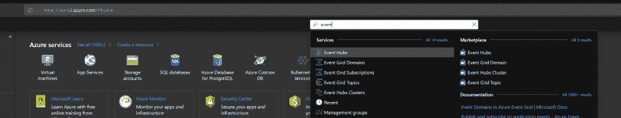
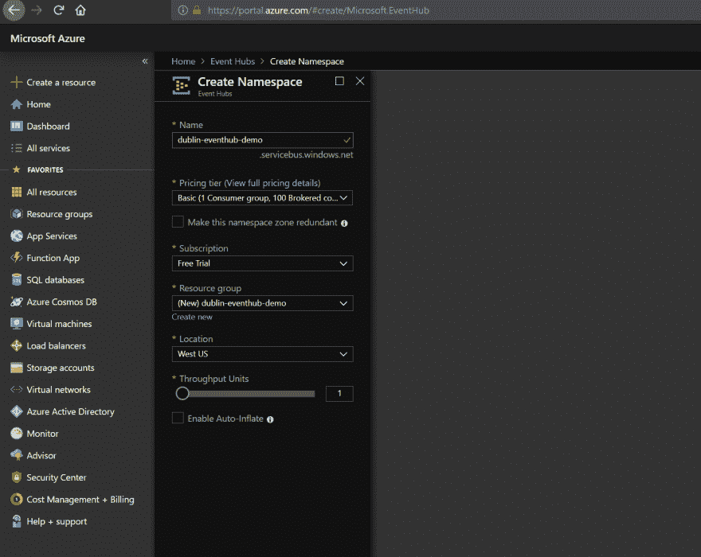
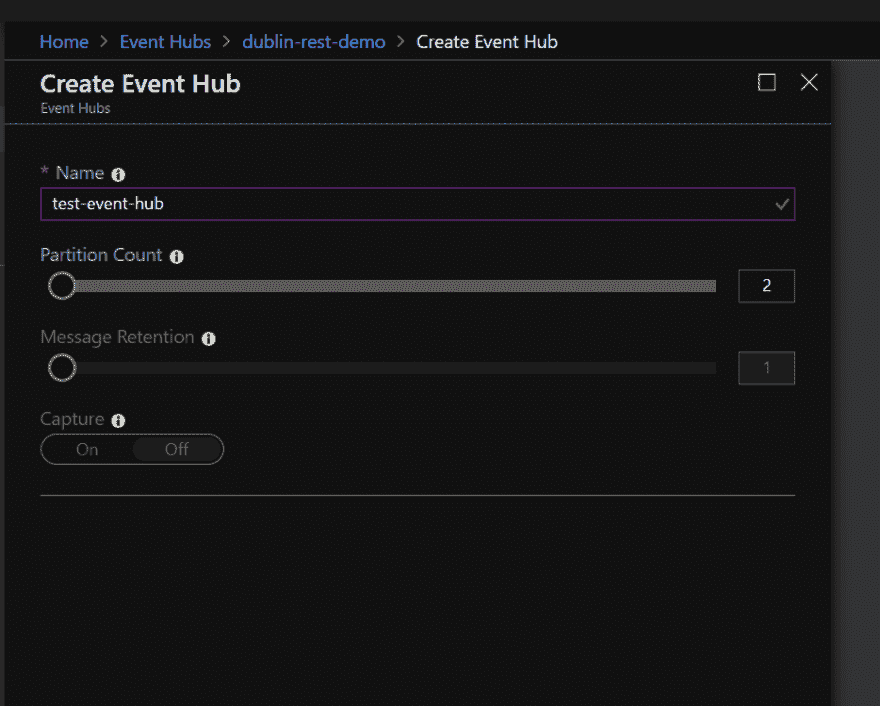
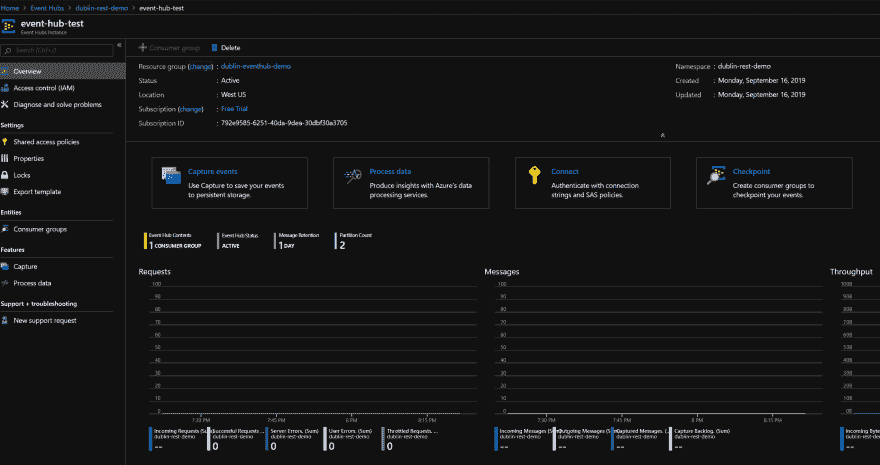
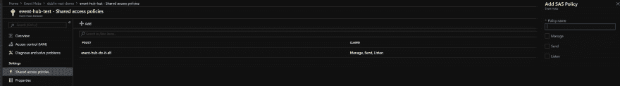
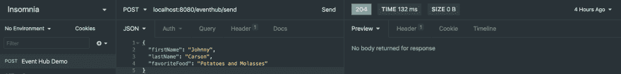

# 使用 Azure Event Hubs 获得多事之秋:第一部分

> 原文：<https://dev.to/danondso/getting-eventful-with-azure-event-hubs-part-one-3jn1>

[Event hub](https://azure.microsoft.com/en-us/services/event-hubs/) 是微软提供的大数据摄取产品，它利用了 AMQP、HTTPS 和阿帕奇卡夫卡。Event hub 提供了数据流上的分区和检查点等优势，以及您的钱包可以处理的所有可伸缩性。

在本文中，我将介绍如何使用 spring boot web 服务建立连接并向 event hub 发送数据。您可以在此处查看完整的示例[。](https://github.com/Danondso/dublin_eventhub_demo)

## 设置 Azure 帐户

如果你还没有，你需要注册一个 azure dev 帐户。他们为您提供足够的积分，让您了解我们在本指南中需要做的事情。

## 创建事件中心名称空间

登录 azure 门户网站，在顶部的搜索框中搜索“活动中心”。您需要选择“活动中心”选项。

[](https://res.cloudinary.com/practicaldev/image/fetch/s--zGxZiOKD--/c_limit%2Cf_auto%2Cfl_progressive%2Cq_auto%2Cw_880/https://thepracticaldev.s3.amazonaws.com/i/8sgr51gnorn5ggua7y5k.PNG)

从那里点击“事件中心”，然后点击添加(+)图标。

[](https://res.cloudinary.com/practicaldev/image/fetch/s--NDkPs0dr--/c_limit%2Cf_auto%2Cfl_progressive%2Cq_auto%2Cw_880/https://thepracticaldev.s3.amazonaws.com/i/1on77z7ghu7euydt2ekd.PNG)

填写创建表单，在这个例子中，我使用了最简单的设置。您可能还需要为这个事件中心创建一个资源组。

[](https://res.cloudinary.com/practicaldev/image/fetch/s--QmhmFHEH--/c_limit%2Cf_auto%2Cfl_progressive%2Cq_auto%2Cw_880/https://thepracticaldev.s3.amazonaws.com/i/8tkclexlp1tcjaj46x4f.PNG)

嘣！我们已经建立了一个事件中心命名空间。名称空间充当您创建的事件中心的组织目录。

## 创建活动中心

导航到您的事件中心名称空间，然后单击事件中心添加(+)图标。

[](https://res.cloudinary.com/practicaldev/image/fetch/s--GMzqZmkH--/c_limit%2Cf_auto%2Cfl_progressive%2Cq_auto%2Cw_880/https://thepracticaldev.s3.amazonaws.com/i/u67apl1e6qnaw7tmqvmg.PNG)

给你的活动中心起一个时髦的名字，根据你的需要调整分区数量，但是在本指南中，我将分区数量保持在 2。单击表单底部的 create，我们就可以开始了。

[](https://res.cloudinary.com/practicaldev/image/fetch/s--ZaKcYgaA--/c_limit%2Cf_auto%2Cfl_progressive%2Cq_auto%2Cw_880/https://thepracticaldev.s3.amazonaws.com/i/dgnwtmqmjvqcssah9pum.PNG)

您应该会看到一条消息，说明您的事件中心正在创建中，完成后，从您的名称空间菜单导航到它。您将看到一个显示各种指标的仪表板，比如吞吐量和消息数量。

[](https://res.cloudinary.com/practicaldev/image/fetch/s--XLGKVSt9--/c_limit%2Cf_auto%2Cfl_progressive%2Cq_auto%2Cw_880/https://thepracticaldev.s3.amazonaws.com/i/x88scppbq5qzzbkqmuh5.PNG)

在侧边菜单中，导航到“共享访问策略”并点按添加按钮(+)。给它一个名字，并给它管理访问权限(给我们读和写的权限)。

[](https://res.cloudinary.com/practicaldev/image/fetch/s--z1V3awB0--/c_limit%2Cf_auto%2Cfl_progressive%2Cq_auto%2Cw_880/https://thepracticaldev.s3.amazonaws.com/i/5fu0g1222opr6zmx3jgx.PNG)

创建共享访问策略为我们提供了打开活动中心城堡的钥匙。单击您刚刚创建的策略，并记下连接字符串。

# 向事件中心发送数据

### 在事件中枢中添加依赖关系。

首先，将这些依赖项添加到 pom 文件中。在撰写本文时，这些依赖项的最新版本是 3.0.0。

```
 <dependency>
            <groupId>com.microsoft.azure</groupId>
            <artifactId>azure-eventhubs</artifactId>
            <version>3.0.0</version>
        </dependency>
        <dependency>
            <groupId>com.microsoft.azure</groupId>
            <artifactId>azure-eventhubs-eph</artifactId>
            <version>3.0.0</version>
        </dependency> 
```

<svg width="20px" height="20px" viewBox="0 0 24 24" class="highlight-action crayons-icon highlight-action--fullscreen-on"><title>Enter fullscreen mode</title></svg> <svg width="20px" height="20px" viewBox="0 0 24 24" class="highlight-action crayons-icon highlight-action--fullscreen-off"><title>Exit fullscreen mode</title></svg>

接下来，让我们创建一个 config 类并创建一个 EventHubClient。

### 创建客户端并连接。

```
import com.microsoft.azure.eventhubs.EventHubClient;
import com.microsoft.azure.eventhubs.EventHubException;
import org.springframework.beans.factory.annotation.Value;
import org.springframework.context.annotation.Bean;
import org.springframework.context.annotation.Configuration;

import java.io.IOException;
import java.util.concurrent.Executors;

@Configuration
public class EventHubConfig {

    @Value("${eventHub.connectionString}")
    private String connectionString;

    @Bean
    public EventHubClient setupEventHubConnection() throws IOException, EventHubException {
        return EventHubClient.createFromConnectionStringSync(connectionString,
                              Executors.newSingleThreadScheduledExecutor());
    }
} 
```

<svg width="20px" height="20px" viewBox="0 0 24 24" class="highlight-action crayons-icon highlight-action--fullscreen-on"><title>Enter fullscreen mode</title></svg> <svg width="20px" height="20px" viewBox="0 0 24 24" class="highlight-action crayons-icon highlight-action--fullscreen-off"><title>Exit fullscreen mode</title></svg>

在这个类中，我从一个配置文件(在我的例子中是应用程序的 yml 文件)中提取 connectionString，注入到 config 类中，然后按原样将其传递给*createFromConnectionStringSync*方法，该方法接受一个连接字符串和一个 *ScheduledExecutorService* 对象。因为我们在这里没有做任何花哨的事情，所以我使用了单线程执行器。

我是这样定义我的 yml 文件的。

```
eventHub:
  connectionString: 'connections  string  here' 
```

<svg width="20px" height="20px" viewBox="0 0 24 24" class="highlight-action crayons-icon highlight-action--fullscreen-on"><title>Enter fullscreen mode</title></svg> <svg width="20px" height="20px" viewBox="0 0 24 24" class="highlight-action crayons-icon highlight-action--fullscreen-off"><title>Exit fullscreen mode</title></svg>

现在我们有了一个事件中心客户端 bean，让我们继续创建一个使用它的服务组件。

```
import com.dublin.eventhub.demo.controller.Controller;
import com.dublin.eventhub.demo.model.EventPayload;
import com.microsoft.azure.eventhubs.EventData;
import com.microsoft.azure.eventhubs.EventHubClient;
import org.slf4j.Logger;
import org.slf4j.LoggerFactory;
import org.springframework.beans.factory.annotation.Autowired;
import org.springframework.stereotype.Service;
import org.springframework.util.SerializationUtils;

import java.util.Objects;

@Service
public class EventHubService {
    private final EventHubClient eventHubClient;
    private Logger log = LoggerFactory.getLogger(Controller.class);

    @Autowired
    public EventHubService(EventHubClient eventHubClient) {
        this.eventHubClient = eventHubClient;
    }

    public void sendEvent(EventPayload test) {

        byte[] bytes = SerializationUtils.serialize(test);

        log.info("Sending message to the event hub {}", eventHubClient.getEventHubName());
        eventHubClient.send(EventData.create(Objects.requireNonNull(bytes)), test.toString());
    }
} 
```

<svg width="20px" height="20px" viewBox="0 0 24 24" class="highlight-action crayons-icon highlight-action--fullscreen-on"><title>Enter fullscreen mode</title></svg> <svg width="20px" height="20px" viewBox="0 0 24 24" class="highlight-action crayons-icon highlight-action--fullscreen-off"><title>Exit fullscreen mode</title></svg>

我们将使用构造函数注入将客户端注入到我们的服务中，从那里我定义了将使用客户端发送数据的 *sendEvent* 方法。

为了向 event hub 发送数据，我们需要将消息序列化为一个字节数组，将其包装在 EventData 对象中，然后将其传递给客户端的 *send* 方法。

### 创建数据类

对于这个例子，我定义了一个简单的数据类。

```
import lombok.AllArgsConstructor;
import lombok.Builder;
import lombok.Data;
import lombok.NoArgsConstructor;

import java.io.Serializable;

@Data
@Builder
@AllArgsConstructor
@NoArgsConstructor
public class EventPayload implements Serializable {
    private String firstName;
    private String lastName;
    private String favoriteFood;
} 
```

<svg width="20px" height="20px" viewBox="0 0 24 24" class="highlight-action crayons-icon highlight-action--fullscreen-on"><title>Enter fullscreen mode</title></svg> <svg width="20px" height="20px" viewBox="0 0 24 24" class="highlight-action crayons-icon highlight-action--fullscreen-off"><title>Exit fullscreen mode</title></svg>

需要注意的是，您正在为 event hub 处理的数据需要是*可序列化的*，因此请确保在您正在处理的数据类上实现*可序列化的*，否则您将得到一条*Java . lang . illegalargumentexception:未能反序列化对象*的消息。

接下来，我们将定义一个端点来发布我们的数据。

### 构建一个端点

```
import com.dublin.eventhub.demo.model.EventPayload;
import com.dublin.eventhub.demo.service.EventHubService;
import org.slf4j.Logger;
import org.slf4j.LoggerFactory;
import org.springframework.beans.factory.annotation.Autowired;
import org.springframework.http.HttpStatus;
import org.springframework.http.ResponseEntity;
import org.springframework.web.bind.annotation.*;

@RestController
public class Controller {

    private final EventHubService eventHubService;
    private Logger log = LoggerFactory.getLogger(Controller.class);

    @Autowired
    public Controller(EventHubService eventHubService) {
        this.eventHubService = eventHubService;
    }

    @PostMapping(path = "/eventhub/send")
    public ResponseEntity sendEvent(@RequestBody EventPayload payload) {
        try {
            log.info("Eventhub send endpoint called, sending {} to event hub..", payload.toString());
            eventHubService.sendEvent(payload);
        } catch (Exception e) {
            log.error("An error arose sending a message to event hub: " + e);
            return new ResponseEntity<Exception>(HttpStatus.INTERNAL_SERVER_ERROR);
        }
        return new ResponseEntity(HttpStatus.OK);
    }
} 
```

<svg width="20px" height="20px" viewBox="0 0 24 24" class="highlight-action crayons-icon highlight-action--fullscreen-on"><title>Enter fullscreen mode</title></svg> <svg width="20px" height="20px" viewBox="0 0 24 24" class="highlight-action crayons-icon highlight-action--fullscreen-off"><title>Exit fullscreen mode</title></svg>

我已经创建了 POST 方法“/eventhub/send ”,并将请求体定义为我们的数据类。从那里，它只是发送到服务。

一旦我们把所有这些都连接起来，我们应该能够运行我们的应用程序，并看到它成功地连接到事件中心。

```
2019-09-24 13:42:21.670  INFO 16113 --- [           main] org.apache.catalina.core.StandardEngine  : Starting Servlet engine: [Apache Tomcat/9.0.24]
2019-09-24 13:42:21.734  INFO 16113 --- [           main] o.a.c.c.C.[Tomcat].[localhost].[/]       : Initializing Spring embedded WebApplicationContext
2019-09-24 13:42:21.734  INFO 16113 --- [           main] o.s.web.context.ContextLoader            : Root WebApplicationContext: initialization completed in 1063 ms
2019-09-24 13:42:21.983  INFO 16113 --- [pool-1-thread-1] c.m.a.eventhubs.impl.MessagingFactory    : messagingFactory[MF_41d4fd_1569350541964], hostName[dublin-rest-demo.servicebus.windows.net], info[starting reactor instance.]
2019-09-24 13:42:21.999  INFO 16113 --- [pool-1-thread-1] c.m.azure.eventhubs.impl.ReactorHandler  : name[MF_41d4fd_1569350541964] reactor.onReactorInit
2019-09-24 13:42:22.002  INFO 16113 --- [pool-1-thread-1] c.m.a.eventhubs.impl.ConnectionHandler   : onConnectionInit hostname[dublin-rest-demo.servicebus.windows.net], connectionId[MF_41d4fd_1569350541964]
2019-09-24 13:42:22.003  INFO 16113 --- [pool-1-thread-1] c.m.a.eventhubs.impl.ConnectionHandler   : onConnectionLocalOpen hostname[dublin-rest-demo.servicebus.windows.net:5671], connectionId[MF_41d4fd_1569350541964], errorCondition[null], errorDescription[null]
2019-09-24 13:42:22.101  INFO 16113 --- [pool-1-thread-1] c.m.a.eventhubs.impl.ConnectionHandler   : onConnectionBound hostname[dublin-rest-demo.servicebus.windows.net], connectionId[MF_41d4fd_1569350541964]
2019-09-24 13:42:23.157  INFO 16113 --- [pool-1-thread-4] c.m.a.eventhubs.impl.ConnectionHandler   : onConnectionRemoteOpen hostname[dublin-rest-demo.servicebus.windows.net:5671], connectionId[MF_41d4fd_1569350541964], remoteContainer[100db877ccad41b1a689c5a458bf1fbc_G6]
2019-09-24 13:42:23.268  INFO 16113 --- [           main] o.s.s.concurrent.ThreadPoolTaskExecutor  : Initializing ExecutorService 'applicationTaskExecutor'
2019-09-24 13:42:23.449  INFO 16113 --- [           main] o.s.b.a.e.web.EndpointLinksResolver      : Exposing 2 endpoint(s) beneath base path '/actuator'
2019-09-24 13:42:23.491  INFO 16113 --- [           main] o.s.b.w.embedded.tomcat.TomcatWebServer  : Tomcat started on port(s): 8080 (http) with context path ''
2019-09-24 13:42:23.495  INFO 16113 --- [           main] com.dublin.eventhub.demo.Application     : Started Application in 3.126 seconds (JVM running for 3.493) 
```

<svg width="20px" height="20px" viewBox="0 0 24 24" class="highlight-action crayons-icon highlight-action--fullscreen-on"><title>Enter fullscreen mode</title></svg> <svg width="20px" height="20px" viewBox="0 0 24 24" class="highlight-action crayons-icon highlight-action--fullscreen-off"><title>Exit fullscreen mode</title></svg>

现在我们都设置好了，让我们发送一些数据给它。打开您最喜欢的 HTTP 客户端，向它发送一些数据。对于这个例子，我用的是[失眠](https://insomnia.rest/)。

[](https://res.cloudinary.com/practicaldev/image/fetch/s--8Yq7tnYw--/c_limit%2Cf_auto%2Cfl_progressive%2Cq_auto%2Cw_880/https://thepracticaldev.s3.amazonaws.com/i/ra9t47jq2cef7ljz04ah.png)

在日志中，我应该看到消息被成功发送到事件中心！

```
2019-09-24 13:43:25.806  INFO 16113 --- [nio-8080-exec-1] c.d.eventhub.demo.controller.Controller  : Eventhub send endpoint called, sending EventPayload(firstName=Johnny, lastName=Carson, email=null, favoriteFood=Potatoes and Molasses) to event hub..
2019-09-24 13:43:25.808  INFO 16113 --- [nio-8080-exec-1] c.d.eventhub.demo.controller.Controller  : Sending message to the event hub event-hub-test 
```

<svg width="20px" height="20px" viewBox="0 0 24 24" class="highlight-action crayons-icon highlight-action--fullscreen-on"><title>Enter fullscreen mode</title></svg> <svg width="20px" height="20px" viewBox="0 0 24 24" class="highlight-action crayons-icon highlight-action--fullscreen-off"><title>Exit fullscreen mode</title></svg>

我们做到了，我们正在序列化和发送数据到事件中心。😁

## 重述

在本指南中，我介绍了如何在 Azure 中创建一个事件中心，设置一个事件中心客户端和服务，以及一个向其发送数据的端点。在第二部分中，我将介绍[消费事件](https://dev.to/danondso/getting-eventful-with-azure-event-hubs-part-two-10ji)。

希望这个指南有所帮助，在评论里让我知道你的想法。