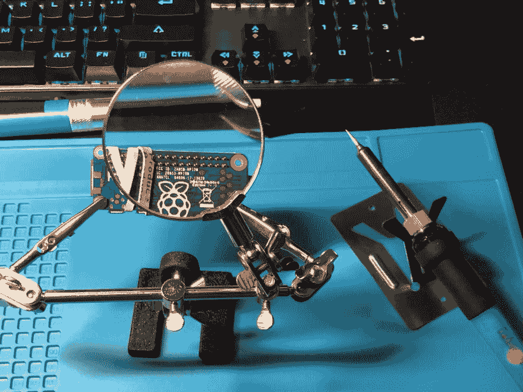
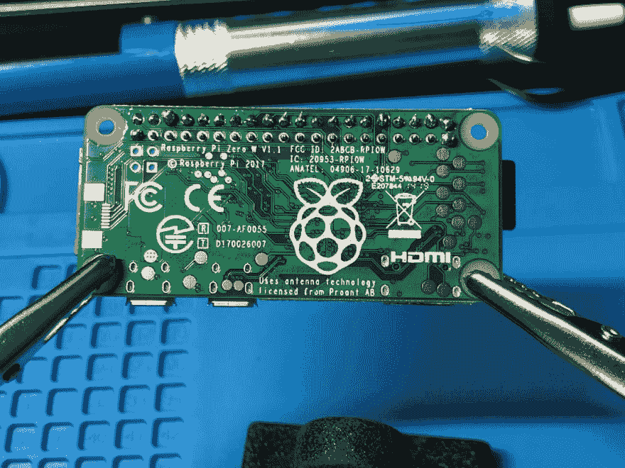
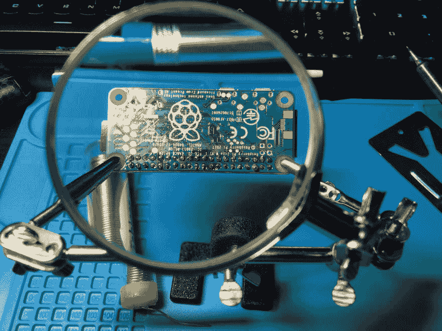
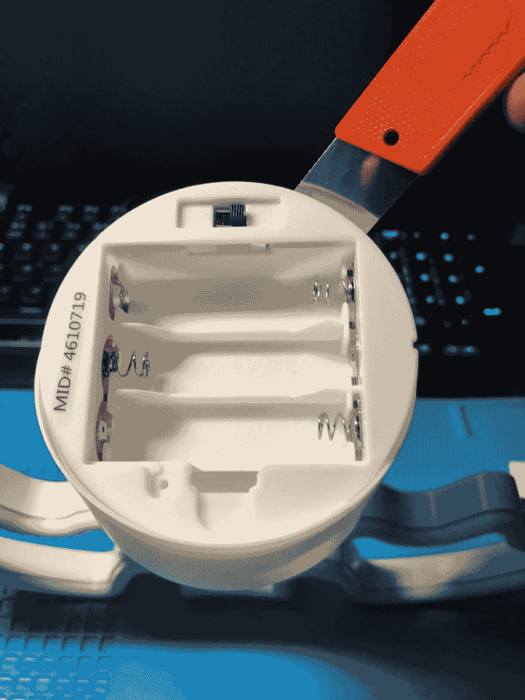
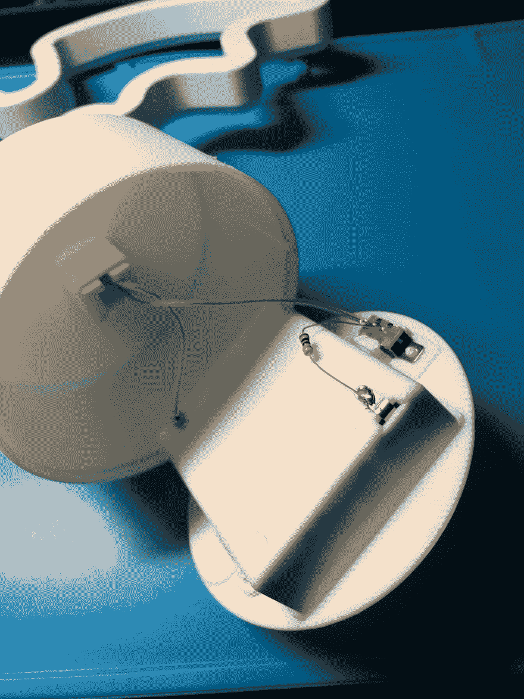
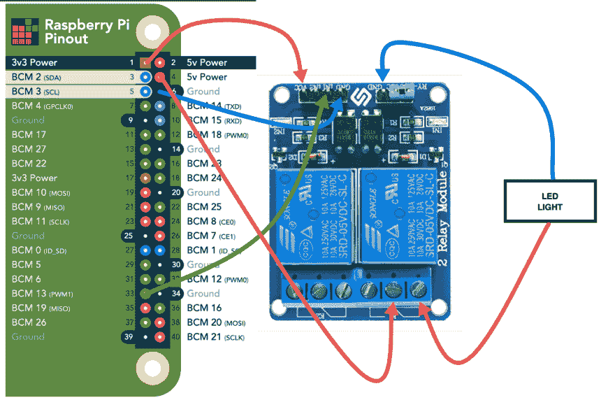
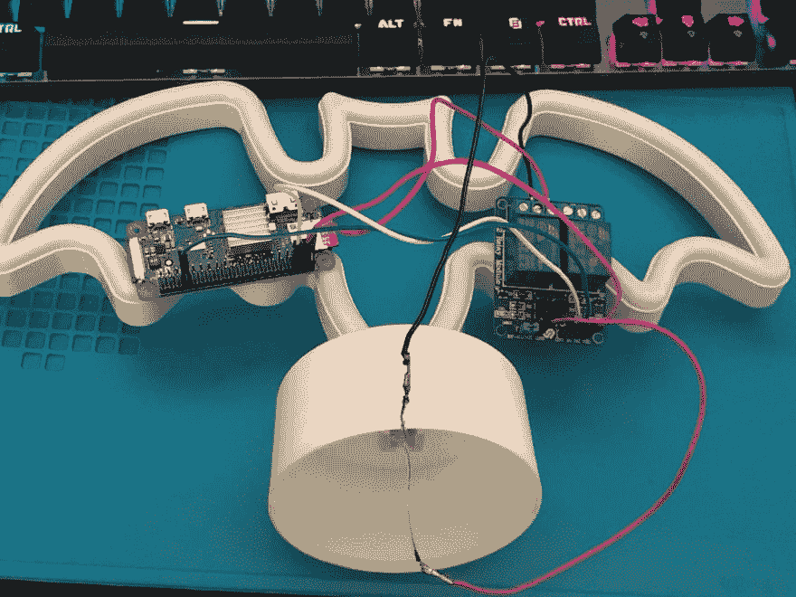
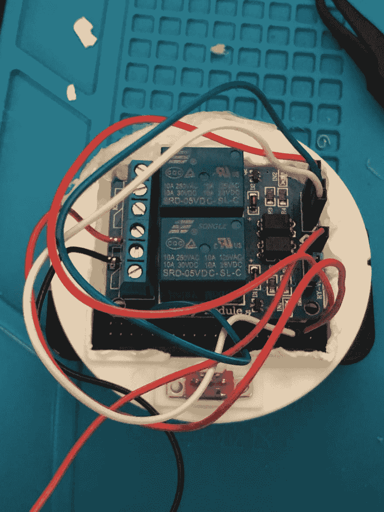

# 团队城市 BatSignal -由 RaspberryPi 提供支持

> 原文:[https://dev . to/tnoor/team city-bat signal-powered-by-raspberrypi-4h1m](https://dev.to/tnoor/teamcity-batsignal-powered-by-raspberrypi-4h1m)

***TL；博士:我了不起的未婚夫带回家一个便宜的目标探测器——一个蝙蝠形状的双色 LED 灯，我把它变成了一个蝙蝠——我们的*** [***团队合作***](https://www.jetbrains.com/teamcity/) ***用树莓搭建服务器的信号。*T13】**

[T2】](https://res.cloudinary.com/practicaldev/image/fetch/s--ou_gp4dY--/c_limit%2Cf_auto%2Cfl_progressive%2Cq_auto%2Cw_880/https://thepracticaldev.s3.amazonaws.com/i/d2ngwfv7cfui2pd8liq1.png)

**需求/原因:**

我们的测试环境在一天中有多次部署，这将使环境停机大约 10 分钟左右。我并不总是关注聊天或者打开团队城市网站，所以我一直想创造一个视觉指示器。这种廉价的看起来像霓虹灯的小灯泡是将这变成现实的完美借口。

**工具:**

这是我用过的东西:

| 产品/工具 | 价格/细节 |
| --- | --- |
| Vilros 的 Raspberry Pi Zero W 套件(Pi Zero W、接头、电源、外壳) | [$26.99 -亚马逊](https://www.amazon.com/gp/product/B0748MPQT4/) |
| SanDisk 16GB microSD 卡 | [$ 5.79——亚马逊](https://www.amazon.com/gp/product/B073K14CVB/) |
| LED 蝙蝠灯-来自目标(美元区-靠近前面) | $5.00 |
| SunFounder 双通道 DC 5V 继电器模块 | [$ 6.79——亚马逊](https://www.amazon.com/dp/B00E0NTPP4) |
| 母跳线(只需要 4 根) | [$ 5.99——亚马逊](https://www.amazon.com/GenBasic-Piece-Female-Jumper-Wires/dp/B01L5ULRUA/) |
| 烙铁 | 最便宜的也行——买一个带小配件的 |
| 援助之手 | 焊接过程中的好工具 |

你不必使用相同的零件——只要使用类似的就可以了。

例如，对于灯，你可以按照同样的说明使用 3 节 AA 电池供电。您可以使用一个 2AA 电池，并使用 Pi 的 3.7V 输出，而不是这里使用的 5V。

**初步计划:**

我想创建一个 web-hook(API ), TeamCity 可以在其中发布关于构建的消息，并触发相应的照明序列。我想我会使用 [ngrok](https://ngrok.com/) 来公开 url，因为这将是在内部公共 WiFi 上工作——这就不需要设置动态 DNS、设置端口转发等。然而，我发现我们的团队城市设置中没有网络挂钩插件。我可以建立一个团队的网络挂钩，但是我必须解析所有的数据来弄清楚它在某些情况下做了什么，我没有耐心等待。我需要在那天完成。

**最终方案:**

我的备份计划是 TeamCity 拥有的 RESTFul API，并且每分钟左右轮询一次。编写一个脚本只需要几分钟，而且每分钟都会轮询一次状态——所以我希望它几乎是实时的，而且不会对服务器造成太大的损害。

由于我们的 WiFi 密码经常更改，我需要一个解决方案，既能轻松地更改密码，又不会太麻烦。

**如何:**

**第一步:准备操作系统**

下载 [BerryLan](http://www.berrylan.org/) 风味 Raspbian 图片。BerryLan 有一个惊人的解决方案，当您的 WiFi 不可用时，它会设置一个蓝牙服务器。他们有一个用于 iOS & Android 的移动应用程序，你可以用它连接到你的 Pi 来设置 WiFi——完全没有头，没有一行代码。

> 如果你不需要经常更改 WiFi 密码，或者打算使用以太网，你可以跳过这一步，下载 plain-Raspbian。如果你想要一个没有 BerryLan 的无头 WiFi 设置，[这里有](https://dev.to/vorillaz/headless-raspberry-pi-zero-w-setup-3llj)一个快速指南。

下载 [Etcher](https://www.balena.io/etcher/) 将 OS 镜像刷新到 microSD 卡。

**第二步:准备 Pi**

将 40 针接头焊接到您的 Pi Zero W 上。如果您需要说明，[这个](https://learn.sparkfun.com/tutorials/how-to-solder-through-hole-soldering/all)网站似乎有一些不错的信息和信息图表。

[T2】](https://res.cloudinary.com/practicaldev/image/fetch/s--dA42rylg--/c_limit%2Cf_auto%2Cfl_progressive%2Cq_auto%2Cw_880/https://thepracticaldev.s3.amazonaws.com/i/xn5ykg5evmgm0qtixjiq.png)

[T2】](https://res.cloudinary.com/practicaldev/image/fetch/s--zUrqpOrf--/c_limit%2Cf_auto%2Cfl_progressive%2Cq_auto%2Cw_880/https://thepracticaldev.s3.amazonaws.com/i/drnal7og5bv53dogi5la.png)

[T2】](https://res.cloudinary.com/practicaldev/image/fetch/s--tbzUp7nj--/c_limit%2Cf_auto%2Cfl_progressive%2Cq_auto%2Cw_880/https://thepracticaldev.s3.amazonaws.com/i/53zntdaki518tpowl7yk.png)

插入您的 microSD 卡、微型 usb 电源(外部微型 usb 端口),并等待 Pi 启动。

**步骤 3:基本 Pi 设置**

下载并打开 BerryLan 应用程序，如果你喜欢它的话。寻找“BT WLAN 设置”，选择你的 WiFi，输入密码，等待它连接。该应用程序将显示您的 IP 地址，我们将需要在接下来的步骤中连接。

使用 PuTTY、Termius 或任何类似的 ssh 工具，使用 pi/raspberry 作为凭证连接到该 IP 地址。

首先要做的是-修改密码。输入`passwd`，然后按照提示更改密码。

输入`sudo raspi-config`改变一些配置-

1.  扩展文件系统
2.  更改时区/区域设置

输入`sudo apt-get update`，然后输入`sudo apt-get upgrade`。这将确保一切都是最新的。

最后，输入`sudo shutdown -h now`，它将使您的 Pi 安全关闭。

**步骤 4:硬件设置(LED 灯)**

让我们撬开 LED 灯，看看内部是什么样子。我们将锁定存放电池的地方。使用一个薄的工具，给你一些杠杆，很容易打开它。在内部，它有一个非常简单的电路-电池供电的串联连接，中间有一个开关和电阻来切换连接。

[T2】](https://res.cloudinary.com/practicaldev/image/fetch/s--InGfklF4--/c_limit%2Cf_auto%2Cfl_progressive%2Cq_auto%2Cw_880/https://thepracticaldev.s3.amazonaws.com/i/xpgyzjil0ywi27da55ag.png)

[T2】](https://res.cloudinary.com/practicaldev/image/fetch/s--vGHSn8iM--/c_limit%2Cf_auto%2Cfl_progressive%2Cq_auto%2Cw_880/https://thepracticaldev.s3.amazonaws.com/i/a3qepja9g6rvryzyxw56.png)

使用焊接工具将电线从拨动开关和电池端子上断开——只需触摸连接一段时间，就会松开。

**第五步:硬件设置(Pi，继电器& LED 灯)**

为此，让我们从查看 GPIO 引脚布局开始-[https://pinout.xyz/pinout/io_pi_zero](https://pinout.xyz/pinout/io_pi_zero)

[T2】](https://res.cloudinary.com/practicaldev/image/fetch/s---AfylU9Y--/c_limit%2Cf_auto%2Cfl_progressive%2Cq_auto%2Cw_880/https://thepracticaldev.s3.amazonaws.com/i/fh0uedzjm1ukqfmz1885.png)

我们将需要一个 3.3V/5V 电源为继电器供电，一个接地引脚为继电器供电，一个 5V 电源为 LED 灯供电，一个触发器(GPIO 引脚)用于打开/关闭 LED 灯。我用针 1 (3.3V)和针 6(接地)为继电器，针 4 (5V)为 led 供电，针 33 (BCM 13)触发继电器。

*   引脚 1 (3.3V)连接到 VCC 的继电器
*   针脚 6(接地)连接到 IN1 旁边 GND 的继电器
*   针脚 33 (BCM 13)连接到 IN1 处的继电器-我们将控制标记为 1 的继电器。
*   针脚 4 (5V)连接到继电器 1。
*   LED 灯-火线连接到继电器 1。
*   LED 灯-地线被连接到 GND 端口对面的另一个 GND 端口上

[T2】](https://res.cloudinary.com/practicaldev/image/fetch/s--xYR09DLg--/c_limit%2Cf_auto%2Cfl_progressive%2Cq_auto%2Cw_880/https://thepracticaldev.s3.amazonaws.com/i/jtbk2b1kdaypf76pzfx8.png)

**第六步:快速测试**

现在我们已经把所有东西都连接上了，让我们快速看一下是否一切正常-

我们将创建一个小脚本来打开和关闭你的灯。

输入`nano led_turnOn.py`(之前的部分。py 是您的文件的名称——您可以随意命名它)

这将打开一个名为 nano 的文本编辑器。复制或输入以下内容-

```
import RPi.GPIO as GPIO

GPIO.setmode(GPIO.BCM)
GPIO.setwarnings(False)
GPIO.setup(13, GPIO.OUT)
print "LED - turned on"
GPIO.output(13, GPIO.LOW) 
```

按下`Control + X`保存文件，然后输入`Y`确认。

现在，让我们创建一个类似的关灯程序-

输入`nano led_turnOff.py`

```
import RPi.GPIO as GPIO

GPIO.setmode(GPIO.BCM)
GPIO.setwarnings(False)
GPIO.setup(13, GPIO.OUT)
print "LED - turned off"
GPIO.output(13, GPIO.HIGH) 
```

按下`Control + X`保存文件，然后输入`Y`确认。

如果您在代码片段中注意到，我们只是简单地将 GPIO 输出从低变为高，以触发电压变化，最终导致继电器通过编程切换灯光。

输入`python led_turnOn.py`检查您的灯是否工作，然后通过输入`python led_turnOff.py`将其关闭。

**第七步:最终脚本**

现在，我们需要一些包来帮助我们调用 API，并使 PI 在 SSL 握手期间不出错*(显然它在生成随机数时遇到了问题)* -

输入`sudo apt-get install python-requests`，然后输入`sudo apt-get install rng-tools`。

安装完成后，我们现在将完成最后的脚本。

我添加了只在工作日和早上 6 点到晚上 9 点之间检查状态的支持。您可以随意更改这些数字。

输入`nano buildCheck.py`

复制以下内容，并根据需要替换变量(构建类型、apiUrl、用户名、密码):

```
import requests
import RPi.GPIO as GPIO
import datetime
import time

# Initialize GPIO Pins and Turn LED off
# Setting Layout to GPIO Pin Number not Board Pin Number GPIO.setmode(GPIO.BCM)
GPIO.setwarnings(False)
# GPIO 13 is the chosen one GPIO.setup(13, GPIO.OUT)

# Time Check to only execute this process during the day and on weekdays now = datetime.datetime.now()
start = datetime.time(6, 00)
end = datetime.time(21)
print('Current DateTime: ' + str(now))

if now.weekday() > 4:
    print('enjoy your weekend')
    GPIO.output(13, GPIO.HIGH)
    quit()
elif now.time() < start:
    print('enjoy your sleep')
    GPIO.output(13, GPIO.HIGH)
    quit()
elif now.time() >= end:
    print('stop working')
    GPIO.output(13, GPIO.HIGH)
    quit()

# Setting UP API Client to call TeamCity Build Server buildType = 'insertBuildTypeHere'
apiUrl = 'https://insertUrlHere.com'
username = 'insertUsernameHere'
password = 'insertPasswordHere'
payload = {'locator': 'running:true,buildType:' + buildType}
headers = {'Accept': 'application/json'}

print('Calling TeamCity')
try:
    # Get Pending Build Count
    r1 = requests.get(apiUrl + '/app/rest/10.0/builds/', params=payload,
                      auth=(username, password), headers=headers, timeout=10, verify=False)
    if (r1.status_code == requests.codes.ok):
        print('Pending Build Count - Status 200 OK')
        jsonResponse1 = r1.json()
        print('Pending Build Count - ' + str(jsonResponse1['count']))
        if (jsonResponse1['count'] > 0):
            # Pending Build - Turn Light On
            GPIO.output(13, GPIO.LOW)
        else:
            # Check Status of Last Build
            r2 = requests.get(apiUrl + '/app/rest/10.0/builds/buildType:' + buildType,
                              auth=(username, password), headers=headers, timeout=10, verify=False)
            print('TeamCity Response Received')
            # Take Action based on Response Code & Build Status in the Response Message
            if (r2.status_code == requests.codes.ok):
                print('Status 200 OK')
                jsonResponse2 = r2.json()
                print('Build Status: ' + jsonResponse2['status'])
                if (jsonResponse2['status'] == 'SUCCESS'):
                    GPIO.output(13, GPIO.HIGH)
                else:
                    for x in range(0, 10):
                        GPIO.output(13, GPIO.LOW)
                        time.sleep(1)
                        GPIO.output(13, GPIO.HIGH)
                        time.sleep(1)
                    GPIO.output(13, GPIO.LOW)
                    time.sleep(1)
            else:
                # Morse Code for API errors -
                print('ERROR: ' + str(r2.status_code))
                print('Response: ' + r2.text)
                for x in range(0, 3):
                    GPIO.output(13, GPIO.LOW)
                    time.sleep(1)
                    GPIO.output(13, GPIO.HIGH)
                    time.sleep(1)
                for x in range(0, 3):
                    GPIO.output(13, GPIO.LOW)
                    time.sleep(2)
                    GPIO.output(13, GPIO.HIGH)
                    time.sleep(2)
                for x in range(0, 3):
                    GPIO.output(13, GPIO.LOW)
                    time.sleep(1)
                    GPIO.output(13, GPIO.HIGH)
                    time.sleep(1)
except:
    # Unhandled Exception - Just 3 LED Blinks
    print('Unhandled Exception')
    for x in range(0, 3):
        GPIO.output(13, GPIO.LOW)
        time.sleep(1)
        GPIO.output(13, GPIO.HIGH)
        time.sleep(1)
    raise 
```

我强烈建议使用一组访问权限最小的凭证，或者从物理上保护 Pi，因为您的密码是以不加密的方式存储在存储卡上的。

按下`Control + X`保存文件，然后输入`Y`确认。

现在，让我们创建一个每分钟运行一次的任务-

输入`sudo crontab -e`

如果您想要记录日志，请在末尾添加以下内容:
`*/1 * * * * python /home/pi/buildCheck.py >> /home/pi/buildCheckLog.txt 2>&1`

否则，添加此:`*/1 * * * * python /home/pi/buildCheck.py`

**第八步:清理**

[T2】](https://res.cloudinary.com/practicaldev/image/fetch/s--v6aUvyvD--/c_limit%2Cf_auto%2Cfl_progressive%2Cq_auto%2Cw_880/https://thepracticaldev.s3.amazonaws.com/i/8493yftpo70lmd7o5pbm.png)

尽情发挥你的创造力，将继电器和电线安装在你的灯底座内。我用一个钻头(没有钻头)钻了一些孔，然后用一套钳子刮去底部的电池座。这给了它相当大的空间，我可以把所有东西都放在里面，但我选择把 Pi 放在外面，以便于给它供电和保持冷却。

用一些 velcro 或热熔胶完成它，你就大功告成了！

享受你的劳动成果，小心蝙蝠信号！

[T2】](https://res.cloudinary.com/practicaldev/image/fetch/s--nUirQxgm--/c_limit%2Cf_auto%2Cfl_progressive%2Cq_auto%2Cw_880/https://thepracticaldev.s3.amazonaws.com/i/ozgp75i657dpfrvyq3w7.png)