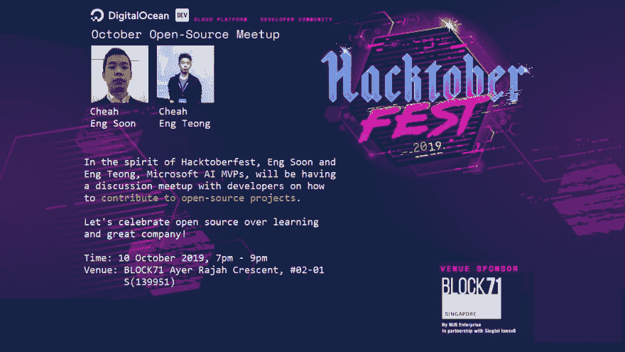

# Hacktoberfest 2019:新加坡 Meetup

> 原文:[https://dev . to/cheahengsoon/hacktoberfest-2019-新加坡-meetup-2me7](https://dev.to/cheahengsoon/hacktoberfest-2019-singapore-meetup-2me7)

[T2】](https://res.cloudinary.com/practicaldev/image/fetch/s--Z0zy8FJv--/c_limit%2Cf_auto%2Cfl_progressive%2Cq_auto%2Cw_880/https://thepracticaldev.s3.amazonaws.com/i/shn5b192q86pvyps6idw.jpg)

# 什么是 HACKTOBERFEST？

由 DigitalOcean 与 DEV 合作举办的 Hacktoberfest 是一个为期一个月的开源软件庆典。

维护者被邀请去引导潜在的贡献者解决有助于项目向前发展的问题，贡献者有机会回馈他们喜欢的项目和他们刚刚发现的其他项目。

没有什么贡献是微不足道的——错误修复和文档更新是有效的参与方式。

# 规则和奖品

首先，在 https://hacktoberfest.digitalocean.com 的 Hacktoberfest 网站上注册。

要获得官方限量版 Hacktoberfest 衬衫，您必须在 10 月 1 日至 31 日期间注册并提出四次拉货请求。

Pull 请求可以针对 GitHub 上的任何公共回购，而不仅仅是那些带有 Hacktoberfest 标签的问题。

如果维护者报告你的拉请求是垃圾邮件或者行为不符合项目的行为准则，你将没有资格参与。

# 事件行为准则

Hacktoberfest 活动是热情、开放和包容的。

请在参加活动前阅读我们的活动行为准则([https://do.co/hacktoberconduct](https://do.co/hacktoberconduct))。

黑客快乐！

**RSVP**@【https://www.meetup.com/AzureSG/events/265122447/ T2】