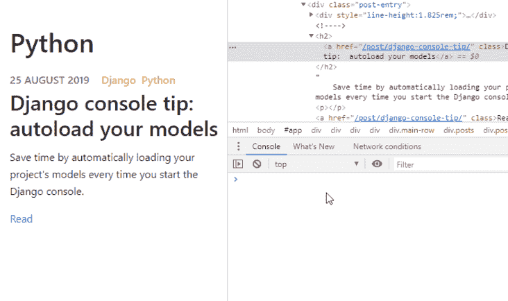
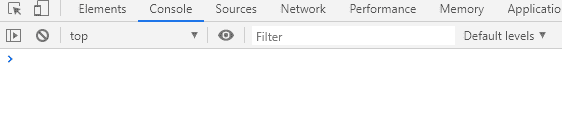
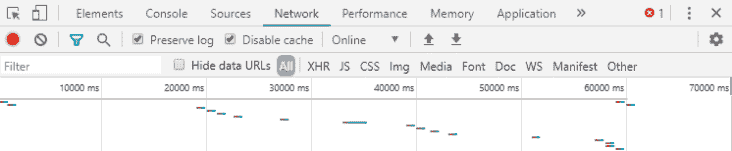
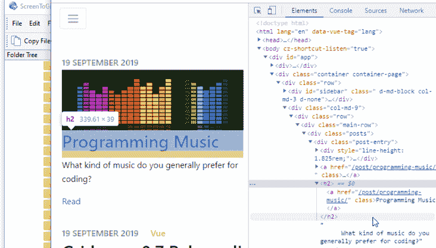
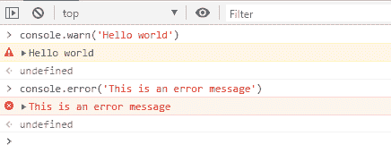
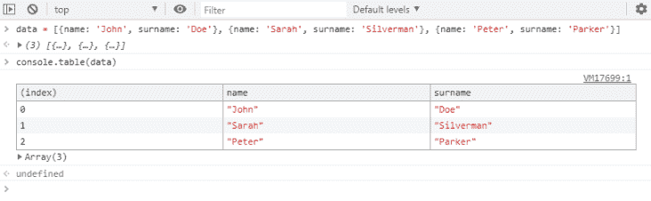
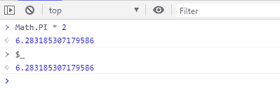
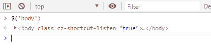
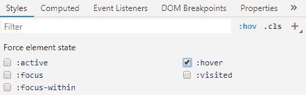

# 模拟缓慢的互联网 Chrome 你可能不知道的东西

> 原文:[https://dev . to/lpellis/things-you-may-not-know-on-chrome-dev tools-53k 6](https://dev.to/lpellis/things-you-may-not-know-about-chrome-devtools-53k6)

> 我几乎每天都在使用 Chrome 开发者工具，但是有一些事情我希望我能早点知道

### 1:轻松获取对任何被检查元素的引用

您可以通过在“elements”视图中右键单击元素，并选择“Store as global variable”，从控制台获取对任何已检查元素的引用。

<figure> 

<figcaption>轻松获得对任何被检查元素的引用</figcaption>

</figure>

### 2:创建固定在控制台上的实时表情

您可以创建一个实时表达式，不断评估并固定在控制台的顶部。这对于观察您知道应该在页面上更新的某些元素非常有用。

<figure>

<figcaption>Chrome 中的直播表情</figcaption>

</figure>

### 3:模拟慢速上网

您可以直接从“网络”选项卡模拟不同的互联网速度。当你的代码需要几秒钟才能加载时，看看它的反应真的很有用。

<figure> 

<figcaption>测试不同的网速</figcaption>

</figure>

### 4:禁用缓存，保留日志

我遇到过许多问题，结果证明根本不是错误，只是错误加载了缓存代码。为了防止这种情况，您可以从网络选项卡关闭所有缓存。(注意，只有当 DevTools 窗口打开时，它才会禁用缓存)

保留日志是另一个有用的功能，当您浏览不同的页面时，它可以防止您的日志/控制台输出被清除。

<figure> 

<figcaption>禁用缓存并保留日志</figcaption>

</figure>

### 5:直接从开发者控制台截图

Chrome devtools 内置了截图工具。要使用它，键入`ctrl+shift+p`(在 devtools 窗口打开的情况下)，然后键入“截图”。

<figure> 

<figcaption>直接从开发者工具中截图</figcaption>

</figure>

### 6:除了 console.log 之外，还有更多日志记录

我们都使用 console.log 进行调试输出，但是您还有更多选择:

> **控制台.警告，控制台.错误**

`console.warn`打印出不同颜色的信息，您可以过滤日志级别。

<figure>

<figcaption>【console . warn】</figcaption>

</figure>

> **控制台.表**

如果你有一个结构化的数据列表，`console.table`会以一个漂亮的表格格式打印出来。

<figure> 

<figcaption>【数据】</figcaption>

</figure>

还有几个如`console.assert`、`console.group`，你可以在这里看到其余的:

### 7: $_ 返回最近求值的表达式

使用`$_`引用控制台上一次执行操作的返回值。

<figure>

<figcaption>$ _</figcaption>

</figure>

### 8: $是 document.querySelector 的快捷方式

您可以使用`$`从控制台中快速选择元素，而不需要 jquery。
同样`$$`是`document.querySelectorAll`的快捷方式

<figure> 

<figcaption></figcaption>

</figure>

### 9:触发样式面板中的悬停或聚焦状态

悬停状态可能很难检查，因为您必须将鼠标移动到元素上，但是有一个简单的方法:在样式下，您可以强制元素样式。

<figure> 

<figcaption>强制某些元素状态</figcaption>

</figure>

### 10:Ctrl+单击查找定义 CSS 属性的位置

有没有想过某个 css 规则到底是在哪里定义的？这很容易找到，你可以简单地在规则上 ctrl+click(在 Mac 上 cmd+click)。

<figure> 

<figcaption>Ctrl+click 带您到定义 css 规则的地方</figcaption>

</figure>

你还有其他的 DevTools 技巧吗？请在评论中告诉我:)

<small>本帖最初发表于[https://loft ie . com/post/things-you-may-not-know-on-chrome-dev tools/](https://loftie.com/post/things-you-may-not-know-about-chrome-devtools/)</small>