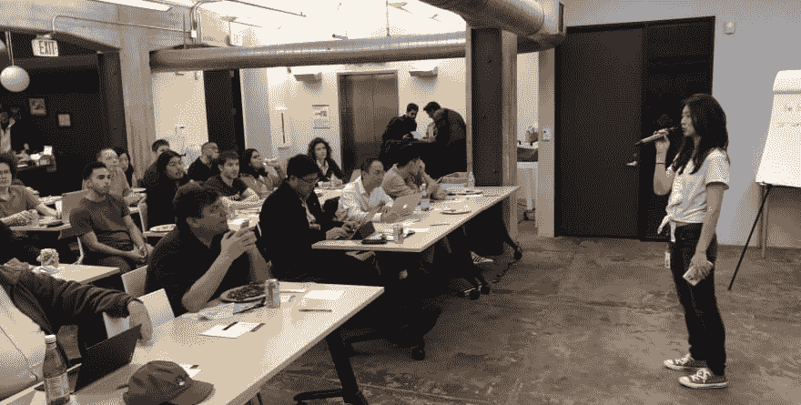
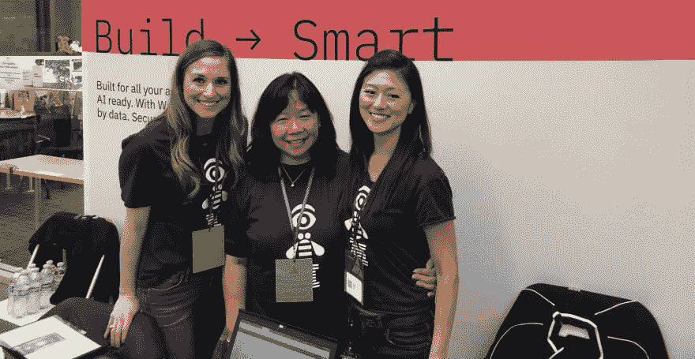
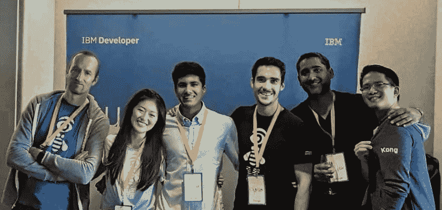
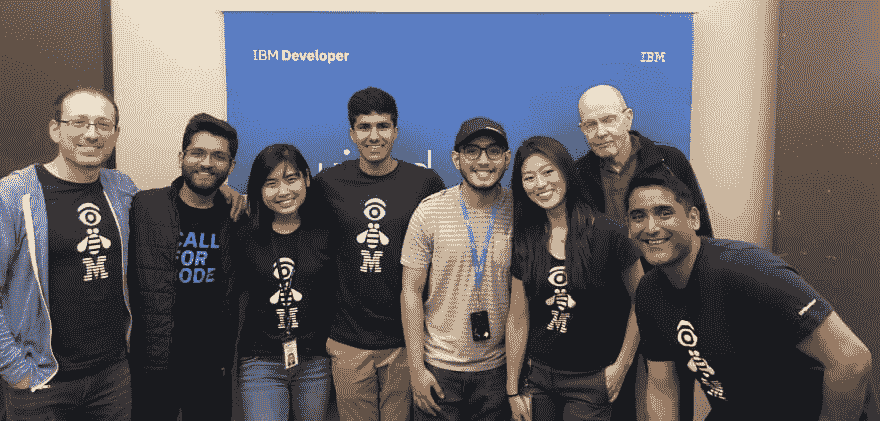

# 让你的 DevRel 团队更有效率:合作与物流策略

> 原文:[https://dev . to/drnugent/make-your-devrel-team-more-efficient-strategies-for-partnerships-logistics-HMC](https://dev.to/drnugent/make-your-devrel-team-more-efficient-strategies-for-partnerships-logistics-hmc)

今天我们采访了 IBM 旧金山开发者关系团队的项目主管 Lisa Jung。Lisa 在过去的一年里一直在提升旧金山团队的效率:虽然我们的开发人员倡导者数量保持不变，但这些活动的数量、规模和效力都有所增加。

## 目录

*   问:你实施了哪些策略来提高效率？
*   问:你如何为你的 meetup 与会者找到内容？
*   问:你如何选择合作伙伴？
*   问:你如何让开发者参与到你的社区中来？
*   问:如何开始构建一个 DevRel 社区？
*   问:如何建立一个全球性的 DevRel 网络？
*   问:你是如何进入开发者关系的？
*   问:DevRel 中谁做得很好？

[T2】](https://res.cloudinary.com/practicaldev/image/fetch/s--afJz7rlI--/c_limit%2Cf_auto%2Cfl_progressive%2Cq_auto%2Cw_880/https://thepracticaldev.s3.amazonaws.com/i/5rmo6wz6t03tl2341x4y.jpg)

### 问:告诉我你在过去 12 个月中在 IBM 使用的战略和战术，以及你如何通过指标来衡量你的成功。

在我加入旧金山城市团队之前，我们会在特定的基础上举行聚会和活动。没有人能预测一个可靠的时间，当他们能接触到我们并向我们学习。我建议我们可以每周安排一次网络研讨会和一次聚会，而不是一周举办四次活动，然后中断几周。自从实施这一战略以来，我们的社区作出了积极回应，并有所发展。从 2018 年 10 月的 5，000 名社区成员开始，我们在第四季度增长了+500，自实施该战略以来，仅前两个季度就增长了+2，100。我们现在有 8000 名社区成员，而且我们在 11 个月内就实现了这一目标！

因此，这种时间安排策略对于衡量标准、团队建设和效率都是有效的。团队中的每个人都共同努力，在季度日历上制定出我们的活动时间表。在个人层面上，我们的开发人员提倡提前了解他们的日程安排:这有助于他们围绕我们的活动进行计划，并有助于防止筋疲力尽。每位倡导者都知道，除了他们独立安排的任何外部活动之外，他们每个月还会参加一次面对面的会议和一次网络研讨会。这给我们的团队以及整个社区带来了很大的稳定性。

顺便说一句，我注意到 meetup 的出席人数也有所增加。一年前，我们会看到一些有三到八名与会者的聚会——当你为场地和食物预算付费时，这可不太好！现在，我们的一些聚会吸引了 50 到 80 名开发者和其他社区成员。我们的月度峰会吸引了多达 150 名与会者！

[T2】](https://res.cloudinary.com/practicaldev/image/fetch/s--KZTTmszF--/c_limit%2Cf_auto%2Cfl_progressive%2Cq_auto%2Cw_880/https://thepracticaldev.s3.amazonaws.com/i/6wpdcbplrnjb7gf3dwbx.jpg)

### 问:你如何为你的 meetup 与会者找到新的有趣的技术内容？

利用我们的合作伙伴关系为我们和其他社区提供了巨大的价值。我们根据合作伙伴的技术和社区人口统计数据来选择合作伙伴，因此，合作伙伴可以谈论人工智能、区块链聊天机器人、无服务器或其他与我们相关的话题。我们还会考察他们社区的规模和活动的频率，看看是否合适。我们知道较小的 meetup 小组可能很难找到演讲者和赞助商，因此我们所有的合作伙伴都有 IBM 专家和食品赞助预算，他们的社区可以接触到他们不会接触到的前沿技术。

通常，我们会通过交叉推广他们的 meetup 来帮助合作伙伴，因此即使他们的出席率较低，我们也会帮助提高出席率，为他们的团队增加曝光率，扩大他们的社区。事实上，他们与 IBM 这样的科技巨头合作也有助于提高我们合作伙伴的可信度。

[T2】](https://res.cloudinary.com/practicaldev/image/fetch/s--9PxIKy4G--/c_limit%2Cf_auto%2Cfl_progressive%2Cq_auto%2Cw_880/https://thepracticaldev.s3.amazonaws.com/i/jergd8pov352z61e3i7c.jpg)

### 问:你如何选择与哪些公司合作，如何有效地进行推销？

有时我们会与那些技术与我们互补的公司合作。然后，我们自己的技术和我们合作伙伴的技术会在彼此的社区中公开，从而提高我们技术的知名度以及团队的知识。我认为这有助于我们的观众理解我们不是一个以产品为中心的群体——因为我们与其他公司合作，我们的议程看起来不是单方面的或以销售为中心的。

### 问:除了我们向老板们报告的冷冰冰的硬数字，科技聚会也是关于社区的。你如何让开发者参与进来，让他们感到受欢迎？

在与开发人员面对面交流时，我是第一线的士兵之一。每当我们制定如何提高与会者参与度的策略时，我经常会提出开发人员在会议中问我的一些问题。开发人员在研讨会期间解决代码问题时提出的问题也很有价值。

真正帮助我们参与和建立信任的一件事是通过我们深入的研讨会与开发人员建立关系。虽然我没有技术背景，但我很擅长记住他们的名字，并让他们快速回答问题——这种类型的互动可以建立信任，并可以在培养积极、不断增长的社区方面发挥很大作用。

在我们的聚会上，我对许多开发人员都直呼其名，他们可能会成为 IBM 最激动的拥护者。看到他们在社交媒体上发布他们所学到的东西，并为我们提供反馈以改进我们的讲座和研讨会，这令人兴奋。

[T2】](https://res.cloudinary.com/practicaldev/image/fetch/s--D6Q2GvJM--/c_limit%2Cf_auto%2Cfl_progressive%2Cq_auto%2Cw_880/https://thepracticaldev.s3.amazonaws.com/i/ggew6knamkqkglkld2u5.jpg)

### 问:对于一个想要开始构建社区的 DevRel 团队，你有什么建议？

关注它的人性方面。如何赢得开发者的心？你如何帮助开发者将你视为盟友？你如何建立一个有机增长的社区？你如何建立一个社区，让开发者可以向你咨询各种各样的问题？你希望你的社区成员以这些方式敞开心扉接近你，而不是对他们说:“我们有最好的技术，去编码吧。”开发人员可以从任何地方获得信息，但是您需要确保营造一种环境，让开发人员可以向您寻求专业知识。

[T2】](https://res.cloudinary.com/practicaldev/image/fetch/s--HClKzW2O--/c_limit%2Cf_auto%2Cfl_progressive%2Cq_auto%2Cw_880/https://thepracticaldev.s3.amazonaws.com/i/bgxtap2liwq9kybvsika.jpg)

### 问:促进全球分布的开发者宣传网络的一些最佳实践是什么？

让我们团队与众不同的一点是，虽然我们是一家大公司的一部分，但我们在战略上的创新方式如此敏捷，以至于我们像一家初创公司一样工作。在公司中有不同的层级，但在我们的团队中，甚至在整个城市中，我们并肩工作，互相帮助快速实现想法，并与全球其他城市团队分享我们的成功。

例如，我们的峰会越来越受欢迎。这是一个受纽约团队启发的想法，但我们通过选择自己的主题、为峰会制定新的日程、从不同部门招募 IBM 演讲人以及其他公司的杰出人士，使之成为我们自己的想法。我们只用了三周时间就组织了第一次峰会，有 300 多名注册者，但由于太受欢迎了，我们不得不停止注册。

现在，其他城市团队和公司对如何在他们的组织中复制这一成功感兴趣，我们能够召开全体会议，分享我们的最佳实践，以帮助实现这一目标。我喜欢这样一个事实，我们可以如此自由地思考想法，知道我们将在团队内部和团队成员的支持下帮助实现这些想法。

### 问:你是如何进入开发者关系这个领域的？

这对我来说是一个全新的领域；不过，我现在做项目管理和事件管理已经八年了。我第一次接触 IBM 是在我在 galplug 工作的时候，帮助 Maya，她当时是 IBM 的执行主管。我参观了她主持的所有研讨会，我的兴趣被激起了。加入 IBM 后，我意识到我们不再关注产品的销售方面，而是帮助开发人员构建适合他们的解决方案，与他们建立信任，并增强社区的能力。我们要在我们的开发者社区中做出巨大的改变，这就是为什么我喜欢从事开发者权益的原因。

[T2】](https://res.cloudinary.com/practicaldev/image/fetch/s--tdZTbx42--/c_limit%2Cf_auto%2Cfl_progressive%2Cq_auto%2Cw_880/https://thepracticaldev.s3.amazonaws.com/i/l9hxek72qsu6b4ojauhz.jpg)

### 问:在 DevRel 社区中，有谁做得特别出色，你想表扬他吗？

Jim Weaver 是 IBM 的 Quantum 开发人员倡导者，他是我有幸与之共事过的最吸引人、最鼓舞人心的开发人员之一。他不仅上演了一场用量子计算机作曲和演奏音乐的精彩演出，还让每一位出席者都感到自己受到了重视。无论他在哪里举办研讨会，你都应该抓住他，因为你会在学习量子计算的同时开怀大笑。

*感谢 Lisa 花时间分享她对开发者关系的看法。*

### 下一步步骤:

*   [在 LinkedIn 上关注 Lisa](https://www.linkedin.com/in/lisa-jung-23304b53/)
*   [加入 meetup 上的 IBM Developer SF group](https://www.meetup.com/IBM-Developer-SF-Bay-Area-Meetup/) ,及时了解我们的网络研讨会和会议。