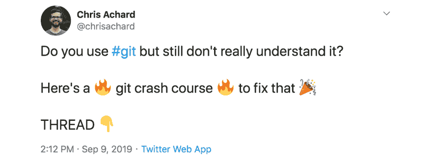
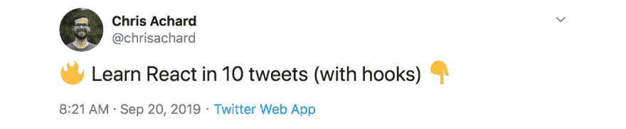
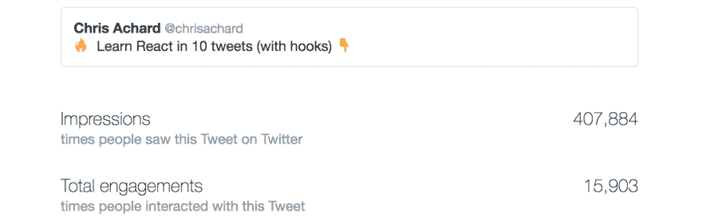

# 我是如何通过教 React 让我的推特粉丝在一个周末增加了三倍的

> 原文:[https://dev . to/chrisachard/how-I-tripled-my-Twitter-following-in-one-weekend-by-teaching-react-44e 5](https://dev.to/chrisachard/how-i-tripled-my-twitter-following-in-one-weekend-by-teaching-react-44e5)

*此文最初发表于此:[https://chrisachard.com/triple-your-twitter-following](https://chrisachard.com/triple-your-twitter-following)T3】*

不，它不涉及垃圾邮件或灰色帽子技术或付费广告。

简短回答:丹·阿布拉莫夫转发了我的一条微博

**长回答:**我非常努力地创作了一些教导人们一些东西的帖子，*然后*丹·阿布拉莫夫转发了其中一个帖子。此外，我整个周末都在推特上直播[对波士顿](https://www.reactboston.com/)的反应，尽管很难说这有什么影响。

这绝对包含了很多运气和时机，但正如[罗布·沃林](https://robwalling.com/)是*的粉丝所说的:“我工作越努力，我就越幸运”*

事情是这样的:

# 最初几个“速成班”线程

周五晚上，我的粉丝不到 700 人。这个数字在几周前还只有 400——但是我一直在制作 twitter 线程，试图教授一个单一的概念，比如 git:

*[https://twitter.com/chrisachard/status/1171124289128554498](https://twitter.com/chrisachard/status/1171124289128554498)*

这些都做得很好。人们似乎喜欢这种形式，我收到了很多关于它如何帮助他们最终理解主题的信息和评论。

此外，我真的很喜欢写这些帖子——试图将这样一个巨大的主题浓缩到几条推文中很有趣，所以这是一个双赢的局面。🎊

*(你可以在这里找到[速成班线程的完整列表)](https://chrisachard.com/crash-courses)*

# 大的那个

然后我决定正面解决 React。我给自己提出的挑战是，在短短的 10 条推文中，教他们如何反应。尝试了几次，花了几天时间才做好，但我终于有了令我骄傲的东西！

这真的是一篇介绍 React 的文章，只有 10 条推文(带有支持图片和代码)，我是在一个周五发布的，就在我飞往 [React 波士顿](https://www.reactboston.com/)之前(顺便说一句，那是一次很棒的会议！)

*[https://twitter.com/chrisachard/status/1175022111758442497](https://twitter.com/chrisachard/status/1175022111758442497)*

它慢慢地开始传播，似乎产生了良好的共鸣！

# 然后就疯了

周六的某个时候，当我在推特上谈论我参加的 React 会议时，我的推特通知开始变得疯狂。

我花了一点时间才弄清楚发生了什么，但随后意识到丹·阿布拉莫夫(Redux 的创造者，脸书 React 团队的一员)转发了 React 的帖子！🎉

(谢谢丹！)

这是我第一次遇到这样的事情，所以看着 Twitter 应用程序放弃通知，停留在“20+”是一种乐趣

到周末结束时(我开始时只有不到 700 名粉丝)，我已经有 2077 个了(而且还在增长！)

*[https://twitter.com/chrisachard](https://twitter.com/chrisachard)*

😲

# 我们能学到什么...

twitter 线程“速成班”的目标一直是在 twitter 上教人们新东西*。*

这是一种由韦斯·博斯、T2、亚当·瓦森和 T4·史蒂夫·舒格推广开来的风格，整个想法就是告诉人们他们在哪里。

我知道，如果我制作了真正好的内容，那么人们会开始注意到我(他们确实注意到了)，但是像这样的任何事情的主要目标必须是**教人们东西**。

# 你也可以做到

所以:确保你的主要目标不是获得追随者(这将自然发生)，而是尽可能多地教授。

过了很久(**年！寻找一种我喜欢制作、其他人也喜欢消费的形式，但我很高兴我坚持了下来。**

创建教导人们复杂主题的内容是一项艰巨的工作，所以要坚持练习！获得反馈，不断迭代，直到找到你也喜欢的格式。

# 推特的触角

到目前为止，这条微博已经有超过 400，000 次点击，超过 15，000 次参与:

[T2】](https://twitter.com/chrisachard/status/1175022111758442497)

Twitter 有多大，有多少利基市场，这仍然让我大吃一惊。🤯

那么你想教什么呢？

# 接下来是什么

嗯，我已经计划了大约 10 个速成班...但现在我真的要双倍下注了。💯

做得最好的线程是那些花费最多时间生产的线程(所以我已经准备好了！)，但这绝对是值得的——这显然是人们喜欢学习的格式，而且很有帮助(基于我收到的所有评论)。

如果你想跟上课程进度，那么你显然应该[在 twitter 上关注我](https://twitter.com/chrisachard)😄

而且:我鼓励你也教授你所知道的东西！

这很难，但却是值得的——而且这是我所知道的唯一能持续增加你的追随者的方法(如果你喜欢这类事情的话)。

祝你好运——如果你成功了，记得给我贴标签！我去看看😊

**喜欢这个帖子？**

你可以在 twitter 上关注我，了解更多信息😄: [@chrisachard](https://twitter.com/chrisachard)
或加入我的快讯:[https://chrisachard.com/newsletter/](https://chrisachard.com/newsletter/)

感谢阅读！