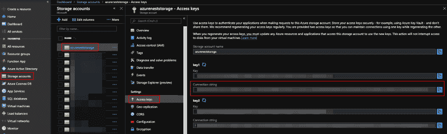

# 为 NestJS 引入 NoSQL Azure 表存储🚀

> 原文:[https://dev . to/azure/introducing-no SQL-azure-table-storage-for-nestjs-291m](https://dev.to/azure/introducing-nosql-azure-table-storage-for-nestjs-291m)

> 原载于 [Trilon 博客](https://trilon.io/blog/nestjs-nosql-azure-table-storage)2019 . 9 . 17。

在本文中，我们将通过新的`@nestjs/azure-database`库，在几分钟内了解如何将 Azure 表存储添加到我们的 NestJS 应用程序中！

如果您不熟悉 [NestJS](https://nestjs.com/) ，它是一个 TypeScript Node.js 框架，可以帮助您构建企业级高效且可伸缩的 Node.js 应用程序。

# [](#whats-azure-table-storage)什么是 Azure 表储？

[Azure Table Storage](http://bit.ly/2lMRQQh) 是一家 NoSQL 键值存储，使用大量半结构化数据集。

表存储允许您创建需要灵活数据模式的大规模可伸缩应用程序。您还可以执行基于 OData 的查询，并使用 JSON 来序列化数据。

使用 Azure 表存储来存储数 Pb 的半结构化数据，并保持低成本。

与许多数据存储不同——内部或基于云的:

*   表存储使您无需手动分割数据集即可进行扩展。
*   可用性也不是一个问题！
*   使用地理冗余存储，存储的数据在一个区域内复制三次，在数百英里外的另一个区域再复制三次。

让我们深入研究如何在 NestJS 应用程序中使用表存储！

# [](#getting-setup)获取设置

> *注意*:在本次演示中，我们将展示一个由 CLI 生成的新的 NestJS 应用程序，但是如果您喜欢使用现有的 NestJS 应用程序，请随意，直接跳过！

## [](#generate-a-new-nestjs-application)生成新的 NestJS 应用程序

出于演示目的，让我们确保安装了最新的 NestJS CLI 并创建一个新的应用程序。

```
$ npm i -g @nestjs/cli
$ nest new PROJECT_NAME 
```

<svg width="20px" height="20px" viewBox="0 0 24 24" class="highlight-action crayons-icon highlight-action--fullscreen-on"><title>Enter fullscreen mode</title></svg> <svg width="20px" height="20px" viewBox="0 0 24 24" class="highlight-action crayons-icon highlight-action--fullscreen-off"><title>Exit fullscreen mode</title></svg>

现在让我们进入新创建的目录并打开我们的 IDE。至此，我们已经生成了一个简单的 NestJS 应用程序。

## [](#setting-up-an-azure-storage-account)设置 Azure 存储帐户

为了使用[表存储](http://bit.ly/2lMRQQh)，我们需要创建一个 Azure 存储帐户。你可以按照这个[一步一步的指引](http://bit.ly/2mvqkHq)。

创建存储帐户后，我们需要复制将用于 SDK 的连接字符串。在 [Azure 门户](https://portal.azure.com/)中，进入仪表板>存储>您的存储账户:

[T2】](https://res.cloudinary.com/practicaldev/image/fetch/s--ZSnR_ql_--/c_limit%2Cf_auto%2Cfl_progressive%2Cq_auto%2Cw_880/https://thepracticaldev.s3.amazonaws.com/i/1276n6osvvj71btuuoju.png)

记下在“设置”选项卡下的“访问密钥”中获得的“存储帐户名称”和“连接字符串”。

> 提示:连接字符串应该以`DefaultEndpointsProtocol=`开头

# [](#nestjs-azure-storage-installation)NestJS Azure 存储安装

接下来，我们需要安装来自 NPM 的`@nestjs/azure-database`SDK:

```
$ npm i --save @nestjs/azure-database dotenv 
```

<svg width="20px" height="20px" viewBox="0 0 24 24" class="highlight-action crayons-icon highlight-action--fullscreen-on"><title>Enter fullscreen mode</title></svg> <svg width="20px" height="20px" viewBox="0 0 24 24" class="highlight-action crayons-icon highlight-action--fullscreen-off"><title>Exit fullscreen mode</title></svg>

> 我们还安装了`dotenv`包，允许我们处理环境变量。

然后，我们将创建一个名为。env 包含以下内容:

```
AZURE_STORAGE_CONNECTION_STRING="<the connection string we copied from previous step>" 
```

<svg width="20px" height="20px" viewBox="0 0 24 24" class="highlight-action crayons-icon highlight-action--fullscreen-on"><title>Enter fullscreen mode</title></svg> <svg width="20px" height="20px" viewBox="0 0 24 24" class="highlight-action crayons-icon highlight-action--fullscreen-off"><title>Exit fullscreen mode</title></svg>

*同样非常重要的是:我们将确保把我们的`.env`文件添加到`.gitignore`中！在 Git 上不能对`.env`文件进行版本控制。*

一旦`.env`文件被创建并准备好，我们将包含下面对`src/main.ts`文件的调用:

```
if (process.env.NODE_ENV !== 'production') require('dotenv').config(); 
```

<svg width="20px" height="20px" viewBox="0 0 24 24" class="highlight-action crayons-icon highlight-action--fullscreen-on"><title>Enter fullscreen mode</title></svg> <svg width="20px" height="20px" viewBox="0 0 24 24" class="highlight-action crayons-icon highlight-action--fullscreen-off"><title>Exit fullscreen mode</title></svg>

> 提示:这一行必须添加到`src/main.ts`文件中任何其他导入之前的*！*

我们的设置现在准备好了。让我们实现应用程序的逻辑。

# [](#preparing-our-business-logic)准备我们的业务逻辑

NestJS 中的 Azure 表存储支持遵循对象关系映射(ORM)设计模式，这基本上是一种从我们的代码访问数据库的“结构化”方式——让您使用 API 而不是编写实际的 SQL 代码。

为了实现这种设计模式，我们需要为每个特性创建以下组件:

*   `DTO`(或数据传输对象)
    *   这是表示我们数据的对象。DTO 主要用于在应用程序服务之间传输数据，例如 HTTP 服务和浏览器之间的数据传输。
*   `Entity`
    *   这基本上是一个映射到表模式的类。
*   `Repository`
    *   这是负责与数据库通信的组件。

让我们首先创建一个 NestJS 特性模块，我们将在其中托管我们的特性业务逻辑。我们将使用 NestJS CLI 创建一个`Cat`特性:

```
$ nest generate module cat 
```

<svg width="20px" height="20px" viewBox="0 0 24 24" class="highlight-action crayons-icon highlight-action--fullscreen-on"><title>Enter fullscreen mode</title></svg> <svg width="20px" height="20px" viewBox="0 0 24 24" class="highlight-action crayons-icon highlight-action--fullscreen-off"><title>Exit fullscreen mode</title></svg>

> 注意:我们将在过程的最后回到我们生成的模块。

## [](#dto)DTO

我们需要为我们的`Cat`特性创建的第一个组件是一个 d to。在名为`cat.dto.ts`的文件中，我们创建了下面的类:

```
export class CatDTO {
  name: string;
  age: number;
} 
```

<svg width="20px" height="20px" viewBox="0 0 24 24" class="highlight-action crayons-icon highlight-action--fullscreen-on"><title>Enter fullscreen mode</title></svg> <svg width="20px" height="20px" viewBox="0 0 24 24" class="highlight-action crayons-icon highlight-action--fullscreen-off"><title>Exit fullscreen mode</title></svg>

## [](#entity)实体

接下来，我们需要一个`Entity`。为此，我们创建一个名为`cat.entity.ts`的文件，并使用`@nestjs/azure-database`提供的装饰器来描述模型:

| 实体 | 代表 | 需要 |
| --- | --- | --- |
| `@EntityPartitionKey(value: string)` | 实体的`PartitionKey` | 是 |
| `@EntityRowKey(value: string)` | 实体的`RowKey` | 是 |
| `@EntityInt32(value?: string)` | 有符号 32 位整数值 |  |
| `@EntityInt64(value?: string)` | 有符号 64 位整数值 |  |
| `@EntityBinary(value?: string)` | 二进制(blob)数据 |  |
| `@EntityBoolean(value?: string)` | `true`或`false`值 |  |
| `@EntityString(value?: string)` | 字符数据 |  |
| `@EntityDouble(value?: string)` | 精度为 15 位的浮点数 |  |
| `@EntityDateTime(value?: string)` | 一天中的时间 |  |

> **注意:**API 在稳定版本中可能会略有变化。

例如，以下实体的形状:

```
import {
  EntityPartitionKey,
  EntityRowKey,
  EntityString,
  EntityIn32
} from '@nestjs/azure-database';

@EntityPartitionKey('CatID')
@EntityRowKey('CatName')
export class Cat {
  @EntityString() name: string;
  @EntityIn32() age: number;
} 
```

<svg width="20px" height="20px" viewBox="0 0 24 24" class="highlight-action crayons-icon highlight-action--fullscreen-on"><title>Enter fullscreen mode</title></svg> <svg width="20px" height="20px" viewBox="0 0 24 24" class="highlight-action crayons-icon highlight-action--fullscreen-off"><title>Exit fullscreen mode</title></svg>

`Cat`实体将被自动转换为 Azure 表存储所期望的以下模式:

```
{  "PartitionKey":  {  "_":  "CatID",  "$":  "Edm.String"  },  "RowKey":  {  "_":  "CatName",  "$":  "Edm.String"  },  "name":  {  "_":  undefined,  "$":  "Edm.String"  },  "age":  {  "_":  undefined,  "$":  "Edm.Int32"  }  } 
```

<svg width="20px" height="20px" viewBox="0 0 24 24" class="highlight-action crayons-icon highlight-action--fullscreen-on"><title>Enter fullscreen mode</title></svg> <svg width="20px" height="20px" viewBox="0 0 24 24" class="highlight-action crayons-icon highlight-action--fullscreen-off"><title>Exit fullscreen mode</title></svg>

## [](#repository)储存库

在 DTO 和实体之后，我们现在需要创建一个`Cat`服务，它将抽象与`Cat`实体相关的所有 CRUD 操作。这个服务将使用 Azure Table 存储`Repository`。

让我们使用 NestJS CLI 创建一个服务:

```
$ nest generate service cat 
```

<svg width="20px" height="20px" viewBox="0 0 24 24" class="highlight-action crayons-icon highlight-action--fullscreen-on"><title>Enter fullscreen mode</title></svg> <svg width="20px" height="20px" viewBox="0 0 24 24" class="highlight-action crayons-icon highlight-action--fullscreen-off"><title>Exit fullscreen mode</title></svg>

在创建的`cat.service.ts`中，我们导入`Repository`并为其提供上一步创建的`Cat`实体定义:

```
import { Injectable } from '@nestjs/common';
import { Repository, InjectRepository } from '@nestjs/azure-database';
import { Cat } from './cat.entity';

@Injectable()
export class CatService {
  constructor(
    @InjectRepository(Cat)
    private readonly catRepository: Repository<Cat>,
  ) {}

  // ... other code ... 
```

<svg width="20px" height="20px" viewBox="0 0 24 24" class="highlight-action crayons-icon highlight-action--fullscreen-on"><title>Enter fullscreen mode</title></svg> <svg width="20px" height="20px" viewBox="0 0 24 24" class="highlight-action crayons-icon highlight-action--fullscreen-off"><title>Exit fullscreen mode</title></svg>

Azure Table Storage `Repository`接口提供了一堆公共 API 和类型，用于管理各种 CRUD ( `Create`、`Read`、`Update`和`Delete`)操作。让我们看看如何使用`@nestjs/azure-database` SDK 实现每个不同的操作。

## [](#the-methods-we-will-be-invoking-are-the-following)我们将调用的方法如下:

*   `create(entity: T): Promise<T>`创建新实体。
*   `findAll(tableQuery?: azure.TableQuery, currentToken?: azure.TableService.TableContinuationToken): Promise<AzureTableStorageResultList<T>>`查找与给定查询匹配的所有实体(如果没有提供查询，则返回所有实体)。
*   `find(rowKey: string, entity: Partial<T>): Promise<T>`使用行键查找一个实体。
*   `update(rowKey: string, entity: Partial<T>): Promise<T>`更新一个实体。这将进行部分更新。
*   `delete(rowKey: string, entity: T): Promise<AzureTableStorageResponse>`使用实体的行键删除实体。

### [](#here-is-an-example-of-such-implementation)下面是这样一个实现的例子:

```
import { Injectable } from '@nestjs/common';
import { Repository, InjectRepository } from '@nestjs/azure-database';
import { Cat } from './cat.entity';

@Injectable()
export class CatService {
  constructor(
    @InjectRepository(Cat)
    private readonly catRepository: Repository<Cat>,
  ) {}

  // find one cat entitu by its rowKey
  async find(rowKey: string, cat: Cat): Promise<Cat> {
    return this.catRepository.find(rowKey, cat);
  }

  // find all cat entities
  async findAll(): Promise<AzureTableStorageResultList<Cat>> {
    return this.catRepository.findAll();
  }

  // create a new cat entity
  async create(cat: Cat): Promise<Cat> {
    return this.catRepository.create(cat);
  }

  // update the a cat entity by its rowKey
  async update(rowKey: string, cat: Partial<Cat>): Promise<Cat> {
    return this.catRepository.update(rowKey, cat);
  }

  // delete a cat entity by its rowKey
  async delete(rowKey: string, cat: Cat): Promise<AzureTableStorageResponse> {
    return this.catRepository.delete(rowKey, cat);
  }
} 
```

<svg width="20px" height="20px" viewBox="0 0 24 24" class="highlight-action crayons-icon highlight-action--fullscreen-on"><title>Enter fullscreen mode</title></svg> <svg width="20px" height="20px" viewBox="0 0 24 24" class="highlight-action crayons-icon highlight-action--fullscreen-off"><title>Exit fullscreen mode</title></svg>

## [](#controller)控制器

最后一步是实现处理 HTTP 请求的 NestJS 控制器。让我们使用 NestJS CLI 创建这样一个控制器:

```
$ nest generate controller cat 
```

<svg width="20px" height="20px" viewBox="0 0 24 24" class="highlight-action crayons-icon highlight-action--fullscreen-on"><title>Enter fullscreen mode</title></svg> <svg width="20px" height="20px" viewBox="0 0 24 24" class="highlight-action crayons-icon highlight-action--fullscreen-off"><title>Exit fullscreen mode</title></svg>

控制器的实现很简单，可能取决于您的应用程序业务需求。下面是一个实现的例子:

```
import {
  Body,
  Controller,
  Delete,
  Get,
  Param,
  Post,
  Put,
  UnprocessableEntityException,
  NotFoundException,
  Patch
} from '@nestjs/common';
import { CatDto } from './cat.dto';
import { Cat } from './cat.entity';
import { CatService } from './cat.service';

@Controller('cats')
export class CatController {
  constructor(private readonly catService: CatService) {}

  @Get()
  async getAllCats() {
    return await this.catService.findAll();
  }

  @Get(':rowKey')
  async getCat(@Param('rowKey') rowKey) {
    try {
      return await this.catService.find(rowKey, new Cat());
    } catch (error) {
      // Entity not found
      throw new NotFoundException(error);
    }
  }

  @Post()
  async createCat(
    @Body()
    catData: CatDto,
  ) {
    try {
      const cat = new Cat();
      // Disclaimer: Assign only the properties you are expecting!
      Object.assign(cat, catData);

      return await this.catService.create(cat);
    } catch (error) {
      throw new UnprocessableEntityException(error);
    }
  }

  @Put(':rowKey')
  async saveCat(@Param('rowKey') rowKey, @Body() catData: CatDto) {
    try {
      const cat = new Cat();
      // Disclaimer: Assign only the properties you are expecting!
      Object.assign(cat, catData);

      return await this.catService.update(rowKey, cat);
    } catch (error) {
      throw new UnprocessableEntityException(error);
    }
  }

  @Patch(':rowKey')
  async updateCatDetails(@Param('rowKey') rowKey, @Body() catData: Partial<CatDto>) {
    try {
      const cat = new Cat();
      // Disclaimer: Assign only the properties you are expecting!
      Object.assign(cat, catData);

      return await this.catService.update(rowKey, cat);
    } catch (error) {
      throw new UnprocessableEntityException(error);
    }
  }

  @Delete(':rowKey')
  async deleteDelete(@Param('rowKey') rowKey) {
    try {
      const response = await this.catService.delete(rowKey, new Cat());

      if (response.statusCode === 204) {
        return null;
      } else {
        throw new UnprocessableEntityException(response);
      }
    } catch (error) {
      throw new UnprocessableEntityException(error);
    }
  }
} 
```

<svg width="20px" height="20px" viewBox="0 0 24 24" class="highlight-action crayons-icon highlight-action--fullscreen-on"><title>Enter fullscreen mode</title></svg> <svg width="20px" height="20px" viewBox="0 0 24 24" class="highlight-action crayons-icon highlight-action--fullscreen-off"><title>Exit fullscreen mode</title></svg>

# [](#putting-everything-together)把一切放在一起

我们已经完成了`Cat`特性的实现。在最后一步中，我们需要将`AzureTableStorageModule`导入到我们之前创建的嵌套特性模块`cat.module.ts`中:

```
import { Module } from '@nestjs/common';
import { AzureTableStorageModule } from '@nestjs/azure-database';
import { CatController } from './cat.controller';
import { CatService } from './cat.service';
import { Cat } from './cat.entity';

@Module({
  imports: [AzureTableStorageModule.forFeature(Cat)],
  providers: [CatService],
  controllers: [CatController],
})
export class CatModule {} 
```

<svg width="20px" height="20px" viewBox="0 0 24 24" class="highlight-action crayons-icon highlight-action--fullscreen-on"><title>Enter fullscreen mode</title></svg> <svg width="20px" height="20px" viewBox="0 0 24 24" class="highlight-action crayons-icon highlight-action--fullscreen-off"><title>Exit fullscreen mode</title></svg>

`AzureTableStorageModule`模块接受几个可选参数:

```
AzureTableStorageModule.forFeature(Cat, {
  table: 'AnotherTableName',
  createTableIfNotExists: true,
}) 
```

<svg width="20px" height="20px" viewBox="0 0 24 24" class="highlight-action crayons-icon highlight-action--fullscreen-on"><title>Enter fullscreen mode</title></svg> <svg width="20px" height="20px" viewBox="0 0 24 24" class="highlight-action crayons-icon highlight-action--fullscreen-off"><title>Exit fullscreen mode</title></svg>

*   `table: string`:表格的名称。如果没有提供，Cat 实体的名称将被用作表名
*   `createTableIfNotExists: boolean`:如果不存在，是否自动创建表格:
    *   如果`true`将在应用程序启动时创建表格。
    *   如果`false`不创建表格。**在查询之前，您必须自己创建表格！**

# [](#in-conclusion)总之

我们刚刚为我们的应用程序实现了一个新的`Cat`特性，它使用`@nestjs/azure-database`官方包来添加对 Azure 表存储的支持。有了 NestJS 的模块化系统，我们就可以像安装一个本地的 Nest 特性一样安装和设置我们的应用程序。

如果你有兴趣了解更多关于使用 Azure 的无服务器 NestJS 应用程序的信息，请点击这里阅读更多信息。

##  [ nestjs ](https://github.com/nestjs) / [蔚蓝-数据库](https://github.com/nestjs/azure-database)

### 嵌套框架(node.js) ☁️的 Azure 数据库(表存储等)模块

<article class="markdown-body entry-content container-lg" itemprop="text">

[T2】](http://nestjs.com/)

一个渐进的 [Node.js](http://nodejs.org) 框架，用于构建高效且可伸缩的服务器端应用。

[](https://www.npmjs.com/~nestjscore)[](https://www.npmjs.com/~nestjscore)[](https://www.npmjs.com/~nestjscore)[](https://travis-ci.org/nestjs/nest)[](https://travis-ci.org/nestjs/nest)[](https://coveralls.io/github/nestjs/nest?branch=master)[](https://discord.gg/G7Qnnhy)[](https://opencollective.com/nest#backer)[](https://opencollective.com/nest#sponsor)[](https://paypal.me/kamilmysliwiec)[](https://twitter.com/nestframework)

## 描述

用于 [Nest](https://github.com/nestjs/nest) 框架(node.js)的 Azure 数据库([表存储](http://bit.ly/nest_azure-storage-table)、 [Cosmos DB](https://azure.microsoft.com/en-us/services/cosmos-db/) 等)模块

## 辅导的

了解如何开始使用用于 NestJS 的 Azure 表存储

## 安装前

用于桌子存储

1.  创建存储帐户和资源([阅读更多信息](http://bit.ly/nest_new-azure-storage-account)
2.  对于[表存储](http://bit.ly/nest_azure-storage-table)，在 [Azure 门户](https://portal.azure.com)中，进入**仪表盘>存储> *你的-存储-账户*** 。
3.  记下在**设置**选项卡下的**访问键**处获得的“存储帐户名”和“连接字符串”。

对于 Cosmos DB

1.  创建一个 Cosmos DB 帐户和资源([阅读更多信息](https://azure.microsoft.com/en-us/services/cosmos-db/)
2.  对于[宇宙数据库](http://bit.ly/nest_azure-storage-table)，在 [Azure 门户](https://portal.azure.com)，进入**仪表盘> Azure 宇宙数据库>*your-Cosmos-DB-account***。
3.  记下在**设置**选项卡下的**键**处获得的“URI”和“主键”。

## 装置

```
$ npm i --save @nestjs/azure-database
```

<svg width="20px" height="20px" viewBox="0 0 24 24" class="highlight-action crayons-icon highlight-action--fullscreen-on"><title>Enter fullscreen mode</title></svg> <svg width="20px" height="20px" viewBox="0 0 24 24" class="highlight-action crayons-icon highlight-action--fullscreen-off"><title>Exit fullscreen mode</title></svg>

## 使用

### 对于 Azure 表存储支持

1.  创建或更新您现有的…

</article>

[View on GitHub](https://github.com/nestjs/azure-database)