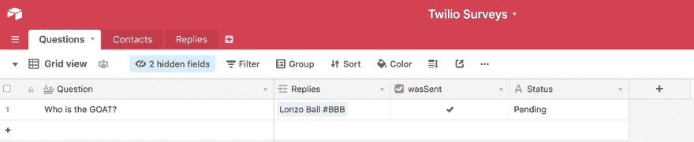
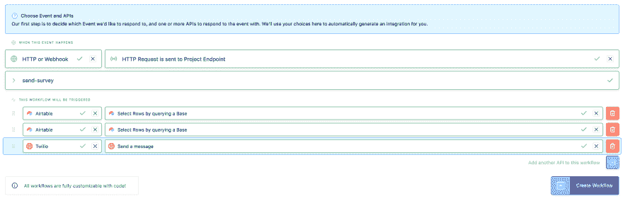
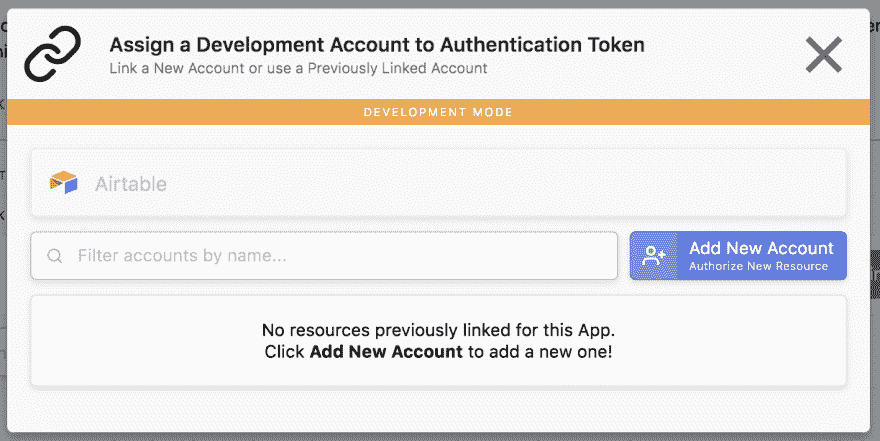
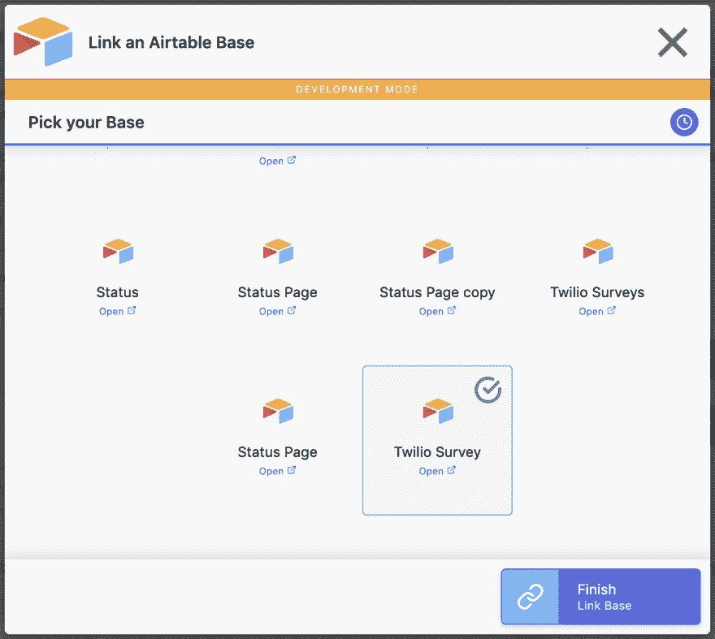
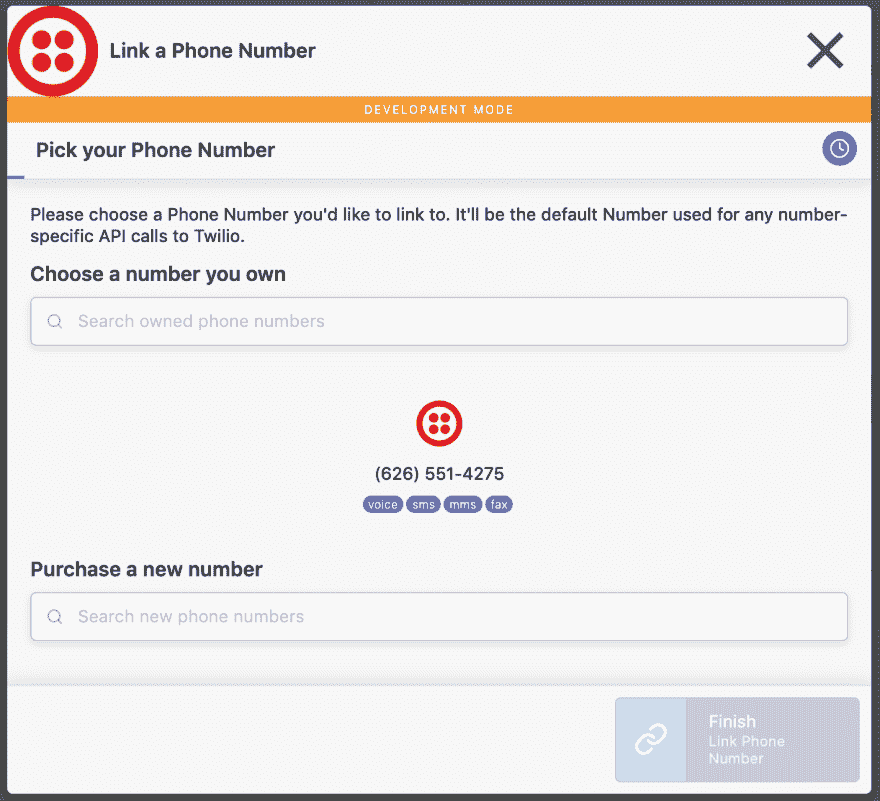
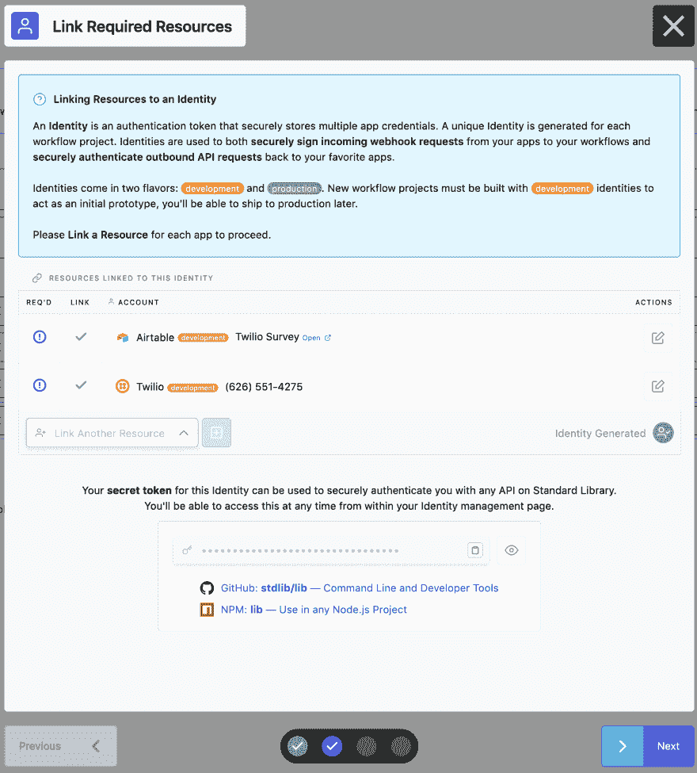
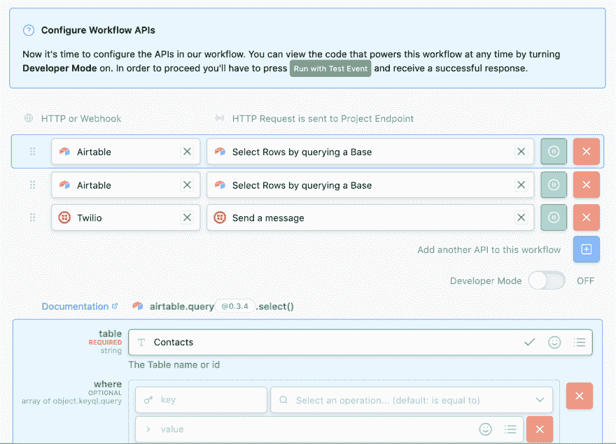
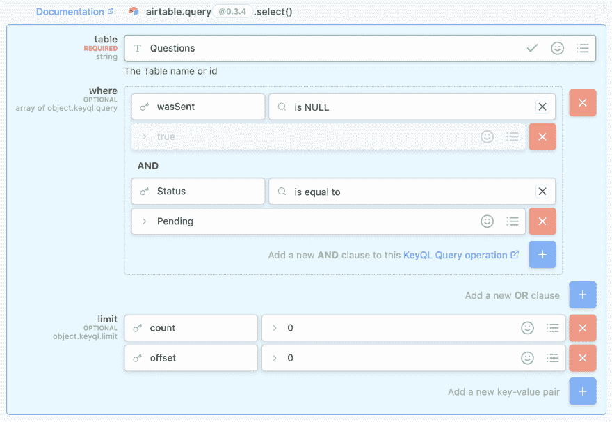
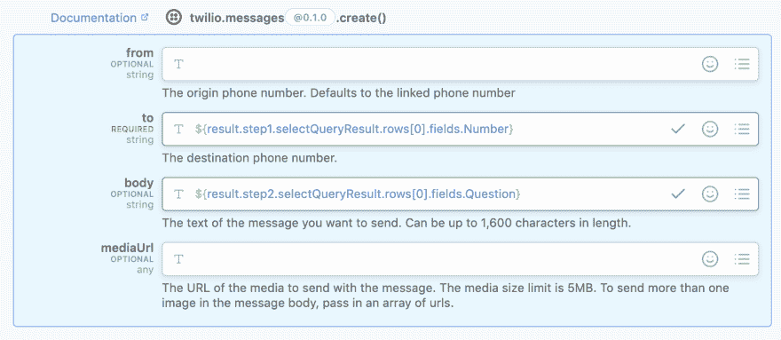
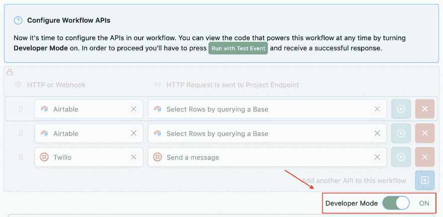

# 用 Twilio + Airtable 在标准库上构建一个应用程序来发送短信调查

> 原文：<https://dev.to/stdlibhq/build-an-app-to-send-sms-surveys-with-twilio-airtable-on-standard-library-39ch>

我们生活在一个协作和团队合作的时代。这意味着在这个时代，即使是最简单的任务(比如订午餐)也经常被提交到委员会投票。值得庆幸的是，我们的时代也是一个伟大的技术成就的时代，也许没有比使用投票和调查更好的方式来达成共识。今天我们将看看如何使用[构建标准库](https://build.stdlib.com/)来部署一个快速易用的投票应用程序，该程序使用你的 [Twilio](https://twilio.com/) 号码向你的群组发送短信，然后在一个方便的 [Airtable](https://airtable.com/) 库中记录他们的回复。

# 你事先需要什么

1x Airtable 账户—[https://www.airtable.com](https://www.airtable.com)
1x Twilio 账户—[https://www.twilio.com](https://www.twilio.com)T5】1x 标准库账户—[https://www.stdlib.com](https://www.stdlib.com)

# 第一步:设置 Airtable

我们要做的第一件事是建立我们的 Airtable 基础，以便它准备好开始接收数据。如果您是新用户，请通过[访问此链接](https://www.airtable.com/)注册一个帐户，然后[单击此处将我们的基础模板添加到您的 Airtable 工作区](https://airtable.com/addBaseFromShare/shrf3W1JpexdDzfio)。您应该会看到一个类似上面截图的基础，但是没有已经填充的极化问题。如您所见，我们的库有三个表，其中两个需要您的一些输入，另一个将完全由标准库填充。让我们仔细看看每个表负责跟踪什么。

**问题**—此表记录您当前和过去的问题。问题放在第一列，其他列将由我们的应用程序处理

**联系人** —这将是您所在小组成员的列表。这里唯一的必填字段是电话号码(*国家代码* + *地区代码* + *电话号码*)。例如 14155309876)。名称字段是可选的

**回复** —该表将完全由我们的应用程序填充。它存储返回的文本消息，以及谁发送了回复，以及回复是针对哪个问题的

出于本教程的考虑，您将需要在联系人表中添加至少一个号码(我建议使用您自己的手机号码进行测试)，并在问题表中添加一个问题(如果您愿意，可以随意继续山羊辩论)。现在基础已经建立，让我们开始我们在标准库上的工作流程！

# 第二步:在标准库上构建你的工作流

如果你还没有这样做，给自己弄一个[标准图书馆账户](https://www.stdlib.com/)(这是免费的！)然后前往 https://build.stdlib.com 的，开始构建你的工作流程。对于这个项目，我们希望通过访问一个 URL 来触发我们的调查，因此在**下，当这个事件发生时**选择 **HTTP 或 Webhook** 作为您的事件，并继续输入以下选项:

**当此事件发生时**

HTTP 或 Webhook → HTTP 请求被发送到项目端点→ **send-survey**

**该工作流将被触发**

*   Airtable →通过查询基数选择行

*   Airtable →通过查询基数选择行

*   Twilio →发送消息

 您现在可以点击创建工作流了！

# 第三步:联系你的资源

下一步是将你的 Twilio 和 Airtable 账户与 Standard Library 上的一个身份联系起来。对于那些不熟悉的人来说，链接标准库上的资源允许你安全地设置你的帐户一次，然后使它们在你的所有工作流程中对你可用。先来链接一个 Airtable 账号，选择一个基数。点击**链接资源**按钮，出现以下画面:
 如果您之前已经链接了 Airtable 基地，它们会出现在这里。

如果这是您第一次链接 Airtable 帐户，请单击**添加新帐户**按钮，并在以下屏幕上输入显示名称。您还需要[从 Airtable](https://www.airtable.com/account) 中检索您的 API 密钥，并将其包含在这里。它应该是这样的:

 点击完成，继续选择你的基地！

现在你将进入一个屏幕，显示你所有的碱基。从我们的模板 **Twilio Survey** 中选择您之前添加的那个，然后点击**完成【链接库】。**

 你所有的空军基地清单。

这就解决了 Airtable 的问题，所以现在您可以将一个 Twilio 编号链接到您的项目。该过程起初看起来与 Airtable 过程非常相似，您将看到相同的弹出屏幕，要求您**添加新帐户**或**链接新资源**，这取决于您过去是否在标准库上使用过 Twilio。如果您在此处看到一个您希望用于该项目的数字，请点击绿色的**选择**按钮，并进入下一步。

如果您还没有链接的号码，请点击**添加新账户**或**链接新资源。**加载屏幕结束后，您应该会看到如下内容:

 在标准库上购买的 Twilio 号码会在这里显示出来。

**注意:**如果您有在标准图书馆之外的 Twilio 上购买的号码，您会注意到它们不在此屏幕上。这就是 Twilio Connect 应用程序工作的结果。要了解更多关于 Twilio Connect 应用和子账户的信息，[请点击此处](https://support.twilio.com/hc/en-us/articles/223135007-What-is-Twilio-Connect-)。

现在，您可以选择以前通过标准库购买的链接号码，也可以购买新号码用于此项目。完成后，点击蓝色的**完成【链接电话号码】**按钮，您将看到以下内容:

 用你的**身份生成**你现在可以点击**下一步**按钮。

# 第 4 部分:设置您的工作流程

在下面的屏幕中，我们将配置之前选择的工作流 API。我们将从最初的查询开始。当界面要求填写**【表格】**时，填写**【联系人】**。将所有其他字段留空，因为我们希望查询返回表中的所有数字。您的窗口现在应该看起来像这样:

 我们的第一个查询抓取了我们联系人表中的所有号码。

现在单击我们工作流第二行旁边的六个点，这表示 **Airtable →通过查询基数选择行。**您将看到一个新的空白查询。请填写以下内容:

*   表格→ **问题**

*   其中→键:**wasSent**→select:is**NULL**

*   点击**旁边的**蓝色加号**向这个 KeyQL 查询操作添加一个新的 AND 子句**

在这个新框中，输入:其中→键:**状态** →选择:**等于** →输入:**待定**

 为符合条件的问题搜索问题。

接下来，点击对话框顶部 **Twilio** 左边的六个点。我们可以选择在这里输入最多四个值，但是我们只需要两个。在“至:”字段中，输入:

`${result.step1.selectQueryResult.rows[0].fields.Number}`

然后，在正文:字段中输入:

`${result.step2.selectQueryResult.rows[0].fields.Question}`

 这样设置 Twilio 的工作流程。

单击对话框底部的绿色 **Run with Test Event** 按钮，您应该会收到一条文本，其中包含您输入到 Airtable 中的问题。如果你做了，那么它正在工作！

虽然可以在构建界面中完成我们需要做的大部分工作，但是我们需要对代码进行一些定制，以存储多个查询的结果(如果我们的 Contacts 表有多个号码怎么办？).为了做所有这些事情，我们需要通过将**开发者模式**按钮切换到**打开来简单地了解一下构建。**[T6】](https://res.cloudinary.com/practicaldev/image/fetch/s--zhkMiBX9--/c_limit%2Cf_auto%2Cfl_progressive%2Cq_auto%2Cw_880/https://miro.medium.com/max/3128/1%2AqyP-TxAkMlJmsCDVDw4org.png)

在这里，你可以看到你所有辛勤工作的幕后成果。这是由我们的工作流程生成的代码。用下面的代码片段替换这里的所有内容。