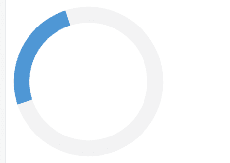
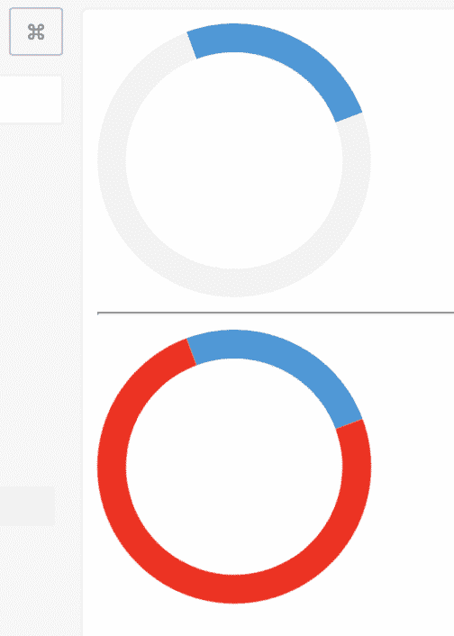

# 样式用样式化组件反应组件:第 2 部分

> 原文：<https://dev.to/destro_mas/style-react-component-with-styled-components-part-2-3d78>

在我之前的文章[中，我写了我们如何开始使用`styled-components`，并用它创建了一个旋转组件。](https://dev.to/destro_mas/style-react-component-with-styled-components-part-1-19fl)

现在我们可以看到，我们如何将道具传递给名为`StyledSpinner`的样式化组件，并改变它的颜色/行为。

对于这个例子，我将通过传递 prop 来改变边框颜色。因此，样式组件将显示我们传递给它的颜色。

让我们为边框颜色使用道具。

```
border: 16px solid ${props => props.color || "red"}; 
```

Enter fullscreen mode Exit fullscreen mode

在这里，我们可以看到，我将边框颜色`#f3f3f3;`改为`${props => props.color || "red"}`，这意味着如果有任何道具被传递，它将使用该颜色，否则它将默认使用红色。
酷！

这个样式化组件的实现将是这样的-

```
const StyledSpinner = styled.div`
  border: 16px solid ${props => props.color || "red"};
  border-radius: 50%;
  border-top: 16px solid #3498db;
  width: 120px;
  height: 120px;
  -webkit-animation: spin 2s linear infinite; /* Safari */
  animation: spin 2s linear infinite;

  @keyframes spin {
    0% { transform: rotate(0deg); }
    100% { transform: rotate(360deg); }
  }
`; 
```

Enter fullscreen mode Exit fullscreen mode

现在，我们可以在 React 组件中使用这个`StyledSpinner`，并传递名为`color`的属性。

```
<StyledSpinner color="#f3f3f3" /> 
```

Enter fullscreen mode Exit fullscreen mode

[](https://res.cloudinary.com/practicaldev/image/fetch/s--04-_9TLP--/c_limit%2Cf_auto%2Cfl_progressive%2Cq_auto%2Cw_880/https://thepracticaldev.s3.amazonaws.com/i/fohz4j3q8rk2uf35vp72.png)

现在，我想在不传递任何`color`道具的情况下添加另一个`StyledSpinner`，它应该使用默认的红色。

```
render() {
    return (
      <Fragment>
        <StyledSpinner color="#f3f3f3" />
        <hr />
        <StyledSpinner />
      </Fragment>
    );
  } 
```

Enter fullscreen mode Exit fullscreen mode

让我们看看他们看起来怎么样。

[](https://res.cloudinary.com/practicaldev/image/fetch/s--7tGufQ-Y--/c_limit%2Cf_auto%2Cfl_progressive%2Cq_auto%2Cw_880/https://thepracticaldev.s3.amazonaws.com/i/zfuo8ez8goov8yltzbaf.png)

酷，如我们所料！

希望有人觉得这个有用。

干杯！
👋

当我试图在网络上贡献内容时，你可以为我在这些❤️上花费的时间买一杯咖啡😊🌸
[T3】](https://www.buymeacoffee.com/destromas)

我的博客: [https://shahjada.me](https://shahjada.me)