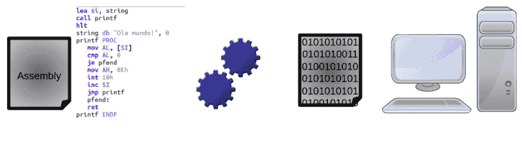
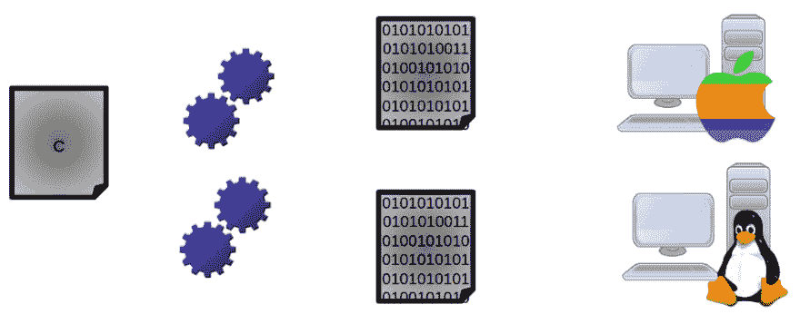
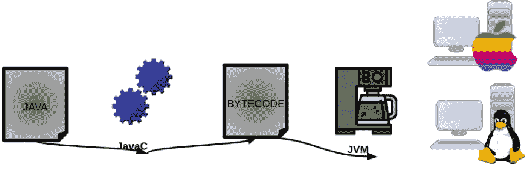
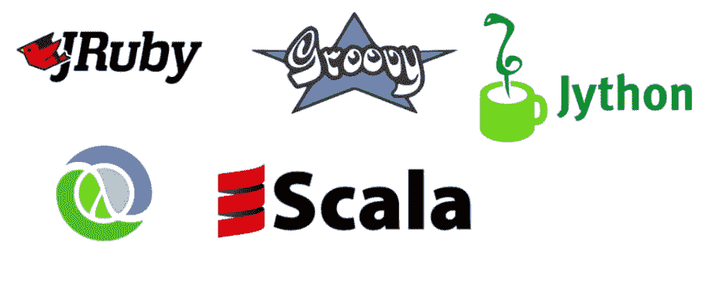

# 幕后的 JVM # 1-什么是 Java？

> [https://dev . to/ananierdev/JVM-在幕后-1o-que-e-o-Java-1h 3m](https://dev.to/ananeridev/jvm-por-debaixo-dos-panos-1-o-que-e-o-java-1h3m)

**欢迎收看 Java 虚拟机系列文章！**

# 布下的 jvm 什么是 java？

> 本文将探讨语境，我相信在直接进入技术部分
> 之前了解历史和其他方面是重要的，内容相当广泛，技术性强，目的是尽可能保持客观和平易近人

## 编译过程

*   一切都始于高级语言电脑的历史，在那里同样只懂得
**   你知道你写的密码吗？你的电脑不了解他，你从来不了解他-我...。是的，他们很笨！*   实际上，您的计算机理解“T0”可执行代码*   让我们以**程序集**等“古”语言为例，看看体系结构:

    *   基本上有一个“Hello World”，它通过一种编译器将代码转换为二进制代码* 

 *

*   **但这太复杂了，好好想想-我...。操作系统只能读取编译的内容，例如，如果要在 MACOX 中运行相同的代码，则必须重新执行所有操作！！**
*   您需要优化流程和时间

## c 中的编译过程

*   很多人对 c 有偏见但你知道 Java 是以 c 为基础的吗？
*   为什么 c 语言在成为多平台的时代是革命性的，即**每个操作系统(OS)**都有编译器
*   c 编译过程非常简单，请参见体系结构:

*   我们看到，我在 c 中编程的“T0”源代码被带到两个进程中，这两个进程将分别为每个操作系统转换一个“**”可执行代码**:d

*   正是基于这种跨平台的理念，Java JVM 的概念应运而生-我...。

    > 在我们开始历史之前，我们迄今为止学到的是:**源代码:**是我，编程人员写的一系列命令。
    > **可执行代码:**是计算机理解的命令序列。
    > **c 语言是跨平台的。**
    > **Java 是以 C** 为基础的

## Java 简介

*   1990 年:Sun Microsystems 创建了一个由 James Gosling 领导的基于 C++的项目，旨在创建不同设备可以相互通信的技术。那时还没有微处理器，所以想象一下这个项目会有多大的革命性！
*   于是组成了自己创造语言的绿色团队——“t0”
*   语言重新命名为【橡树】
*   于是产生了“T0”【七星】
*   1992 年:star 项目最终陷入僵局，因为没有企业投资，*我相信，因为它非常革命性*
*   star 7 的核心是互动性，所以猜猜谁对 star 7 编程语言感兴趣？
*   **Tim Berners-Lee** 自己，当时正在开发 HTML，其主要功能是实时用户交互(尚不存在)
*   宝石和克拉拉就是这样聚在一起的(坏笑话)
*   于是出现了允许互动的
***   因此，现在只需更改语言名称，因为 Oak 已经在市场上存在，这时 Gosling 召集了他的团队，重新命名为 JAVA，因为这是美国人想要非常浓咖啡时所使用的一个词——“t0”【Java coffee】，因为我们程序员只经营咖啡的基础，没有什么比这更公平的了。】**

 **> *   Mei, we listened to the beautiful story of Java. Isn't it cool?
> *   Now we just need to know the reason of JVM-I ...

## 用 JVM 编译代码

*   观察以下架构: 

*   实际上，该代码经过“**Java 编译器或 javac]**->之后，在“**javac]【T3]内，其源代码被转换为字节代码->JVM 读取该字节代码并将其转换为可执行代码。**

*   JVM 输出为 JVM 的语言——“t0”字节码“”，从而允许对任何操作系统进行多版本处理

*   最酷的是，当您将 Java 下载到计算机上时，JVM 已经在一起了，您不需要退出搜索(JVM 和许多其他功能，请记住)。

> *编写一个运行位置*这一概念允许 JVM 中的其他几种语言环绕，主要是 modinha 语言

###### 在此结束了 JVM 的第一个介绍部分！我希望它很有价值，我保证很快就会发行第二部分

## 如果你想读这篇同样的文章，用英语来说，你会在我的网站上找到:[http://bit . ly/JVM-under-hood-1](http://bit.ly/jvm-under-the-hood-1)***