# 一个带有动态数据的 SSR+PWA 应用。

> 原文:[https://dev . to/tobymosque/quasar-framework-a-SSR-pwa-app-with-dynamic-data-c5p](https://dev.to/tobymosque/quasar-framework-a-ssr-pwa-app-with-dynamic-data-c5p)

# [](#table-of-contents)目录

*   [1 简介](#1-introduction)
*   2 CouchDb
*   [3 类星体项目](#3-quasar-project)
*   [4 准备](#4-preparing)
    *   [4.1 多功能皮带应用扩展](#41-utility-belt-app-extension)
    *   [4.2 安装依赖关系](#42-installing-dependencies)
    *   [4.3 设置](#43-setup)
*   [5 配置 PouchdDb](#5-configuring-pouchddb)
    *   [5.1 创建引导文件](#51-creating-a-Boot-File)
    *   [5.2 安装 PouchDb 插件](#52-installing-the-pouchdb-plugins)
    *   [5.3 配置您的数据库模式](#53-configuring-your-database-schema)
    *   [5.4 植入数据库](#54-seeding-the-database)
    *   [5.5 同步数据库](#55-sync-the-database)
    *   你的项目会是什么样的？
*   6 CouchDb
    *   [6.1 从应用程序](#61-accessing-the-couchDb-from-the-app)访问 CouchDb
        *   [6.1.1 备选方案 1 -配置 CORS](#611-alternative-1-configuring-the-cors)
        *   [6.1.2 备选方案 2 -反向代理](#612-alternative-2-reverse-proxy)
        *   6.1.3 银弹
    *   [6.2 测试访问](#62-testing-the-access)
*   [7 集中数据](#7-centralized-cata)
    *   [7.1 商店](#71-store)
    *   [7.2 发射事件](#72-emitting-events)
    *   [7.3 解释](#73-explanation)
*   [8 设置框架](#8-setting-the-framework)
*   [9 列举人物](#9-listing-the-people)
    *   [9.1 配置路线](#91-configuring-the-route)
    *   [9.2 创建视图](#92-creating-a-view)
    *   [9.3 添加状态容器和空白页面](#93-adding-a-state-container-and-an-empty-page)
    *   [9.4 监听变化](#94-listening-for-changes)
    *   [9.5 表格和列](#95-table-and-columns)
    *   [9.6 动作](#96-actions)
    *   [9.7 截图](#97-screenshots)
*   [10 编辑一个人](#10-editing-a-person)
    *   [10.1 创建视图](#101-creating-a-view)
    *   [10.2 添加状态容器和空白页面](#102-adding-a-state-container-and-an-empty-page)
    *   [10.3 监听变化](#103-listening-for-changes)
    *   [10.4 数据来源](#104-data-sources)
    *   [10.5 动作](#105-actions)
    *   [10.6 截图](#106-screenshots)
*   [11 用工人包装 PouchDB 实例](#11-wrapping-the-pouchdb-instance-with-a-worker)
    *   [11.1 网络工作者](#111-web-worker)
    *   [11.2 共享工人](#112-shared-worker)
    *   [11.3 服务人员](#113-service-worker)
    *   [11.4 银弹](#114-silver-bullet)
*   [12 应用程序关闭时同步](#12-syncing-when-the-app-is-closed)
*   [13 号仓库](#13-repository)

## [](#1-introduction)1 简介

我们将构建一个 SSR 应用程序来管理一个小的 CRUD，但是整个 CRUD 将离线工作。为了能够做到这一点，我们将使用 PouchDB 来持久化客户端浏览器中的所有内容。然后，在服务器端，我们将直接查询 CouchDB。

我们将使用 Quasar 应用程序扩展来帮助我们创建我们需要的商店和页面。如果你想了解更多关于应用程序扩展，请查看以下链接: [Quasar - Utility Belt 应用程序扩展，以加快 SSR 和离线第一应用程序的开发。](https://dev.to/tobymosque/quasar-utility-belt-app-extension-to-speedup-the-development-of-ssr-and-offline-first-apps-175h)

## [](#2-couchdb)2 CouchDb

我们的第一步是安装一个 CouchDb 实例。转到 [CouchDb 主页](http://couchdb.apache.org)并按照说明进行操作。

安装 CouchDB 的具体步骤将取决于您的操作系统。如果你在`Windows`上，它会像`next > next > finish`向导一样简单。如果你在`Linux`上，你需要在你的终端上执行一些命令。这需要一些时间，但你应该习惯了。

要检查一切是否如预期的那样工作，您可以访问:[http://localhost:5984/_ utils](http://localhost:5984/_utils)，将出现如下所示的页面。

[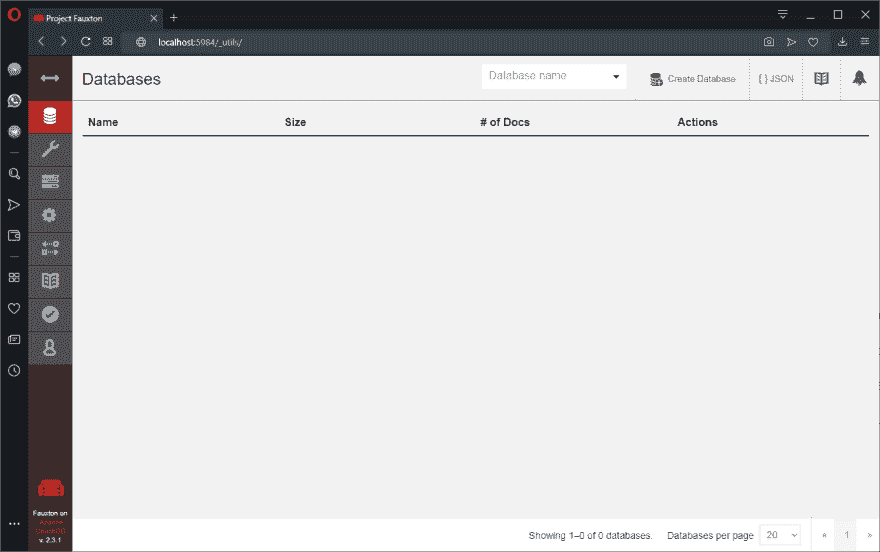T2】](https://res.cloudinary.com/practicaldev/image/fetch/s--piG2Krud--/c_limit%2Cf_auto%2Cfl_progressive%2Cq_auto%2Cw_880/https://thepracticaldev.s3.amazonaws.com/i/yz7qhdwfg6fi5dyvxput.png)

## [](#3-quasar-project)3 类星体项目

首先，我真的建议你使用`yarn`来管理你的本地包，使用`npm`来管理全局包，但是你可以自由使用你喜欢的包管理器。

我们的第一步是确保安装了`@quasar/cli`和`up-to-date`，所以即使您已经安装了 cli，也请运行下面的命令。

```
$ npm i -g @quasar/cli@latest 
```

[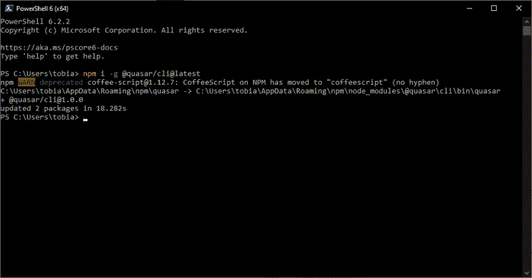T2】](https://res.cloudinary.com/practicaldev/image/fetch/s--QLwPQ6FY--/c_limit%2Cf_auto%2Cfl_progressive%2Cq_auto%2Cw_880/https://thepracticaldev.s3.amazonaws.com/i/94t9jz2u5n91n3pq2ccd.png)

我们现在可以创建一个新项目，运行下面的命令:

```
$ quasar create quasar-offline 
```

以下是我选择的:

```
? Project name (internal usage for dev) quasar-offline
? Project product name (official name; must start with a letter if you will build mobile apps) Quasar App
? Project description A Quasar Framework app
? Author Tobias de Abreu Mesquita <tobias.mesquita@gmail.com>
? Check the features needed for your project: (Press <space> to select, <a> to toggle all, <i> to invert selection)ESLint, Vuex, Axios, Vue-i18n
? Pick an ESLint preset Standard
? Cordova id (disregard if not building mobile apps) org.cordova.quasar.app
? Should we run `npm install` for you after the project has been created? (recommended) yarn 
```

除了 Vuex 特性之外，您并不受限于这些选项中的任何一个，所以您可以随意选择您可能已经正常执行的操作。

[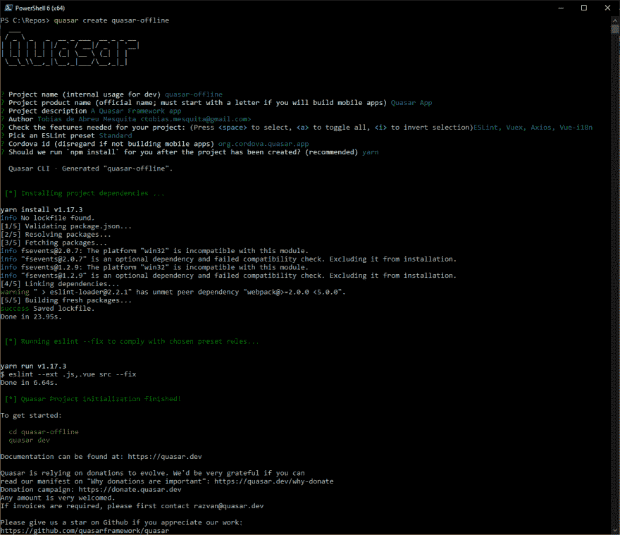T2】](https://res.cloudinary.com/practicaldev/image/fetch/s--bWIVbkEW--/c_limit%2Cf_auto%2Cfl_progressive%2Cq_auto%2Cw_880/https://thepracticaldev.s3.amazonaws.com/i/5lj7qkoa89nycguddkkc.png)

## [](#4-preparing)4 准备中

### [](#41-utility-belt-app-extension)4.1 多用途皮带 App 扩展

```
$ quasar ext add "@toby.mosque/utils" 
```

### [](#42-installing-dependencies)4.2 安装依赖项

因为我们计划使用 PouchDB 在客户端持久化一切，所以我们需要安装所需的包。

```
$ yarn add pouchdb pouchdb-find relational-pouch worker-pouch 
```

[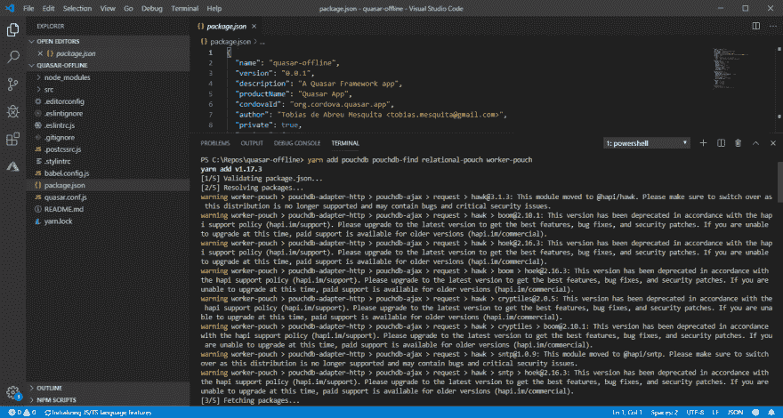T2】](https://res.cloudinary.com/practicaldev/image/fetch/s--rSWsT0W4--/c_limit%2Cf_auto%2Cfl_progressive%2Cq_auto%2Cw_880/https://thepracticaldev.s3.amazonaws.com/i/bwicvjtcyl8jlvzc084w.png)

### [](#43-setup)4.3 设置

我们需要在项目中做一些小的改动(好的，我们会做一个变通方案/macgyver)。

编辑你的`./babel.config.js`看起来像:

```
module.exports = {
  presets: [
    '@quasar/babel-preset-app'
  ]
} 
```

打开您的`./quasar.conf.js`，用下面的代码行扩展 web pack:

```
cfg.resolve.alias['pouchdb-promise'] = path.join(__dirname, '/node_modules/pouchdb-promise/lib/index.js') 
```

这里是`./quasar.conf.js`的简化视图。

```
const path = require('path')
module.exports = function (ctx) {
  return {
    build: {
      extendWebpack (cfg) {
        cfg.resolve.alias['pouchdb-promise'] = path.join(__dirname, '/node_modules/pouchdb-promise/lib/index.js')
      }
    }
  }
} 
```

## [](#5-configuring-pouchddb)5 配置 PouchdDb

### [](#51-creating-a-boot-file)5.1 创建引导文件

遵循类星体的哲学，为了配置任何东西，你将创建一个具有单一责任的引导。

```
$ quasar new boot pouchdb/index 
```

您需要在`./quasar.conf.js`
中注册引导文件

```
const path = require('path')
module.exports = function (ctx) {
  return {
    boot: [
      'i18n',
      'axios',
      'pouchdb/index'
    ]
  }
} 
```

### [](#52-installing-the-pouchdb-plugins)5.2 安装 PouchDb 插件

我们将在一个单独的文件中安装 pouchdb 的插件:

创建`./src/boot/pouchdb/setup.js`并将其修改为如下所示:

```
import PouchDB from 'pouchdb'
import RelationalPouch from 'relational-pouch'
import PouchDbFind from 'pouchdb-find'
import WorkerPouch from 'worker-pouch'

PouchDB.adapter('worker', WorkerPouch)
PouchDB.plugin(RelationalPouch)
PouchDB.plugin(PouchDbFind)

export default PouchDB 
```

现在，编辑`./src/boot/pouchdb/index.js`

```
import PouchDB from './setup'

class Database {
  local = void 0
  remote = void 0
  syncHandler = void 0
  async configure ({ isSSR }) {
    if (isSSR) {
      this.local = new PouchDB('http://localhost:5984/master/')
    } else {
      this.local = new PouchDB('db')
      this.remote = new PouchDB('http://localhost:5984/master/')
    }
  }
}

const db = new Database()
export default async ({ Vue, ssrContext }) => {
  await db.configure({ isSSR: !!ssrContext })
  Vue.prototype.$db = db
}

export { db } 
```

我们在这里做什么？与服务器端相比，当代码在客户端运行时，我们需要稍微不同的行为。

在服务器端，应用程序将直接查询 CouchDb 实例。在客户端，应用程序将只依赖本地数据库，并在连接可用时进行同步。

### [](#53-configuring-your-database-schema)5.3 配置您的数据库模式

开发人员从`PouchDb` / `CouchDb`开始时的一个常见错误是为每种文档类型创建一个表(基于个人经验)，但是很快他们就会发现这不是一个好主意。为了正确同步，每个数据库都需要一个专用连接。

为了解决这个问题，我们将把所有内容都保存在一个表中。就我个人而言，我认为以关系的方式考虑数据是很容易的，所以我们将使用 PouchDB 插件来抽象它: [relational-pouch](https://github.com/pouchdb-community/relational-pouch)

我们已经在前面的步骤中注册了插件，但是我们仍然需要配置数据库模式。同样，我们将在一个单独的文件中这样做:

创建`./src/boot/pouchdb/create.js`并将其修改为如下所示:

```
import PouchDB from './setup'

export default function (name, options) {
  let db = options !== void 0 ? new PouchDB(name, options) : new PouchDB(name)
  db.setSchema([
    {
      singular: 'person',
      plural: 'people',
      relations: {
        company: { belongsTo: { type: 'company', options: { async: true } } },
        job: { belongsTo: { type: 'job', options: { async: true } } }
      }
    },
    {
      singular: 'company',
      plural: 'companies',
      relations: {
        people: { hasMany: { type: 'person', options: { async: true, queryInverse: 'person' } } }
      }
    },
    {
      singular: 'job',
      plural: 'jobs',
      relations: {
        people: { hasMany: { type: 'person', options: { async: true, queryInverse: 'person' } } }
      }
    }
  ])
  return db
} 
```

再来一次，编辑`./src/boot/pouchdb/index.js`

```
import create from './create'

class Database {
  local = void 0
  remote = void 0
  syncHandler = void 0
  async configure ({ isSSR }) {
    if (isSSR) {
      this.local = create('http://localhost:5984/master/')
    } else {
      this.local = create('db')
      this.remote = create('http://localhost:5984/master/')
    }
  }
}

const db = new Database()
export default async ({ Vue, ssrContext }) => {
  await db.configure({ isSSR: !!ssrContext })
  Vue.prototype.$db = db
}

export { db } 
```

### [](#54-seeding-the-database)5.4 播种数据库

现在，让我们在数据库中植入一些数据。我们将只在服务器端这样做。同样，我们将在一个单独的文件中完成:

为了生成我们的数据(对于本文)，我们将使用 [FakerJS](https://github.com/marak/Faker.js/)

```
yarn add faker 
```

创建`./src/boot/pouchdb/seed.js`并将其修改为如下所示:

```
import uuid from '@toby.mosque/utils'
import faker from 'faker'

export default async function (db) {
  var { people: dbpeople } = await db.rel.find('person', { limit: 1 })
  if (dbpeople && dbpeople.length > 0) {
    return
  }

  faker.locale = 'en_US'
  let companies = []
  for (let i = 0; i < 5; i++) {
    let company = {}
    company.id = uuid.comb()
    company.name = faker.company.companyName()
    companies.push(company)
  }

  let jobs = []
  for (let i = 0; i < 10; i++) {
    let job = {}
    job.id = uuid.comb()
    job.name = faker.name.jobTitle()
    jobs.push(job)
  }

  let people = []
  for (let i = 0; i < 100; i++) {
    let companyIndex = Math.floor(Math.random() * Math.floor(5))
    let jobIndex = Math.floor(Math.random() * Math.floor(10))
    let company = companies[companyIndex]
    let job = jobs[jobIndex]
    let person = {}
    person.id = uuid.comb()
    person.firstName = faker.name.firstName()
    person.lastName = faker.name.lastName()
    person.email = faker.internet.email()
    person.company = company.id
    person.job = job.id
    people.push(person)
  }

  for (let company of companies) {
    await db.rel.save('company', company)
  }

  for (let job of jobs) {
    await db.rel.save('job', job)
  }

  for (let person of people) {
    await db.rel.save('person', person)
  }
} 
```

现在在服务器端启动运行时调用种子:

```
import create from './create'
import seed from './seed'

class Database {
  local = void 0
  remote = void 0
  syncHandler = void 0
  async configure ({ isSSR }) {
    if (isSSR) {
      this.local = create('http://localhost:5984/master/')
      await seed(this.local)
    } else {
      this.local = create('db')
      this.remote = create('http://localhost:5984/master/')
    }
  }
}

const db = new Database()
export default async ({ Vue, ssrContext }) => {
  await db.configure({ isSSR: !!ssrContext })
  Vue.prototype.$db = db
}

export { db } 
```

### [](#55-sync-the-database)5.5 同步数据库

最后，我们需要在远程和本地数据库之间同步数据。

当应用程序启动时，在任何事情之前，我们将尝试做一个完整的复制。为了使任务更加清晰，我们将把复制方法放在一个承诺中:

```
async replicate ({ source, target }) {
  return new Promise((resolve, reject) => {
    source.replicate.to(target).on('complete', resolve).on('error', reject)
  })
} 
```

我们将验证应用程序是否在线，并尝试进行完整的复制(请记住，客户端必须在线才能执行此操作)。如果出现问题，那是因为客户端离线或 CouchDB，但这不会阻止用户访问系统。

```
if (navigator.onLine) {
  try {
    await this.replicate({ source: this.remote, target: this.local })
    await this.replicate({ source: this.local, target: this.remote })
  } catch (err) {

  }
} 
```

之后，我们将启动实时复制并跟踪任何更改。

```
this.syncHandler = this.local.sync(this.remote, {
  live: true,
  retry: true
})
this.local.changes({
  since: 'now',
  live: true,
  include_docs: true
}).on('change', onChange) 
```

现在，您的引导文件将如下所示:

```
import create from './create'
import seed from './seed'

class Database {
  local = void 0
  remote = void 0
  syncHandler = void 0
  async configure ({ isSSR, onChange }) {
    if (isSSR) {
      this.local = create('http://localhost:5984/master/')
      await seed(this.local)
    } else {
      this.local = create('db')
      this.remote = create('http://localhost:5984/master/')
      if (navigator.onLine) {
        try {
          await this.replicate({ source: this.remote, target: this.local })
          await this.replicate({ source: this.local, target: this.remote })
        } catch (err) {

        }
      }
      this.syncHandler = this.local.sync(this.remote, {
        live: true,
        retry: true
      })
      this.local.changes({
        since: 'now',
        live: true,
        include_docs: true
      }).on('change', onChange)
    }
  }
  async replicate ({ source, target }) {
    return new Promise((resolve, reject) => {
      source.replicate.to(target).on('complete', resolve).on('error', reject)
    })
  }
}

const db = new Database()
export default async ({ Vue, ssrContext }) => {
  await db.configure({
    isSSR: !!ssrContext,
    onChange (change) {
      console.log(change)
    }
  })
  if (!ssrContext) {
    var { people } = await db.rel.find('person')
    console.log(people)
  }
  Vue.prototype.$db = db
}

export { db } 
```

### [](#56-how-your-project-would-look-like)5.6 你的项目会是什么样子？

[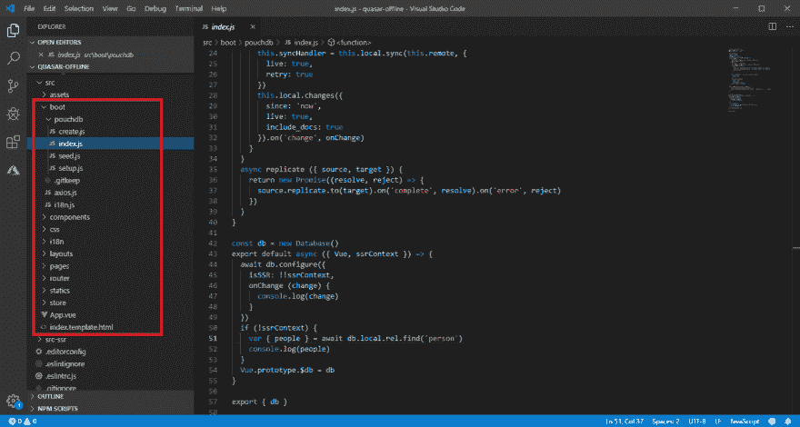T2】](https://res.cloudinary.com/practicaldev/image/fetch/s--r-cP9gdT--/c_limit%2Cf_auto%2Cfl_progressive%2Cq_auto%2Cw_880/https://thepracticaldev.s3.amazonaws.com/i/3qx7zy64mg1lgec5camk.png)

## [](#6-couchdb)6 CouchDb

### [](#61-accessing-the-couchdb-from-the-app)6.1 从应用程序访问 CouchDb

如果您尝试运行您的应用程序，您会注意到 CouchDB 拒绝来自客户端的任何连接。这里你有两个选择:将您的应用程序配置为 CouchDB 的反向代理，或者配置 CouchDb 实例的 CORS。

#### [](#611-alternative-1-configuring-the-cors)6.1.1 备选项 1 -配置 CORS

打开 faux ton([http://localhost:5984/_ utils](http://localhost:5984/_utils))，进入配置，CORS，并启用它。

[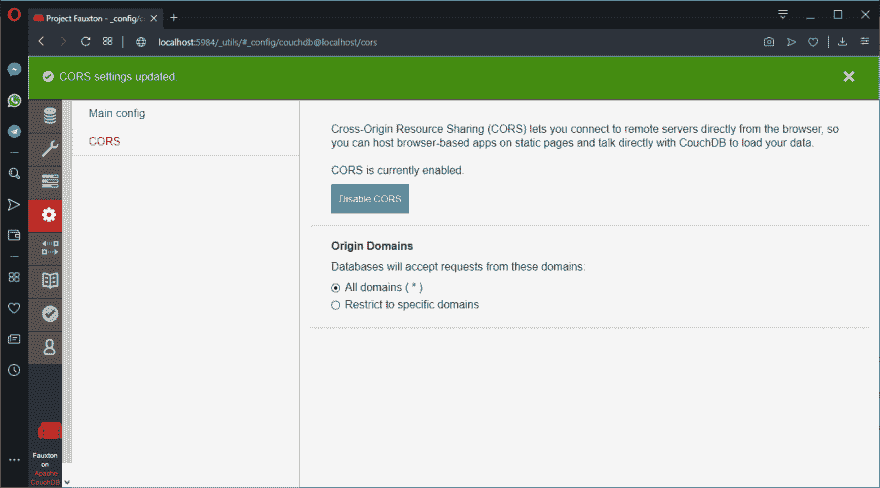T2】](https://res.cloudinary.com/practicaldev/image/fetch/s--tSxQFJEx--/c_limit%2Cf_auto%2Cfl_progressive%2Cq_auto%2Cw_880/https://thepracticaldev.s3.amazonaws.com/i/84oimjod2xqe4fvz5owh.png)

#### [](#612-alternative-2-reverse-proxy)6.1.2 替代 2 -反向代理

安装以下软件包

```
yarn add --dev http-proxy-middleware 
```

编辑您的`./src-ssr/extention.js`如下所示:

```
var proxy = require('http-proxy-middleware')
module.exports.extendApp = function ({ app, ssr }) {
  app.use(
    '/db',
    proxy({
      target: 'http://localhost:5984',
      changeOrigin: true,
      pathRewrite: { '^/db': '/' }
    })
  )
} 
```

[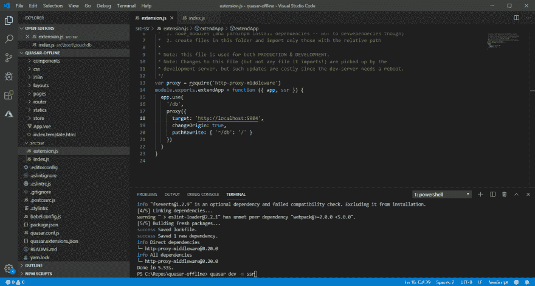T2】](https://res.cloudinary.com/practicaldev/image/fetch/s--YbGV8iCJ--/c_limit%2Cf_auto%2Cfl_progressive%2Cq_auto%2Cw_880/https://thepracticaldev.s3.amazonaws.com/i/q6mvvbt85das1fncaki1.png)

编辑您的引导文件:

```
if (isSSR) {
  this.local = create('http://localhost:5984/master/')
  await seed(this.local)
} else {
  this.local = create('db')
  // you can't use a relative path here
  this.remote = create(`${location.protocol}//${location.host}/db/master/`)
} 
```

#### [](#613-silver-bullet)6.1.3 银子弹

你不知道该选择什么？使用反向代理，因为这会给你更多的自由。

### [](#62-testing-the-access)6.2 测试访问

运行您的应用:

```
$ quasar dev -m ssr 
```

[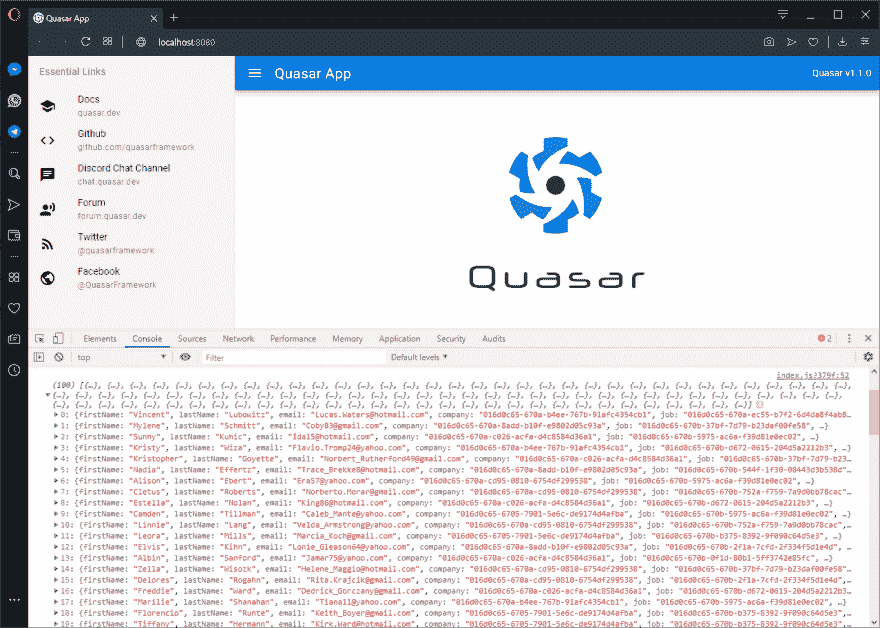T2】](https://res.cloudinary.com/practicaldev/image/fetch/s--UnbJuNMS--/c_limit%2Cf_auto%2Cfl_progressive%2Cq_auto%2Cw_880/https://thepracticaldev.s3.amazonaws.com/i/yd9awnwcvb425612lgu4.png)

现在检查你的控制台。如果您看到一个 100 人的列表，那么一切都按预期运行。

## [](#7-centralized-data)7 集中数据

### [](#71-store)7.1 商店

由于这是一个 SSR 应用程序，我们不想在服务器端查询整个数据库，但查询域实体将是一个好主意。我们将把 job 和 company 实体作为我们的域实体来处理(因为它们被用在所有的路由中)。

我们的第一步是创建一个商店(使用 Vuex)来存放这两个集合:

**src/store/database . js**

```
import { factory } from '@toby.mosque/utils'
import { db } from 'src/boot/pouchdb'
const { store } = factory

const options = {
  model: class PeopleModel {
    companies = []
    jobs = []
  },
  collections: [
    { single: 'company', plural: 'companies', id: 'id' },
    { single: 'job', plural: 'jobs', id: 'id' }
  ]
}

export default store({
  options,
  actions: {
    async initialize ({ commit }) {
      let { companies } = await db.local.rel.find('company')
      let { jobs } = await db.local.rel.find('job')
      commit('companies', companies)
      commit('jobs', jobs) 
    }
  }
}) 
```

**src/store/index . js**T2】

```
import Vue from 'vue'
import Vuex from 'vuex'

import database from './database'

Vue.use(Vuex)

export default function () {
  const Store = new Vuex.Store({
    modules: {
      database
    },
    strict: process.env.DEV
  })

  return Store
} 
```

### [](#72-emitting-events)7.2 发射事件

由于我们的数据正在与远程数据库实时同步，CRUD 操作将在我们的商店之外进行。因此，我们需要跟踪它们，并在每次发生时发出事件来更新我们的集中存储。

为此，我们需要修改引导文件:`./src/boot/pouchdb/index.js`

```
// ...

const db = new Database()
export default async ({ Vue, store, router, ssrContext }) => {
  await db.configure({
    isSSR: !!ssrContext,
    onChange (change) {
      let { data, _id, _rev, _deleted } = change.doc
      let parsed = db.local.rel.parseDocID(_id)
      let event = events[parsed.type]

      if (_deleted) {
        router.app.$emit(parsed.type, { id: parsed.id, _deleted })
        router.app.$emit(parsed.id, { _deleted })
        if (event) {
          store.dispatch(event.delete, parsed.id)
        }
      } else {
        data.id = parsed.id
        data.rev = _rev
        router.app.$emit(parsed.type, data)
        router.app.$emit(parsed.id, data)
        if (event) {
          store.dispatch(event.save, data)
        }
      }
    }
  })
  await store.dispatch('database/initialize')
  Vue.prototype.$db = db
}

export { db } 
```

### [](#73-explanation)7.3 解释

让我们想象一下，有人更新了一个人，在这种情况下改变的对象将会是什么样子:

```
{
  id: person_2_016d0c65-670c-1d7d-9b96-f3ef340aa681,
  seq: ...,
  changes: [{ ... }, { ... }],
  doc: {
    "_id": "person_2_016d0c65-670c-1d7d-9b96-f3ef340aa681",
    "_rev": "2-0acd99b71f352cca4c780c90d5c23608",
    "data": {
      "firstName": "Mylene",
      "lastName": "Schmitt",
      "email": "Coby83@gmail.com",
      "company": "016d0c65-670a-8add-b10f-e9802d05c93a",
      "job": "016d0c65-670b-37bf-7d79-b23daf00fe58"
    }
  }
} 
```

为了正确地索引文档，relational-pouch 插件在保存之前修改 id，附加文档的类型和关键字的类型(2 表示关键字是字符串)。我们需要把它分解以便得到文件的类型和你的身份证。

```
let _id = 'person_2_016d0c65-670c-1d7d-9b96-f3ef340aa681'
let parsed = db.local.rel.parseDocID(_id)
console.log(parsed)
// { id: '016d0c65-670c-1d7d-9b96-f3ef340aa681', type: 'person'} 
```

现在，我们将发出 2 个事件来通知应用程序一些文档已经更新。

1.  第一个是通知持有记录集合的组件，事件名称是类型。
2.  第二个是通知持有特定记录细节的组件，事件名称是记录 id(在应用程序中是唯一的)。

```
if (_deleted) {
  router.app.$emit('person', { id: '016d0c65-670c-1d7d-9b96-f3ef340aa681', _deleted: true })
  router.app.$emit('016d0c65-670c-1d7d-9b96-f3ef340aa681', { _deleted: true })
} else {
  data.id = parsed.id
  data.rev = _rev
  router.app.$emit('person', data)
  router.app.$emit('016d0c65-670c-1d7d-9b96-f3ef340aa681', data)
} 
```

我们的最后一步，是更新集中存储。我们将发送一个更新商店的动作:

```
if (_deleted) {
  if (event) {
    store.dispatch('database/deletePerson', parsed.id)
  }
} else {
  if (event) {
    store.dispatch('database/saveOrUpdatePerson', data)
  }
} 
```

## [](#8-setting-the-framework)8 设定框架

让我们配置框架来使用预取和自动发现组件。将`config > preFetch`设置为`true`，将`config > framework > all`设置为`'auto'`。下面简单介绍一下`./quasar.conf.js`的

```
const path = require('path')
module.exports = function (ctx) {
  return {
    build: {
      preFetch: true,
      framework: {
        all: 'auto',
        plugins: [...]
      }
    }
  }
} 
```

## [](#9-listing-the-people)9 清单中的人

我们已经有一些数据工作，同步过程配置。让我们创建一些页面。但是首先，我们需要更新`src/router/routes.js`文件。：

### [](#91-configuring-the-route)9.1 配置路线

```
const routes = [
  {
    path: '/',
    component: () => import('layouts/MyLayout.vue'),
    children: [
      { path: '', redirect: '/people/' },
      { path: 'people/', component: () => import('pages/People/Index.vue') },
      { path: 'people/:id', component: () => import('pages/Person/Index.vue') }
    ]
  }
]

// Always leave this as last one
if (process.env.MODE !== 'ssr') {
  routes.push({
    path: '*',
    component: () => import('pages/Error404.vue')
  })
}

export default routes 
```

### [](#92-creating-a-view)9.2 创建视图

现在，创建如下所示的`src/pages/People/Index.vue`文件:

```
<template>
  <q-page class="q-pa-md">
    <q-table title="People" :data="people" :columns="columns" row-key="id" >
      <template v-slot:top-left>
        <q-btn color="positive" icon="edit" label="create" to="/people/create" />
      </template>
      <template v-slot:body-cell-actions="props">
        <q-td class="q-gutter-x-sm">
          <q-btn round outline color="primary" icon="edit" :to="'/people/' + props.value" />
          <q-btn round outline color="negative" icon="delete" @click="remove(props.row)" />
        </q-td>
      </template>
    </q-table>
  </q-page>
</template>

<style>
</style>

<script src="./Index.vue.js">
</script> 
```

### [](#93-adding-a-state-container-and-an-empty-page)9.3 添加状态容器和空白页面

我们需要创建`src/pages/People/Index.vue.js`。我们的第一步将是创建一个`state container`和一个空白页面:

```
import { factory } from '@toby.mosque/utils'
import { db } from 'src/boot/pouchdb'
import { mapGetters, mapActions } from 'vuex'
const { page, store } = factory

const moduleName = 'people'
const options = {
  model: class PeopleModel {
    people = []
  },
  collections: [
    { single: 'person', plural: 'people', id: 'id' }
  ]
}

const storeModule = store({
  options,
  actions: {
    async initialize ({ commit }, { route }) {
      let { people } = await db.local.rel.find('person')
      commit('people', people)
    },
    async remove (context, person) {
      await db.local.rel.del('person', { id: person.id, rev: person.rev })
    }
  }
})

export default page({
  name: 'PeoplePage',
  options,
  moduleName,
  storeModule,
  mounted () { ... },
  destroyed () { ... },
  data () { ... },
  computed: { ... },
  methods: {
    ...mapActions(moduleName, { __remove: 'remove' }),
    ...
  }
}) 
```

如果你担心`remove`动作没有`commit`任何东西，那是故意的。因为我们将监听变化，一旦一个人被删除(不管是谁，在哪里和/或什么时候)，它将在状态容器中反映出来。

### [](#94-listening-for-changes)9.4 监听变化

为了监听 people 集合中的任何变化，我们需要更新挂载和销毁的钩子，并启用/禁用一些事件监听器。

```
export default page({
  ...
  mounted () {
    let self = this
    if (!this.listener) {
      this.listener = entity => {
        if (entity._deleted) {
          self.deletePerson(entity.id)
        } else {
          self.saveOrUpdatePerson(entity)
        }
      }
      this.$root.$on('person', this.listener)
    }
  },
  destroyed () {
    if (this.listener) {
      this.$root.$off('person', this.listener)
    }
  }
  ...
}) 
```

这样，每当一个人被创建、更新或删除时，状态容器将被更新，而不管修改的来源。

### [](#95-table-and-columns)9.5 表格和列

因为我们使用一个表格来显示人员，所以我们需要配置我们的列，总共六列(`firstName`、`lastName`、`email`、`job`、`company`、`actions`)。

但是，`job`和`company`字段没有保存描述，而是保存 id，我们需要将它们映射到您各自的描述。我们需要编辑`computed`属性，看起来像:

```
export default page({
  ...
  computed:  {
    ...mapGetters('database', ['jobById', 'companyById'])
  }
  ...
}) 
```

现在，我们将在`data`钩子
中创建列定义

```
export default page({
  ...
  data () {
    let self = this
    return {
      columns: [
        { name: 'firstName', field: 'firstName', label: 'First Name', sortable: true, required: true, align: 'left' },
        { name: 'lastName', field: 'lastName', label: 'Last Name', sortable: true, required: true, align: 'left' },
        { name: 'email', field: 'email', label: 'Email', sortable: true, required: true, align: 'left' },
        {
          name: 'job',
          label: 'Job',
          sortable: true,
          required: true,
          field (row) { return self.jobById(row.job).name },
          align: 'left'
        },
        {
          name: 'company',
          label: 'Company',
          sortable: true,
          required: true,
          field (row) { return self.companyById(row.company).name },
          align: 'left'
        },
        { name: 'actions', field: 'id', label: 'Actions', sortable: false, required: true, align: 'center' }
      ]
    }
  },
  ...
}) 
```

### [](#96-actions)9.6 动作

是时候配置我们的行动了。确切的说，我们独特的行动:删除一个人。我们将编辑我们的方法挂钩，如下所示:

```
export default page({
  ...
  methods: {
    ...mapActions(moduleName, { __remove: 'remove' }),
    remove (row) {
      this.$q.dialog({
        color: 'warning',
        title: 'Delete',
        message: `Do u wanna delete ${row.firstName}  ${row.lastName}`,
        cancel: true
      }).onOk(async () => {
        try {
          await this.__remove(row)
          this.$q.notify({
            color: 'positive',
            message: 'successfully deleted'
          })
        } catch (err) {
          console.error(err)
          this.$q.notify({
            color: 'negative',
            message: 'failed at delete'
          })
        }
      })
    }
  }
}) 
```

### [](#97-screenshots)9.7 截图

[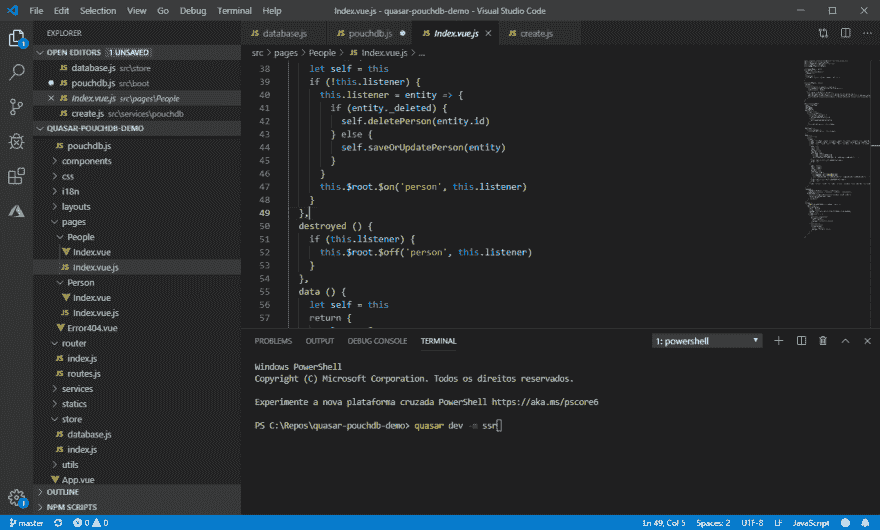T2】](https://res.cloudinary.com/practicaldev/image/fetch/s--w44D-bN4--/c_limit%2Cf_auto%2Cfl_progressive%2Cq_auto%2Cw_880/https://thepracticaldev.s3.amazonaws.com/i/t15bugw8czglwfdddfoh.png)

[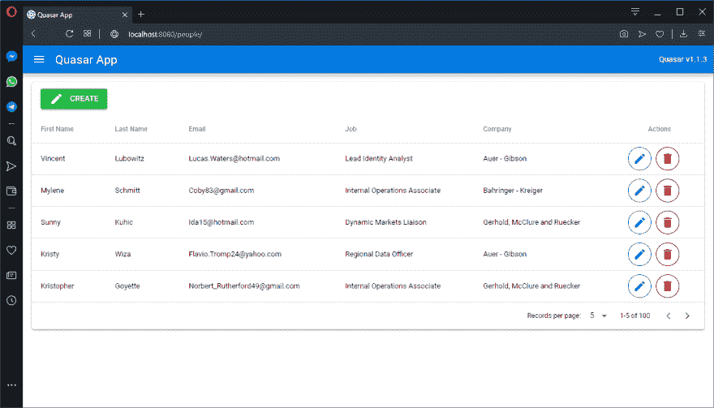T2】](https://res.cloudinary.com/practicaldev/image/fetch/s---UzCpU19--/c_limit%2Cf_auto%2Cfl_progressive%2Cq_auto%2Cw_880/https://thepracticaldev.s3.amazonaws.com/i/2jzmnfr6r2rfxx7r00wr.png)

## [](#10-editing-a-person)10 编辑一个人

### [](#101-creating-a-view)10.1 创建视图

创建`src/pages/Person/Index.vue`文件，并将其编辑成如下所示:

```
<template>
  <q-page class="q-pa-md">
    <q-card class="full-width">
      <q-card-section>
        Person
      </q-card-section>
      <q-separator />
      <q-card-section class="q-gutter-y-sm">
        <q-input v-model="firstName" label="First Name" outlined />
        <q-input v-model="lastName" label="Last Name" outlined />
        <q-input v-model="email" label="Email" type="email" outlined />
        <q-select v-model="company" label="Company" map-options emit-value option-value="id" option-label="name" outlined :options="companies" />
        <q-select v-model="job" label="Job" map-options emit-value option-value="id" option-label="name" outlined :options="jobs" />
      </q-card-section>
      <q-separator />
      <q-card-actions class="row q-px-md q-col-gutter-x-sm">
        <div class="col col-4">
          <q-btn class="full-width" color="grey-6" label="return" to="/people/" />
        </div>
        <div class="col col-8">
          <q-btn class="full-width" color="positive" label="save" @click="save" />
        </div>
      </q-card-actions>
    </q-card>
  </q-page>
</template>

<style>
</style>

<script src="./Index.vue.js">
</script> 
```

### [](#102-adding-a-state-container-and-an-empty-page)10.2 添加状态容器和空白页面

我们需要创建`src/pages/Person/Index.vue.js`，我们的第一步将是创建一个`state container`和一个空白页面:

```
import { factory, store as storeUtils, uuid } from '@toby.mosque/utils'
import { db } from 'src/boot/pouchdb'
import { mapActions } from 'vuex'
const { mapState } = storeUtils
const { page, store } = factory

const options = {
  model: class PersonModel {
    id = ''
    rev = ''
    firstName = ''
    lastName = ''
    email = ''
    job = ''
    company = ''
  }
}

const moduleName = 'person'
const storeModule = store({
  options,
  actions: {
    async initialize ({ dispatch, commit }, { route }) {
      let person = await dispatch('personById', route.params.id)
      commit('id', person.id || uuid.comb())
      commit('rev', person.rev)
      commit('firstName', person.firstName)
      commit('lastName', person.lastName)
      commit('email', person.email)
      commit('job', person.job)
      commit('company', person.company)
    },
    async personById (context, id) {
      let { people } = await db.local.rel.find('person', id)
      let person = people && people.length > 0 ? people[0] : {}
      return person
    },
    async save ({ state }) {
      let current = { ...state }
      delete current['@@']
      await db.local.rel.save('person', current)
    }
  }
})

export default page({
  name: 'PersonPage',
  options,
  moduleName,
  storeModule,
  mounted () { ... },
  destroyed () { ... },
  computed: { ... },
  methods: {
    ...mapActions(moduleName, { __save: 'save', initialize: 'initialize' }),
    ...
  }
}) 
```

同样，不要担心`save`。缺少一个`commit`是有意的，因为我们将监听变化。一旦当前人员被修改(无论何人、何地和/或何时),页面将被通知。

### [](#103-listening-for-changes)10.3 监听变化

为了监听当前 person 的任何变化，我们需要更新挂载和销毁的钩子，并启用/禁用一些事件监听器。

但与我们之前所做的不同，我们将只通知应用程序，并让用户决定他们想要做什么。

```
export default page({
  ...
  mounted () {
    if (this.rev && !this.listener) {
      this.listener = entity => {
        if (entity._deleted) {
          // if that person got deleted, the unique option to the user is leave that page.
          this.$q.dialog({
            parent: this,
            color: 'warning',
            title: 'Deleted',
            message: 'Someone deleted this person'
          }).onDismiss(() => {
            this.$router.push('/people/')
          })
        } else {
          // if that person got update, the user will be able to keep the changes or discard them.
          this.$q.dialog({
            parent: this,
            color: 'warning',
            title: 'Deleted',
            cancel: 'No',
            ok: 'yes',
            message: 'Someone updated this person. do u wanna refresh the fields?'
          }).onOk(() => {
            this.initialize({ route: this.$route })
          }).onCancel(() => {
            this.rev = entity.rev
          })
        }
      }
      this.$root.$on(this.id, this.listener)
    }
  },
  destroyed () {
    if (this.rev && this.listener) {
      this.$root.$off(this.id, this.listener)
    }
  },
  ...
}) 
```

这样，每次当前的人被更新或删除时，用户都会得到通知，不管修改的来源是什么。

### [](#104-data-sources)10.4 数据来源

像以前一样，`job`和`company`字段不保存描述，而是保存 id。但是现在我们需要`jobs`和`companies`的全部集合来获取`QSelect`选项。:

```
export default page({
  ...
  computed: {
    ...mapState('database', ['jobs', 'companies'])
  },
  ...
}) 
```

### [](#105-actions)10.5 动作

现在，是时候写我们的保存方法了。我们将编辑我们的方法钩子，看起来像:

```
export default page({
  ...
  methods: {
    ...mapActions(moduleName, { __save: 'save', initialize: 'initialize' }),
    async save () {
      try {
        await this.__save()
        this.$q.notify({
          color: 'positive',
          message: 'successfully saved'
        })
        this.$router.push('/people/')
      } catch (err) {
        this.$q.notify({
          color: 'negative',
          message: 'failure at save'
        })
      }
    }
  }
}) 
```

### [](#106-screenshots)10.6 截图

[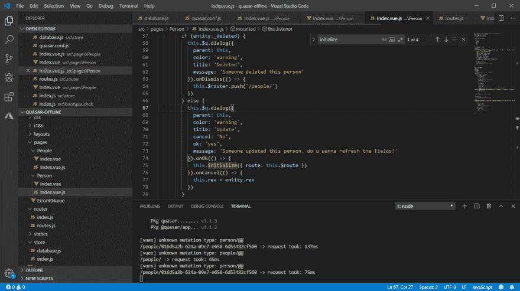](https://res.cloudinary.com/practicaldev/image/fetch/s--qHAq5mJg--/c_limit%2Cf_auto%2Cfl_progressive%2Cq_auto%2Cw_880/https://thepracticaldev.s3.amazonaws.com/i/24793jokpwys9n21lc8m.png)
[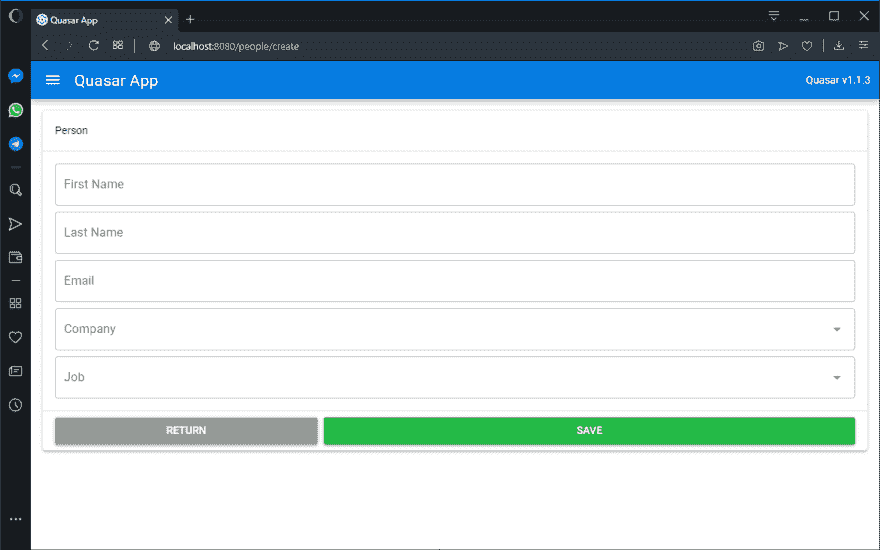](https://res.cloudinary.com/practicaldev/image/fetch/s--K_M9qUFD--/c_limit%2Cf_auto%2Cfl_progressive%2Cq_auto%2Cw_880/https://thepracticaldev.s3.amazonaws.com/i/zbwyqlm9ne0fhz8bp9il.png)
[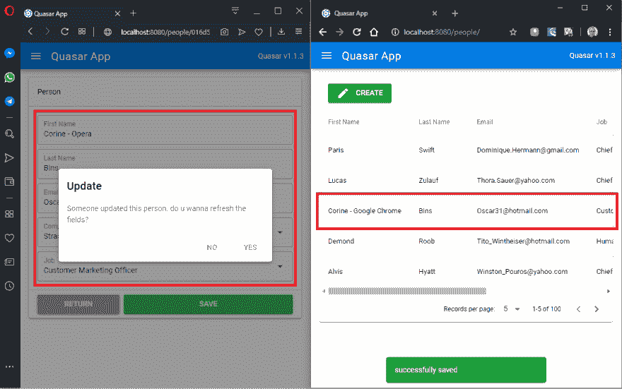](https://res.cloudinary.com/practicaldev/image/fetch/s--rOOx6GQE--/c_limit%2Cf_auto%2Cfl_progressive%2Cq_auto%2Cw_880/https://thepracticaldev.s3.amazonaws.com/i/yi1r5fbol8af5ii4c5fr.png)
[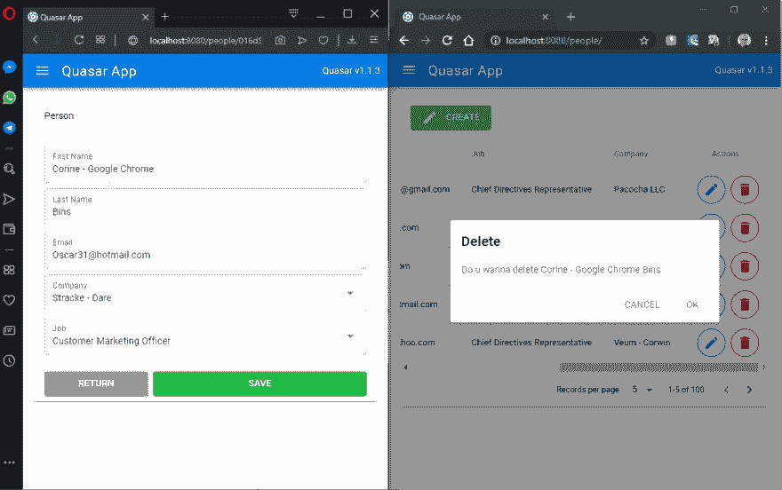](https://res.cloudinary.com/practicaldev/image/fetch/s--G1fbR_Sp--/c_limit%2Cf_auto%2Cfl_progressive%2Cq_auto%2Cw_880/https://thepracticaldev.s3.amazonaws.com/i/s42ne6lhfzb8nflt1771.png)
[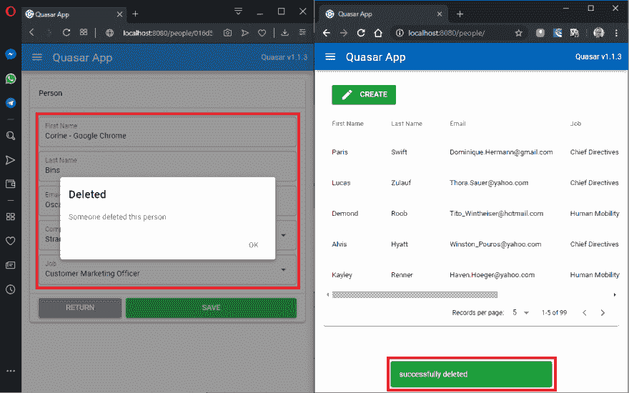](https://res.cloudinary.com/practicaldev/image/fetch/s--wW-wJn-z--/c_limit%2Cf_auto%2Cfl_progressive%2Cq_auto%2Cw_880/https://thepracticaldev.s3.amazonaws.com/i/wqd8x83sreint9kta8pr.png)

## [](#11-wrapping-the-pouchdb-instance-with-a-worker)11 用 Worker 包装 PouchDB 实例

到目前为止，所有的数据库操作都是在主线程中进行的，包括查询、更新、删除、同步等。

如果您有一个大型数据库，并且您经常创建或更新文档，您的 UI 可能会遭受持续阻塞，这将导致糟糕的用户体验。

无论如何，我真的建议您将任何数据库操作转移到一个单独的线程中。为此，你需要这个包:

```
yarn add worker-pouch 
```

### [](#111-web-worker)11.1 网络工作者

这是基本设置。您的第一步是验证`worker adapter`是否已配置。只要打开`src/boot/pouchdb/setup.js`，寻找:

```
import PouchDB from 'pouchdb'
import WorkerPouch from 'worker-pouch'

PouchDB.adapter('worker', WorkerPouch)
export default PouchDB 
```

我们的第二步，是配置本地数据库使用`worker adapter`。只需打开`src/boot/pouchdb/input.js`并更换:

```
async configure ({ isSSR, onChange }) {
  if (isSSR) {
    // ...
  } else {
    this.local = create('db')
    // ...
  }
} 
```

用

```
async configure ({ isSSR, onChange }) {
  if (isSSR) {
    // ...
  } else {
    this.local = create('db', { adapter: 'worker' })
    // ...
  }
} 
```

现在，我们所有的数据库操作都在一个独立的工作线程中。

### [](#112-shared-worker)11.2 共享工作者

同步过程的最大问题是，如果您打开了多个浏览器选项卡，它们都将访问 LocalStorage 的单个实例。如果您在其中一个选项卡中更新文档，其他选项卡将不会收到通知。

如果你想通知你所有的标签，你需要使用一个`SharedWorker`。在这种情况下，所有选项卡只有一个工作器。

TODO:等待[https://github.com/GoogleChromeLabs/worker-plugin/pull/42](https://github.com/GoogleChromeLabs/worker-plugin/pull/42)被合并。

### [](#113-service-worker)11.3 服务人员

除了这篇文章的名字，直到现在我们的应用程序还不是一个 PWA。让我们改变这一点。打开`./quasar.conf.js`并将`ssr > pwa`设置为`true`。

```
const path = require('path')
module.exports = function (ctx) {
  return {
    ssr: {
      pwa: true
    }
  }
} 
```

现在，工具箱已经配置好了，我们的应用程序有了一个服务人员，但我们对它没有很大的控制权，无论如何我们可以改变这一点。打开你的。/quasar.conf.js，并将您的 pwa > workboxPluginMode 配置为 InjectManifest:

```
const path = require('path')
module.exports = function (ctx) {
  return {
    pwa: {
      workboxPluginMode: 'InjectManifest'
    }
  }
} 
```

现在，我们需要编辑`./src-pwa/custom-service-worker.js`如下所示:

```
/*
 * This file (which will be your service worker)
 * is picked up by the build system ONLY if
 * quasar.conf > pwa > workboxPluginMode is set to "InjectManifest"
 */
/*eslint-disable*/
workbox.core.setCacheNameDetails({prefix: "pouchdb-offline"})

self.skipWaiting()
self.__precacheManifest = [].concat(self.__precacheManifest || [])
workbox.precaching.precacheAndRoute(self.__precacheManifest, {
  "directoryIndex": "/"
})
workbox.routing.registerRoute("/", new workbox.strategies.NetworkFirst(), 'GET')
workbox.routing.registerRoute(/^http/, new workbox.strategies.NetworkFirst(), 'GET')

self.addEventListener('activate', function(event) {
  event.waitUntil(self.clients.claim())
}) 
```

为了将数据库操作转移到`Service Worker`中，我们需要配置 webpack，这样它将能够传输一些依赖项。

```
yarn add --dev serviceworker-webpack-plugin 
```

再次编辑`./quasar.conf.js`:

```
const path = require('path')
module.exports = function (ctx) {
  return {
    build: {
      extendWebpack (cfg, { isServer }) {
        cfg.resolve.alias['pouchdb-promise'] = path.join(__dirname, '/node_modules/pouchdb-promise/lib/index.js')
        cfg.module.rules.push({
          enforce: 'pre',
          test: /\.(js|vue)$/,
          loader: 'eslint-loader',
          exclude: /node_modules/,
          options: {
            formatter: require('eslint').CLIEngine.getFormatter('stylish')
          }
        })

        if (!isServer) {
          const worker = new ServiceWorkerWebpackPlugin({
            entry: path.join(__dirname, 'src-pwa/pouchdb-service-worker.js'),
            filename: 'pouchdb-service-worker.js'
          })
          cfg.plugins = cfg.plugins || []
          cfg.plugins.push(worker)
        }
      }
    }
  }
} 
```

现在，创建`./src-pwa/pouchdb-service-worker.js`并编辑你的内容如下:

```
/*eslint-disable*/
let registerWorkerPouch = require('worker-pouch/worker')
let PouchDB = require('pouchdb')

PouchDB = PouchDB.default && !PouchDB.plugin ? PouchDB.default : PouchDB
registerWorkerPouch = registerWorkerPouch.default && !registerWorkerPouch.call ? registerWorkerPouch.default : registerWorkerPouch

self.registerWorkerPouch = registerWorkerPouch
self.PouchDB = PouchDB 
```

最后，修改`./src-pwa/custom-service-worker.js`以导入与工人邮袋相关的脚本并注册它们:

```
/*
 * This file (which will be your service worker)
 * is picked up by the build system ONLY if
 * quasar.conf > pwa > workboxPluginMode is set to "InjectManifest"
 */
/*eslint-disable*/
importScripts(`pouchdb-service-worker.js`)
workbox.core.setCacheNameDetails({prefix: "pouchdb-offline"})

self.skipWaiting()
self.__precacheManifest = [].concat(self.__precacheManifest || [])
workbox.precaching.precacheAndRoute(self.__precacheManifest, {
  "directoryIndex": "/"
})
workbox.routing.registerRoute("/", new workbox.strategies.NetworkFirst(), 'GET')
workbox.routing.registerRoute(/^http/, new workbox.strategies.NetworkFirst(), 'GET')

registerWorkerPouch(self, PouchDB)
self.addEventListener('activate', function(event) {
  event.waitUntil(self.clients.claim())
}) 
```

我们需要修改我们的`./src/boot/pouchdb/index.js`，以便本地`pouchdb`实例指向`Service Worker` :

```
async configure ({ isSSR, onChange }) {
  if (isSSR) {
    // ...
  } else {
    if ('serviceWorker' in navigator) {
      if (!navigator.serviceWorker.controller) {
        await new Promise(resolve => {
          navigator.serviceWorker.addEventListener('controllerchange', resolve, { once: true })
        })
      }
      this.local = create('db', {
        adapter: 'worker',
        worker () {
          return navigator.serviceWorker
        }
      })
    } else {
      this.local = create('db', { adapter: 'worker' })
    }
    // ...
  }
} 
```

如果您检查您的网络选项卡，它现在应该看起来像:

[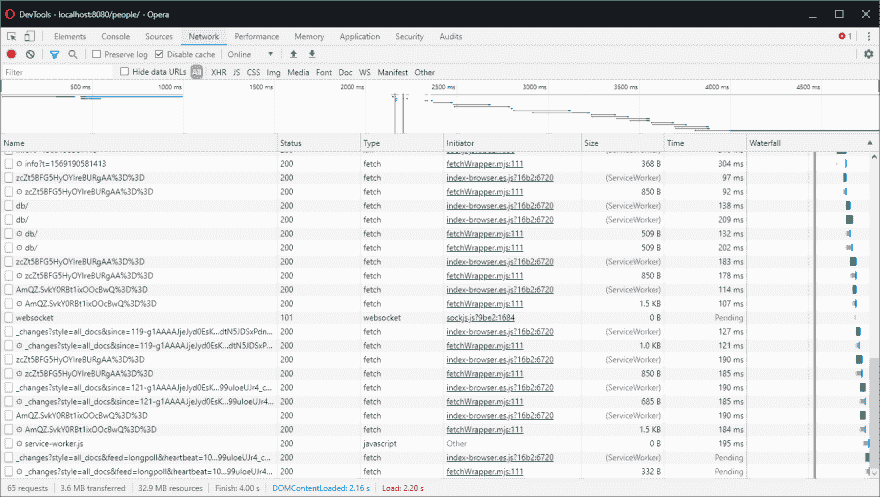T2】](https://res.cloudinary.com/practicaldev/image/fetch/s--F3Vt67uL--/c_limit%2Cf_auto%2Cfl_progressive%2Cq_auto%2Cw_880/https://thepracticaldev.s3.amazonaws.com/i/ncqyp91tauia2rsuwpqe.png)

### [](#114-silver-bullet)11.4 银子弹

你不知道选哪个工人？使用`SharedWorker`，因为它没有超过`DedicatedWorker`的缺点，并且`ServiceWorker`在应用程序关闭后不会保持活动状态。

## [](#12-syncing-when-the-app-is-closed)12 应用程序关闭时同步

**这只是一个概述**

只有在应用程序打开时,`Service Worker`才会保持活动状态。即使我们将数据库操作转移到`Service Worker`中运行，一旦应用程序关闭，同步也会停止。

为了让数据库即使在应用程序关闭时也能同步，我们需要使用 [web-push](https://www.npmjs.com/package/web-push) 将我们的服务器转换为推送服务器，之后，我们需要将客户端登录到推送服务器。

在配置了推送之后，我们可以配置一个 cron 作业来定期发送推送(比如每 30 分钟一次)，客户端将在每次收到通知时启动同步过程。

## [](#13-repository)13 号仓库

你可以在这里查看最终项目:
[https://gitlab.com/TobyMosque/quasar-couchdb-offline](https://gitlab.com/TobyMosque/quasar-couchdb-offline)