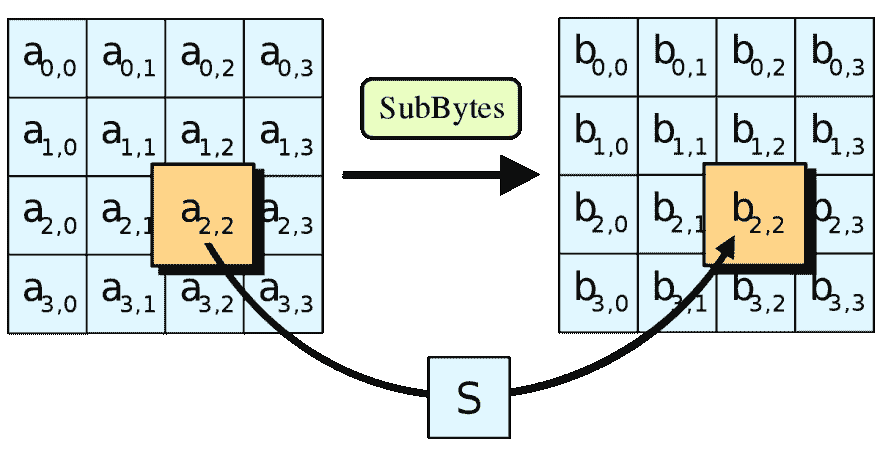

# 使用 Trezor 的 Python 加密

> 原文:[https://dev . to/codesharedot/python-encryption-with-tre zor-31i 6](https://dev.to/codesharedot/python-encryption-with-trezor-31i6)

Trezor 是一个硬件钱包[用于多种用途](https://dev.to/codesharedot/trezor-hardware-wallet-with-python-16fo)。例如，您可以用它来加密/解密消息。

在本文中，您将学习如何创建一个简单的程序，在 Trezor 硬件钱包的帮助下对消息进行加密和解密。

这是一个终端应用，但是你可以用 PyQt 为它创建一个 GUI。

我会试试看。

## [](#setup)设置

那么我们该怎么做呢？首先确保你知道 [python 基础知识](https://pythonbasics.org)。你需要 Python 3.x，不能用老的 2.x，那就装 trezorlib。

```
pip install trezor 
```

你可能还知道一些其他的模块。

[T2】](https://res.cloudinary.com/practicaldev/image/fetch/s--3LlH30cX--/c_limit%2Cf_auto%2Cfl_progressive%2Cq_auto%2Cw_880/https://proxy.duckduckgo.com/iu/%3Fu%3Dhttps%253A%252F%252Fthumbs.gfycat.com%252FAnguishedWeepyBluebottlejellyfish-mobile.jpg%26f%3D1%26nofb%3D1)

## [](#example)举例

我要做的程序将要求用户提供一条消息，对它进行加密，然后要求确认加密和解密。

像这样连接到 trezor:

```
#!/usr/bin/python3
device = get_transport()
client = TrezorClient(transport=device, ui=ui.ClickUI()) 
```

然后我创建加密和解密函数:

```
#!/usr/bin/python3
def encrypt(key, value):
    addr = [0,1,2]
    enc = misc.encrypt_keyvalue(client, addr, key, value, ask_on_encrypt=True, ask_on_decrypt=True)
    return enc

def decrypt(key, value):
    addr = [0,1,2]
    dec = misc.decrypt_keyvalue(client, addr, key, binascii.unhexlify(value), ask_on_encrypt=True, ask_on_decrypt=True)
    return dec 
```

这种实现使用 [AES 分组密码](https://en.wikipedia.org/wiki/Advanced_Encryption_Standard)，也就是加密算法。

[T2】](https://res.cloudinary.com/practicaldev/image/fetch/s--D9YHpEhZ--/c_limit%2Cf_auto%2Cfl_progressive%2Cq_auto%2Cw_880/https://proxy.duckduckgo.com/iu/%3Fu%3Dhttps%253A%252F%252Fupload.wikimedia.org%252Fwikipedia%252Fcommons%252Fthumb%252Fa%252Fa4%252FAES-SubBytes.svg%252F1200px-AES-SubBytes.svg.png%26f%3D1%26nofb%3D1)

(是的，我们现在跳过解释算法)。

为什么这很重要？这意味着块的消息长度必须是 16 的倍数。要确保这一点，您可以使用简单的填充:

```
plain = plain.ljust(256, ' ') 
```

密钥是硬编码在代码中的

```
key = "password" 
```

那你要崔卓做什么？在这个实现中，您需要连接 Trezor 来解密和加密消息。把它想象成 U2F。

当然，在没有编译代码的情况下，攻击者可以很容易地修改它。总体来说，第一次尝试。

[T2】](https://res.cloudinary.com/practicaldev/image/fetch/s--jvWuLZfE--/c_limit%2Cf_auto%2Cfl_progressive%2Cq_66%2Cw_880/https://proxy.duckduckgo.com/iu/%3Fu%3Dhttps%253A%252F%252Fthumbs.gfycat.com%252FScornfulAltruisticAcouchi-size_restricted.gif%26f%3D1%26nofb%3D1)

无论如何，不要硬编码密码。

总结和一些更多的这个和那个:

```
#!/usr/bin/python3
import unittest
import common
import binascii
from trezorlib.tools import parse_path
from trezorlib import tezos, ui, device
from trezorlib import messages as proto
from trezorlib.transport import TransportException  
from trezorlib.exceptions import TrezorFailure
from trezorlib import btc, coins, messages as proto, tools, ui
from trezorlib.client import TrezorClient
from trezorlib.transport import get_transport
from trezorlib import misc

device = get_transport()
client = TrezorClient(transport=device, ui=ui.ClickUI())

def encrypt(key, value):
    addr = [0,1,2]
    enc = misc.encrypt_keyvalue(client, addr, key, value, ask_on_encrypt=True, ask_on_decrypt=True)
    return enc

def decrypt(key, value):
    addr = [0,1,2]
    dec = misc.decrypt_keyvalue(client, addr, key, binascii.unhexlify(value), ask_on_encrypt=True, ask_on_decrypt=True)
    return dec

plain = input("Enter message: ")
plain = plain.ljust(256, ' ')
message = plain.encode()

key = "password"
res = encrypt(key, message)
print(res.hex())

dec = decrypt(key,res.hex())
print(dec) 
```

相关链接:

*   [Trezor 硬件钱包](http://trezor.io)
*   [学习 Python](https://pythonbasics.org/)
*   [基本 Trezor 连接](https://dev.to/codesharedot/trezor-hardware-wallet-with-python-16fo)