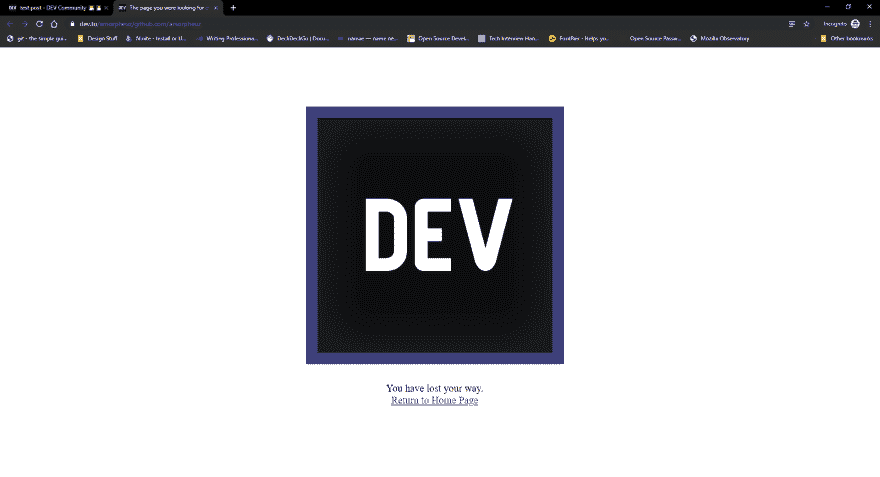

# 测试岗位

> 原文:[https://dev.to/amorpheuz/test-post-508b](https://dev.to/amorpheuz/test-post-508b)

发布测试用例:

# [ 评论中的链接被开发者追加到 URL  #4101](https://github.com/thepracticaldev/dev.to/issues/4101) 

[](https://github.com/Amorpheuz) **[Amorpheuz](https://github.com/Amorpheuz)** posted on [<time datetime="2019-09-24T16:10:01Z">Sep 24, 2019</time>](https://github.com/thepracticaldev/dev.to/issues/4101)

**描述一下当我点击文章[评论中的 leanpub 链接时的错误](https://dev.to/devteam/your-first-year-in-code-now-available-in-print-3pai)**,你的第一年代码:现已出版！通过 [Issac](https://dev.to/isaacdlyman/comment/flcd) 它把我重定向到[https://dev . to/isaacdlyman/comment/lean pub . com/first year incode](https://dev.to/isaacdlyman/comment/leanpub.com/firstyearincode)而不是[https://leanpub.com/firstyearincode](https://leanpub.com/firstyearincode)。只是为了确认一下，我还创建了一篇测试文章[这里](https://dev.to/amorpheuz/test-post-508b)有一个测试评论，似乎也有同样的问题！

却被 dev.to 的 404 页面击中。

```
base-21348764b2d6ec27daf94a953246cd11e24aac20da16f75fca16b9ff96b994a8.js:70 GET https://dev.to/amorpheuz/github.com/amorpheuz?i=i 404
XMLHttpRequest.send @ base-21348764b2d6ec27daf94a953246cd11e24aac20da16f75fca16b9ff96b994a8.js:70
w @ base-21348764b2d6ec27daf94a953246cd11e24aac20da16f75fca16b9ff96b994a8.js:111
m @ base-21348764b2d6ec27daf94a953246cd11e24aac20da16f75fca16b9ff96b994a8.js:111 
```

该元素似乎编码正确`<a href="github.com/amorpheuz" rel="nofollow">github.com/amorpheuz</a>`

[T2】](https://user-images.githubusercontent.com/22113778/65528914-dfe14a80-df12-11e9-9e23-4e4959c1e7e2.png)

**重现**

1.  转到[这里](https://dev.to/amorpheuz/test-post-508b)
2.  点击[评论](https://dev.to/amorpheuz/comment/fled)中的测试链接。
3.  被 404 页击中。

**预期行为**应该正确打开链接，而不附加 dev。

**截图** [](https://user-images.githubusercontent.com/22113778/65529320-8af20400-df13-11e9-899e-b7519c6db524.png)

**桌面(请填写以下信息):**

*   操作系统:Windows 10
*   浏览器:谷歌浏览器
*   版本:77.0.3865.90(官方版本)(64 位)

**智能手机(请填写以下信息):**

*   设备:诺基亚 6.1
*   OS: Android 9
*   浏览器:谷歌浏览器
*   版本:77.0.3865.90

**附加上下文**

[View on GitHub](https://github.com/thepracticaldev/dev.to/issues/4101)