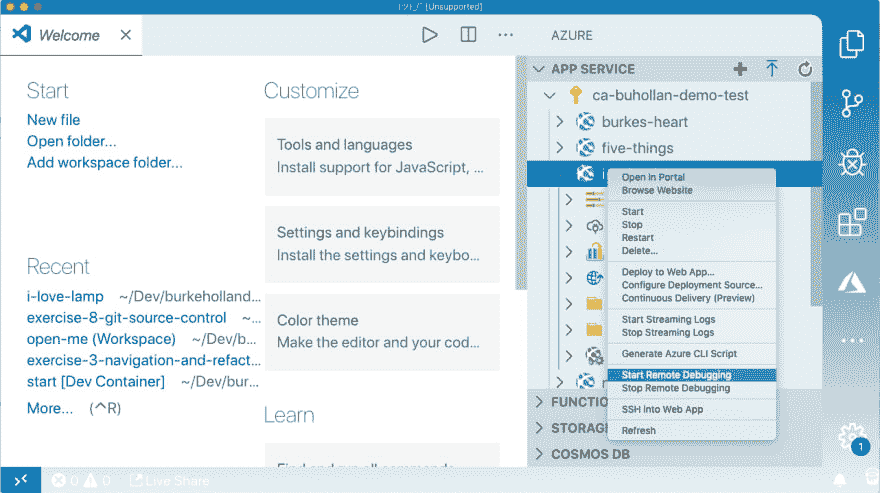
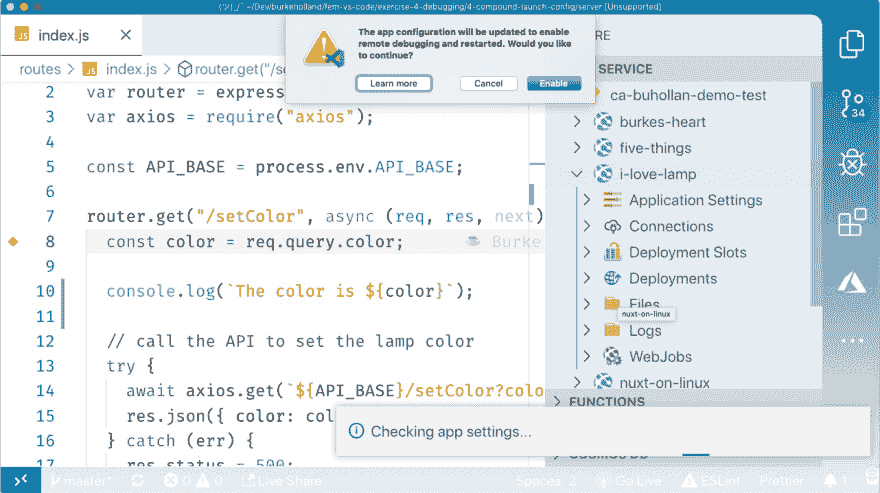
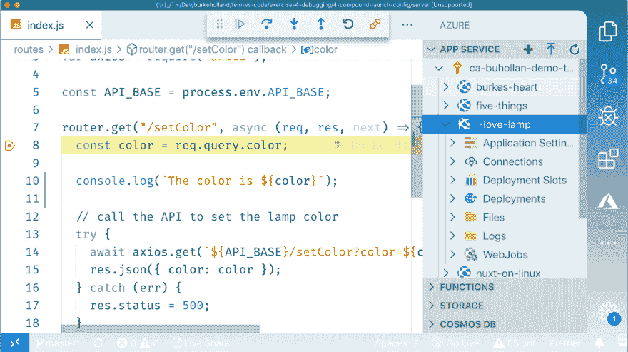
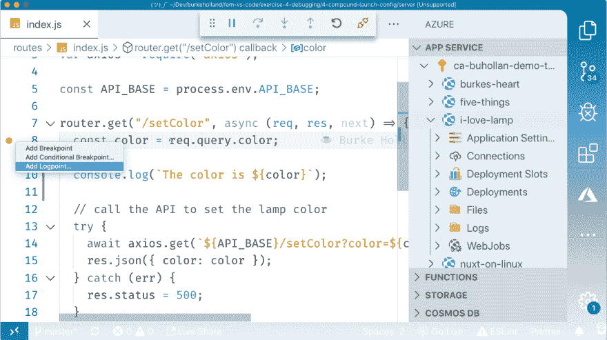
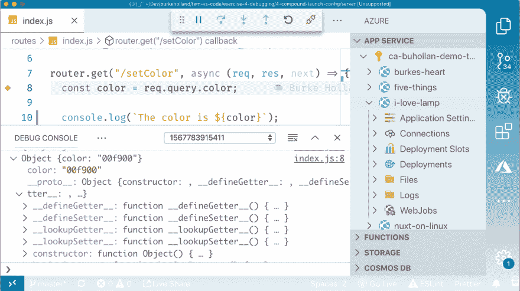
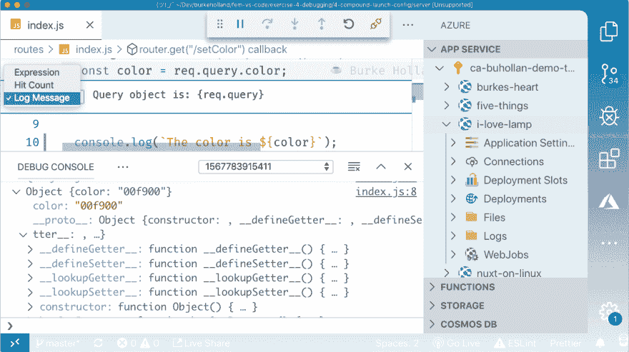

# 继续，在生产中调试您的应用程序

> 原文:[https://dev . to/Burke Holland/go-ahead-debug-your-apps-in-production-1h 09](https://dev.to/burkeholland/go-ahead-debug-your-apps-in-production-1h09)

程序员喜欢绝对地说话。永远不要在星期五投入生产。千万不要强行推进回购。不要在生产中调试。

从不在生产中调试？从来没有？

这将会很难，因为任何曾经构建过应用程序的人都会告诉你，这只是时间问题，这正是你将要做的事情。再多的测试也无法完全缓解这一事实。我们并不完美。这反映在我们做的每一件事上。我们所能做的最好的事情就是降低风险并快速应对失败。

这篇文章是关于快速应对失败的。说到失败，我算是个专家。我们将了解如何在生产中调试节点应用程序，以及如何在不阻塞执行的情况下完成这项工作。

## [](#providers-that-support-remote-debugging)支持远程调试的提供者

一些宿主提供程序支持远程调试。大多数情况下，您可以使用 ngrok 来完成。这里有一个关于如何使用 ngrok 和 Heroku 的例子。

Azure 通过 VS 代码的 [AppService 扩展提供了对远程调试的原生支持。](https://marketplace.visualstudio.com/items?itemName=ms-azuretools.vscode-azureappservice&WT.mc_id=devto-blog-buhollan)

## [](#putting-the-app-in-debug-mode)将应用置于调试模式

在调试之前，必须在本地打开与部署到服务器上的项目相同的结构。例如，如果我有一个带有“服务器”文件夹的项目，并且在构建过程中，只有“服务器”文件夹被部署，那么我必须在 VS 代码中将该服务器文件夹作为根文件夹打开。现在我的机器一字不差地模仿 Azure 中的内容。

要调试已经部署到 Azure 的应用程序，请右键单击它并选择“开始远程调试”。

[T2】](https://res.cloudinary.com/practicaldev/image/fetch/s--AGqL0NXv--/c_limit%2Cf_auto%2Cfl_progressive%2Cq_auto%2Cw_880/https://thepracticaldev.s3.amazonaws.com/i/rpp92o3mqmti3pjvl5vl.png)

VS 代码会提示你确定你想这么做。原因是这会使你的站点进入调试模式，这会导致性能问题。但是，如果您正处于需要在生产中进行调试的阶段，您可能就不在乎了。

[T2】](https://res.cloudinary.com/practicaldev/image/fetch/s--RxBN3xde--/c_limit%2Cf_auto%2Cfl_progressive%2Cq_auto%2Cw_880/https://thepracticaldev.s3.amazonaws.com/i/waie7ydivsknt5tpbp38.png)

站点将被切换到调试模式，VS 代码将被附加。现在，您会在顶部看到调试栏。

## [](#breakpoints-in-production-apps)生产 app 中的断点？

我是说，我们已经在生产中调试了。我们已经处于“午夜威胁等级”了。一切皆有可能。

放入一个断点，然后点击生产中的站点。它会像在本地运行一样中断 VS 代码。

[T2】](https://res.cloudinary.com/practicaldev/image/fetch/s--dVrQOMQk--/c_limit%2Cf_auto%2Cfl_progressive%2Cq_auto%2Cw_880/https://thepracticaldev.s3.amazonaws.com/i/5jsotpai0ms7f5pcrdlf.png)

你为什么会想这么做呢？在生产应用程序中添加断点会暂停所有人的执行，对吗？是的。是的，它是。

但是假设你已经有了一个生产应用程序，它要么关闭，要么不起作用。您已经检查了日志，查看了所有的仪器，但是您不知道哪里出了问题。在这一点上，你有什么损失呢？你的应用无法运行。添加一个断点不会让事情变得更糟。

不过，这是一件非常棘手的事情。更有可能的是，您在生产中遇到的问题并没有导致整个应用程序停止运行，而是导致了一些问题。关闭应用程序的其余部分来解决问题不是一个可行的策略。

在这种情况下，您可以使用 Logpoints。

## [](#logpoints-in-lieu-of-breakpoints)代替断点的日志点

日志点就像断点，但是它们不会暂停执行。他们只是把事情记录下来。这对于能够检查生产中的对象和值非常有帮助。通过这种方式，您可以很快找到错误的根本原因，因为您处于错误**已经出现**的环境中。你不必尝试去创造它。

在 VS 代码中，右击装订线并选择“添加日志点”。

[T2】](https://res.cloudinary.com/practicaldev/image/fetch/s--6qOo9AhF--/c_limit%2Cf_auto%2Cfl_progressive%2Cq_auto%2Cw_880/https://thepracticaldev.s3.amazonaws.com/i/hujgndi4zt22qr8irmve.png)

默认情况下，日志点是简单的字符串。如果你输入“hello world”，它会在 VS 代码调试控制台中记录下来。如果你想要某个对象或表达式的值，你需要用花括号把它括起来。

```
Query string value is: {req.query} 
```

注销后，您可以像在浏览器开发工具中一样展开对象。

[T2】](https://res.cloudinary.com/practicaldev/image/fetch/s--LkRML_QG--/c_limit%2Cf_auto%2Cfl_progressive%2Cq_auto%2Cw_880/https://thepracticaldev.s3.amazonaws.com/i/5sx77x28apf1skdcn513.png)

您还可以通过“Hitcount”来记录日志点，只要一行代码被点击一定次数，您就可以记录日志。也可以通过表达式来实现，这相当于条件断点。

[T2】](https://res.cloudinary.com/practicaldev/image/fetch/s--2Vhr4KhD--/c_limit%2Cf_auto%2Cfl_progressive%2Cq_auto%2Cw_880/https://thepracticaldev.s3.amazonaws.com/i/z29bfw0iwhknx9nhahsx.png)

当您发现问题时(如果您是我，几乎总是缺少环境变量)，您可以断开调试器，VS 代码将提示您让应用程序退出调试模式。

## [](#debug-in-production-its-ok)生产中调试，没事

我想说的是，有时候事情升级得很快。“永远不要在产品中调试”是个不错的建议，但是当一切都已经成为“苍蝇王”的时候，我会说去做吧。它可能会节省你的工作时间和停机时间。

阅读有关在生产和登录点中调试节点应用程序的更多信息...

*   节点的 Azure 远程调试
*   [VS 代码调试和登录点](https://code.visualstudio.com/docs/editor/debugging?WT.mc_id=devto-blog-buhollan)