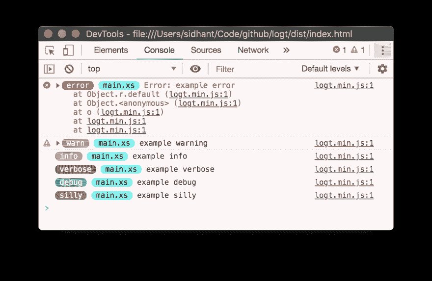
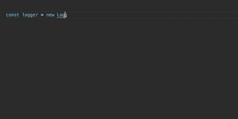

# 用于浏览器的彩色记录器

> 原文:[https://dev . to/sidhantpanda/a-colorful-logger-for-the-browser-1id 8](https://dev.to/sidhantpanda/a-colorful-logger-for-the-browser-1id8)

介绍一个专为简化前端开发而构建的彩色日志记录器— [logt](https://www.npmjs.com/package/logt)

[T2】](https://res.cloudinary.com/practicaldev/image/fetch/s--Rwjqdg0P--/c_limit%2Cf_auto%2Cfl_progressive%2Cq_auto%2Cw_880/https://i.imgur.com/efMwTMd.png)

## [](#features)特性

*   **小库大小**——只有~1.3KB 的 gzipped！
*   **彩色标签**有助于根据重要性区分日志。
*   **日志级别**隐藏不太重要的日志消息。
*   **以编程方式显示隐藏消息**打印由于日志级别而隐藏的日志。
*   **Built with TypeScript** for detailed type info and that sweet sweet autocomplete.

    [T2】](https://i.giphy.com/media/ckNv6K3sRo8dWOUtH7/giphy.gif)

## [](#installation)安装

```
$ npm i logt -S 
```

## [](#usage)用法

你可以在你的前端项目中使用这个记录器。您可以选择作为 ES6 模块，或者直接将脚本包含在 HTML 中。

#### [](#as-an-es6-module)作为 ES6 模块

```
import LogT from "logt";

const LOG_TAG = "sample tag";
const logger = new LogT("error");

logger.error(LOG_TAG, new Error("example error")); 
```

#### [](#include-in-html)包含在 HTML 中

```
<script src="https://cdn.jsdelivr.net/gh/sidhantpanda/logt/dist/logt.min.js"></script> <script>
var LOG_TAG = 'sample tag';
var logger = createLogger('error');

logger.error(LOG_TAG, new Error('example error'));
</script> 
```

## [](#peek-into-hidden-logs)窥视隐藏日志

这个特性允许在开发者工具中快速查看隐藏的日志，而无需修改代码。记录器在本地存储所有隐藏的消息。

```
const logger = new LogT(0); // Only error logs will printed to console
logger.warn('TAG', 'warning message'); // Will not print anything to console
logger.info('TAG', 'info message'); // Will not print anything to console
logger.debug('TAG', 'debug message'); // Will not print anything to console
logger.silly('TAG', 'silly message'); // Will not print anything to console

logger.showHidden(1); // Will print the warning message
logger.showHidden(2); // Will print the info warning message
logger.showHidden(5); // Will print the debug as well as silly message 
```

查看 Github 上的项目，了解更多详细文档！