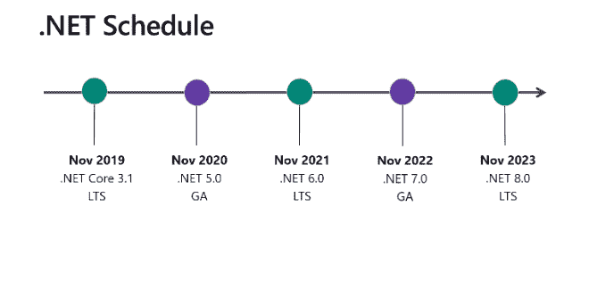

# 。NET Core 3.0 -新功能和即将推出的功能

> 原文：<https://dev.to/bharatdwarkani/net-core-3-0-what-s-new-and-upcoming-next-4fpa>

。昨天发布的 NET Core 3.0 月 23 日。

**宣布。NET Core 3.0**
[https://dev blogs . Microsoft . com/dotnet/announcing-NET-Core-3-0/](https://devblogs.microsoft.com/dotnet/announcing-net-core-3-0/)

围棋虚拟直播会议—[https://www.dotnetconf.net/agenda](https://www.dotnetconf.net/agenda)

**要点**

*   性能大大提高
*   C# 8.0 支持。
*   WPF 和 WF 支持。NET Core 3.0，但还不能在 Linux 上运行。
*   物联网、Rasberry Pi 的更多改进。
*   高性能 JSON APIs
*   。NET 核心应用程序现在有了可执行文件
*   在单个 exe 中打包应用程序的所有依赖项，并提供微调支持。
*   gRPC 支持无服务器编程，作为 WCF 服务的替代。

**ASP.NET 核心和 Blazor 更新。NET Core 3.0**
[https://dev blogs . Microsoft . com/aspnet/ASP-NET-Core-and-blazor-updates-in-NET-Core-3-0/](https://devblogs.microsoft.com/aspnet/asp-net-core-and-blazor-updates-in-net-core-3-0/)

**客户端 Blazor 将于 2020 年 5 月发布稳定版本**

**实体框架核心 3.0 和实体框架 6.3**
[https://dev blogs . Microsoft . com/dotnet/announding-ef-Core-3-0-and-ef-6-3-general-avail ability](https://devblogs.microsoft.com/dotnet/announcing-ef-core-3-0-and-ef-6-3-general-availability)

**要点:**

*   受限客户端评估—一个非常需要的功能。
*   每个 LINQ 查询只有一条 SQL 语句
*   Cosmos DB 支持
*   可为空的引用类型。

**ASP.NET Core 3.0 的新增功能**
[https://docs . Microsoft . com/en-us/aspnet/Core/release-notes/aspnetcore-3.0？view=aspnetcore-3.0](https://docs.microsoft.com/en-us/aspnet/core/release-notes/aspnetcore-3.0?view=aspnetcore-3.0)

**要点:**

*   性能提升。
*   Blazor 支持
*   gRPC —是一个流行的高性能 RPC(远程过程调用)框架。
*   SignalR 改进—自动重新连接支持。
*   适用于循环、异步可枚举。
*   通用主机支持
*   反向代理下托管应用的改进。
*   Identity server 集成模板。
*   同一项目下独立前端(Angular，React)和后端 API 的项目模板。
*   微服务的项目模板。

**xa marin**
T3】新功能 https://dev blogs . Microsoft . com/xa marin/xa marin-dotnet-conf-2019/

**要点:**

*   XAML 热重装为 Xamarin。形式
*   Xamarin 热重启 iOS 13 和 Android 10
*   iOS 13 和 Android 10 支持

**Visual Studio 2019–16.3**
T3】https://dev blogs . Microsoft . com/Visual Studio/dot-net-core-support-in-Visual-Studio-2019-version-16-3/

从…迁移。NET core 2.2 到 3.0
T3】https://docs . Microsoft . com/en-us/aspnet/core/migration/22-to-30？view=aspnetcore-3.0

下一步是什么？
**。网芯 3.1** LTS 将于 2019 年 11 月
**发布。NET 5**——2020 年 11 月目标是将所有平台整合在同一屋檐下。网络 5

[T6】](https://res.cloudinary.com/practicaldev/image/fetch/s--p0Z85RJD--/c_limit%2Cf_auto%2Cfl_progressive%2Cq_auto%2Cw_880/https://thepracticaldev.s3.amazonaws.com/i/wkmt2ert4qf8g4akc1wd.png)

查看我的网站，获取更多与 ASP.NET 核心相关的博客和资源链接—[https://sharetechlinks.com](https://sharetechlinks.com)