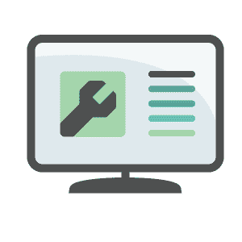
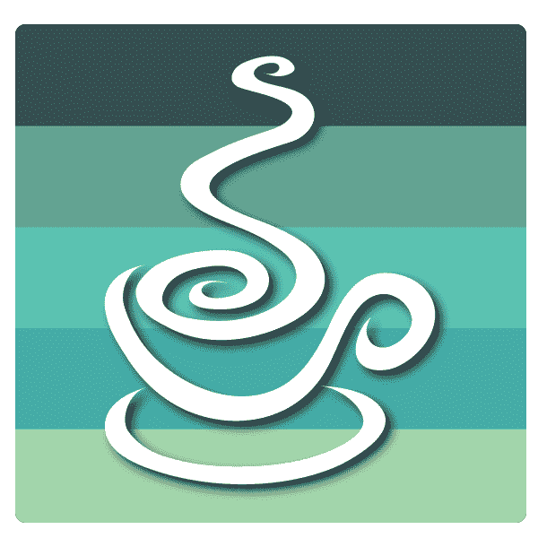

# 什么是现场可靠性工程师？你应该成为其中一员吗？

> 原文:[https://dev . to/scal yr/what-a-site-reliability-engineer-should-you-be-one-3ig 1](https://dev.to/scalyr/what-is-a-site-reliability-engineer-should-you-become-one-3ig1)

尽管站点可靠性工程已经存在了一段时间，但它只是最近才在通用软件界获得名声。但是仍然有很多关于什么是现场可靠性工程师(SRE)和做什么的问题。

我们所知道的大部分来自谷歌的《站点可靠性工程》一书。在这篇文章中，我们会多次提到这本书。

sre 被比作运营组、系统管理员等等。

但是这种比较没有涵盖他们在当今现代软件环境中的角色。

sre 涵盖的责任比运营更多。虽然他们通常有系统管理的背景，但他们也将软件开发技能带入角色中。

SREs 结合了所有这些技能，确保复杂的分布式系统平稳运行。

那么他们是如何做到这一切的呢？

请继续阅读，了解什么是 sre，以及他们如何通过履行职责来实现这一目标。

[T2】](https://res.cloudinary.com/practicaldev/image/fetch/s--dSJS4NIs--/c_limit%2Cf_auto%2Cfl_progressive%2Cq_auto%2Cw_880/https://library.scalyr.com/2019/01/22215455/Computer_with_wrench_and_Scalyr_colors_signifying__site_reliability_engineer-300x300.png)

## 什么是现场可靠性工程师？

让我们从一个定义开始我们的帖子。什么是现场可靠性工程师？

首先，[站点可靠性工程](https://www.scalyr.com/blog/what-is-sre/)的概念首先是由谷歌的一个工程师团队写的[的同名书籍](https://landing.google.com/sre/books/)引入的。

维基百科是这样定义网站可靠性工程的:

> 站点可靠性工程(SRE)是一门学科，它结合了软件工程的各个方面，并将它们应用于基础设施和操作问题。

简而言之，我们可以说,**SRE 是一个在编码/自动化方面有着坚实背景的专业人士，他利用这些经验来解决基础设施和运营方面的问题。**

等一下...这听起来是不是有点耳熟？SRE 和德沃普斯有什么不同？

首先，你不应该把 DevOps 当成一个角色。

更确切地说，这是团队文化的一部分。它不能也不应该分配给一个人，而是作为一个团队来执行。

另一方面，SRE 是创建和维护高可用性服务的实践。承担这个角色的专业人士应该是软件开发人员。

## 现场可靠性工程师做什么？

### 自动化所有的事情

SRE 角色和传统运营团队的一个不同之处在于自动化。

在过去，运营人员会通过执行脚本、按下按钮和执行其他手动操作来保持系统运行。然而，在 SRE 世界，人们非常重视自动化。

这个驱动来自哪里？SRE 角色的工程方面。

当你把软件开发人员放在一个相同的功能日复一日重复的位置时，他们将被迫自动化。这是软件开发人员最擅长的。

[T2】](https://res.cloudinary.com/practicaldev/image/fetch/s--AOCyIbRz--/c_limit%2Cf_auto%2Cfl_progressive%2Cq_auto%2Cw_880/https://library.scalyr.com/2018/07/19175223/iStock-542714868-1024x1024.png)

自动化并不停留在自动化软件构建和一些验收测试上。他们的自动化包括 CI/CD 和基础架构创建和修补，以及监控、警报和自动响应某些事件。

在谷歌的 SRE 书中，这也被称为消除辛劳:

> 辛劳是一种与运行生产服务相关的工作，这种工作往往是手动的、重复的、可自动化的、战术性的，缺乏持久的价值，并且随着服务的增长而线性扩展。
> 
> — *现场可靠性工程*

但是为什么我们如此关注减少辛劳呢？

减少工作量不仅使流程变得可重复和自动化，而且还增加了 sre 构建工具和调查基础设施变更以进一步提高站点可靠性的时间。

总之，工作越少，投入的时间和资源就越多，以确保您的软件生态系统可靠运行，并且您可以更快地交付商业价值。

### 监控分布式系统

随着分布式系统的普及，更需要加强监控。

您的应用程序已经启动并运行，这还不够。我们还需要确保基础设施正常工作，并且所有其他内部依赖项都可以访问和运行。

此外，应用程序的业务功能应该有适当的监控，以验证它们是否正常工作。

对于这部分工作，SREs 可以使用 Scalyr 这样的产品来监控和警告任何潜在的问题。这使他们能够实时监控系统，并跟踪可能表明可靠性降低的长期趋势。

### 提供随时待命的支持

与传统的运营角色类似，sre 花时间轮流值班。

除了监控基础设施和他们自己的服务之外，他们还可以让开发团队进行咨询和故障排除。

随叫随到是什么样子的？

通常情况下，sre 会根据一个时间表轮换待命角色，该时间表允许其他 sre 专注于工程设计，同时也不会导致待命工程师精疲力竭。随叫随到的轮换从连续几天到一周或更长时间不等。

当高优先级页面触发时，工程师将调查并诊断问题。SRE 也可能会吸引更多的工程师或软件开发人员来解决这个问题。

根据系统的 SLA，他们可能需要一起工作，在几分钟内解决问题。对于低优先级问题，SRE 通常在工作时间处理。

对于那些不喜欢在凌晨 3 点为发生的每一件小事从床上跳起来的工程师来说，这是一个好消息。

<figure>

<figcaption>Log4j</figcaption>

</figure>

### 管理事件

SRE 角色的一个重要部分是管理事故。

现在你可能会说这和随叫随到的责任没什么区别。你发现一个问题，然后解决它。会有多难呢？

为了管理事故，sre 需要雇用额外的专业技能来确保一切顺利进行。

例如，当发生中断时，可能有许多方法来诊断和尝试解决问题。

因此，为了正确管理事故，必须有人监控和促进所有相关人员的行动。这需要明确定义的角色。

虽然不是所有的公司都包括这些谷歌推荐的事件角色，但我们至少应该考虑它们。这些角色包括:

*   事故指挥官，对发生的所有事情保持高度关注。
*   对基础设施或系统执行流程或修改的工程师。
*   向客户和管理层传达正确信息的沟通角色。
*   负责计划任何会议、移交和后勤需求的计划角色。
*   如果没有明确定义的 sre 角色，当 sre 在没有预先协调和沟通的情况下尝试不同的解决方案时，我们可能会让他们互相影响。

### 促进尸检

现在，我们已经经历了一个事件，并在上面的章节中解决了它，我们准备好进行事后分析了。

通常，SRE 会促成或参与这些尸检。

尸检将所有相关方聚集在一起，对事故进行分析。目标是分析事故期间发生了什么，并找到根本原因。参与者还确定将来如何预防或解决事故。

下面列出了一些尸检结果:

*   提高可靠性或监控的故事。
*   有助于未来事故的附加文件。
*   进一步调查或测试，以证明与事故相关的任何假设。

### 跟踪停机

SRE 的另一项职责是跟踪停机。这最终有助于确定长期趋势，并帮助创建合理的 SLO 和 SLA。

跟踪的一个用途是监控低优先级事件。这些事件可能不会给消费者带来真正的问题，但着眼于长期趋势和时机可以帮助隔离和解决似乎没有根本原因的讨厌的错误。

### 与 SRE 和开发团队合作

除了在随叫随到期间支持开发团队之外，sre 还提供咨询和故障排除。

这可以帮助其他 SRE 团队和软件开发团队解决操作或可靠性问题。

[T2】](https://res.cloudinary.com/practicaldev/image/fetch/s--66FeqvSh--/c_limit%2Cf_auto%2Cfl_progressive%2Cq_auto%2Cw_880/https://library.scalyr.com/2019/08/30154258/Will-drive-changes.png)

在这种情况下，SRE 将评估当前的问题，并确定哪些问题可以通过自动化或工程工作来改善。SRE 也可能建议解决可靠性问题。

也许最重要的是，SRE 将推动团队过程的变化。这些变化将确保站点可靠性工程增强团队交付价值的能力。

### 创建服务水平指标和目标

当您听到一项服务已经达到或正在努力达到 99.99%的正常运行时间时，您正在谈论服务水平目标(SLO)。服务水平指标(SLI)衡量这些目标。

换句话说，SLI 是一个关于如何衡量 SLO 的协议。

SREs 通过提供历史服务性能的数据来帮助实现这些目标。他们还有助于为未来提供现实的目标，并可能为客户提供适当的 SLA 建议。

然后，SRE 会努力确保您的申请符合(但不超过)规定的 SLO。

现在你可能认为不努力超越 SLO 很奇怪。然而，让某些东西比它需要的更可靠是浪费资源。

SREs 平衡了客户的需求和所提供服务的目标。

### 职责可能有所不同

在本帖中，我们讨论了站点可靠性工程师参与的各种活动。尽管这些活动是由许多 sre 完成的，但它们并不是一成不变的。

[T2】](https://res.cloudinary.com/practicaldev/image/fetch/s--X8eex5kr--/c_limit%2Cf_auto%2Cfl_progressive%2Cq_auto%2Cw_880/https://library.scalyr.com/2018/07/19175348/HTTP-Monitor-What-Is-It-and-Why-Do-You-Need-It.png)

公司确实会根据需要改变他们在 SRE 的角色和职责。一般来说，处于 SRE 之旅不同阶段的公司可能有不同的需求。

例如，一家较新的公司可能需要 SRE 支持来控制一般的停机。大部分精力都花在基本的可靠性上。

然而，在这一过程中走得更远的其他公司可能已经消除了全公司范围的停机。他们可能会花更多的时间来改进或验证与业务相关的服务指标。

例如，一旦站点的总体可用性稳定可靠，您的披萨店应用程序可能需要对其披萨推荐进行新的监控。

## 你应该成为 SRE 吗？

如果你在自动化方面有扎实的基础，你应该考虑成为一名 SRE。

*   你是一个想提高你的编码技能的系统工程师吗？
*   你是一个想学习如何管理大型系统的开发人员吗？

如果以上任何一个问题的答案是“是”，那么这个角色就适合你。

这是了解 DevOps 世界最新发展的最佳方式。你也能够在目前需求旺盛的领域增加你的知识和技能。

## 结论

正如我们所讨论的，sre 花时间在技术和面向过程的职责上。

他们不仅仅是一个操作或系统管理团队。他们利用自己的工程技能来自动化和减少管理任务所需的手动干预。

此外，他们与其他工程团队合作，提供适当的监控、事件响应和管理。

随着时间的推移，这些功能提高了分布式系统的可靠性和维护成本。

最后，他们在您的组织中传播站点可靠性工程的文化，以便所有团队都学会在考虑可靠性的情况下做出决策。