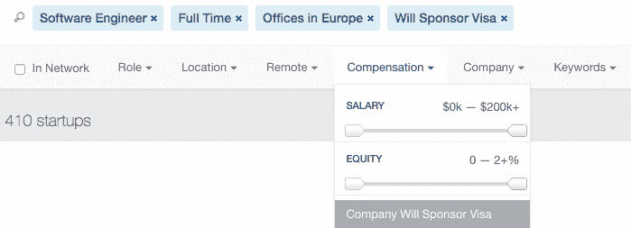
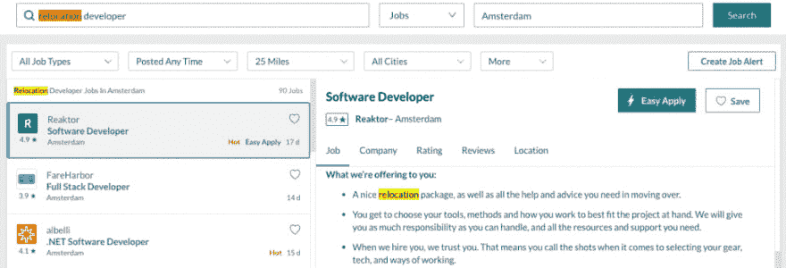
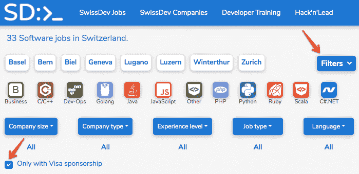
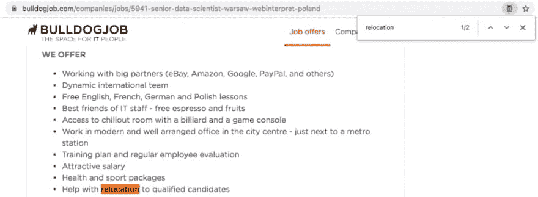
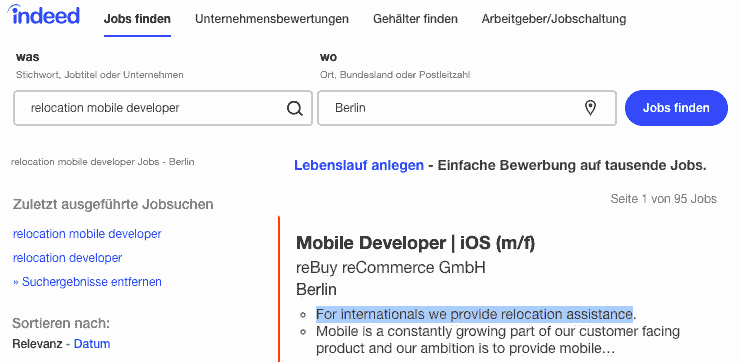
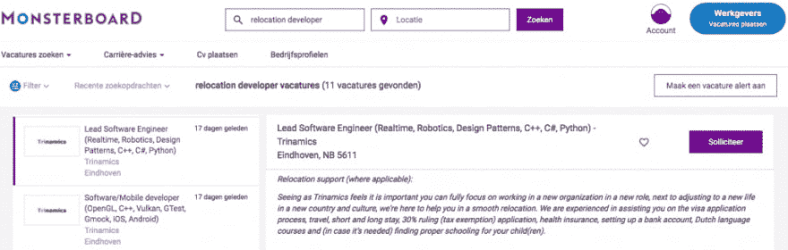

# 移居欧洲找技术工作的实用指南

> 原文：<https://dev.to/stetsenko_me/a-practical-guide-to-finding-a-tech-job-with-relocation-to-europe-36eh>

找一份技术工作本身很容易，但当你试图找到一份提供异地安置的工作时，就很有挑战性了。令人惊讶的挑战，因为越来越多的欧洲科技公司转向来自世界各地的人才。

让我们来看看一些方法，你可以使用求职网站来帮助你找到工作，重新安置到欧洲。

### 电报频道

Telegram is a powerful messaging app that is very flexible in its uses. One of the things that it is used for is to communicate new job postings, website updates, or news. Several Telegram channels exist specifically for jobs that offer relocation. Here are links to the two most popular:

*   [重定位](https://t.me/relocateme)
*   [国外工作](https://t.me/jobs_abroad)

您可以通过单击链接预览每个频道，而无需加入它们。页面加载后，单击预览频道。您不需要登录或下载任何东西来查看内容。

### 科技求职板和利基网站

#### [AngelList](https://angel.co/jobs)

It's now one of the go-to websites for people looking for tech jobs at startups. To filter for IT jobs with relocation, check the **Location** tab for Europe or a specific country and then go to the **Compensation** tab. You will find a section for “**Company Will Sponsor Visa**.” Without doing this step you will find any job available that meets the other criteria you select.

#### 

#### [玻璃门](https://www.glassdoor.co.uk/Job/relocation-developer-jobs-SRCH_KO0,20.htm)

Glassdoor is the place to not only get the inside scoop on your future employer but also look for (tech) jobs with relocation. When you go to search for a job, type “**relocation developer**” or “**relocation**” **and the title of another tech job** that you are looking to apply to. Fill out the filters for location and other job details to narrow down where you are searching.

#### 

#### 

因为 Glassdoor 没有专门针对重新定位的过滤器，所以您会发现一些不提供重新定位的工作，或者不是您在搜索结果中寻找的工作。然而，总的来说，网站在过滤他们方面做得很好。

#### [Relocate.me](https://relocate.me/?utm=5d8a09f7a8d291.98915085)

Why should you have to go to a regular job site when you are looking specifically for jobs that offer relocation? You don’t have to. Relocate.me is a website that specifically focuses on listing [tech jobs that offer relocation](https://relocate.me/search/?utm=5d8a0a2f0da571.69007838). All jobs come with relocation benefits, but they vary depending on the position and company. In addition to this, you have access to a wealth of useful [information on all things tech job relocation](https://relocate.me/learning-center).

#### [堆栈溢出作业](https://stackoverflow.com/jobs)

You can easily use the popular Stack Overflow website to find software engineering jobs offering relocation. To do this, go to the Jobs page and click the following options: “**Visa sponsor**” and “**Offers relocation**.” Both of them can be found under filters.

#### 

#### 

或者只需[点击此链接](https://stackoverflow.com/jobs?v=true&t=true)查看多个有工作安置帮助的职位空缺。

#### [Landing.jobs](https://landing.jobs/)

Dedicated to finding tech jobs in Europe, Landing.jobs is a good place to find employment with relocation. The main country that they feature is **Portugal**, but you can find jobs in other parts of Europe as well. When searching for jobs on the site, make sure to select the filter for “**visa & work permit**.”

*   [提供搬迁的工作](https://landing.jobs/jobs?page=1&rl=true&hd=false&t_co=false&t_st=false)
*   [提供重新安置和/或签证支持的工作](https://landing.jobs/jobs?page=1&vs=true&hd=false&t_co=false&t_st=false)

#### [jobs tech](https://www.jobsintech.io/)

JobsInTech is a simple website made by tech people for tech people to find jobs in the field. On JobsInTech you are able to see job opportunities from around the world, including in Europe. To view the list of jobs that offer relocation/visa sponsorship, [click here](https://www.jobsintech.io/jobs#q=&page=0&refinements=%5B%7B%22visa_sponsor%22%3A%22will_sponsor_visa%22%7D%2C%7B%22job_type%22%3A%22full-time%22%7D%5D).

#### [TechMeAbroad](https://techmeabroad.com/)

TechMeAbroad is a tech job search website that focuses on companies that are looking to hire talent from abroad. The only postings you will find on their site is for positions that are to be filled by international tech talent.

#### [GitHub 乔布斯](https://jobs.github.com/positions)

GitHub is another one of the top tech websites on the internet. Beyond its other features, the site has a job listing page. To help filter jobs, use the search bar to find relocation. Here are a few helpful search terms:

*   [搬迁支持](https://jobs.github.com/positions?utf8=%E2%9C%93&description=Relocation+support&location=)
*   [搬迁援助](https://jobs.github.com/positions?utf8=%E2%9C%93&description=Relocation+assistance&location=)
*   [搬迁包](https://jobs.github.com/positions?utf8=%E2%9C%93&description=Relocation+package&location=)

#### [启动。乔布斯](https://startup.jobs/)

Tech jobs at startups are very desirable, and Startup.Jobs is specifically dedicated to helping people find jobs at startups. The list of jobs on the site has startup positions available around the world. Some of the positions are also remote positions.

您可以使用关键字过滤器来过滤搜索列表。像“[重新安置](https://startup.jobs/?q=relocation&hPP=20&p=0&dFR%5Bcommitment%5D%5B0%5D=Full-Time&is_v=1)或“[签证](https://startup.jobs/?q=visa&hPP=20&p=0&dFR%5Bcommitment%5D%5B0%5D=Full-Time&dFR%5Bcommitment%5D%5B1%5D=Part-Time&dFR%5Bcommitment%5D%5B2%5D=Internship&dFR%5Bcommitment%5D%5B3%5D=Contractor&is_v=1)这样的关键词是很好的起点。确保还设置了位置。

#### [在爱沙尼亚工作](https://www.workinestonia.com/)

This is one of the first websites you should check if you're looking to move your career to Estonia. The website lists job opportunities for both tech and non-tech professionals. Here's a [link](https://www.workinestonia.com/latest-offers/?cat=41) to all the IT jobs that are currently available.

#### [柏林发展工作岗位](https://berlindevjobs.com/)

The Berlin Dev Jobs is a small website that allows companies to post open dev positions in Berlin. The page is simple both to read and submit too, making it a great place to turn. When you read through the list, you will see “**paid relocation**” and/or “**visa sponsorship**” below listings to let you know about the benefit.

#### 

#### 

#### [柏林创业公司乔布斯](https://berlinstartupjobs.com/)

Berlin Startup Jobs is a website that specifically focuses on posting jobs at startups in Berlin. There is no tag specifically for **relocation support** or **relocation assistance**, but you can put it in the search box, and it will pull up any job that mentions relocation.

*   [关键字为“搬迁支持”的职位空缺](https://berlinstartupjobs.com/?s=relocation%20support&is_v=1)
*   [关键字为“搬迁援助”的职位空缺](https://berlinstartupjobs.com/?s=relocation%20assistance&is_v=1)

#### [德国 IT 工作岗位](http://germanitjobs.com/)

The slogan of German IT Jobs is “we get programmers hired in Germany.” Right on the homepage, you can see a variety of tech jobs that are open to foreign applicants and offer relocation support. To view all job opportunities that are currently available, [follow this link](http://germanitjobs.com/jobs).

#### [SwissDev 工作岗位](https://swissdevjobs.ch/)

For those looking to move to Switzerland, SwissDev Jobs is a great place to turn. It allows you to easily locate software developer jobs anywhere in Switzerland. Overall the website has a nice UI and is easy to utilize. In order to filter it to only jobs with relocation, you simply need to check the filter box for “**Only with Visa sponsorship**.”

#### 

#### [斗牛犬作业](https://bulldogjob.com/companies/jobs)

Bulldogjob.com is a website for those who are looking for IT jobs in Poland. Since it doesn’t have a feature to filter out jobs with relocation, you will need to look at any posting that you are interested in to see if they offer relocation/work visa sponsorship. To save time, when you open up a listing, hit Command/Ctrl+F to search the page for “**relocation**,” “**visa**,” or any other relevant term.

#### 

#### [StartupJobs.cz](https://www.startupjobs.cz/en/)

StartupJobs was created to help people find job postings at startups in Prague, Czech Republic. All of the jobs listed on the website can be found under the offers tab. There is no filter for relocation but using the word “**relocation**” in the search bar does a fantastic job at filtering search results. [Here](https://www.startupjobs.cz/en/offers?superinput=relocation) you can see those of the jobs that offer relocation.

#### [窦](https://jobs.dou.ua/vacancies/?relocation)

DOU is a Ukrainian job search site. You can find jobs around Ukraine but also in the surrounding parts of the European Union. The link we provided above takes you directly to the section for those looking for relocation. Much of the website is in Russian, so this resource is best for those who have some experience with Russian.

#### [F6S](https://www.f6s.com/jobs)

F6S is a website dedicated to helping startup founders. One of the big things that the website does is to host positions available at startups. Following [this link](https://www.f6s.com/jobs?type%5B%5D=employment&roles%5B%5D=13&roles%5B%5D=14&roles%5B%5D=17&keywords%5B%5D=Relocation&sort=newest&sort_dir=desc) will take you to the F6S job search page with the **relocation** already marked. You will be able to find jobs in startups at all stages and employment in all levels from entry-level all the way up to co-founder.

#### [轮毂](https://thehub.dk/jobs)

The Hub is also a website for finding startup jobs. There is a Denmark version (the main version) of the website along with ones for Sweden, Norway, Finland, and Northern Ireland. Like with some of the other sites, there is no filter for relocation, so you have to [use the search bar to filter out results](https://thehub.dk/jobs?role=backenddeveloper%20frontenddeveloper%20fullstackdeveloper%20androiddeveloper%20iosdeveloper%20businessintelligence%20projectmanagement&position=full-time&search=reloca).

### 商务化人际关系网

One of the easiest sites to start on is LinkedIn. Go to the LinkedIn [job search section](https://www.linkedin.com/jobs/) and you will see thousands of jobs listed from around the world. Large and small companies alike look for new talent on LinkedIn.

使用关键字选项卡，您可以在搜索中添加“**重新安置**或“**签证担保**”。一旦你设置好关键词，别忘了选择你想找工作的国家。以下是一些帮助您开始的链接:

*   [搬迁至波兰的开发人员职位](https://www.linkedin.com/jobs/search/?currentJobId=1295972748&geoId=105072130&keywords=relocation%20software%20developer&location=Poland)
*   [搬迁至荷兰的开发工作](https://www.linkedin.com/jobs/search/?currentJobId=1500859179&geoId=102890719&keywords=relocation%20devops&location=Netherlands)
*   [全栈开发人员工作迁移到德国](https://www.linkedin.com/jobs/search/?currentJobId=1457642117&geoId=101282230&keywords=relocation%20full%20stack%20developer&location=Germany)

LinkedIn 很棒，因为它允许你为你可能感兴趣的职位设置职位提醒。如果您想获得有关提供重新定位的职务的提醒，请确保将搜索结果顶部的职务提醒开关切换到打开状态。

### 招聘机构

Tech companies get very busy and they often outsource hiring international talent to recruiting agencies. Going through a recruitment agency can be very beneficial as a job seeker. You will be able to see many jobs from someone who will help you to find the right position for you.

除了帮助你找到合适的职位，招聘人员还能告诉你一家公司的所有相关信息。这包括公司的搬迁政策和福利。

以下是欧洲一些受欢迎的国际招聘公司:

*   [Relocateme.eu](https://relocateme.eu/jobs/)
*   [狂欢派对](http://www.rave-cruitment.com/)
*   [Nederlia](https://nederlia.com/)
*   [全局{M}](https://globalm.io/)
*   爱尔兰招聘人员
*   [C/MIND](http://www.cmind.se/)
*   [达尔文招聘](https://www.darwinrecruitment.com/)
*   [擎天柱搜索](https://www.optimussearch.com/)

### 工作搜索引擎和工作聚合器

Almost all companies have job listings on job search engines. These are job posting sites that you have probably heard of before. Turning to these sites to find a tech job with relocation in Europe can be a great idea. Because these sites aggregate jobs from around the internet, you can find a huge variety of listings on them.

看看求职搜索引擎中的三大选项。

#### [的确](https://www.indeed.com/)

Indeed is one of the big names in job searches. To find jobs on this site, you want to start by [selecting the country](https://www.indeed.com/worldwide) that you want to find employment in. Once you have chosen the country, search for “**relocation developer**” or “**relocation**” **and another job title** that you are interested in.

#### 

#### 

这里有几个链接可以帮助你开始:

*   [搬迁至德国的开发人员职位](https://de.indeed.com/Jobs?q=relocation%20developer&vjk=bbb971f588bad0f4)
*   [搬迁至荷兰的开发人员职位](https://www.indeed.nl/vacatures?q=relocation%20developer&vjk=ae9b994c3aa7d406)
*   [捷克共和国搬迁后的开发人员工作岗位](https://cz.indeed.com/jobs?q=relocation%20developer&vjk=9be978e488395584)
*   [搬迁至西班牙的开发人员职位](https://www.indeed.es/ofertas?q=relocation%20developer&vjk=a0cef6260290e98f)

事实上，谷歌还为你的搜索提供了获取工作提醒的能力。

#### [怪物](https://www.monster.com/)

Like Indeed, Monster is a big name in the job search world. The link above will take you to the list of country websites for Monster. [Select the country](https://www.monster.com/geo/siteselection) you are looking to relocate to and search for job titles you are interested in with the word “**relocation**” added to the search.

#### 

#### 

因为 Monster 没有专门针对重新安置的过滤器，所以你会发现一些不提供重新安置的工作或者不是你在搜索结果中寻找的。然而，总的来说，该网站在过滤他们方面做得很好，特别是在像德国、T2 和荷兰这样的国家，这些国家以非常吸引外来移民而闻名。

#### " T0 职业生涯"

Karriere.at is Austria’s largest job search website. In the search box, you will look for terms such as **relocation support** or **visa sponsorship**. If you get too many results that are not in the tech industry, try adding the job title you are interested in.

### 职业页面

A number of tech companies around the European Union are continually recruiting international talent to add to their teams. Among them are the following:

*   [酷蓝](https://www.careersatcoolblue.com/vacancies?division=27&division=11&division=22&q=#scroll)(荷兰)
*   Booking.com(荷兰)
*   [潇洒地. io](https://www.smartly.io/careers) (芬兰)
*   [送货英雄](https://www.deliveryhero.com/careers/jobs/#/?department=)(德国)
*   扎兰多(德国)
*   [N26](https://n26.com/en/careers/departments/13426) (多个位置)
*   [博尔特](https://careers.bolt.eu/positions?team=engineering)(爱沙尼亚)
*   [弯勺子](https://bendingspoons.com/careers.html)(意大利)
*   格洛沃(西班牙)
*   [Zava](https://boards.greenhouse.io/zava/) (UK)

定期查看这些和[其他职业页面](https://relocate.me/blog/job-relocation/30-foreign-tech-companies-are-ready-to-hire-you-in-2019)寻找空缺职位。此外，不要忘记从公司那里申请工作提醒。
T3】

### 外籍人士社区和网站

Expats around the world love to communicate with each other. Many websites and communities have popped up to help facilitate communication. Often a company interested in hiring international talent will post to one of these sites or someone will make the position known.

*   [柏林外籍人士](https://www.facebook.com/groups/berlinexpats/)
*   [阿姆斯特丹外派工作](https://www.facebook.com/groups/ExpatJobsAmsterdamTheNetherlands/)

一些外籍人士网站会有一个专门用于找工作的版块。也可以尝试以下网站之一:

*   [Expat.com](https://www.expat.com/en/jobs/europe/germany/it.html)
*   [Iamexpat.nl](https://www.iamexpat.nl/career/jobs-netherlands)
*   [ExpatJob.com](https://www.expatjob.com/expat-it-jobs.html)
*   [本地岗位](https://jobs.thelocal.com/)

    

    ### 脸书集团

    

    有许多脸书团体为科技行业的人提供开始找工作的机会。其中就有[柏林理工](https://www.facebook.com/groups/berlintechjobs/)和[搬迁](https://www.facebook.com/groups/532845610216208/)。这两个 FB 小组定期发布以搬迁为福利的职位。

*注:Relocation 是俄罗斯脸书小组，虽然有些帖子是英文的，但大多数是俄文的。脸书和谷歌 Chrome 都有简化的翻译功能。【T2* 

### 其他选项

#### [黑客攻击](https://app.vanhack.com/New/#/jobs)

VanHack was created specifically to help connect software developers with job positions that include relocation. The main country that they feature is **Canada**, but you can also find a range of postings in European countries like Denmark, France, Germany, Spain, to name but a few.

#### [Techloop](https://techloop.io/?utm_expid=.KAEKamRTRsmAfxcxSabLVA.0&utm_referrer)

Techloop is an exciting job search website where you create an anonymous resume on the platform, and then tech companies send you offers, including salaries. By keeping your name and identifiers off your profile, you get offers that are based exclusively on your training, education, and experience. Not all jobs offer relocation but a good number of the jobs on Techloop do because the company is already interested in you as they are reaching out to you.

在欧盟，技术类工作会很有回报。他们不仅有有竞争力的工资，而且你可以和一些顶尖的专业人士一起工作。如果你有任何关于寻找技术工作机会的建议，请在下面的评论中告诉我们。否则，请分享这个列表来帮助我们传播这个消息吧！