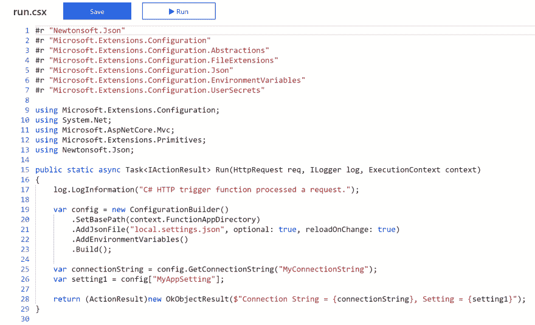
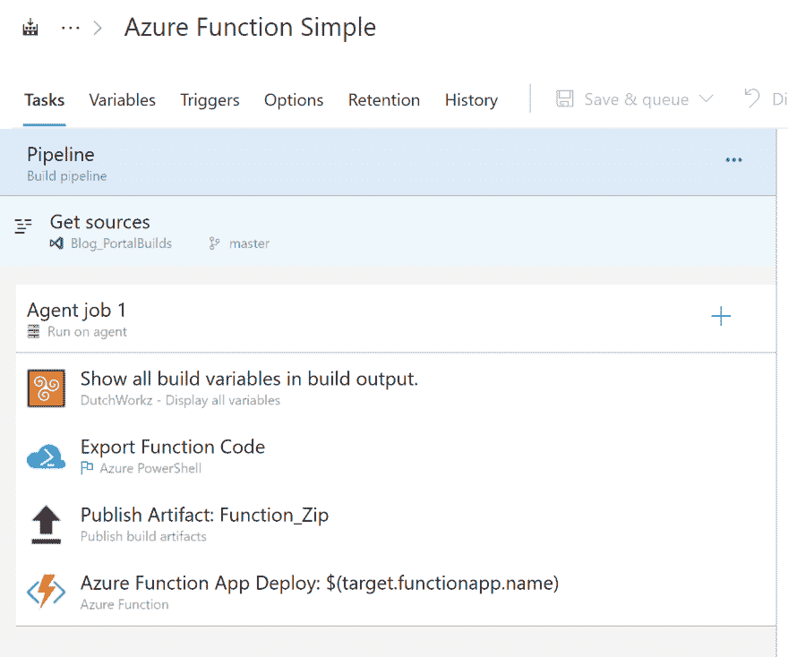
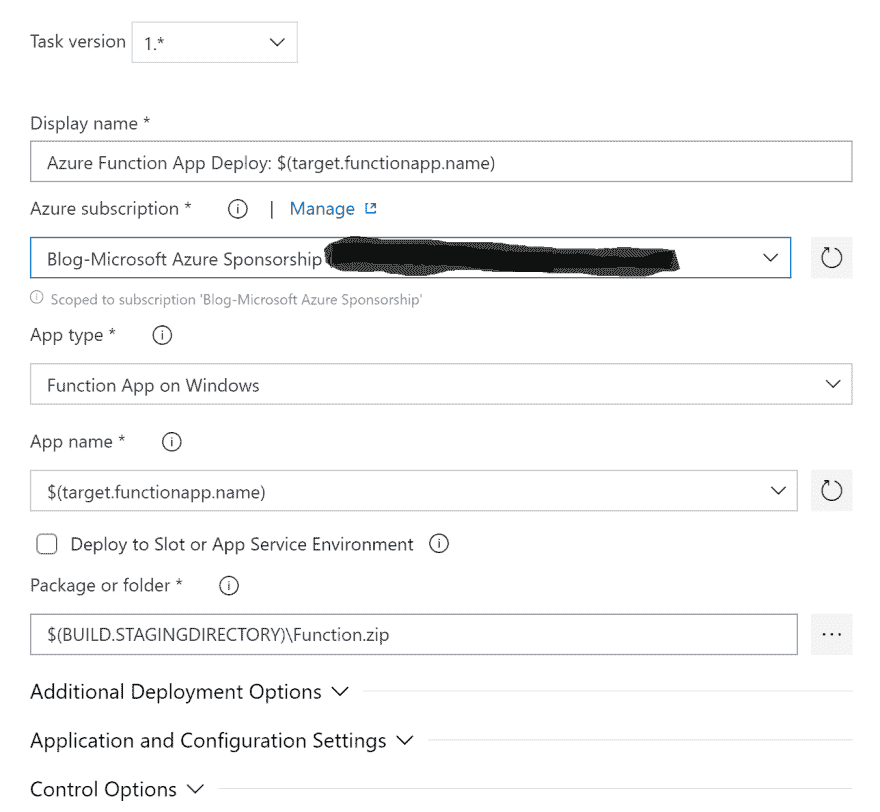
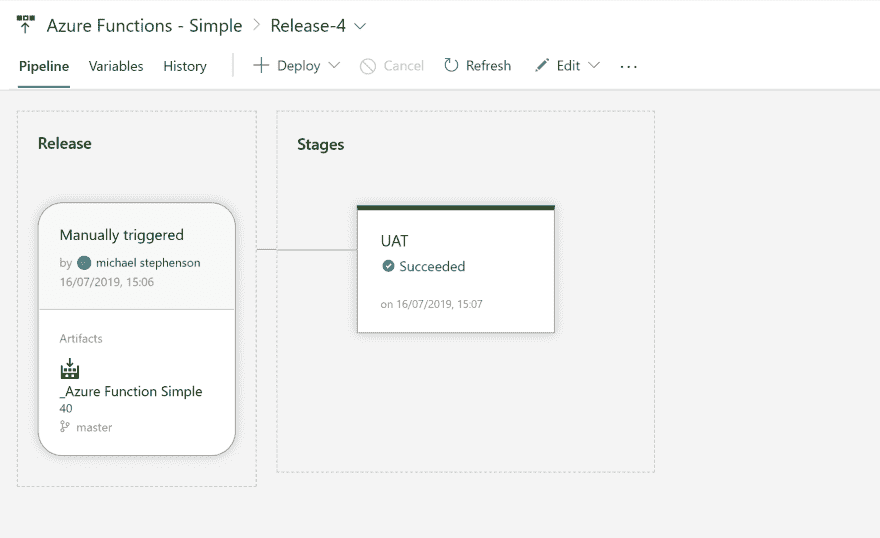
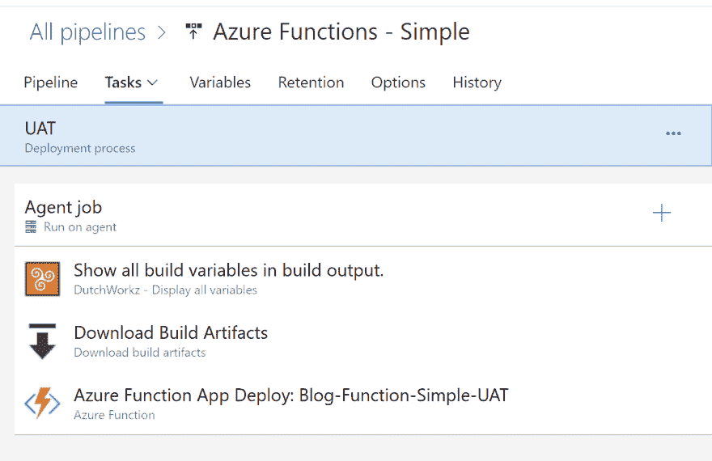

# 门户中的 Azure 功能–ALM

> 原文：<https://dev.to/suryavenkat_v/azure-functions-in-the-portal-alm-1a73>

作者鸣谢:[迈克尔·史蒂芬森](https://www.serverless360.com/blog/author/michael)，微软 Azure MVP。

最初发表于 [Serverless360 博客](https://serverless360.com/)。

> 本文是 [#ServerlessSeptember](https://dev.to/azure/serverless-september-content-collection-2fhb) 的一部分。在这个无服务器的内容集合中，您可以找到其他有用的文章、详细的教程和视频。9 月份，每天都有来自社区成员和云倡导者的新文章发布，没错，每天都有。在 https://docs.microsoft.com/azure/azure-functions/了解更多关于微软 Azure 如何实现你的无服务器功能的信息。

Azure 的优势之一是，对于一些用例，你可以在 Azure 门户中开发解决方案。这样做的好处是，您可以专注于编写一些代码，而不必担心 Visual Studio 和扩展的版本以及所有其他开销，这些开销会将任何人都可以编写的几行简单代码变成需要额外开发人员技能的代码。让我们面对现实吧，ALM 过程已经存在很多年了，但是仍然有很大一部分开发人员没有遵循它们。

在门户中完成工作的能力是很有吸引力的，我希望我们在未来会看到更多，但是当涉及到 ALM 活动时，它确实会给你带来挑战，比如保持代码的安全版本，以及能够在环境之间可靠地移动

本文探讨了在门户中开发 Azure 功能的选择，但是使用一些基本的 ALM 类型的活动，这只会产生很小的开销，但是给出了一些好的实践，这样在门户中开发在现实世界中也是可以的。

## 我的过程

我要遵循的流程如下:

*   我将有一个开发资源组，其中将包含我的 Azure 功能和代码
*   资源组还将包含该功能的其他资产，如 AppInsights 和 Storage
*   我将创建第二个<sup>和第一个</sup>资源组，名为 Test。在我的构建过程中，我将使用最新版本刷新测试资源组，这样我就可以进行一些测试
*   一旦我对测试资源组感到满意，我将执行一个发布管道，它将把最新的功能复制到其他环境中，比如 UAT，我假设其他测试人员也在使用它

总结管道的使用情况，见下文:

*   开发->测试=构建管道
*   -> UAT 和更远的地方=释放管道。

## 假设

我要做几个假设:

*   功能应用和 Azure 资源将提前手工创建
*   任何配置设置都将手动添加到功能应用程序中。

在这个简单的例子中，我们假设一切都很简单，我们可以在不同的环境之间更新代码。在未来的例子中，我们将会看到一些更复杂的场景。

## 走查

为了开始演练，让我们看看下面的函数代码:

[](https://res.cloudinary.com/practicaldev/image/fetch/s--sdILWcS4--/c_limit%2Cf_auto%2Cfl_progressive%2Cq_auto%2Cw_880/https://www.serverless360.com/wp-content/uploads/2019/07/Function-Code.png)

你可以看到这是一个非常简单的函数，它只是读取一些配置设置并返回它们。

### 构建流程

从这里，我们需要进入我们在 Azure DevOps 中的构建过程。构建过程如下所示:

[](https://res.cloudinary.com/practicaldev/image/fetch/s--THHiey6f--/c_limit%2Cf_auto%2Cfl_progressive%2Cq_auto%2Cw_880/https://www.serverless360.com/wp-content/uploads/2019/07/build-process-azure-functions.png)

我已经定义了一个构建过程，可以用于门户中的任何功能应用程序。我只需要更改变量和订阅引用，就可以通过克隆功能轻松地重用它。

构建执行以下步骤:

*   Show all build variables =我用它来排除故障，因为它显示了所有构建变量的值
*   Export code =这使用 App Service Kudu API 特性下载函数 App 的源代码作为 zip 文件
*   Publish Artifact =将 zip 文件附加到构建中，这样我可以在以后的发布管道中使用它
*   Azure Function App Deploy =这将把 zip 文件部署到测试函数 App，以便我可以根据需要进行一些手动测试。

### 仔细观察出口

我认为在构建过程中，导出函数代码这一步值得仔细观察。这一步使用 Powershell 执行一个 web 请求，以 zip 文件的形式下载代码。我已经在 function app 中使用了发布者配置文件来获取发布者凭据，我可以将这些凭据保存为构建变量，然后用作 web 请求进行下载的基本身份验证头。请参见下面这段代码

```
$user = '$(my.functionapp.deployment.username)'
$pass = '$(my.functionapp.deployment.password)'
$pair = "$($user):$($pass)"

Write-Host $pair
$encodedCreds = [System.Convert]::ToBase64String([System.Text.Encoding]::ASCII.GetBytes($pair))

$basicAuthValue = "Basic $encodedCreds"

$Headers = @{
    Authorization = $basicAuthValue

}

Write-Host $(my.functionapp.name)

Invoke-WebRequest -Uri 

"https://$(my.functionapp.name).scm.azurewebsites.net/api/zip/site/wwwroot/" -OutFile 
"$Env:BUILD_STAGINGDIRECTORY\Function.zip" -Headers $Headers

```

## 近距离观察 Azure Function App Deploy

Azure Function app deploy 只是使用了开箱即用的任务。我指向我在前面步骤中刚刚下载的 zip 文件，它会自动为我部署它。我已经将这个任务的部署类型设置为 Zip 部署。

[](https://res.cloudinary.com/practicaldev/image/fetch/s--dptPKc94--/c_limit%2Cf_auto%2Cfl_progressive%2Cq_auto%2Cw_880/https://www.serverless360.com/wp-content/uploads/2019/07/Function-App-Deploy.png)

### 发布流程

我们现在有一个可重复的构建过程，它将从我的开发功能应用程序中获取最新版本的代码，并将其推送到测试实例和打包 zip 文件，以便我可以在未来某个时候发布该版本的代码。

为了向其他环境发布，我有一个 Azure DevOps 发布管道。你可以在下面看到这个:

[](https://res.cloudinary.com/practicaldev/image/fetch/s--b5gfGNCr--/c_limit%2Cf_auto%2Cfl_progressive%2Cq_auto%2Cw_880/https://www.serverless360.com/wp-content/uploads/2019/07/Azure-devops-release-pipeline.png)

发布管道包含对我应该使用的构建输出的引用，然后包含我们想要部署到的每个环境的一组任务。在这种情况下，它只是 UAT。UAT 发布过程如下所示:

[](https://res.cloudinary.com/practicaldev/image/fetch/s---7tBULQr--/c_limit%2Cf_auto%2Cfl_progressive%2Cq_auto%2Cw_880/https://www.serverless360.com/wp-content/uploads/2019/07/UAT-release.png)

您可以看到，在这种情况下，发布过程非常简单，实际上是构建过程的简化版本。在这个例子中，我正在下载我们在构建中保存的工件。然后，我们使用 Azure Function deploy 将函数复制到 UAT 函数应用程序。我们只是在上面的构建过程中使用相同的 OOTB 配置，但这次我们指向 UAT 函数应用程序。

我现在只需要运行发布流程，将该功能部署到其他环境中。

## 限制

*   我没有使用任何 visual studio，所以我不太可能自动测试我的功能。我可能会考虑在这方面做些什么，但这超出了本文的范围
*   在本文中，我没有将代码放在源代码控制中。我很高兴附加到构建中的 zip 文件已经足够了。如果我愿意的话，我可以将 zip 文件保存到源代码管理中，或者将它解包并保存到源代码管理中
*   我在这里没有使用任何持续集成，你也许可以用逻辑应用程序监控 Azure 事件，然后开发你自己的触发器。

## 摘要

希望您可以看到，在门户工作中，为您的开发实现最基本的 ALM 过程是非常简单的，这将增加一些成熟度。