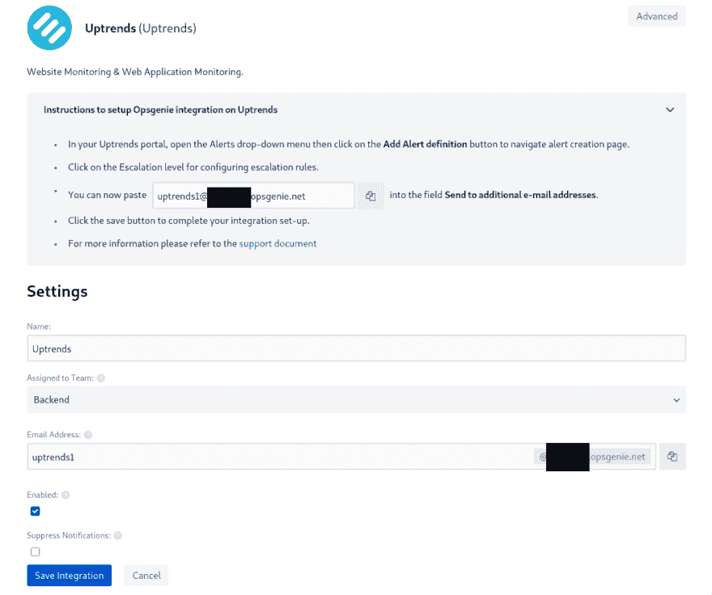
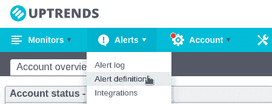
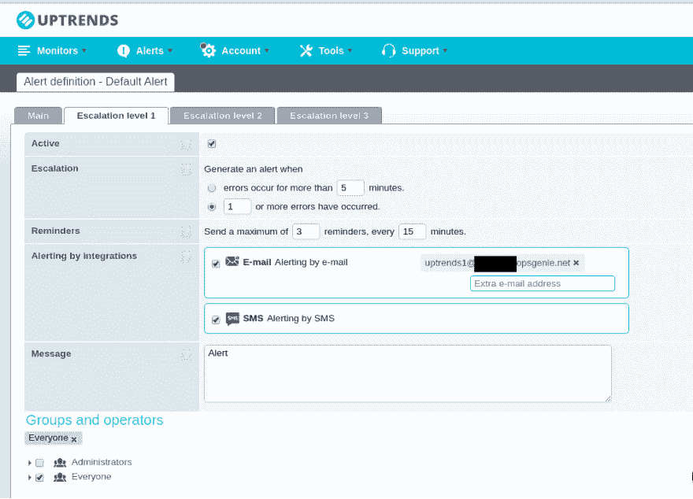
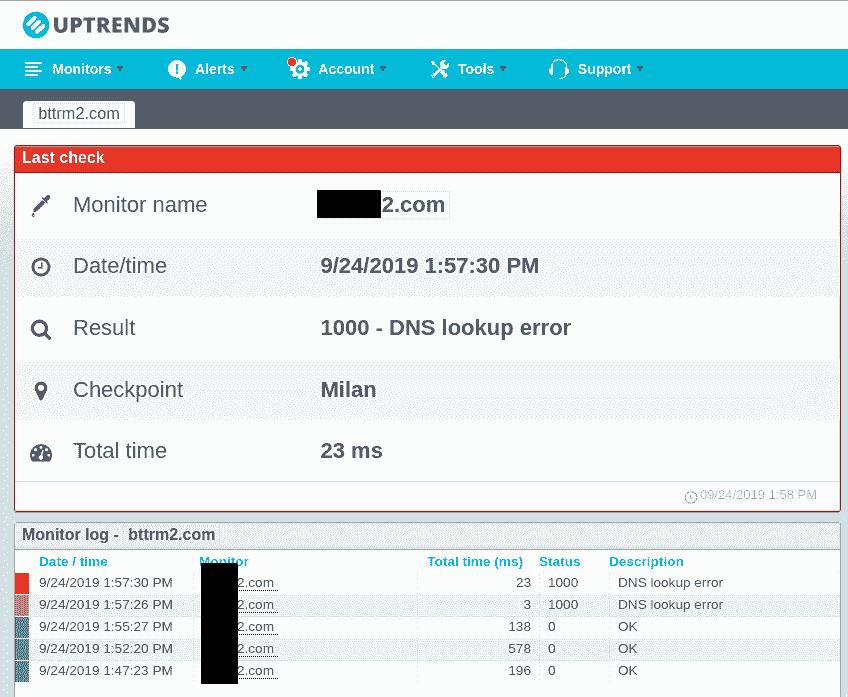
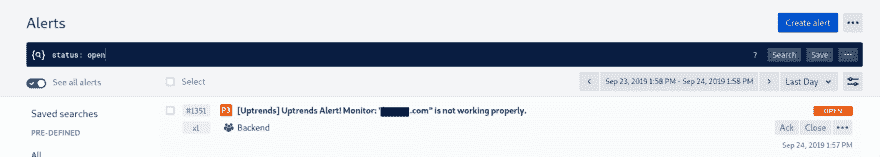

# OpsGenie:上升趋势集成

> 原文:[https://dev.to/setevoy/opsgenie-uptrends-integration-4hai](https://dev.to/setevoy/opsgenie-uptrends-integration-4hai)

Uptrends——只是一个简单的 ping 监测服务，已经用于 RTFM 博客(参见 [Prometheus: RTFM 博客监测设置与 ansi ble——Grafana、Loki 和 promtail](https://rtfm.co.ua/en/prometheus-rtfm-blog-monitoring-set-up-with-ansible-grafana-loki-and-promtail/) 帖子了解更多详情)。

现在，我想将它添加为项目 API 端点的附加警报服务，并将其警报配置为通过 OpsGenie 发送，我们已配置了移动警报，请参见[普罗米修斯:ops genieиalert manager—уведомлениявпочту/sms/телефон](https://rtfm.co.ua/prometheus-opsgenie-i-alertmanager-uvedomleniya-v-pochtu-sms-telefon/)(*俄罗斯*)。

集成非常简单:OpsGenie 将创建一个电子邮箱，Uptrends 将在其中发送消息。

进入[https://app . ops genie . com/settings/integration/add/UptrendsEmail](https://app.opsgenie.com/settings/integration/add/UptrendsEmail):

[T2】](https://rtfm.co.ua/wp-content/uploads/2019/09/Screenshot_20190924_135047.png)

省省吧。

进入*上升趋势–警报–警报定义*:

[T2】](https://rtfm.co.ua/wp-content/uploads/2019/09/Screenshot_20190924_143851.png)

编辑*默认*提醒，因为我们在这里是自由计划，不能创建一个以上。

在*升级级别 1* 选项卡中，设置由 OpsGenie 生成的电子邮箱:

[T2】](https://rtfm.co.ua/wp-content/uploads/2019/09/Screenshot_20190924_135412.png)

并检查它-设置一些非工作域进行检查，并等待警报被触发:

[T2】](https://rtfm.co.ua/wp-content/uploads/2019/09/Screenshot_20190924_135902.png)

在 OpsGenie 上也有同样的警告:

[T2】](https://rtfm.co.ua/wp-content/uploads/2019/09/Screenshot_20190924_135846-1.png)

完成了。

### 类似的帖子

*   <small>03/10/2019</small>[Prometheus:RTFM 博客监控与 ansi ble–Grafana、Loki 和 promtail 一起设置](https://rtfm.co.ua/en/prometheus-rtfm-blog-monitoring-set-up-with-ansible-grafana-loki-and-promtail/)
*   <small>02/07/2019</small>[Grafana Labs:Loki——分布式系统、标签和过滤器](https://rtfm.co.ua/en/grafana-labs-loki-distributed-system-labels-and-filters/)
*   <small>03/06/2019</small> [普罗米修斯:black box-exporter probe _ http _ status _ code = = 0 及其调试](https://rtfm.co.ua/en/prometheus-blackbox-exporter-probe_http_status_code-0-and-its-debug/)
*   <small>03/26/2019</small> [普罗米修斯:警报管理器的警报接收者和基于严重性级别和标签的路由](https://rtfm.co.ua/en/prometheus-alertmanagers-alerts-receivers-and-routing-based-on-severity-level-and-tags/)