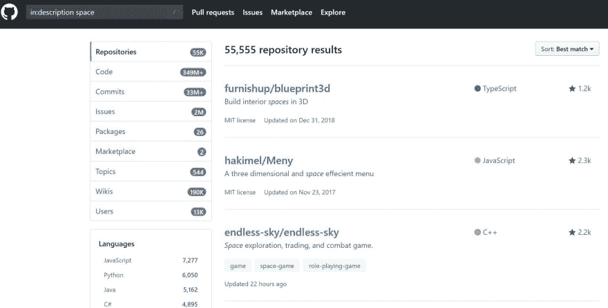
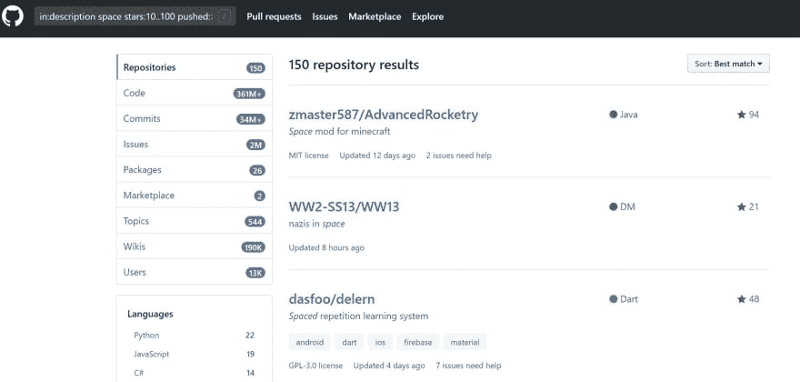
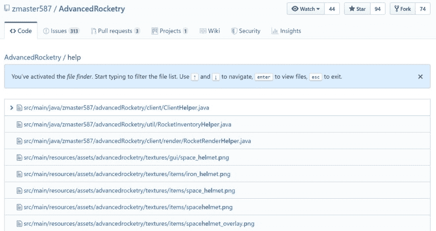
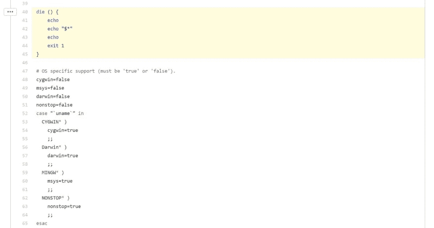
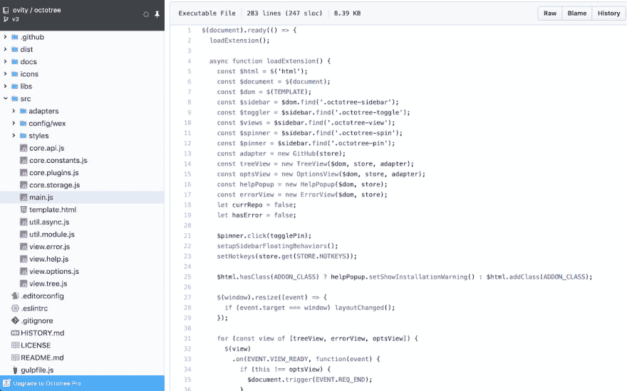
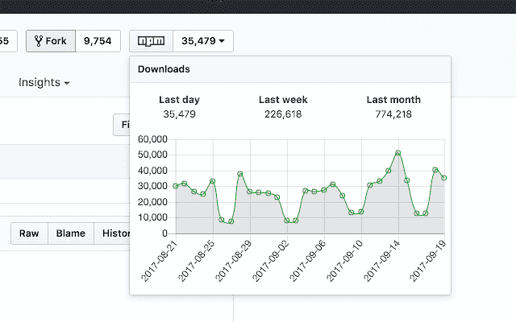
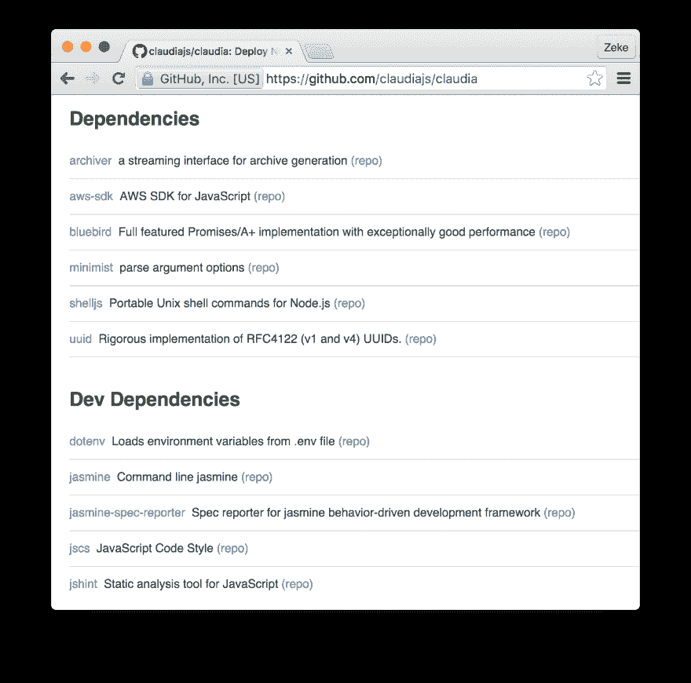

# 通过这些特性和扩展成为 GitHub 大师

> 原文:[https://dev . to/x-team/become-a-github-master-with these-features-and-extensions-418 e](https://dev.to/x-team/become-a-github-master-with-these-features-and-extensions-418e)

[T2】](https://res.cloudinary.com/practicaldev/image/fetch/s---3hvYbXO--/c_limit%2Cf_auto%2Cfl_progressive%2Cq_auto%2Cw_880/https://res.cloudinary.com/dukp6c7f7/image/upload/f_auto%2Cfl_lossy%2Cq_auto/s3-ghost/2019/09/Git-Cover.jpg)

无论你是大型软件公司的专业程序员，还是从事开源项目的业余开发人员，你都可能是 GitHub 的常客。就像你经常使用的其他程序一样，你对 GitHub 了解得越多，你就越能以富有成效和创造性的方式使用它。

因此，这里有一些 GitHub 的特性和扩展，可以帮助你成为一个更有生产力和创造力的 GitHub 用户。

## 在 GitHub 中搜索

了解任何搜索引擎的语法对于加快工作速度都是至关重要的。你可以使用 GitHub 的[高级搜索](https://github.com/search/advanced)搜索的大部分内容都可以直接在它的常规搜索栏中搜索。

首先，您可以在存储库标题、描述、自述文件、代码、提交、问题、拉取、请求，...使用`in:name`、`in:description`、`in:readme`等...后面跟着你的搜索词。

<figure> 

<figcaption>在描述库</figcaption>

</figure>

中搜索‘空间’

GitHub 允许你在搜索查询中使用`>`、`>=`、`<`和`<=`。当你在寻找有一定数量的明星或话题的回复时，这很有用。例如:`in:description space stars:>2500`将搜索一个超过 2500 颗星的回购协议，其描述中包含单词 *space* 。

此外，您可以使用`..`在一个范围内进行搜索。`in:description space stars:100..1000`将搜索一个回购协议，该协议包含 100-1000 颗恒星，其描述中包含单词 *space* 。简单，一旦你知道了！

使用`YYYY-MM-DD`格式，将上述内容与日期结合起来，搜索会变得更加强大。你可以搜索回购是什么时候`created`或者某样东西是什么时候最后`pushed`的。例如:`in:description space stars:10..100 pushed:>2019-08-23`搜索在描述中有单词*空格*的回购，在 10 - 100 星之间，并在 2019 年 8 月 23 日之后进行最后一次推送。

<figure> 

<figcaption>用这个搜索查询</figcaption>

</figure>

仍有超过 150 个回购

同样，你也可以搜索`language:`、`user:`、`org:`。将这些结合在一起，你将有能力搜索你想要的任何东西，而不需要浏览回购页面。

## 有用的 GitHub 键盘快捷键

知道键盘快捷键真的可以加快工作速度。在 GitHub 中按下`?`调出其键盘快捷键。这些是我发现最有用的。

*   按下`s`或`/`聚焦搜索栏。
*   按`t`模糊搜索文件或 repo 的内部文件。
*   在文件中按`b`打开责备视图。
*   按下`y`创建一个文件的 URL 永久链接，您可以共享该文件，因为文件不会因更改而改变。

<figure> 

<figcaption>【模糊文件搜索】用‘t’快捷键</figcaption>

</figure>

与按下`y`获取 URL 永久链接相关的是`#L`后面跟一个数字，您可以用它来表示特定的代码行。您也可以在这里创建一个范围。例如，添加`#L40-L45`将突出显示文件中的第 40-45 行。

<figure> 

<figcaption>在网址末尾添加#L40-L45 来突出行号 40-45</figcaption>

</figure>

## 有用的 GitHub 扩展

就像对你的 IDE 的[扩展可以帮助加速你的工作一样，给 GitHub 添加扩展也可以。这里有 5 个 GitHub 扩展，可以极大地改善你的体验。](https://x-team.com/blog/14-vscode-extensions/)

### [八叉树](https://www.octotree.io/)

[T2】](https://res.cloudinary.com/practicaldev/image/fetch/s--h7_f3VDY--/c_limit%2Cf_auto%2Cfl_progressive%2Cq_auto%2Cw_880/https://res.cloudinary.com/dukp6c7f7/image/upload/f_auto%2Cfl_lossy%2Cq_auto/s3-ghost/2019/09/Octotree-Firefox.png)

Octotree 可以在 [Chrome](https://chrome.google.com/webstore/detail/octotree/bkhaagjahfmjljalopjnoealnfndnagc) 、 [Firefox](https://addons.mozilla.org/en-US/firefox/addon/octotree/) 和 [Opera](https://addons.opera.com/en/extensions/details/octotree/) 上使用，它允许你使用类似于 ide 中的侧边栏树来浏览 GitHub repos。

它还加快了拉式请求审查的速度，如果你愿意每年花费 29.95 美元，它的专业版可以让你在主题、增强的代码审查、多个 GitHub 帐户等之间切换。

### [群星标记者](https://github.com/benoitgrelard/github-stars-tagger)

[T2】](https://res.cloudinary.com/practicaldev/image/fetch/s--LnAhYMsg--/c_limit%2Cf_auto%2Cfl_progressive%2Cq_auto%2Cw_880/https://res.cloudinary.com/dukp6c7f7/image/upload/f_auto%2Cfl_lossy%2Cq_auto/s3-ghost/2019/09/Stars-Tagger.jpg)

Stars Tagger 是一个 [Chrome](https://chrome.google.com/webstore/detail/github-stars-tagger/aaihhjepepgajmehjdmfkofegfddcabc) 扩展，允许你标记和分类你的星号回购，使你更容易搜索你想要的回购。

或者，如果你不想安装浏览器扩展，你可以使用 [Astral](https://astralapp.com/) 来组织你的星号 GitHub repos。

### [GitHub npm 统计](https://github.com/katranci/github-npm-stats)

[T2】](https://res.cloudinary.com/practicaldev/image/fetch/s--oW5kVuRk--/c_limit%2Cf_auto%2Cfl_progressive%2Cq_auto%2Cw_880/https://res.cloudinary.com/dukp6c7f7/image/upload/f_auto%2Cfl_lossy%2Cq_auto/s3-ghost/2019/09/npm-stats.png)

GitHub npm stats 是一个简单的 [Chrome 扩展](https://chrome.google.com/webstore/detail/github-npm-stats/oomfflokggoffaiagenekchfnpighcef?hl=en)，允许你查看 GitHub repos 的 npm 下载统计。

### [【npmhub】](https://npmhub.org/)

[T2】](https://res.cloudinary.com/practicaldev/image/fetch/s--lO56TICL--/c_limit%2Cf_auto%2Cfl_progressive%2Cq_auto%2Cw_880/https://res.cloudinary.com/dukp6c7f7/image/upload/f_auto%2Cfl_lossy%2Cq_auto/s3-ghost/2019/09/npmhub.png)

npmhub 是一个 [Chrome](https://chrome.google.com/webstore/detail/npmhub/kbbbjimdjbjclaebffknlabpogocablj) 和 [Firefox](https://addons.mozilla.org/en-US/firefox/addon/npm-hub/) 的扩展，允许你探索 GitHub(和 GitLab)回购上的 npm 依赖。当你浏览一个带有`package.json`文件的 repo 时，它会注意到，并在自述文件下面的 GitHub 页面上显示每个模块的元数据。

### [精致](https://github.com/sindresorhus/refined-github) [GitHub](https://github.com/sindresorhus/refined-github)

[T2】](https://res.cloudinary.com/practicaldev/image/fetch/s--BF9O0ByB--/c_limit%2Cf_auto%2Cfl_progressive%2Cq_auto%2Cw_880/https://res.cloudinary.com/dukp6c7f7/image/upload/f_auto%2Cfl_lossy%2Cq_auto/s3-ghost/2019/09/Refined-GitHub-Features.jpg)

Refined GitHub 是 Chrome 和 T2 Firefox 的扩展，旨在改善 GitHub 的许多小问题。该扩展有许多功能，包括添加反应头像的能力，显示谁对评论作出了反应，合并 PR 时等待检查的选项，以及在代码中链接问题/PR 引用的能力。

* * *

我们已经讨论了强大的 GitHub 搜索功能、4 个有用的键盘快捷键和 5 个很棒的 GitHub 扩展。希望其中至少有一个能让你成为更快更高效的开发者。

你最喜欢的 GitHub 特性或扩展是什么？请在下面的评论中告诉我👇。