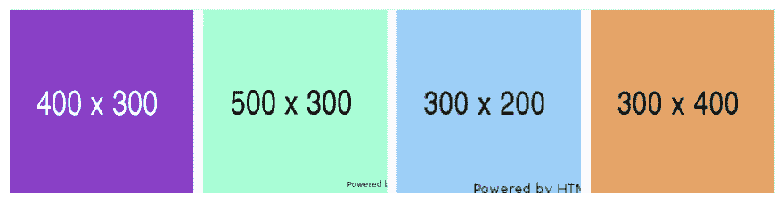

# 比容器 CSS 大的图像

> 原文:[https://dev . to/jimfrenette/title-images-large-than-container-CSS-1j 38](https://dev.to/jimfrenette/title-images-larger-than-container-css-1j38)

当元素的高度和/或宽度小于图像时，这将使图像在元素内部居中。当您有各种长宽比的图像资源，并希望显示为相同大小的缩略图时，这种方法非常有用。

#### [](#demo)[试玩](https://jimfrenette.com/code-editors/sandbox/images-larger)

[T2】](https://res.cloudinary.com/practicaldev/image/fetch/s--STsMIfct--/c_limit%2Cf_auto%2Cfl_progressive%2Cq_auto%2Cw_880/https://thepracticaldev.s3.amazonaws.com/i/tex9lz7beh7beo90n4gl.png)

##### [](#html)HTML

```
<ul class="thumbnails">
  <li>
    
  </li>
  <li>
    
  </li>
  <li>
    
  </li>
  <li>
    
  </li>
</ul> 
```

##### [](#css)CSS

```
ul.thumbnails {
  display: flex;
  flex-wrap: wrap;
}
ul.thumbnails li {
  height: 150px;
  border: 4px solid #FFF;
  overflow: hidden;
  position: relative;
  width: 150px;
}
ul.thumbnails li img {
  position: absolute;
  top: -9999px;
  bottom: -9999px;
  left: -9999px;
  right: -9999px;
  margin: auto;
  width: 250px;
} 
```

最初发表于[jimfrenette.com/css/images-larger-than-container](https://jimfrenette.com/css/images-larger-than-container/)