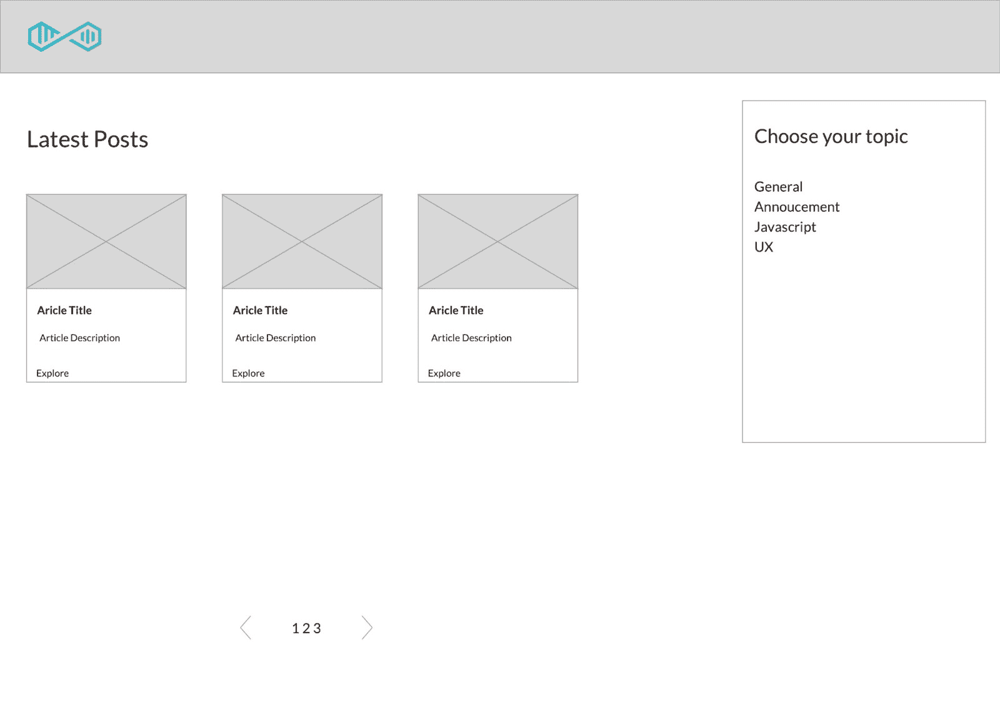

# 如何用 NextJS 和 Contentful 建立一个强大的博客

> 原文：<https://dev.to/techhiveio/how-to-build-a-powerful-blog-with-nextjs-and-contentful-1gh9>

如果你知道从哪里开始，建立一个大规模的博客会很容易。在这篇文章中，我们向你展示如何通过几个步骤建立一个健壮的博客，由我们选择的 CMS 驱动:Contentful。

然而，如果你喜欢另一个 CMS，通过几个简单的步骤，你可以集成你最喜欢的 headless CMS。

我们还探索了如何添加谷歌分析和自动生成网站地图。

所以拿起一杯咖啡，让我们开始吧！

为了创建我们的新博客，我们选择了一些您可能熟悉也可能不熟悉的工具:

*   **接下来。JS** (V9+)作为我们的主框架，
*   **React Markdown** 解析并显示博文内容，
*   **心满意足**作为我们的无头 CMS，
*   **云托管和部署的网络效率**

## 用户体验

为了建立一个吸引用户的博客，我们需要定义用户体验。

我们首先定义我们的需求。博客有以下主要目的:

*   用户可以看到所有的博客帖子，
*   用户可以使用分页来导航大量的博客帖子，
*   用户可以通过他感兴趣的主题进行过滤，
*   用户应该能够阅读博客文章

你博客上的导航应该是用户友好的。第一次阅读的读者可以扫一眼主题和标签。一旦他们找到他们愿意阅读的博客文章，他们可以直接导航到它。

用户还应该有能力通过相关主题过滤。

[](//images.ctfassets.net/yy0ya4rtm8k6/j4OAoqbxNTa4x01RpBz50/e7455d4d9ecf658c18b27d866ba7d7f1/blog-sketch.jpeg)

您可以添加其他需求，但是这应该让您开始考虑设计。

## 先决条件

确保您安装了最新的稳定节点版本和 npm 或 yarn。

对于本文，我们使用 **npm** 来安装包。然而，请随意使用纱或任何其他包装经理你感到舒服。

## 打基础

### 设置下一个。射流研究…

开始很容易。输入以下命令之一来创建您的应用程序:

`npx create-next-app`

或者

```
npm install -g create-next-app
create-next-app my-next-blog && cd my-next-blog 
```

按照终端中的指示，你应该可以开始了。

### 整合打字稿

Next 的最新版本。Js 直接内置了 Typescript。

为了启用它，我们首先安装相关的包。导航到您的项目，并运行:

`npm install --save-dev typescript @types/react @types/node`

如果还没有，将 pages 中的文件从`index.js`重命名为`index.tsx`，然后运行应用程序:

`npm run dev`

下一个。Js 会自动创建一个 **`tsconfig.json`** 并将你的项目设置成 Typescript。如果您有一个组件文件夹，现在可以删除该文件夹。

我们还想包括样式的 CSS 插件。

`npm install --save @zeit/next-css`

在项目的根目录下创建一个 **`next.config.js`** ，包括以下内容: