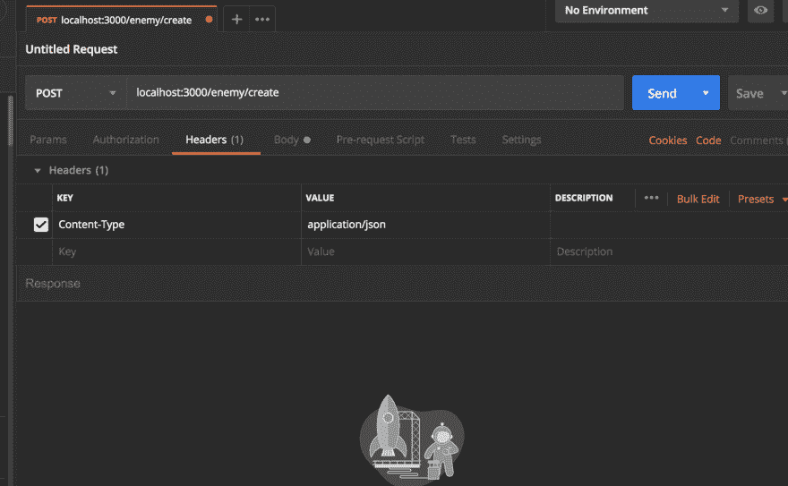
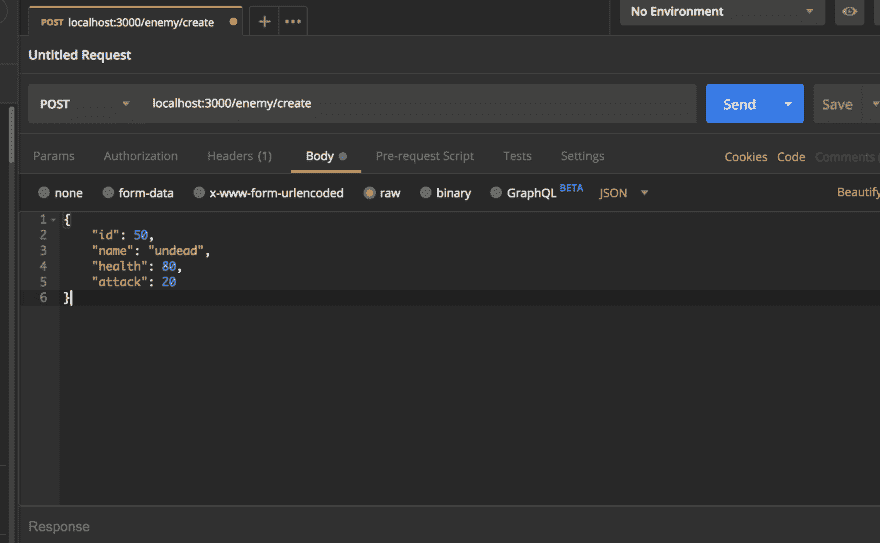
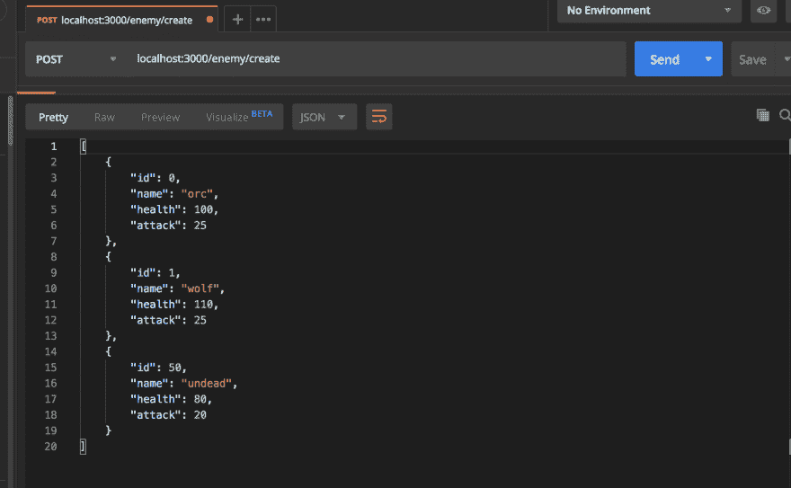
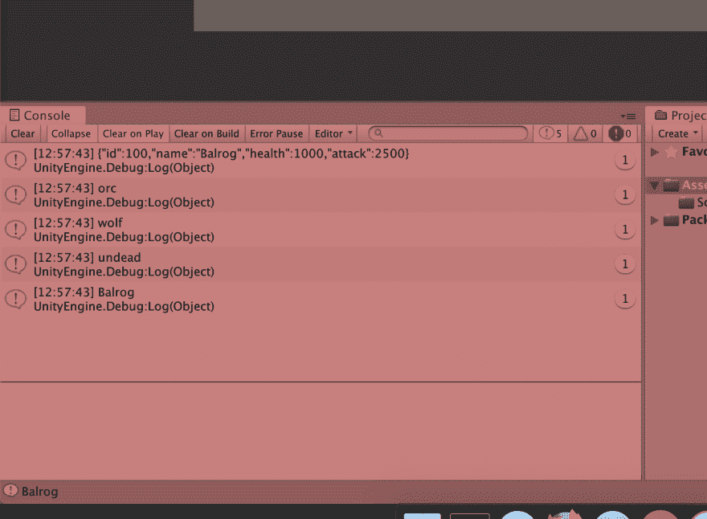
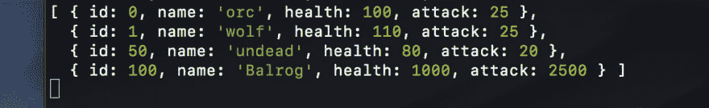

# 使用 Node 和 Express 创建 REST 服务以便与 Unity 一起使用——第 3 部分

> 原文:[https://dev . to/ce muka/making-a-rest-service-using-node-and-express-to-use-with-unity-part-3-4 onf](https://dev.to/cemuka/making-a-rest-service-using-node-and-express-to-use-with-unity-part-3-4onf)

问候所有的统一忍者！

在这一部分，我们将从 unity 客户端向节点服务器发出 POST 请求。我们还没有创建数据库，所以我现在要创建一个数组。

从服务器端开始。在`app.js`中，记得我们有一个单一的敌人对象，这部分，我将创建一个数组并填充一些敌人。

```
let enemies = [
    {
        "id": 0,
        "name": "orc",
        "health": 100,
        "attack": 25
    },
    {
        "id": 1,
        "name": "wolf",
        "health": 110,
        "attack": 25
    }
]; 
```

接下来，告诉 express 支持 JSON 编码的主体。

```
app.use(express.json()); 
```

接下来，让我们创建一个 post 方法来接收来自 unity 客户端的请求。

```
app.post('/enemy/create', (req, res) => {
let newEnemy = {
    "id": req.body.id,
    "name": req.body.name,
    "health": req.body.health,
    "attack": req.body.attack
};

enemies.push(newEnemy);
console.log(enemies);
res.send(enemies);
}); 
```

我将修改我的 get 方法来获取我的`enemies`数组。现在我的`app.js`文件是这样的:

```
const express = require('express');
const app = express();
app.use(express.json());

app.get('/', (req, res) => {
    res.send('Hello Unity Developers!');
});

let enemies = [
    {
        "id": 0,
        "name": "orc",
        "health": 100,
        "attack": 25
    },
    {
        "id": 1,
        "name": "wolf",
        "health": 110,
        "attack": 25
    }
];

app.get('/enemy', (req, res) => {
    res.send(enemies);
});

app.post('/enemy/create', (req, res) => {
let newEnemy = {
    "id": req.body.id,
    "name": req.body.name,
    "health": req.body.health,
    "attack": req.body.attack
};

enemies.push(newEnemy);
console.log(enemies);
res.send(enemies);
});

app.listen(3000, () => console.log('started and listening.')); 
```

打开终端，启动节点，访问 unity 客户端。

```
node app.js 
```

让我们进行一个 api 调用，我将使用 postman。

[T2】](https://res.cloudinary.com/practicaldev/image/fetch/s--m6kS4zRB--/c_limit%2Cf_auto%2Cfl_progressive%2Cq_auto%2Cw_880/https://thepracticaldev.s3.amazonaws.com/i/4s05xp31h5lltieosq5m.png)

不要忘记将标题和正文设置为`application/json`。

现在根据敌方模式创建一个敌方 json 字符串，点击发送。

[T2】](https://res.cloudinary.com/practicaldev/image/fetch/s--3KSP3t_h--/c_limit%2Cf_auto%2Cfl_progressive%2Cq_auto%2Cw_880/https://thepracticaldev.s3.amazonaws.com/i/zsar1id2q4e7282jils8.png)

[T2】](https://res.cloudinary.com/practicaldev/image/fetch/s--GT532m3s--/c_limit%2Cf_auto%2Cfl_progressive%2Cq_auto%2Cw_880/https://thepracticaldev.s3.amazonaws.com/i/sphg3g6131k8cisxh00i.png)

看来我们的敌人越来越多了:)

最后一部分，我们成功地接收了一个 json 对象，并用 unity ui 元素将它显示在屏幕上。但是我们结构的这一部分发生了一些变化。我给敌人添加了`id`属性，现在我的回应不是一个对象而是一个数组。

首先，在 unity 中将`id`属性添加到`Enemy`类中。

```
public class Enemy
{
    public int id;
    public string name;
    public int health;
    public int attack;
} 
```

是啊，那很容易！但是请记住，`JsonUtility`不能与`{get; set;}`一起工作。

现在重要的部分！如果您的任务是发送一个 json 数组并在 unity 中解析，不幸的是没有现成的解决方案。别担心，经过几次搜索和试验，我找到了一个变通办法，详细的解释，请看这里的和这里的。

比如你的回应是这样的，那么`JsonUtility`就不行:

```
[  {  //item  },  {  //item  },  {  //item  }  ] 
```

相反，我们将使它成为一个单键和一个数组对象作为一个值:

```
{  "result":  [{//item},{//item},{//item}]  } 
```

这样，我们就有了一个包含**项**的**一个列表**，这个结构与`JsonUtility`一起工作。

为了实现这个技巧，我们将创建一个名为`JsonHelper`的静态类。让我们在项目文件夹中创建它。

```
using UnityEngine;
using System.Collections.Generic;

public static class JsonHelper
{
    public static List<T> FromJson<T>(string json)
    {
        Wrapper<T> wrapper = JsonUtility.FromJson<Wrapper<T>>(json);
        return wrapper.result;
    }

    [System.Serializable]
    private class Wrapper<T>
    {
        public List<T> result;
    }
} 
```

`JsonHelper`类有一个通用的`FromJson`方法，它返回我们要创建的任何类的列表。这里的关键部分是`Wrapper`类，它有一个结果列表，存储来自。在我们的例子中，当我们从服务器获得一个 json 对象数组时，我们必须像这样修改我们的响应字符串:

```
{
    "result": [
        //enemy,
        //enemy
    ]
} 
```

我们已经讨论了我们的模式，并创建了一个助手类来使它工作，让我们写一些代码吧！

首先，将`Enemy`类标记为`Serializable`，这样 unity 将能够转换为 json。更多解释[此处](https://forum.unity.com/threads/terminology-what-does-serializable-mean-in-unity-terms.546241/)。

```
[System.Serializable]
public class Enemy
{
    public int id;
    public string name;
    public int health;
    public int attack;
} 
```

第二，打开`ClientApi`脚本，做一个 post 方法。unity 的 post 方法需要两个参数，post url 和一个敌人对象。

```
public IEnumerator Post(string url, Enemy enemy)
{
  var jsonData = JsonUtility.ToJson(enemy);
  Debug.Log(jsonData);

  using(UnityWebRequest www = UnityWebRequest.Post(url, jsonData))
  {

  }
} 
```

我们用`JsonUtility`将一个`Enemy`对象转换成一个 json 字符串。

接下来，配置我们请求的`content-type`。

```
public IEnumerator Post(string url, Enemy enemy)
{
  var jsonData = JsonUtility.ToJson(enemy);
  Debug.Log(jsonData);

  using(UnityWebRequest www = UnityWebRequest.Post(url, jsonData))
  {
        www.SetRequestHeader("content-type", "application/json");
    www.uploadHandler.contentType = "application/json";
    www.uploadHandler = new UploadHandlerRaw(System.Text.Encoding.UTF8.GetBytes(jsonData));

    yield return www.SendWebRequest();
  }
} 
```

我们已经将方法设置为发送一个 json 对象和一个 url 端点。

记住，我们在接到请求后会把敌人送回去作为回应。因此，让我们根据响应列出一个列表，然后显示到控制台。现在，是处理响应结束错误的时候了。

```
// handle the result
var result = System.Text.Encoding.UTF8.GetString(www.downloadHandler.data);  
result = "{\"result\":" + result + "}"; 
var resultEnemyList = JsonHelper.FromJson<Enemy>(result);

foreach (var item in resultEnemyList)
{
  Debug.Log(item.name);
} 
```

这是我们上面讨论过的部分。我一得到数据，就修改它，以便能够与`JsonHelper`一起工作。

然后只显示控制台每个元素的`name`进行测试。

```
public IEnumerator Post(string url, Enemy enemy)
{
  var jsonData = JsonUtility.ToJson(enemy);
  Debug.Log(jsonData);

  using(UnityWebRequest www = UnityWebRequest.Post(url, jsonData))
  {
        www.SetRequestHeader("content-type", "application/json");
    www.uploadHandler.contentType = "application/json";
    www.uploadHandler = new UploadHandlerRaw(System.Text.Encoding.UTF8.GetBytes(jsonData));
    yield return www.SendWebRequest();

    if (www.isNetworkError)
    {
      Debug.Log(www.error);
    }
    else
    {
      if (www.isDone)
      {
        // handle the result
        var result = System.Text.Encoding.UTF8.GetString(www.downloadHandler.data);  
        result = "{\"result\":" + result + "}"; 
        var resultEnemyList = JsonHelper.FromJson<Enemy>(result);

        foreach (var item in resultEnemyList)
        {
          Debug.Log(item.name);
        }
      }
      else
      {
        //handle the problem
        Debug.Log("Error! data couldn't get.");
      }
    }
  }
} 
```

为了测试，为 post url 定义一个字符串变量，在`Start`中创建一个`Enemy`对象，然后切换回 unity。

```
public string getUrl  = "localhost:3000/enemy";
public string postUrl = "localhost:3000/enemy/create";

void Start()
{
  var enemy = new Enemy(){
    id = 100,
    name = "Balrog",
    health = 1000,
    attack = 2500
  };

  StartCoroutine(Post(postUrl, enemy));
} 
```

该上场了！

[T2】](https://res.cloudinary.com/practicaldev/image/fetch/s--M8MNr8RY--/c_limit%2Cf_auto%2Cfl_progressive%2Cq_auto%2Cw_880/https://thepracticaldev.s3.amazonaws.com/i/tk9jj9splrphzq80hec7.png)

也在终端上检查 console.log。

[T2】](https://res.cloudinary.com/practicaldev/image/fetch/s--ZDeHhCSi--/c_limit%2Cf_auto%2Cfl_progressive%2Cq_auto%2Cw_880/https://thepracticaldev.s3.amazonaws.com/i/fqeusdv13gycruwvhel1.png)

干得好，我们的团结忍者技能提高了一点点！！🎉🎉🎉🌟🌟🌟👏👏👏😎😎

看起来我们已经成功地从 unity 客户端发送数据，从服务器接收数据，并用更新的数据进行响应😎👾

抢代码[这里](https://github.com/cemuka/unity-node-tutorial)

下一部分我们将在 ui 元素的帮助下发布，为了在 unity 中处理数据，我们将使用可脚本化的对象。

直到下一部分，干杯！