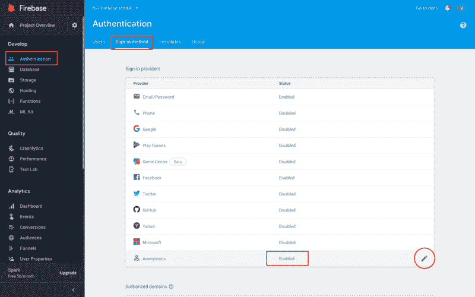
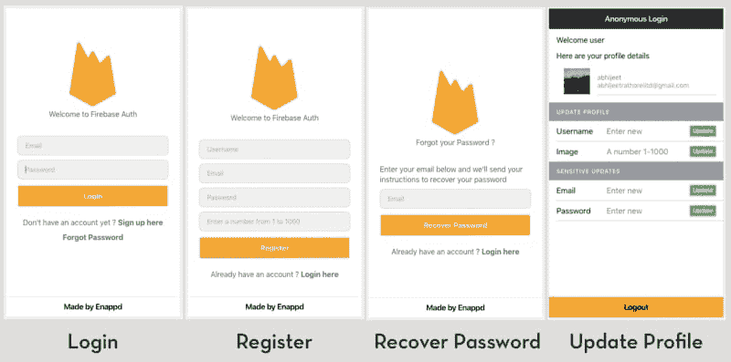

# Ionic 4 中使用 Firebase 的基本电子邮件身份验证

> 原文：<https://dev.to/enappd/basic-email-authentication-with-firebase-in-ionic-4-egn>

* * *

在这篇文章中，我将介绍在 Ionic 4 应用中使用 Firebase 进行电子邮件认证的基础知识。我们将经历所有的基本东西，如登录，注册，恢复密码，注销，更新个人资料，更新电子邮件和重置密码。这些是你正在创建的任何 Ionic 4 应用的基本要素。

我们将在`ionic serve`中完成所有这些，即浏览器本身。这意味着，您可以在应用程序和 PWA 中使用这些功能(👻太棒了，对吧？)

如果你已经熟悉什么是 Firebase 和 Ionic 4，跳过基本的介绍。

> 本教程的完整源代码可在 [Ionic-4-firebase-auth](https://github.com/enappd/ionic-4-firebase-auth) 中找到

### 什么是 Firebase？

如果你不太了解 Firebase …请关注最新的技术新闻！Firebase 是当今市场上的“时髦”产品。人们可以使用 Firebase 创建快速的移动应用程序后端和数据库，并提供大量内置和易于集成的功能。

Firebase 最常用的功能是作为后端。但是除了后端，Firebase 的认证特性是必须使用的。因此，本质上 Auth 成为默认情况下使用最多的特性。其他一些受欢迎的功能有

*   推送通知
*   **云函数**
*   分析学
*   广告暴民
*   Crashlytics
*   应用内消息
*   远程配置
*   社交登录
*   ……以及更多

#### Firebase 身份验证方法

Firebase 提供了许多登录方法——电子邮件/密码、社交登录和匿名登录。

**邮箱登录**是最基本也是最常用的认证方式。几乎每个应用程序都允许用户使用他们的电子邮件和密码登录。

也就是说，我相信您对学习 Firebase 的各种身份验证非常感兴趣。你可以看看我关于其他 Firebase 认证方法的博客

*   离子 4 [脸书登录](https://enappd.com/blog/facebook-login-in-ionic-4-apps-using-firebase/25)
*   Ionic 4 [Twitter 登录](https://enappd.com/blog/twitter-login-in-ionic-4-apps-using-firebase/24)
*   Ionic 4 [匿名登录](https://enappd.com/blog/firebase-anonymous-login-in-ionic-4/37)

还有免费的开胃菜！！👻👻👻

### 什么是离子 4？

你可能已经知道离子，但我把它放在这里只是为了初学者。 **Ionic** 是一款完整的开源 SDK，用于混合移动应用开发。Ionic 提供使用 CSS、HTML5 和 Sass 等 Web 技术开发混合移动应用的工具和服务。应用程序可以通过这些网络技术构建，然后通过本地应用程序商店分发，安装在设备上。

换句话说——如果你在 Android 中创建本地应用程序，你就在 **Java** 中编码。如果你在 iOS 中创建原生应用，你可以在 **Obj-C** 或 **Swift** 中编码。这两种语言都很强大，但是很复杂。有了 Cordova(和 Ionic ),你可以为你的应用程序编写一段代码，它可以在 iOS 和 Android(以及 windows！)，HTML、CSS 和 JS 的简单性也是如此。

### 职位结构

我们将一步一步地探索 Firebase 的电子邮件认证特性。这是我的博客分解

1.  创建一个 Firebase 项目
2.  创建一个简单的 Ionic 4 应用
3.  将 Ionic 应用程序连接到 Firebase
4.  使用 AngularFire2 实现电子邮件验证功能
5.  探索 Firebase Auth 的更多特性

正如我上面所说的，我们可以在浏览器中测试所有这些，但是也可以在你的设备中进行构建和测试。让我们开始吧！


<figure>

<figcaption class="imageCaption">Dive … Like a boss!</figcaption>

</figure>

### 步骤 1 —创建一个 Firebase 项目

如果你曾经使用过 Firebase，你可以跳到下一步。对于初学者，你可以通过进入 [Firebase 控制台](http://console.firebase.google.com)来创建一个 Firebase 项目(如果它要求你登录的话)。创建新项目或选择现有项目。您的 Firebase 控制台仪表板应该如下所示


<figure>

<figcaption class="imageCaption">Firebase dashboard with your projects</figcaption>

</figure>

**注意** —创建一个 Firebase 项目真的很容易，但是如果你仍然面临任何问题，请遵循[这篇博客](https://enappd.com/blog/how-to-integrate-firebase-in-ionic-4-apps/23/)的步骤 1-4

#### 启用匿名登录

一旦你的项目被创建，进入项目内部。进入**认证**页签，需要切换匿名登录**启用**



<figure>

<figcaption class="imageCaption">Enable anonymous login in Firebase</figcaption>

</figure>

### 步骤 2——创建一个简单的 Ionic 4 应用程序

> 我在[这篇博客](https://enappd.com/blog/how-to-create-an-ionic-4-app-for-beginners/13/)中已经详细报道了这个话题。

简而言之，您需要采取的步骤如下

*   确保您已经在系统中安装了 node(在这篇博文发表时是 V10.0.0)
*   使用 npm 安装**离子 cli**
*   使用`ionic start`创建 Ionic 应用程序

为了本教程，您可以创建一个`blank`启动器。运行`ionic start blank`时，将安装节点模块。安装完成后，使用在浏览器上运行您的应用程序

```
$ ionic serve
```

这是应用程序的外观。



<figure>

<figcaption class="imageCaption">App screens for Firebase basic auth</figcaption>

</figure>

我们将在后续步骤中看到这些代码

### 步骤 3-将 Ionic 应用程序连接到 Firebase

#### 复制 Firebase 配置

> *这一步的细节可以在我们的博客* [*如何在 Ionic 4 apps 中集成 Firebase*](https://enappd.com/blog/how-to-integrate-firebase-in-ionic-4-apps/23/)中找到

首先，从 Firebase 控制台复制 Firebase 配置信息，并将其粘贴到 Ionic 4 应用程序的`environment`文件中。环境文件将如下所示


为了将应用程序连接到 Firebase，并使用 Firebase 方法，我们将使用 AngularFire2 包。使用以下命令安装软件包

```
$ npm install firebase @angular/fire --save
```

在`app.module.ts`中导入 **angularFire2** 和你的`environment`