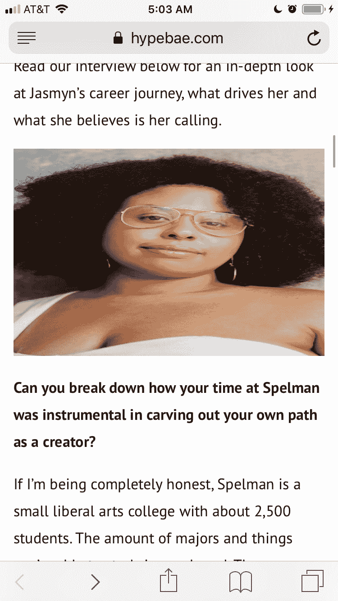
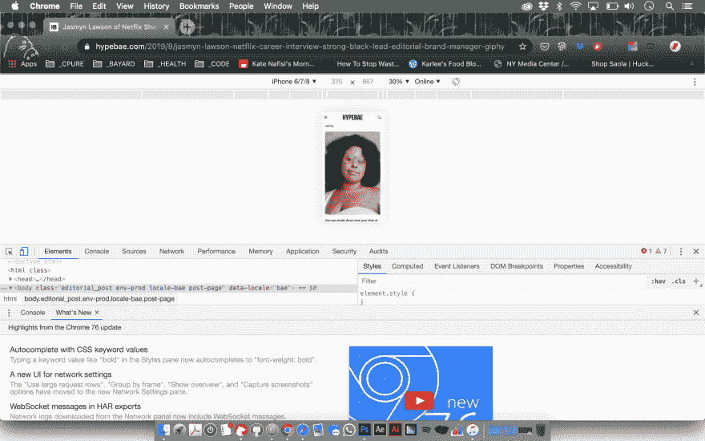
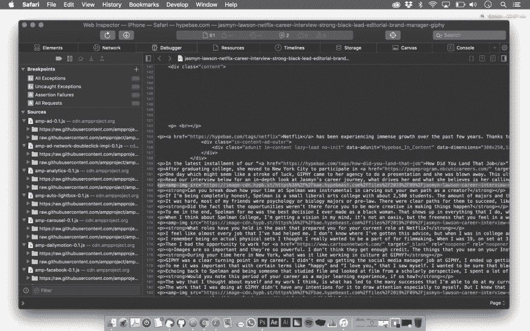

# 通过在凌晨 4:30 发现一个 bug 来了解 iPhone 的开发工具。

> 原文：<https://dev.to/courtneypure/learning-about-developer-tools-for-your-iphone-by-finding-a-bug-at-4-30-am-35d4>

一个美丽的早晨，凌晨 4 点 35 分，我醒来，决定查看我的推特，发现有一个 [Hypebae](https://hypebae.com/) ！老实说，你的女孩一点也不时尚，但是我喜欢看街头服饰！我是 [Hypebeast](https://hypebeast.com/) 的超级粉丝，该网站主要关注当代男性街头服饰，但终于有了一个姐妹网站。我特别感兴趣，因为当我浏览 twitter 时，我看到了这篇关于[爱新觉罗·媚·劳森和她的科技之旅](https://hypebae.com/2019/9/jasmyn-lawson-netflix-career-interview-strong-black-lead-editorial-brand-manager-giphy)的精彩文章。作为一名 POC，我喜欢看到黑人取得成就，我喜欢看到黑人女性取得成就，尤其是在科技领域！

那么我要带着这个去哪里？我在我的旧 iPhone 6 上查看文章时发现了一个 bug。Hypebeast 以其当代街头服饰的美丽图片而闻名，看到 Juan Veloz 的美丽图片尤其令人分心。作为一名艺术家，看到艺术作品没有按照预期表现出来让我很恼火，但作为一名编码员，我意识到这是一个错误；不是故意的，而是要修理的东西！

我决定从我的电脑开始，在 Google Chrome 和 Safari 上搜索开发工具来检查图像元素。尽管我在手机上看到了一些东西，但我无法使用 iPhone 6/7/8 的 Chrome 开发者工具复制我在 iPhone 上看到的东西。老实说，它看起来非常好，但实际上这就是我所看到的；

对抗

我的问题是我如何解决这个问题？如何在手机上找到这个 bug？然后我从一部 iPhone 上学会了如何使用开发者工具！首先，我必须在我的 iPhone 设置中启用“网络检查器”，它位于 Safari 的高级设置中。然后把我的手机连接到我的笔记本电脑，我就可以进入 Safari 桌面应用程序，点击工具栏中的“开发”，然后向下滚动到 iPhone，选择“用于开发”Viola，我得到了我需要的答案，图像被设置为 700 像素 x 500px 像素。

作为一个代码新手，我不知道如何着手解决这个问题(我猜这就是在 github 上开源的工作方式...你发现了一个错误，发送一个拉请求等等？)但是我只想记录我从这篇文章中学到的这个新的开发人员工具。也要说 Hypebeast，如果你看到这个显示爱新觉罗·媚·劳森和胡安·维罗兹修复这个错误的爱。服装和图像太棒了！！还要对开发商的辛苦喊一声，这不容易啊！