# 使用 Firebase 云消息控制台发送推送的完整指南

> 原文：<https://dev.to/enappd/complete-guide-on-sending-push-using-firebase-cloud-messaging-console-2mio>

* * *

这篇文章关注的是使用 Firebase 云消息控制台发送各种类型的推送通知。我们还将探索 Firebase 提供的云消息控制台的所有特性。

#### 为什么使用 Firebase 发送推送？

如果你不太了解 Firebase …你需要了解最新的技术新闻。Firebase 是当今市场上创建快速移动应用后端的热门产品，具有大量内置和易于集成的功能。

Firebase 最常用的功能是作为后端。但是除了这个后端，其他一些流行的特性有

*   推送通知
*   **云函数**
*   分析学
*   广告暴民
*   Crashlytics
*   应用内消息
*   远程配置
*   社交登录
*   ……以及更多

有人可能想知道为什么要在应用程序中集成推送通知。推送通知是**最大的一个功能**，可以让你的用户参与到你的应用中。人们痴迷于通知。人们会定期检查手机，以免错过任何通知。如果你的应用发送定期的(有趣的)推送，你的用户会很高兴，你会看到比没有推送通知少得多的应用卸载。

市场上有许多[推送通知集成服务](https://thetool.io/2018/top-push-notifications-tools)。但 Firebase 是谷歌的产品，本质上是用于可靠推送通知的服务。它是 GCM (Google Cloud messaging)的更好版本，本质上是所有应用程序的默认版本。

### Firebase 推送消息控制台

一旦推送通知被集成到应用程序中，发送它们可以有多种方式

*   手动触发通知
*   使用 CRON 作业触发通知
*   基于用户操作，使用云功能触发通知

手动触发常用于大量的 app。这避免了编写复杂的逻辑来向用户发送通知，并且允许简单的测试。为此，Firebase 提供了一个消息控制台，您可以使用它来发送各种推送消息、过滤目标用户、安排消息等等。

让我们更深入地了解一下 Firebase 推送消息控制台中的可用选项。不用说，你的应用应该集成 Firebase 来利用这些特性😄。我们将讨论以下主题

1.  通知历史
2.  通知报告
3.  创建新通知
4.  创建通知实验

### 1.通知历史

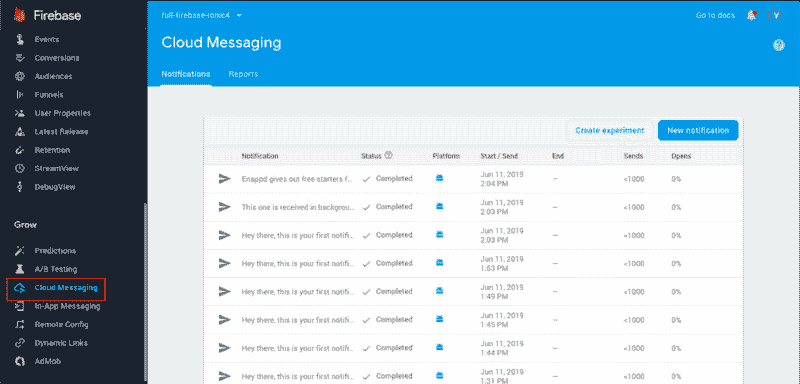

<figure>

<figcaption class="imageCaption">Firebase Cloud messaging console</figcaption>

</figure>

云消息控制台如上图截图所示。它包含两个选项卡—通知和报告

在**通知**选项卡中，您可以看到之前发送的消息列表、它们的开始/发送时间、发送次数和打开次数。对于经常向用户发送通知的人来说，这是非常有用的信息。

### 2.通知报告

如果您定期发送大量通知，您会希望有一个更图形化的界面来查看数据。通知报告正是为您提供了这一点

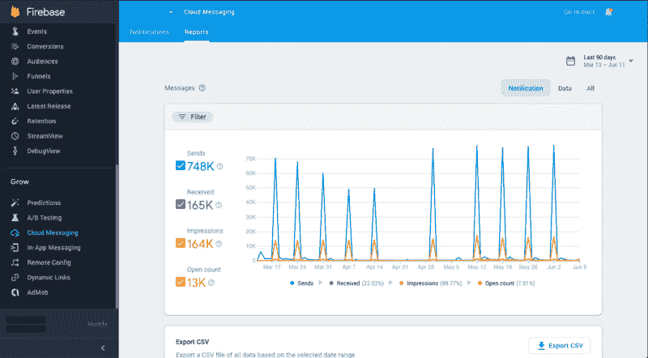

<figure>

<figcaption class="imageCaption">Firebase Notification reports</figcaption>

</figure>

您可以查看邮件的全局概览以及用户接收/打开邮件的方式。您还可以按日期过滤这些结果，并将数据导出为 CSV 格式。

#### 过滤报告数据

您可以根据 Firebase 项目中的平台或应用程序过滤报告数据，以便更清楚地了解情况

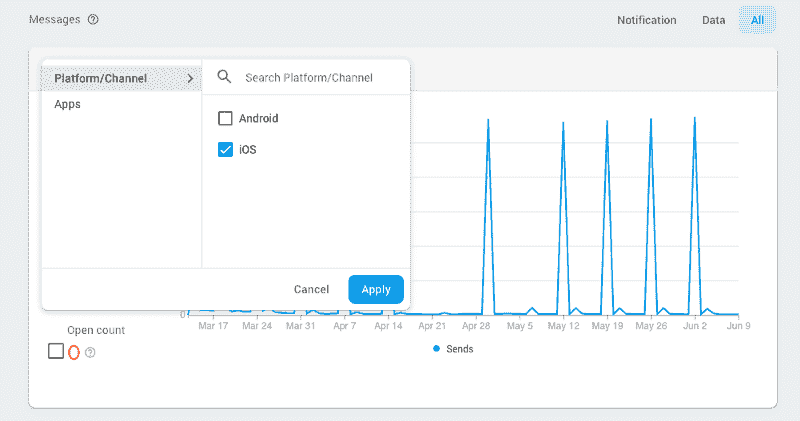

<figure>

<figcaption class="imageCaption">Filter messaging reports with platform or apps</figcaption>

</figure>

### 3.创建通知

单击通知选项卡中的**新通知**，打开一个表单，您可以在其中编写通知。

<figure>

<figcaption class="imageCaption">Compose notification form</figcaption>

</figure>

撰写表单有 5 个部分，我们将逐一介绍

*   通知
*   目标
*   行程安排
*   转换事件
*   附加选项

#### 3A。通知部分

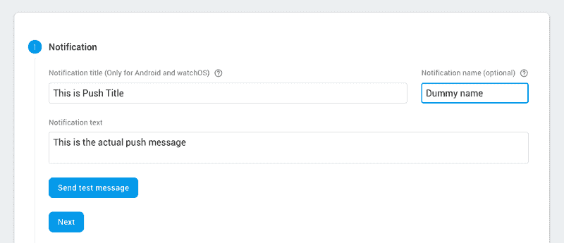

<figure>

<figcaption class="imageCaption">Notification section in Compose form</figcaption>

</figure>

*   通知标题——这是在 Android 设备的推送消息中显示的标题。iOS 不会在推送消息中显示此标题
*   通知文本—这是消息的主体。这是用户在推送通知中看到的文本内容。

如果您将上述通知发送到您的应用程序，它将在 Android 设备中显示如下

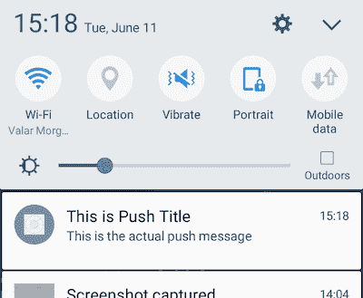

<figure>

<figcaption class="imageCaption">Push showing title and message</figcaption>

</figure>

*   通知名称—它只是 Firebase 用来标识不同消息的一个虚拟名称

#### 发送测试消息

假设您的应用程序有成千上万的用户，您对想要测试的通知做了一些更改。在这种情况下，您肯定不会向所有用户发送数据。在这种情况下，在测试设备上测试通知非常方便。

在通知区点击**发送测试信息**。您将看到以下弹出窗口

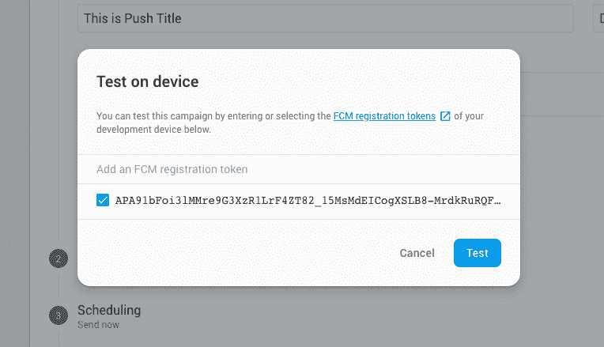

<figure>

<figcaption class="imageCaption">Enter your device token to send a test push</figcaption>

</figure>

您需要找到您设备的**设备令牌**并在此输入。点击**发送**，仅向您的设备发送测试推送。很方便，对吧？

#### 3B。目标部分

经常会有这样的情况，你想把某些通知只发送给 iOS 用户，或者只发送给 Android 用户，或者带有一些其他的参数。目标部分是筛选将接收推送的目标用户的好方法。

这里有两种主要的方式来过滤用户。

1.  按用户细分
2.  按主题

#### 3B。1.按用户细分

在这里，你可以根据应用程序、用户属性、语言、国家等过滤用户。

**按 App 过滤**

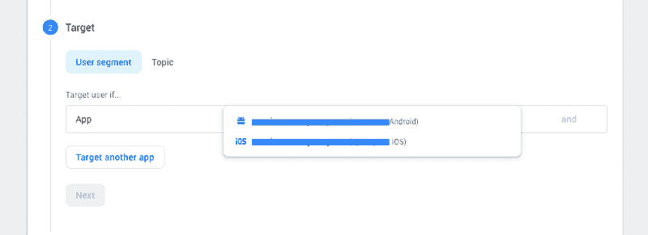

<figure>

<figcaption class="imageCaption">Filter users by app</figcaption>

</figure>

您可以选择哪些应用程序用户应该接收通知。要同时添加 iOS 和 Android 应用程序(比如说)，您可以单击**将另一个应用程序**作为目标，并将其他应用程序添加到目标中。

一旦你选择了应用程序，你可以点击右边的**和**按钮。您会看到一个下拉列表，从中选择下一个标准。

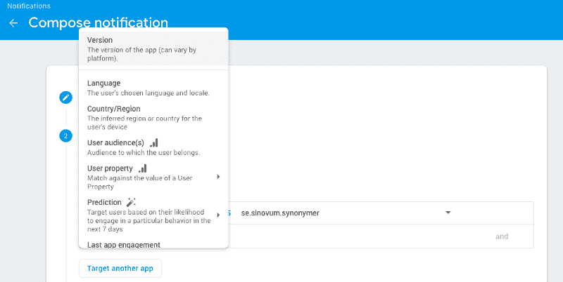

<figure>

<figcaption class="imageCaption">More filtering criteria for targets</figcaption>

</figure>

**按版本过滤**

您可以按目标应用程序的版本过滤目标。本质上，您可以向不同的版本发送不同的通知。当您希望旧应用程序用户升级到新版本时，这很有用。这些版本由 Firebase 自动捕获。

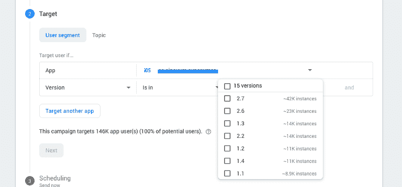

<figure>

<figcaption class="imageCaption">Filter by app version</figcaption>

</figure>

**按语言过滤**

你也可以通过语言过滤你的目标用户。该语言列表是由 Firebase 根据用户统计数据(基于用户的默认区域语言)自动创建的

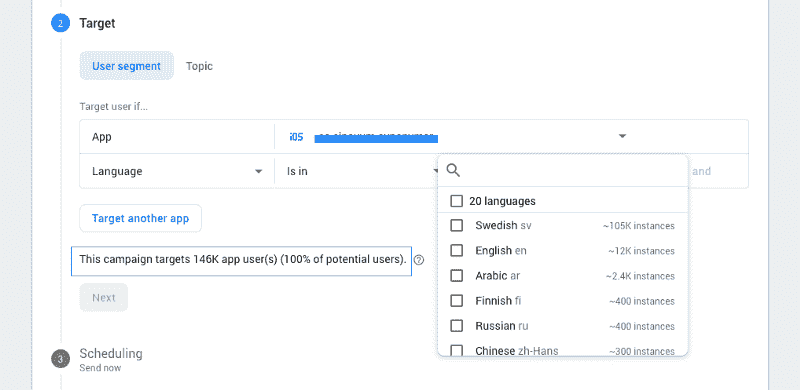

<figure>

<figcaption class="imageCaption">Filter your target by language</figcaption>

</figure>

您可以看到 Firebase 让您大致了解每种语言有多少用户。此外，您可以在突出显示的蓝色框中看到将接收通知的最终用户数量。

**按国家过滤**

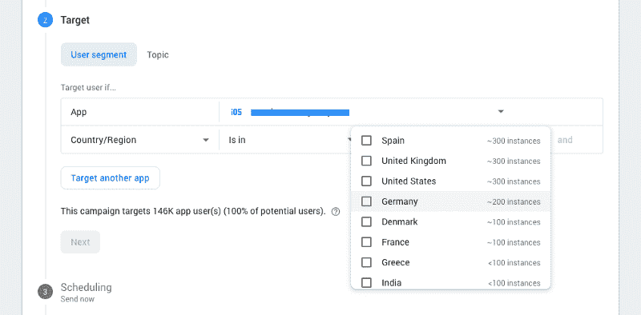

<figure>

<figcaption class="imageCaption">Filter targets by Country</figcaption>

</figure>

与语言类似，您也可以按国家过滤您的目标用户。国家列表是由 Firebase 根据用户统计自动创建的。同样，Firebase 让您大致了解每个选项有多少用户。

**按用户属性过滤**

用户属性是在过滤过程中提供自定义属性的一种智能方式。您可以在应用程序代码中提供任意数量的用户属性。

例如，如果用户购买了某种产品，您可以为该用户分配一个属性`productbought= product_name`。然后，在发送推送时，您可以过滤所有此类用户，为他们创建特定于产品的通知

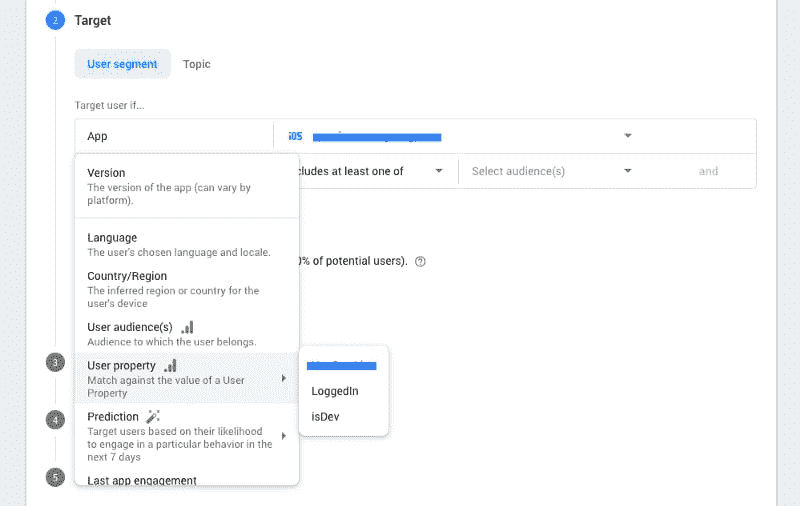

<figure>

<figcaption class="imageCaption">Filter by User Properties</figcaption>

</figure>

一些有意义的用户属性可以是

*   isLoggedIn
*   已注册
*   isPremiumUser
*   自由苏联
*   伊索杜塞
*   isreferreducer

**按最后一个应用参与度过滤**

向很长时间没有使用你的应用的用户发送推送通知通常非常有用。在这种情况下，您不需要创建单独的 userProperty。Firebase 给你一个选项，通过**最后一次应用参与**来过滤用户

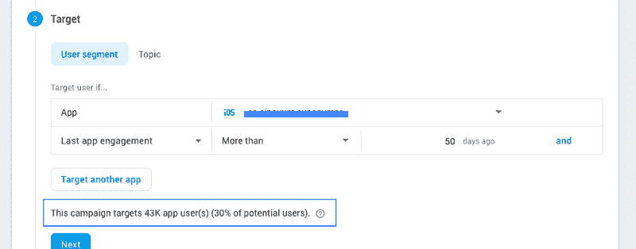

<figure>

<figcaption class="imageCaption">Filter users by last app engagement — wake up your users!</figcaption>

</figure>

类似于**最后一次应用参与，**你也可以选择通过**第一次打开**属性来过滤用户，这几乎是不言自明的。

**注意** -您可以组合多个过滤标准，以获得特定通知的确切目标用户。

#### 3B。2.按主题

在你的应用中，你可以根据用户的活动为他们自动订阅某些频道，或者让他们选择订阅某些主题。当发送推送时，您可以简单地选择这些主题并发送通知。这些主题适用于多个应用程序，因此您不必选择多次。

例如，如果你是一个新闻应用程序，你可以让你的用户选择订阅科技新闻、时尚新闻或政治新闻——每一个都属于不同的“主题”。根据谁订阅了什么，他们会收到相关通知，无论是在 iOS 还是 Android 上

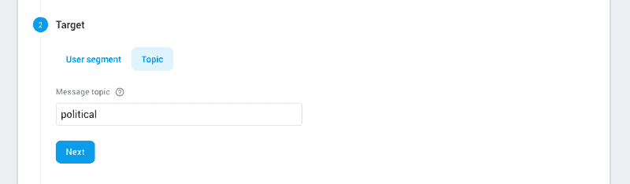

<figure>

<figcaption class="imageCaption">Filter your push simply by topics</figcaption>

</figure>

请注意，在新主题创建和它成为可用目标之间有一天的延迟。

#### 3C。调度部分

在合适的时间发送通知是很重要的，因为这个时间最能吸引你的用户，比如周末，晚上他们下班回来的时候等等。

Firebase 提供了许多选项来安排您的通知

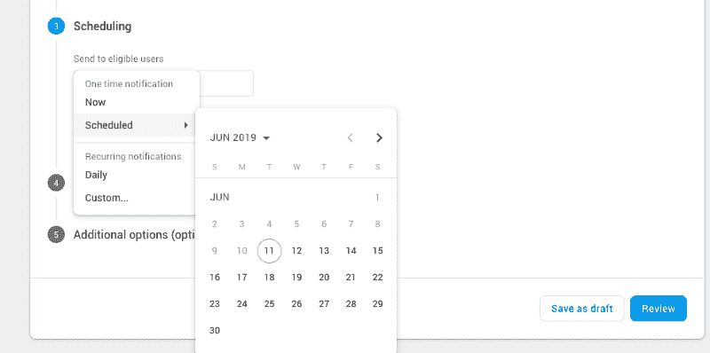

<figure>

<figcaption class="imageCaption">Schedule your notifications as you want</figcaption>

</figure>

*   **立即发送** —立即发送所有通知
*   **日程** —从日历中选择
*   **每日** —通知将在每天的自定义时间发送。您可以指定开始和结束日期

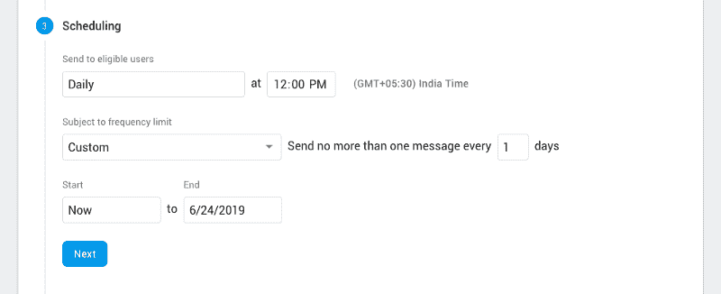

<figure>

<figcaption class="imageCaption">Schedule push with a daily schedule</figcaption>

</figure>

*   **自定义时间表** —您也可以使用自定义时间表发送通知

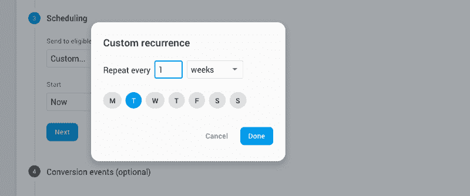

<figure>

<figcaption class="imageCaption">Schedule push with a custom schedule in the week</figcaption>

</figure>

#### 3D。转换事件部分

Firebase 已经提供了通知**发送**和**开启**事件。你可以利用这些来评估你的活动效果。但是有时你也想通过通知来检查某个活动是否发生了。例如，如果用户在收到通知后确实做了他/她应该做的事情，您可能会想这么做。为此，您可以使用**转换事件**

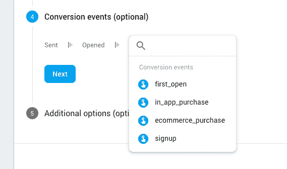

<figure>

<figcaption class="imageCaption">Enable conversion events for better campaign effectiveness estimation</figcaption>

</figure>

你可以将转化事件与分析和广告结合起来，创建一个有效的活动来跟踪哪些转化了，哪些没有转化

#### 3E。附加选项部分

Firebase 还为您提供了在推送通知中附加附加数据的选项。这些数据以键值对的方式出现。您可以附加多个这样键值对，以便通过您的通知传输更有意义的数据。

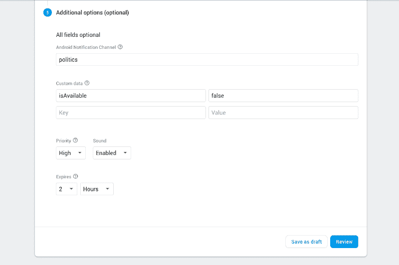

<figure>

<figcaption class="imageCaption">Implement additional options in your notification campaign</figcaption>

</figure>

您还可以在此部分更改推送通知的以下设置

*   **Priority** — Priority 表示这个通知应该消耗用户多少宝贵的注意力。在某些情况下，低优先级通知可能对用户隐藏，而高优先级通知可能会打断用户。例如，如果设备具有**游戏模式，当用户处于**游戏模式时，**低优先级通知可能会被隐藏。**
*   **声音** —您的通知是否应该用声音通知用户
*   **Expires** —这告诉系统，如果之前的尝试由于某种原因失败，多长时间后重试发送通知

### 4.创建通知实验

Firebase 引入了一种使用通知实现 A/B 测试的新方法。

从本质上说，在实验中，您创建不同的用户组，并在他们身上尝试不同的事情(通过发送通知)。这让你很好地了解一个策略与其他策略相比有多好。

在**通知**选项卡中，点击**创建实验**组成一个新实验。

#### 4a。实验基础

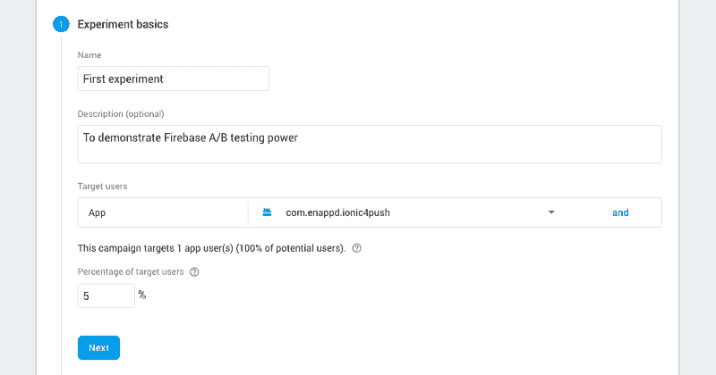

<figure>

<figcaption class="imageCaption">Compose an experiment</figcaption>

</figure>

输入实验的基本细节，选择要在哪个应用程序上进行实验。同样，您可以按照前面章节中描述的所有过滤器来过滤您的目标受众。

请注意，您需要选择您将要试验的用户的百分比。这些用户将被随机选择。保持低百分比，这样你就不会在实验中遇到任何意外。

#### 4b。变体

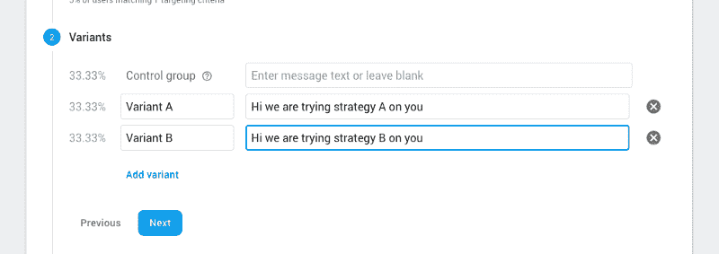

<figure>

<figcaption class="imageCaption">Create experiment variations</figcaption>

</figure>

在变体部分，您可以为不同的部分定义不同的推送消息。**控制组**是体验正常应用行为的用户的子集。将其他变体的行为与对照组进行比较。您可以添加多个变体

#### 4c。目标

在这一部分，您可以定义实验的目标。这是将在对照组和其他变量之间进行比较的参数

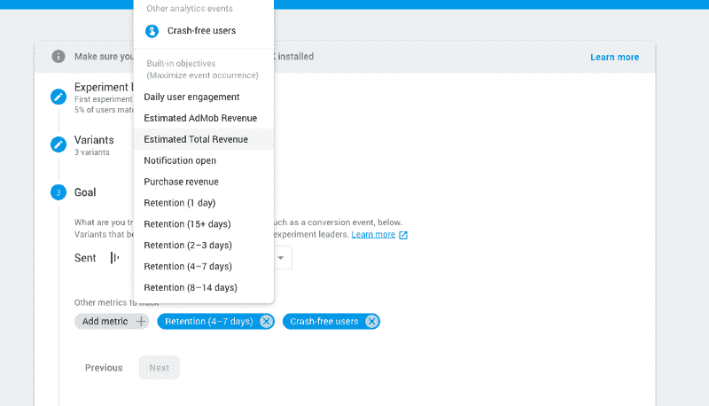

<figure>

<figcaption class="imageCaption">Choose your goal for comparison purpose</figcaption>

</figure>

Firebase 中有各种默认目标。

#### 4d。消息选项

此部分与普通撰写通知表单的附加选项部分完全相同。

<figure>

<figcaption class="imageCaption">Additional options for experiment messages</figcaption>

</figure>

您可以在这里创建额外的键-值对，定义到期或消息，设置优先级和打开/关闭声音

完成实验设置后，点击**查看。**它将向您展示设置的概述，以便您在开始实验前进行回顾。你可以随时回去**编辑**这个实验。一旦你准备好了，你就可以开始实验了。通知将根据您在实验设置中选择的设置发送。

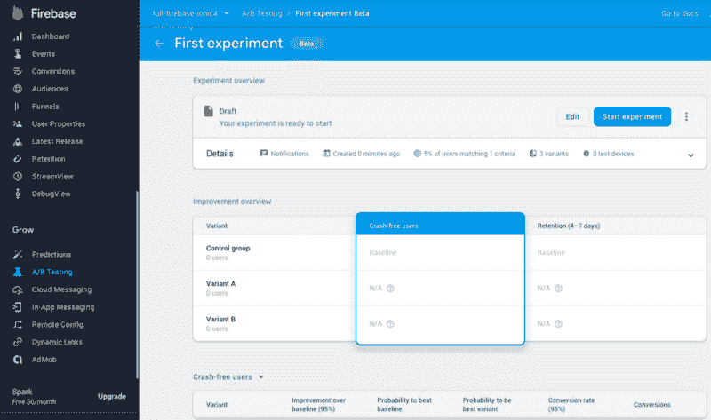

<figure>

<figcaption class="imageCaption">Review the experiment before starting it!</figcaption>

</figure>

### 结论

我知道，我知道，这是一个很长的帖子。但是 Firebase 推送通知值得这样一个帖子来详细解释事情。对于开发者来说，这是一个非常棒的工具。想象一下，如果没有这个工具来撰写和发送通知，生活会是怎样！

总之，我们学习了如何在 Firebase 控制台中编写通知，以及过滤目标受众、计划和其他通知选项的各种选项。我们还学习了 Firebase 的新实验功能，它允许您使用通知来设置实验，并为您提供比较来衡量活动的有效性。

这将证明对你是多么有用！

**敬请关注更多有趣的应用博客！**

### 后续步骤

既然你已经学会了如何使用 Firebase 发送各种推送通知，你也可以试试

*   [Ionic 4 PayPal 支付集成——用于应用程序和 PWA](https://enappd.com/blog/ionic-4-paypal-payment-integration-for-apps-and-pwa/16)
*   [Ionic 4 Stripe 支付集成——用于应用和 PWA](https://enappd.com/blog/ionic-4-stripe-payment-integration-with-firebase-for-apps-and-pwa/17)
*   [Ionic 4 Apple Pay 集成](https://enappd.com/blog/how-to-integrate-apple-pay-in-ionic-4-apps/21)
*   [使用 Firebase 在 Ionic 4 中登录 Twitter】](https://enappd.com/blog/twitter-login-in-ionic-4-apps-using-firebase/24)
*   [脸书用 Firebase 登录爱奥尼亚 4](https://enappd.com/blog/facebook-login-in-ionic-4-apps-using-firebase/25)
*   [离子 4 中的地理位置](https://medium.com/enappd/using-geolocation-and-beacon-plugins-in-ionic-4-754b41304007)
*   [二维码和扫描仪](https://medium.com/enappd/qr-code-scanning-and-optical-character-recognition-ocr-in-ionic-4-95fd46be91dd)在 Ionic 4 和
*   [Ionic 4 中的翻译](https://medium.com/enappd/how-to-translate-in-ionic-4-globalization-internationalization-and-localization-31ec5807a8bc)

如果你需要一个基础来启动你的下一个 Ionic 4 应用程序，你可以使用 [Ionic 4 完整应用程序](https://store.enappd.com/product/ionic-4-full-app/)来制作你的下一个很棒的应用程序

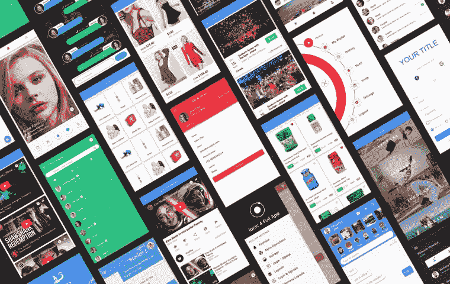

<figure>

<figcaption class="imageCaption">Use Ionic 4 Full app for your next awesome app</figcaption>

</figure>