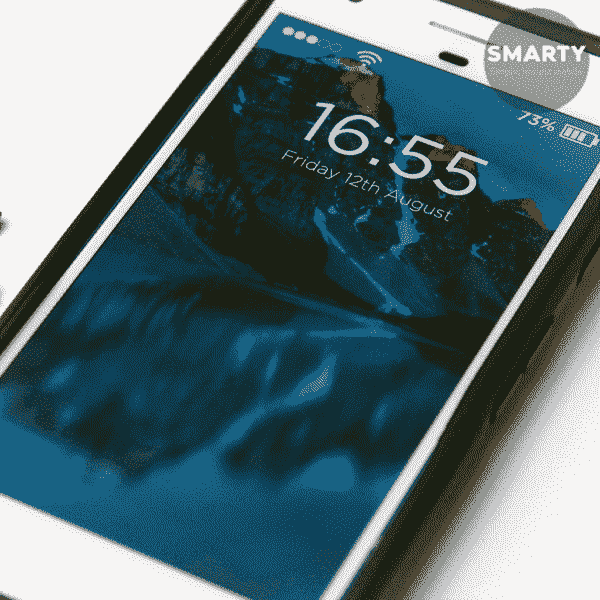
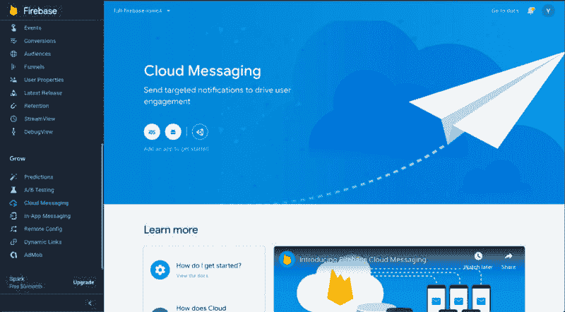
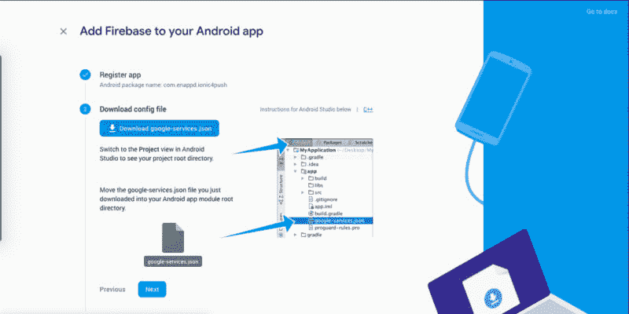
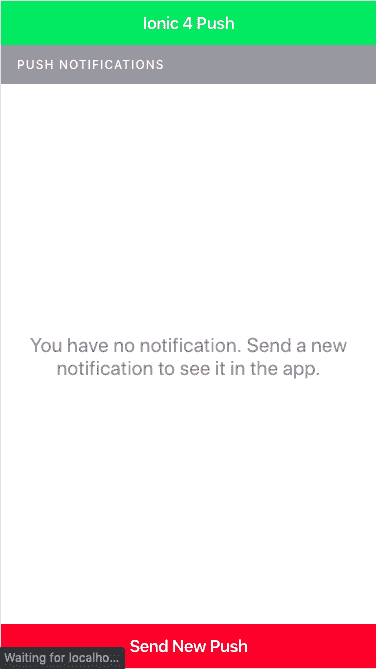
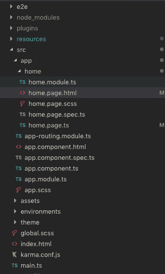
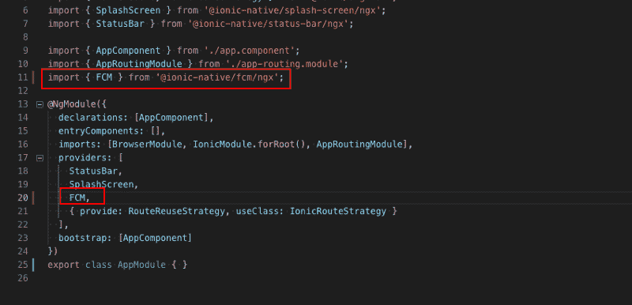

# Ionic 4 中的 Firebase 推送通知

> 原文:[https://dev . to/enappd/firebase-push-notifications-in-ional-4-37nk](https://dev.to/enappd/firebase-push-notifications-in-ionic-4-37nk)

* * *

在这篇文章中，我们将学习如何使用 Firebase 在 Ionic 4 应用程序中设置推送通知。我们将使用 Firebase 控制台发送通知，并在应用程序中接收它们。我们还将学习如何在 Ionic 4 应用中处理推送通知。因为所有这些可能会变得很长，所以我将讨论仅限于 Android 应用程序。我将在 Ionic 4 的 iOS 应用程序中发布另一篇博客。

> **这个博客的完整代码可以在** [**Github**](https://github.com/enappd/ionic-4-push) 完全免费找到


<figure>

<figcaption class="imageCaption">No no… not the push we are talking about 😐</figcaption>

</figure>

### 什么是推送通知

好吧，我试着用自己的语言定义一下。如果 Whatsapp、脸书或 Twitter 关闭了，你怎么知道什么时候会收到新消息？是的，那些从屏幕顶部弹出的显示新消息、更新或新闻的小消息被称为推送通知(或简称为 Push)



<figure>

<figcaption class="imageCaption">Yes, those …… are push notifications</figcaption>

</figure>

有人可能想知道为什么要在应用程序中集成推送通知。让我告诉你，推送通知是让你的用户参与到你的应用中的最大功能。人们痴迷于通知。人们会定期检查手机，以免错过任何通知。如果你的应用发送定期的(有趣的)推送，你的用户会很高兴，你会比没有推送时看到更少的应用卸载。

### 什么是离子 4？

你可能已经知道离子，但我把它放在这里只是为了初学者。 **Ionic** 是一款用于混合移动应用开发的完整开源 SDK，由 Drifty 公司的[马克斯林奇](https://medium.com/u/a76fa51de1ba)、[本斯佩里](https://medium.com/u/14b1be5c1354)和亚当布拉德利于 2013 年创建。Ionic 提供使用 CSS、HTML5 和 Sass 等 Web 技术开发混合移动应用的工具和服务。可以使用这些 Web 技术构建应用程序，然后通过本地应用程序商店分发，并利用 Cordova 安装在设备上。

所以，换句话说——如果你用 Android 创建原生应用，你就用 Java 编码。如果你在 iOS 中创建原生应用，你用 Obj-C 或 Swift 编码。这两种语言都是强大但复杂的语言。使用 Cordova(和 Ionic ),你可以为你的应用编写一段代码，它可以在 iOS 和 Android 上运行。)，HTML、CSS 和 JS 的简单性也是如此。

### 结构

我将一步一步地进行下去，这样你就可以很容易地跟上。

1.  创建一个 Firebase 项目并查找推送选项
2.  创建一个基本的 Ionic 4 应用程序
3.  将你的 Ionic 4 应用程序与 Firebase 连接，并安装推送插件
4.  在 Android 上构建应用程序
5.  从 Firebase 控制台发送通知
6.  在应用程序中接收不同类型的通知
7.  在你的应用中处理推送通知

### 1.创建一个 Firebase 项目并查找推送选项

转到 [Firebase](https://console.firebase.google.com/) 并创建你的第一个项目(或者使用一个现有的项目)。您的控制台应该是这样的


<figure>

<figcaption class="imageCaption">Your Firebase projects all in one place</figcaption>

</figure>

**注意** —创建一个 Firebase 项目真的很容易，但是如果你仍然面临任何问题，请遵循[这篇博客](https://enappd.com/blog/how-to-integrate-firebase-in-ionic-4-apps/23/)的步骤 1-4

点击你的项目，你将进入该项目的仪表板。寻找**云消息**标签。这就是奇迹发生的地方！



<figure>

<figcaption class="imageCaption">Cloud messaging section of Firebase console — You can send push notifications from here</figcaption>

</figure>

#### 推送通知设置

Firebase 控制台还包含 web、android 和 iOS 的推送通知设置。在这里你可以找到你的 **sender_id，**上传 iOS 推送证书等。要设置选项，你首先必须在 Firebase 控制台中创建一个 Android 应用程序。


<figure>

<figcaption class="imageCaption">Add a new Android app in Firebase</figcaption>

</figure>

在这个过程中，它会要求你输入应用程序的**包名**，并提供**Google-services . JSON。**确保你的包名与你在应用程序的`config.xml`中设置的包名相同。(Ionic 4 默认包名是 io.ionic.starter，不要用默认包名)



<figure>

<figcaption class="imageCaption">Download google-services.json</figcaption>

</figure>

### 2.创建一个基本的 Ionic 4 应用程序

创建一个基本的 Ionic 4 应用程序非常容易。假设您的系统中已经安装了所有的基本要求，运行

```
$ ionic start MyApp blank
```

这将创建标题为`MyApp`和空白模板的应用程序。

> 关于如何创建一个基本的 Ionic 4 应用程序的更多细节，请参考我的博客[如何创建一个 Ionic 4 应用程序](https://enappd.com/blog/how-to-create-an-ionic-4-app-for-beginners/13)

稍微修改一下，你的主页就会变成这样。



<figure>

<figcaption class="imageCaption">Slight modification in the homepage to send and receive Push</figcaption>

</figure>

文件结构看起来像这样，只是一个想法



<figure>

<figcaption class="imageCaption">File structure for Ionic 4 Push sample app</figcaption>

</figure>

### 3.在你的应用中安装推送插件

我们将使用 Ionic 原生 FCM 插件实现推送。要安装此插件，请运行

```
$ ionic cordova plugin add cordova-plugin-fcm-with-dependecy-updated
$ npm install @ionic-native/fcm
```

这将安装插件。在`app.module.ts`中导入插件



<figure>

<figcaption class="imageCaption">Import push plugin in app.moudle.ts</figcaption>

</figure>

此外，将插件导入到您的`home.page.ts`中，我们将在那里实现某些动作。`home.page.ts`代码如下所示