# 如何在 Google 计算引擎上部署 Laravel(在 LINUX 上)

> 原文：<https://dev.to/updivision/how-to-deploy-laravel-on-google-compute-engine-on-linux-3h30>

我们的开发人员经历了很多。这些是他们的故事。这是由我们的高级应用程序设计师之一因陀罗讲述的。

我们之前发表了一篇关于在 Google App Engine 上部署 Laravel 的文章。然而，在使用了一段时间后，我们决定我们需要更多的灵活性和对服务器的访问，我们开始研究。结果:现在我们已经转移到谷歌计算引擎。

Google Compute Engine (GCE)更接近于 VPS，它们各有优缺点。虽然我不认为谷歌计算引擎是所有应用程序的最佳选择，但我们对某个数据中心和该领域的静态 IP 有非常具体的需求。考虑到这些限制，GCE 看起来是最好的选择。以下是我们如何做到这一点的插图故事。

## 起动前

在走这条路之前，我强烈建议浏览一下 Google 文档。虽然这篇博文足以让你的应用启动并运行，但更多的定制可能要通过阅读文档来完成。Google 关于部署 PHP 应用的文档非常缺乏，所以我也看了一下 Python 文档，这很有帮助。

我还必须指出，我在这个例子中使用了 **NGINX** 。如果你想使用 Apache，请看看[社区教程](https://cloud.google.com/community/tutorials/setting-up-lamp?hl=zh-TW)。

这个部署需要**Linux**的基础知识，因为我们将在 **Linux 虚拟机**上进行部署。

## 先决条件

1.  [谷歌云壳](https://cloud.google.com/shell/docs/quickstart)
2.  [Google 云平台上的 PHP](https://cloud.google.com/php/docs/)。我们将使用灵活的环境。
3.  可选:[谷歌云上的 Python](https://cloud.google.com/python/docs/)
4.  设置您的 ssh 密钥

在您的终端中(我在 Windows 上使用 git bash 以获得 Ubuntu/Linux 的自由度)，键入: *ssh-keygen -t rsa*

当提示输入位置和文件名时，点击 enter 键默认或设置您自己的:*输入保存密钥的文件(/home/)。ssh/id_rsa):*

当提示输入密码时，输入一个安全的密码(推荐)或单击 enter 跳过使用密码:*输入密码(空表示无密码):*

运行这个命令来获取您的公钥，并在以后复制它: *cat ~/。ssh/id_rsa.pub*

## 准备部署

**注**:这篇文章改编自我们的谷歌应用引擎帖子。

1.  创建一个谷歌云账户:[https://cloud.google.com/](https://cloud.google.com/)或者直接在这里【https://console.cloud.google.com】T2。您将获得 365 天/ 300 美元的试用信用(以先到者为准)。除非你是一个非常老的用户(测试版)，你也将被要求添加你的卡，但你不会被收费。

2.  如果需要，创建一个新项目= >快速视频[此处](https://www.youtube.com/watch?v=7n9DkOzjwlA&feature=youtu.be&t=35s)。

3.  下面继续创建计算引擎实例。

4.  我们将使用 Google cloud shell 来部署:[https://cloud.google.com/shell/docs/quickstart](https://cloud.google.com/shell/docs/quickstart)。为了能够使用它，你需要为你的操作系统下载云 SDK:【https://cloud.google.com/sdk/】T2。你可以从你的浏览器直接使用云壳，或者你可以安装云壳。我把它安装在我的电脑上，因为我发现浏览器无法使用)。如果您运行 Windows，您需要以管理员权限打开它。遵循谷歌为其他操作系统提供的快速入门教程。

5.  在你继续学习 google cloud shell 之前，我推荐你阅读一下关于 php 环境的文章:[https://cloud.google.com/php/docs](https://cloud.google.com/php/docs)。

6.  使用命令 **gcloud auth login** 从控制台登录。您将通过浏览器登录。如果你想看到所有可用的命令，在命令行中写下 **gloud help** 并按回车键。

7.  在命令行中键入**g cloud config set project project _ id**，其中 project id 是您刚刚赋予新创建项目的项目 id。在项目信息小部件下选择项目后，可以在 google 控制台的第一页中找到它。

8.  要查看所有项目的列表，请键入 **gcloud 项目列表**。

这是它的先决条件。我们将继续进行所需的数据库设置和下载。

## 准备您的项目

不像 GAE，在 GCE 上部署你不需要改变什么。然而，你可以把你的应用程序放在 docker 容器中，就像这里解释的那样，让你的工作更容易。

## 创建计算引擎实例

**第一步**。单击创建新实例

**第二步**。在“创建实例”页面上，确保您知道您在为谁服务(GCE 是按区域设置的)。就我而言，我计划为欧盟和澳大利亚服务。因此，我将创建两个实例，并在它们前面放置一个负载平衡器。

**a. Name** :为您的实例命名(将在通过 google cloud SDK shell 连接时使用)

**b. Region** :选择你想要服务的地区(在我的例子中，我选择了欧洲-西部-3 和澳大利亚-东南部 1)。你可以随意选择任何你想要的区域。

**c .机器类型**:我建议一开始使用多个微实例来测试你需要的东西。查看右边的价格。它通常会因地区不同而略有不同，因为我只能假设是税。你可以定制你的机器。去检查一下。

容器:在这里你可以解决一个大问题，并继续使用 Docker。我将使用这台机器作为一个副总裁，所以我现在不会使用它。

e .身份和 API 访问:由于我们为这个应用程序实现了大量的谷歌 API，包括日志和存储，我选择允许对所有云 API 的完全访问。然而，如果你只打算使用一个或两个 API，那就为每个 API 设置访问权限。我不喜欢允许默认访问，但好消息是你可以随时更改这个设置。

防火墙:我选择了允许 HTTPS 流量。这是因为我们不打算允许任何 http 流量。请继续，根据您在应用中使用的内容(外部 API、cors 请求等)在这里做出选择

**g** 。继续操作，单击“管理”、“磁盘”、“网络”、“ssh 密钥”,因为我们将设置一个 SSH 密钥和一些其他设置:

—描述:我将其留空

—标签:我留空了。它们是用来组织项目的，但是因为我为我的每个 Laravel 项目创建了一个新的 Google Cloud 项目，所以我每次都跳过它

—删除保护:如果启用此选项，您将无法再删除此实例。删除实例的唯一方法是删除整个项目。但是，您可以关闭实例以避免计费。

—自动化
启动脚本:空白。添加您希望在实例 statup
Metadata: blank 上运行的任何脚本。用于启动和关闭脚本(如果有的话)。我不知道。

—可用性策略
preemptivity:off 除非你想要一个 tmp 计算机器
自动重启:on，否则你的服务器可能在维护硬件故障后停机
On host maintenance:Migrate VM instance，否则当服务器被移动或维护时你的机器可能被终止。

**第三步**。完成了。单击创建。

**第四步**。现在我创建了欧盟的机器，也应该创建澳大利亚的机器，但是在考虑这个问题后，我决定完成第一台机器的设置，然后克隆它。

## 设置计算引擎机

启动我的机器后，我将继续通过控制台登录。有两种方法可以做到:

1.  从浏览器中(单击实例列表中的 ssh 按钮)。我不会这样做，因为我更喜欢谷歌 sdk 控制台，但如果你在路上，赶时间，这是一个很好的选择。

2.  打开谷歌控制台，输入: *gcloud auth login* 。点击 enter 后，您将被重定向到您的浏览器，在那里您可以正常登录您的 google 帐户。

3.  现在，我们需要设置项目。所以只需在控制台中键入这个:*g cloud config set project project _ id*。其中，project_ id 是您刚刚为新创建的项目指定的项目 id。在项目信息小部件下选择项目后，可以在 Google 控制台的第一页找到它。

[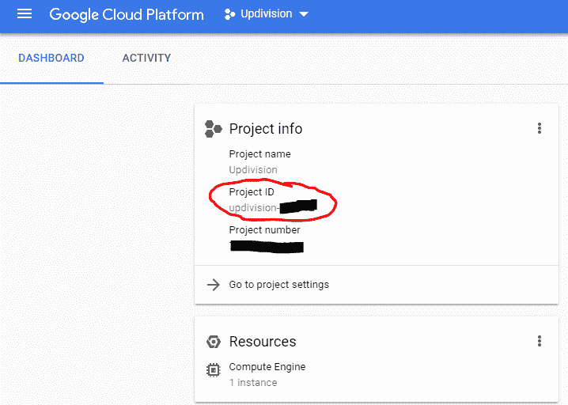](https://res.cloudinary.com/practicaldev/image/fetch/s--fc8EFDPj--/c_limit%2Cf_auto%2Cfl_progressive%2Cq_auto%2Cw_880/https://thepracticaldev.s3.amazonaws.com/i/r78znp7rl9m5oju88r1w.png)

要查看您所有项目的列表，请键入: *gcloud 项目列表*

要登录到您的机器，请键入:*g cloud compute ssh instance-x*。Instance-x 是实例的名称。

查看项目类型信息:
*g cloud compute PROJECT-info describe-PROJECT PROJECT PROJECT _ ID*。

如果你在另一个区域已经有一个项目，使用这个命令:
*g cloud compute project-info add-metadata-metadata Google-compute-default-region = Europe-west 1，Google-compute-default-zone = Europe-west 1-b*

如果您 ssh 连接出现任何问题，请尝试运行:*sudo g cloud compute config-ssh*

或者按照这个教程:[https://cloud . Google . com/compute/docs/instances/connecting-advanced # thirdpartytools](https://cloud.google.com/compute/docs/instances/connecting-advanced#thirdpartytools)

## 设置数据库

要设置数据库，我们必须遵循与谷歌应用引擎几乎相同的过程。

转到[https://console.cloud.google.com](https://console.cloud.google.com)，选择您的项目，然后转到左侧菜单并选择 SQL。

[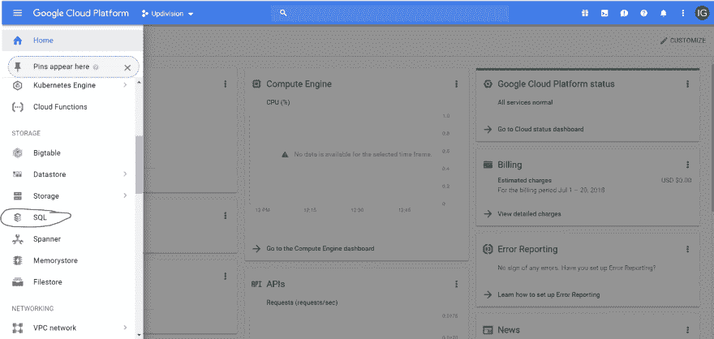](https://res.cloudinary.com/practicaldev/image/fetch/s--6vqjX8Wz--/c_limit%2Cf_auto%2Cfl_progressive%2Cq_auto%2Cw_880/https://thepracticaldev.s3.amazonaws.com/i/kw988hatdsewd6qpu22a.png)

在那里，单击 create instance(second generation)并为 SQL DB 实例命名。有关选择设置的更多信息，请参考[如何在 Google App Engine](https://dev.to/updivision/how-to-deploy-a-laravel-web-app-on-google-app-engine-2hpb) 上部署 Laravel web app 中的**设置 SQL 数据库**部分。

一旦创建了符合您需要的数据库，您就可以将它连接到两个实例。事情是这样的:

1.  转到您的实例列表，复制计算引擎的外部 IP

2.  点击数据库和非政府组织授权选项卡

[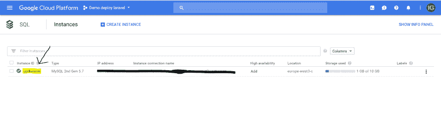](https://res.cloudinary.com/practicaldev/image/fetch/s--YLOYa4tF--/c_limit%2Cf_auto%2Cfl_progressive%2Cq_auto%2Cw_880/https://thepracticaldev.s3.amazonaws.com/i/jj08y8n5ajvo4lekpql1.png)

在授权选项卡中，在名称输入中添加实例的名称，在网络输入中添加 ip 地址。

1.  使用数据库用户名、主机和名称设置您的。环境文件

## 实例组和 ssl

现在你进来了。这就像任何其他 VPS 机器，所以继续安装 nginx，php，mysql，git，composer 模块(不是数据库，因为它是管理的)等等。服务器通常会运行 apache，但我更喜欢 nginx，因为我通常会在 apache 中遇到优化问题。

**注意**:您对您在机器上安装的任何东西以及任何潜在的问题负责。
现在，我将在 usr/share/nginx/html 中克隆我的库，并启用设置站点。

## 单机 vs 多机设置

现在，您可以选择安装 letsencrypt 证书并继续使用您的 live，或者您可以继续使用多台机器设置。如果你选择只保留一台机器，那么向下滚动到设置你的域，但是如果你决定继续多机设置，那么继续阅读。

## 多台机器设置

我的机器启动并运行后，我克隆了第一个实例，并将第二个实例的数据中心移到 US-east1。在我克隆了机器之后，我必须像设置第一台机器一样设置第二台机器。

在写这篇博客的过程中，我删除并重新创建了机器，所以图片中的名称可能会改变，但我会继续将它们命名为实例 1 和 2。

一旦实例准备就绪，就该创建实例组了。

## 创建一个实例组

转到您的虚拟机实例列表。在第一个实例末尾的 3 个点上，单击**新建实例组**。

[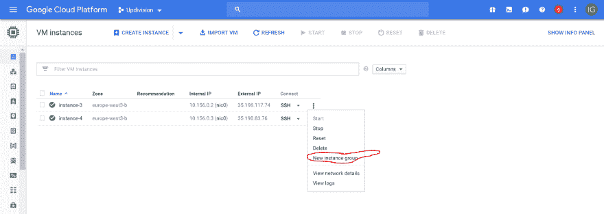](https://res.cloudinary.com/practicaldev/image/fetch/s--1DXsCwCl--/c_limit%2Cf_auto%2Cfl_progressive%2Cq_auto%2Cw_880/https://thepracticaldev.s3.amazonaws.com/i/6y6i0n2yjh6fkgl73jfq.png)

选择 unmanaged(或者不选择，取决于您的需要),并在页面末尾添加第二个实例。单击创建。

如果你想选择管理，你需要创建一个实例模板，谷歌可以在流量增加时自动旋转。为此，当实例启动时，您还需要一个启动脚本来运行。你可以用 bash 来写。

[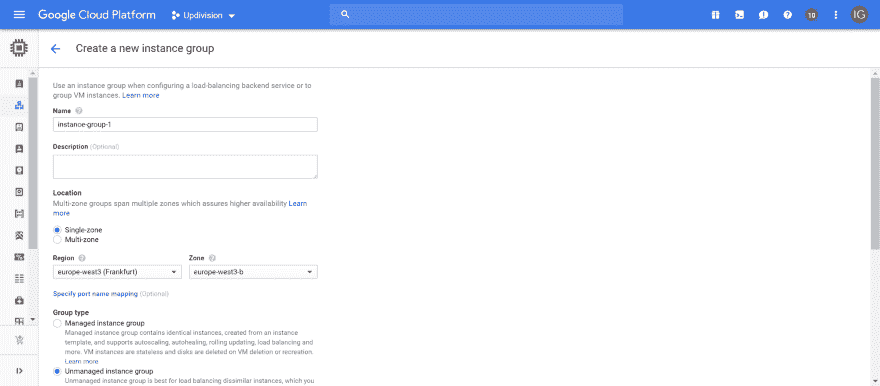](https://res.cloudinary.com/practicaldev/image/fetch/s--0GFOIUgf--/c_limit%2Cf_auto%2Cfl_progressive%2Cq_auto%2Cw_880/https://thepracticaldev.s3.amazonaws.com/i/k5kbt253aux88kl1hnvj.png)

[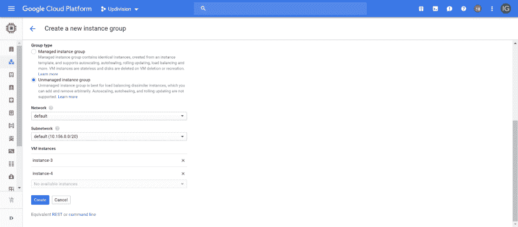](https://res.cloudinary.com/practicaldev/image/fetch/s--qNuSXlAE--/c_limit%2Cf_auto%2Cfl_progressive%2Cq_auto%2Cw_880/https://thepracticaldev.s3.amazonaws.com/i/42d9hmxvtnp8ku7u1f10.png)

## 设置域

转到左侧菜单，选择 VPC 网络

[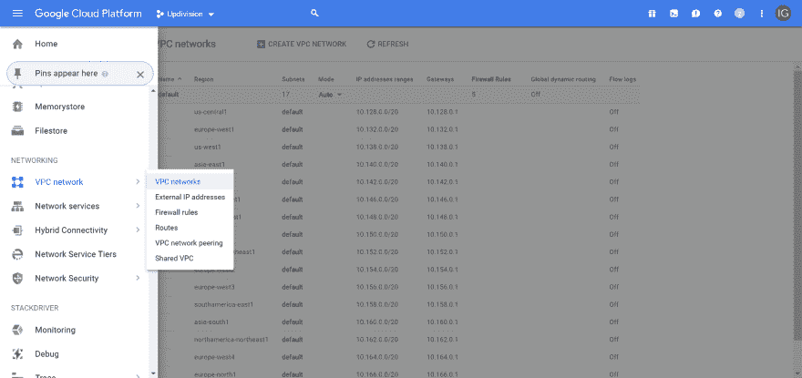](https://res.cloudinary.com/practicaldev/image/fetch/s--PmIRIWQ4--/c_limit%2Cf_auto%2Cfl_progressive%2Cq_auto%2Cw_880/https://thepracticaldev.s3.amazonaws.com/i/r73w8mckags89q86yivi.png)

现在选择外部 IP 地址，并确保您的实例运行在静态 Ip 地址上。如果它不保留一个。

[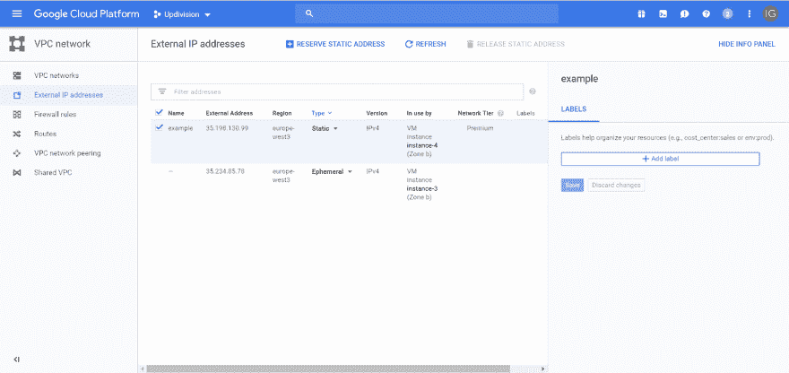](https://res.cloudinary.com/practicaldev/image/fetch/s--Ak7Sn2T9--/c_limit%2Cf_auto%2Cfl_progressive%2Cq_auto%2Cw_880/https://thepracticaldev.s3.amazonaws.com/i/4j1axh5jx9o5nclty07q.png)

要在实例组上设置域，您需要进入左侧菜单并单击网络服务

[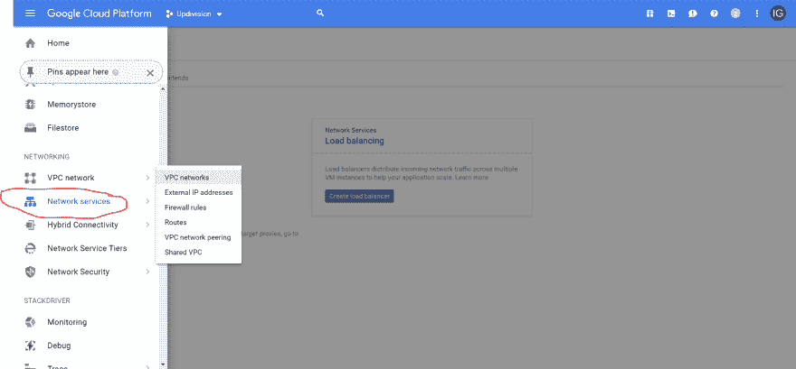](https://res.cloudinary.com/practicaldev/image/fetch/s--ZmDhb6MA--/c_limit%2Cf_auto%2Cfl_progressive%2Cq_auto%2Cw_880/https://thepracticaldev.s3.amazonaws.com/i/d882iclfhkntsvr61z9k.png)

在左侧菜单中，您需要选择云 DNS

[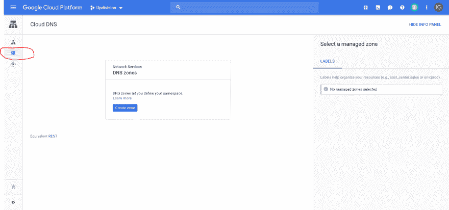](https://res.cloudinary.com/practicaldev/image/fetch/s--OzrLB9d3--/c_limit%2Cf_auto%2Cfl_progressive%2Cq_auto%2Cw_880/https://thepracticaldev.s3.amazonaws.com/i/p36b5bwzan6u0gj47vcx.png)

单击创建区域，并按如下方式填写字段:

**区域名**:用来识别域东西

**DNS 名称**:域名(在我的例子中是 updivision.work .不要添加子域。我们稍后会这样做)

DNSSEC:我把它设置成了关闭，但是你可以通过点击输入旁边的问号来阅读更多信息

**描述**:可选，描述你的区域

单击创建

[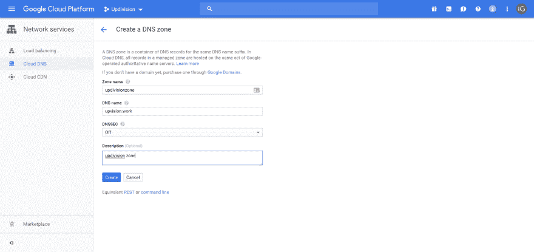](https://res.cloudinary.com/practicaldev/image/fetch/s--GDLm1SSV--/c_limit%2Cf_auto%2Cfl_progressive%2Cq_auto%2Cw_880/https://thepracticaldev.s3.amazonaws.com/i/z33m5w3u78gykzvshsa6.png)

然后，我们需要创建一个记录，将我们保留的 IP 地址连接到我们正在设置的域。单击您所在区域的名称，然后在页面顶部添加记录集。

[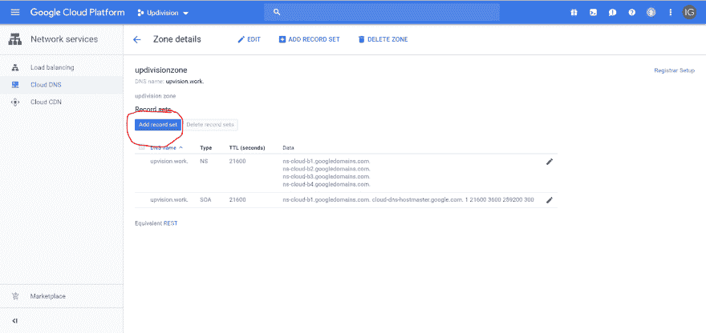](https://res.cloudinary.com/practicaldev/image/fetch/s--BmWjTzZV--/c_limit%2Cf_auto%2Cfl_progressive%2Cq_auto%2Cw_880/https://thepracticaldev.s3.amazonaws.com/i/2cmjqgu5ue0c8en4s919.png)

添加一个 A 记录。复制实例的 IP，并将其粘贴到 IPv4 地址输入中。如果你想使用一个子域添加到 DNS 名称输入。

[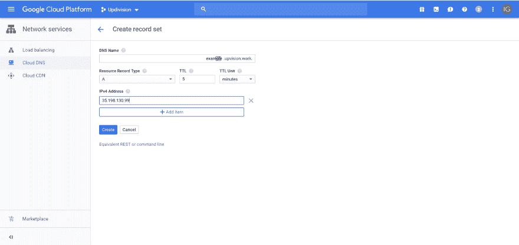](https://res.cloudinary.com/practicaldev/image/fetch/s--OSceZxJc--/c_limit%2Cf_auto%2Cfl_progressive%2Cq_auto%2Cw_880/https://thepracticaldev.s3.amazonaws.com/i/ephjpcs6u6ao46a4ivzu.png)

一旦你点击创建，去你的域名卖家那里，用你从谷歌得到的条目设置域名服务器(自定义域名系统)。

由于我使用 sparkpost 发送电子邮件，并使用 google 电子邮件服务在我设置的大多数域上接收电子邮件，因此我不需要为电子邮件服务设置任何记录，因为我将使用编程提供的 api，但您总是可以通过添加所需的记录来设置电子邮件。

## SSL

如前所述，如果你只需要一个实例，你可以用 certbot 安装 letsencrypt(如果你建立一个小型网站或测试环境，这种情况最有可能发生)。不过，如果您的目标是生产环境，我将在本章继续介绍负载平衡。

进入左侧菜单，点击网络服务，这次选择负载平衡。

[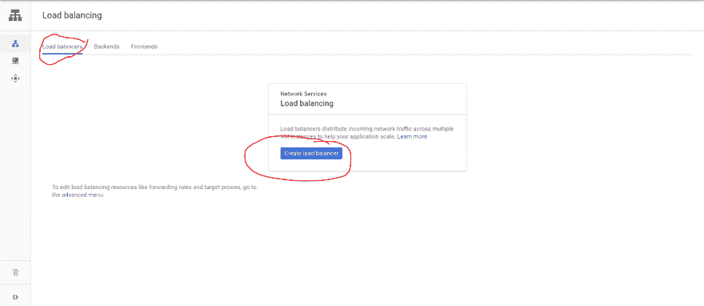](https://res.cloudinary.com/practicaldev/image/fetch/s--q4yssUgw--/c_limit%2Cf_auto%2Cfl_progressive%2Cq_auto%2Cw_880/https://thepracticaldev.s3.amazonaws.com/i/ov69mkogsj6pwe8gm35j.png)

单击创建负载平衡器。在下一个屏幕中，选择 HTTP(S)负载平衡。要了解更多信息，你可以点击这个链接:[https://cloud.google.com/load-balancing/docs/https/](https://cloud.google.com/load-balancing/docs/https/)

[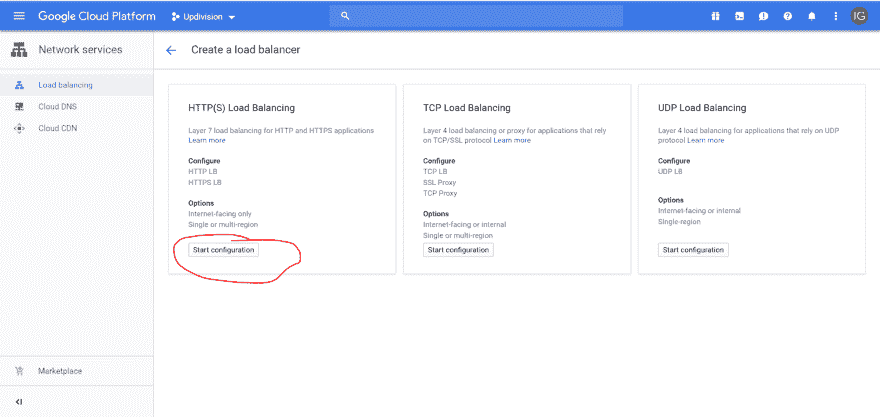](https://res.cloudinary.com/practicaldev/image/fetch/s--Xi8I0UiO--/c_limit%2Cf_auto%2Cfl_progressive%2Cq_auto%2Cw_880/https://thepracticaldev.s3.amazonaws.com/i/m03amarw422dw0c68myy.png)

单击开始配置。给它一个名字，然后点击后端配置。

[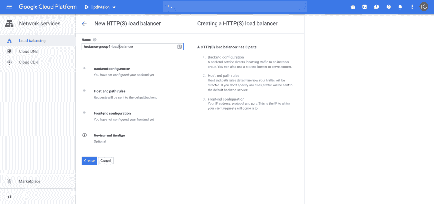](https://res.cloudinary.com/practicaldev/image/fetch/s--9_zZGCNb--/c_limit%2Cf_auto%2Cfl_progressive%2Cq_auto%2Cw_880/https://thepracticaldev.s3.amazonaws.com/i/u903kmaobpa67a42fg6b.png)

选择创建后端服务和后台存储桶，然后选择创建后端服务

[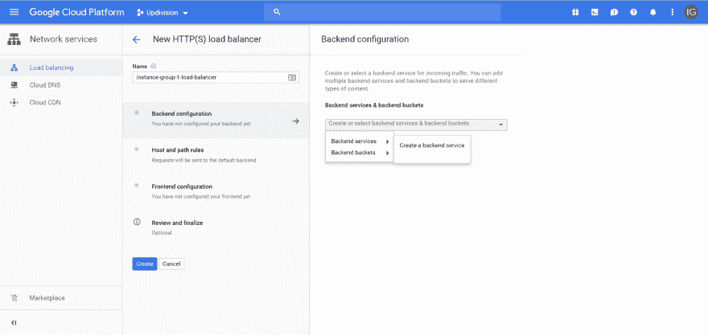](https://res.cloudinary.com/practicaldev/image/fetch/s--qpvIphlG--/c_limit%2Cf_auto%2Cfl_progressive%2Cq_auto%2Cw_880/https://thepracticaldev.s3.amazonaws.com/i/ua7nwlzw0t6upfdgx3uz.png)

给它一个名称，选择实例组并将协议编辑为 https

[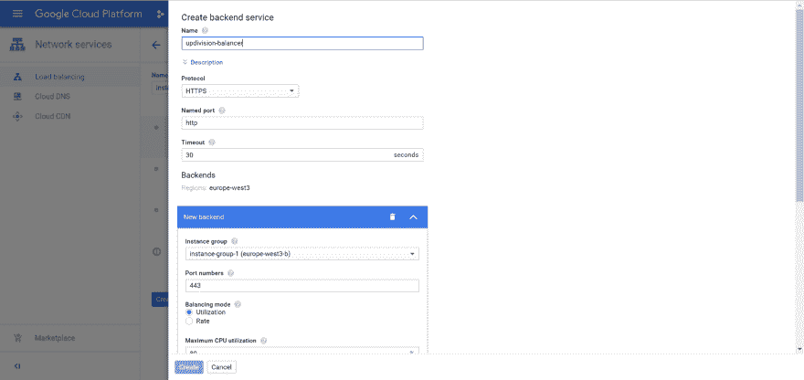](https://res.cloudinary.com/practicaldev/image/fetch/s--3Ki5kVb5--/c_limit%2Cf_auto%2Cfl_progressive%2Cq_auto%2Cw_880/https://thepracticaldev.s3.amazonaws.com/i/jfyv9ald5mb3bqc65qjr.png)

我还向下滚动并选中了启用云 CDN。在单击创建之前，我需要创建一个运行状况检查。

[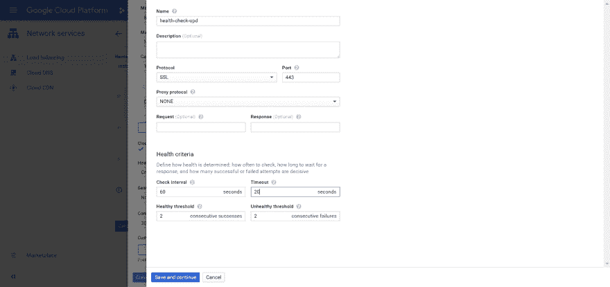](https://res.cloudinary.com/practicaldev/image/fetch/s--Zdm55aco--/c_limit%2Cf_auto%2Cfl_progressive%2Cq_auto%2Cw_880/https://thepracticaldev.s3.amazonaws.com/i/ng437nkubipr6v8c58sd.png)

单击保存并继续，然后单击创建。在第一个屏幕中(点击创建后会显示出来)，我点击了创建。

你也可以去谷歌官方云页面查看你的设置:[https://cloud.google.com/iap/docs/load-balancer-howto](https://cloud.google.com/iap/docs/load-balancer-howto)

伙计们，就这样吧。我希望你喜欢这篇文章，并发现它很有帮助。你自己有什么提示或建议吗？或者一些问题？欢迎在评论中提问。

我建议在开始之前阅读所有的 Google 文档，并确保您已经计划好了设置。我不得不删除我的实例一次，因为我没有提前计划。

拉拉威尔部署愉快！