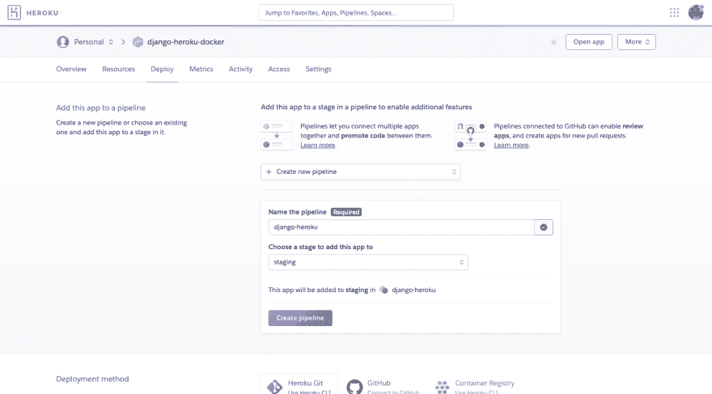
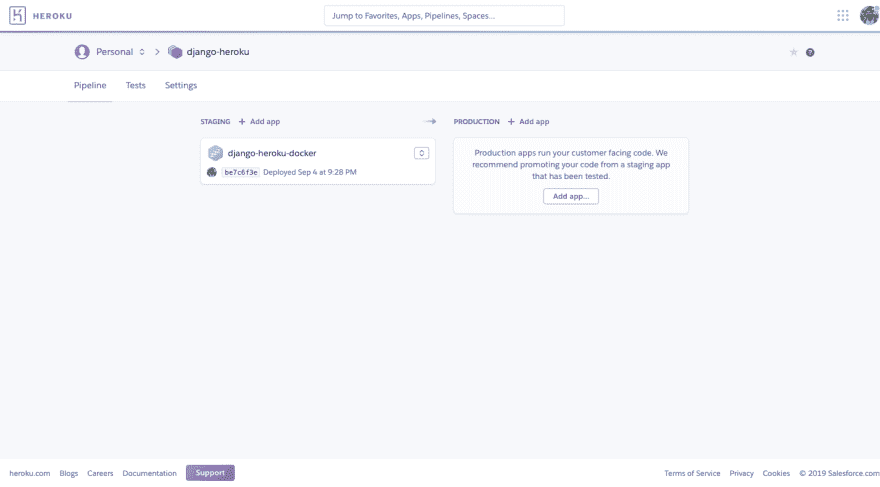

# 如何使用 Heroku 管道

> 原文:[https://dev.to/michaelyin/how-to-use-heroku-pipeline-60h](https://dev.to/michaelyin/how-to-use-heroku-pipeline-60h)

## [](#introduction)简介

这篇文章是我的 [Python Heroku 教程系列](https://www.accordbox.com/blog/django-heroku-tutorial/)的第 4 篇。在这个 Heroku 教程中，我将讨论如何设置 Heroku 管道以及如何使用它。

> Heroku 管道是一组共享相同代码库的 Heroku 应用程序。管道中的每个应用程序代表连续交付工作流中的以下阶段之一

*   发展
*   回顾
*   脚手架
*   生产

**Heroku review app 现在只能与 Github 一起使用，在大多数情况下并不需要(我们可以使用不同的测试来确保代码运行良好)**

## git lab 的工作流程

有一些不同的方法来使用 Heroku 管道，这里是我的工作流程，希望它能启发你。

1.  当我们将一些功能合并到主分支时，我们会将代码推送到 Gitlab。

2.  Gitlab CI 将检查代码风格，运行单元测试，实时测试，以确保所有功能正常工作。

3.  如果提交通过 CI，代码将被部署到 Heroku 管道的`staging app`

4.  我们可以做一些手动测试，检查功能是否工作正常(在某些情况下不需要这一步)

5.  如果我们认为提交可以进行，我们应该将代码从`staging app`提升到`production app`

`staging app`和`production app`共享相同的代码(在某些情况下，`staging app`中的代码版本可能稍新)，但是它们有不同的 env 资源(数据库、AWS S3 桶、域名和其他配置变量)

## [](#create-heroku-pipeline-in-heroku-dashboard)在 Heroku 仪表盘中创建 Heroku 管道

在 heroku dashboard 中，**确保您已经有 heroku 应用程序，然后将其添加到新的 Heroku 管道中**您可以在应用程序的`Deploy`标签中完成此操作

[T2】](https://res.cloudinary.com/practicaldev/image/fetch/s--aLeOflMU--/c_limit%2Cf_auto%2Cfl_progressive%2Cq_auto%2Cw_880/https://www.accordbox.com/uploimg/heroku-pipeline-create-new-pipeline.original.png)

完成后，您可以在 Heroku 仪表盘中看到 pipeline，并且可以继续将新的 Heroku 应用程序添加到 pipeline 中，名为`production app`

[T2】](https://res.cloudinary.com/practicaldev/image/fetch/s--27pxXMDp--/c_limit%2Cf_auto%2Cfl_progressive%2Cq_auto%2Cw_880/https://www.accordbox.com/uploimg/heroku-pipeline-list.original.png)

## [](#create-heroku-pipeline-in-heroku-cli)在 Heroku CLI 中创建 Heroku 管道

```
$ heroku pipelines:create -a django-heroku-docker

? Pipeline name django-heroku
? Stage of django-heroku-docker staging
Creating django-heroku pipeline... done Adding ⬢ django-heroku-docker to django-heroku pipeline as staging... done 
```

如果您想将 Heroku app 添加到 pipeline

```
$ heroku pipelines:add django-heroku -a django-heroku-docker-production 
```

## [](#how-to-promote-staging-app)如何推广分期 app

当你在你的`staging app`上测试这个版本，并且看起来可以部署到`production app`上时，你只需要点击管道页面上的`Promote to production...`。

代码会自动部署到`production app`。

请注意，如果您使用`docker`来部署您的项目，上面的`promote`按钮在某些情况下可能不起作用。要解决这个问题，可以将`promote`工作定义为 CI 中的手工工作。(或者让 CI 自动部署`prod`分支到生产应用)

## [](#some-tips)一些提示

为了避免操作失误，最好让你的 Heroku app 有正确的后缀。

例如，你正在开发一个项目`whitewave`，阶段应用程序的名称为`whitewave-staging`，生产应用程序的名称为`whitewave-prod`。

## [](#what-you-should-keep-in-mind)你应该记住什么

当你开始使用 Heroku 管道时，你应该知道两个 Heroku 应用程序和相关资源可能比一个 Heroku 应用程序花费更多的钱。

但是管道可以确保每个提交在部署到您的生产站点之前都经过了测试，这降低了风险，这就是为什么我建议您尝试一下。

## [](#conclusion)结论

在这个 Heroku 教程中，我谈到了如何在你的项目中使用 Heroku 管道，如果你还有问题，请随时联系。