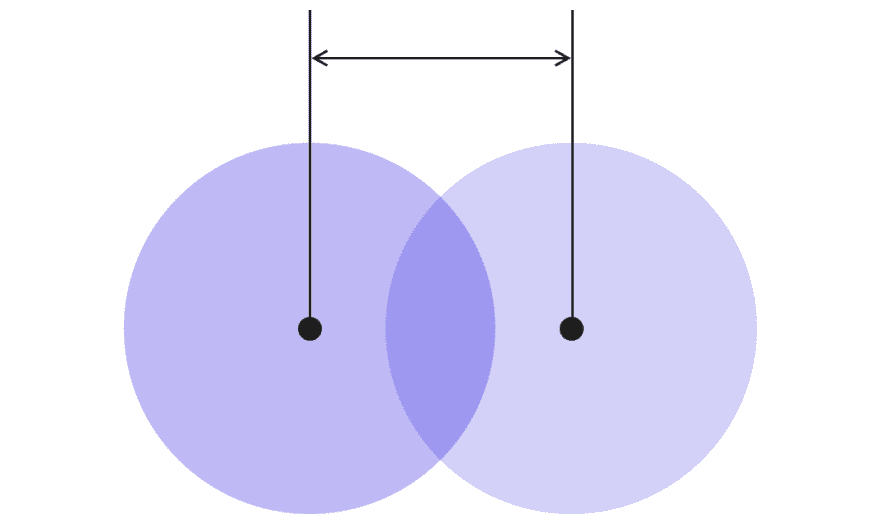

# React Native 中的可拖动聊天头

> 原文:[https://dev . to/prototyp/draggable-chat-heads-in-react-native-4f1g](https://dev.to/prototyp/draggable-chat-heads-in-react-native-4f1g)

我们大多数人都很熟悉脸书的悬浮头，它在所有其他应用程序之上尖叫着吸引你的注意力。在当时，这是一个新奇的概念，有点烦人，但仍然是新事物。

最近，我们有一个客户要求类似的行为，只是在应用程序中，这将显示可拖动的个人资料照片，这些照片可以通过重叠来配对。

[T2】](https://res.cloudinary.com/practicaldev/image/fetch/s--FauCj418--/c_limit%2Cf_auto%2Cfl_progressive%2Cq_auto%2Cw_880/https://thepracticaldev.s3.amazonaws.com/i/7zfkuqgp507z0gfy6pau.png)

因为你可能会略读这一部分，看看你期待的解决方案是否在这里，让我们开门见山。

我们使用了 **panResponder** 并将每个人包装在其中。

```
constructor(props: Props) {
        super(props);
        this.pan.addListener((value) => this.position = value);

        this.panResponder = PanResponder.create({
            onMoveShouldSetPanResponder: (evt, gestureState) => true,

            onPanResponderGrant: () => {
                this.pan.setOffset({
                    x: this.position.x,
                    y: this.position.y
                });

                this.pan.setValue({ x: 0, y: 0 });
            },

            // Move object while onPress is active. Snapping is handled later.
            onPanResponderMove: Animated.event([
                null, { dx: this.pan.x, dy: this.pan.y }
            ]),

            // Handle swiper behaviour after object is released.
            onPanResponderRelease: (e, { dx, dy, vx }) => {
                // Fix jumping when moving the object second time.
                this.pan.flattenOffset();

                // Send ending position to parent component.
                this.props.calculateOverlapping(dx, dy, this.props.person.id);

                // Animate springy tuff.
                Animated.spring(this.pan, { toValue: { x: 0, y: 0 } }).start();
            }
        });
    } 
```

# [](#register-initial-people-position)**登记初始人位置**

每个人都被包裹在一个动画里。视图组件，这意味着它是可拖动的。动画。视图和普通视图一样，有一个 onLayout 事件，在装载和布局更改时调用。

一旦事件被触发，我们就可以注册这个人的初始位置。它们被绝对定位，但是当报告位置时，它将使用基于它们所在的父元素的 XY 坐标(0，0 将是父元素的左上角)。

```
const newPersonPosition = new PersonPosition(Math.trunc(event.nativeEvent.layout.x + 30), 
Math.trunc(event.nativeEvent.layout.y + 30), userId); 
```

位置被截断，因为我们不需要水平和垂直位移报告的极端精度(**中的 **dx** 和 **dy** )。**

这里的 PersonPosition 只是一个构造函数，它创建一个具有水平和垂直位置的对象，以及 userId，稍后我们可以使用它来触发特定用户的事件。

此外，我还添加了 30，这是一个神奇的数字，是组件宽度和高度的一半。报告位置(**event . native event . layout . x**)是组件左上角的位置。如果你想在这方面更科学，正确的方法是检查一个组件的宽度和高度，并添加一半，但我知道我的是 60，所以我只是手动添加了一半。现在我们保存它，因为它是元件的中心，我们需要它来计算重叠。

然后将每个人的位置放入一个数组，保存到 state:

```
peoplePosition.push(newPersonPosition);this.setState({   peoplePosition}); 
```

这是为了有一个更简单的方法来比较未来的组件和所有其他的组件(使用 array 的 find 方法)。

# [](#checking-for-overlapping)**检查重叠**

主要部分是在用户释放人之后检查重叠。我们可以这样得到落点坐标:

```
const droppedX = Math.trunc(draggedPerson.startingPointX + dx);
const droppedY = Math.trunc(draggedPerson.startingPointY + dy); 
```

这里我们取被拖动人的水平起点，加上水平位移，然后对垂直轴重复。结果再次被截断以删除不需要的小数。

然后，对照没有被拖动的所有人的位置来检查该人的结束位置:

```
const matchedPerson = notDraggedPeople.find((personPosition: PersonPosition) => 
Math.abs(personPosition.startingPointX - droppedX) < 30 && Math.abs(personPosition.startingPointY - droppedY) < 30); 
```

如果被丢下的人在任何一个人的设定距离内，我们就有匹配了！这里的半径被硬编码为 30px，但是您可以根据需要设置它。

也许最好是元素宽度的一半+一些缓冲区，这样更容易成功重叠。您肯定希望避免使其大于重叠元素的总宽度，以避免误报。

[T2】](https://res.cloudinary.com/practicaldev/image/fetch/s--ZMIDT_QE--/c_limit%2Cf_auto%2Cfl_progressive%2Cq_auto%2Cw_880/https://thepracticaldev.s3.amazonaws.com/i/9tosuj4x8j5kl9bzmjki.png)

距离为 0 意味着两个组件完全重叠(它们的中心匹配)。距离 30(在我们的例子中)意味着它们被边缘接触。调整这个数字来决定你需要多精确才能得到一个成功的匹配。

如果匹配成功，只需将此人推送到 **matchedPeople** 数组，并保存到状态:

```
let matchedPeople = [];

if (matchedPerson) {
    matchedPeople.push(matchedPerson);    

    this.setState({
        matchedPeople
    });
} 
```

# [](#trigger-action-after-ovelapping)**重叠后触发动作**

最后，你大概是想在用户成功重叠两个头之后做点什么。

在我们的例子中，我们只是监听 ComponentWillUpdate:
中匹配的人的状态变化

```
componentWillUpdate(nextProps: Props, nextState: State) {
    if (nextState.matchedPeople.length) {
       // Navigate away from the screen
    }
} 
```

您应该在此处检查更改，以避免每个组件更新的过度触发，但是由于一旦出现成功的重叠(matchedPeople 数组被填充)，我们就离开了此屏幕，所以这是一个简单的检查逻辑。

如果您有使用 panResponder 的经验，这段代码应该很容易复制。如果你需要复习一下 panResponder，我已经写了另一篇文章来解决旋转圈选择项目的问题:

[https://medium . com/prototyped/circular-swiper-using-pan-responder-and-animated-library-b 78 eee 9784 a4](https://medium.com/prototyped/circular-swiper-using-pan-responder-and-animated-library-b78eee9784a4)

我哪里搞砸了吗？有更好的想法？请发送电子邮件至 [hello@prototyp.digital](mailto:hello@prototyp.digital) 或访问 [https://prototyp.digital](https://prototyp.digital) 联系我们。干杯！