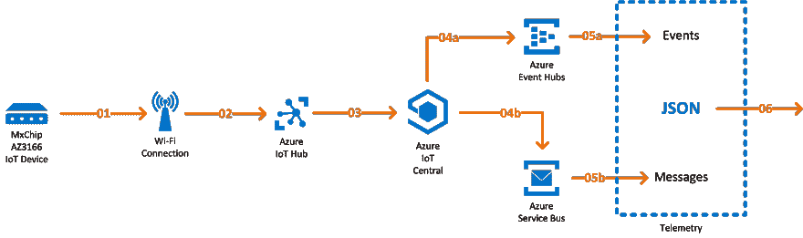
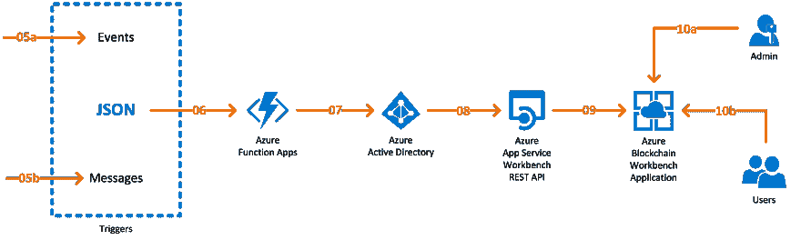

# 在器官运输中使用区块链和物联网

> 原文：<https://dev.to/idiwork/using-blockchain-iot-during-organ-transportation-4fe1>

技术使想象不可思议的事情成为可能，但我们不能忽视我们创造的原因:人。

我们必须继续创造，以改善我们的现在和未来，我们可以改善的最重要的问题之一是在医疗领域。在 idiWork 中，我们想象了将物联网与区块链结合起来运输挥发性货物的情况，例如移植手术中的器官。

通过物联网，我们可以获得器官状态的连续信息。有了 Azure 技术，我们可以实时传输关于器官的信息，而有了区块链，它可以在任何情况下以安全的方式传输。

此外，通过我们将与区块链创建的智能合同，我们将对整个流程中执行的每个操作进行细致的记录，此外还将确保参与的每一方同步，在需要的时间采取行动。

这是项目的结构，其中我们可以看到我们如何从物理设备获取信息，正确地注册它并注册它...

...以便每个事件和有用的信息能够到达所有相关的用户:

你想知道我们是怎么做到的吗？在 [idiWork 中，你会发现从物联网设备设置到 Azure 功能开发的详细的一步一步的过程，以了解这项技术如何工作并继续创造。](https://www.idiwork.com/projects/experiment-101/)

想了解更多？

### 第一部分:物联网设备设置🔌

在第[部分，我们将通过 Azure 物联网中心](https://www.idiwork.com/step-by-step-how-to-set-up-an-iot-device-in-azure-iot-hub/)进行物联网设备设置。

我们注册与我们一起工作的设备，配置它的 Wi-Fi 连接，并使 Azure 服务的信息传输成为可能。您甚至可以使用我们视频中的器件 MxChip AZ3166 来完成这一过程。看看这个:

[https://www.youtube.com/embed/WZLupmVKxKs](https://www.youtube.com/embed/WZLupmVKxKs)

### 第二部分:区块链 Worbench App🔒

[在第二部分，你将学习如何创建区块链 work bench App](https://www.idiwork.com/how-to-create-a-blockchain-workbench-app/)。这里我们将详细介绍这个过程中最重要的部分之一:智能合同。我们可以定义被运输器官的所有可能状态，最低和最高温度，以及在每种状态下运行的部件。因此，一切都是协调的，以避免错误，并促进所有各方在那一刻和以他们应该的方式行动。

### 第三部分:Azure 功能 App💻

最后，[第三部分将展示如何创建一个 Azure 函数 App 来注册所有的遥测数据](https://www.idiwork.com/experiment-101-how-to-create-and-azure-function-app-to-record-telemtry-readings/)。我们将指定我们注册的遥测值，您可以详细研究 C#中的代码，从中我们可以看到如何授权流程的操作，以及如何在 JSON 中序列化或反序列化信息。

你甚至可以看到这个实验在运行，不要错过！

### 这就是我们如何去想象、构建和创造一个伟大的未来。

请不要犹豫，访问 GitHub 上的资源库，我们在那里发布所有的实验:

##  [ idiWork ](https://github.com/idiWork) / [实验 _101](https://github.com/idiWork/Experiment_101)

### 在器官运输中使用区块链和物联网

<article class="markdown-body entry-content container-lg" itemprop="text">

# 实验#101 -器官运输

#### 在器官运输过程中使用区块链和物联网。

* * *

###### 项目日期:

*   2019 年 5 月至 8 月

###### 服务:

*   Azure 物联网中心
*   Azure 物联网中心
*   Azure 活动中心
*   Azure 函数
*   Azure 逻辑应用
*   Azure 区块链工作台

###### 使用的技术:

*   物联网
*   区块链

* * *

## 关于

该实验研究了将物联网(IoT)和区块链结合起来用于易挥发货物运输的可能性。物联网允许我们与设备通信，并从不同的传感器收集环境测量值，如温度和湿度。所涉及的不同组件发送和接收数据，区块链结构以安全的方式完整地存储、传输和验证这些数据。

## 想法

该实验试图模拟在从一个地点到另一个地点的挥发性货物运输中对环境条件的实时监控，始终验证所获得的值在既定的安全参数范围内。

## 效用

对于这个实验，我们选择了案例…

</article>

[View on GitHub](https://github.com/idiWork/Experiment_101)

感谢阅读，下次实验再见！