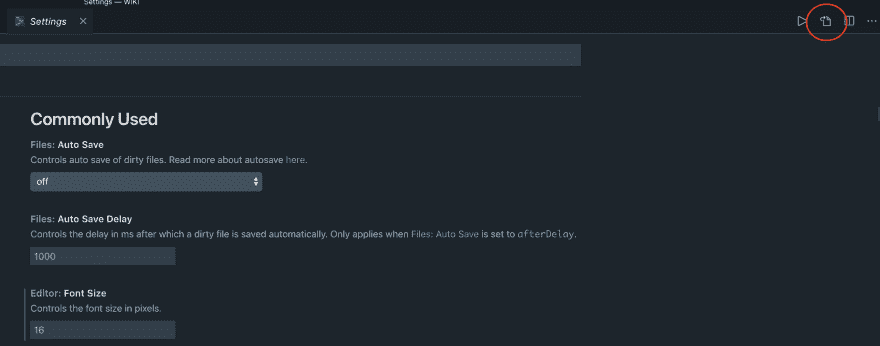

# 为你最喜欢的 VSCode 主题添加斜体支持

> 原文:[https://dev . to/salted-bytes/adding-italics-support-to-your-favorite-vs code-theme-2ec 9](https://dev.to/salted-bytes/adding-italics-support-to-your-favourite-vscode-theme-2ec9)

如果你和我一样，你会花时间让你的开发环境恰到好处。我是说，为什么不呢。你每天盯着它好几个小时。应该就是你喜欢的样子。

我住在 VSCode，它曾经是 NeoVim，但 VSCode 的类型脚本支持要好得多，所以我在大约一年前做了全职转换。我是那些使用带有连字和斜体变体的字体( [Dank Mono](https://dank.sh/) )的人之一，我想获得这些特性的所有好处。

所有 VSCode 主题都支持连字，因为这取决于您的编辑器。但是你怎么做呢？你最喜欢的主题不支持斜体。

谁不想要斜体字呢？太漂亮了！

[T2】](https://i.giphy.com/media/l4HohoX8ZsPIJwVxe/giphy.gif)

事实证明这非常简单。几乎所有东西都有一个设置，就是 VSCode。这包括改变你主题如何对待你代码的某些部分。

要打开设置(在 mac 上)，按下 **cmd +，然后点击标签右上角的按钮**

[T2】](https://res.cloudinary.com/practicaldev/image/fetch/s--WNpWLklX--/c_limit%2Cf_auto%2Cfl_progressive%2Cq_auto%2Cw_880/https://thepracticaldev.s3.amazonaws.com/i/cmf11wn9dlbikmnj240z.png)

首先我们需要将`"editor.tokenColorCustomizations"`属性添加到我们的设置文件中。然后，我们添加主题的名称作为关键字。这很棒，因为这意味着我们可以针对不同的主题使用不同的斜体设置。

```
"editor.tokenColorCustomizations":  {  "[Nord]":  {  "textMateRules":  []  }  } 
```

我们现在针对代码的不同部分进行设置。其结构如下:

```
{  "scope":  "emphasis",  "settings":  {  "fontStyle":  "italic"  }  }, 
```

**范围**是我们的目标，设置是我们希望如何影响我们选择的范围。记住，你也可以在这里改变其他设置，比如字体粗细，颜色等等，但是我们只关心代码中特定部分的斜体。

现在我不打算逐一介绍我的设置，但包括了我发现适合我的设置。

```
"editor.tokenColorCustomizations":  {  "[Nord]":  {  "textMateRules":  [  {  "scope":  "emphasis",  "settings":  {  "fontStyle":  "italic"  }  },  {  "scope":  "strong",  "settings":  {  "fontStyle":  "bold"  }  },  {  "scope":  "entity.other.attribute-name",  "settings":  {  "fontStyle":  "italic"  }  },  {  "scope":  "markup.underline",  "settings":  {  "fontStyle":  "underline"  }  },  {  "scope":  "markup.bold",  "settings":  {  "fontStyle":  "bold"  }  },  {  "scope":  "markup.heading",  "settings":  {  "fontStyle":  "bold"  }  },  {  "scope":  "markup.italic",  "settings":  {  "fontStyle":  "italic"  }  },  {  "scope":  "storage.type",  "settings":  {  "fontStyle":  "italic"  }  },  {  "scope":  "storage.modifier",  "settings":  {  "fontStyle":  "italic"  }  },  {  "name":  "String interpolation",  "scope":  [  "punctuation.definition.template-expression.begin",  "punctuation.definition.template-expression.end",  "punctuation.section.embedded"  ],  "settings":  {  "fontStyle":  "italic"  }  },  {  "scope":  "keyword.control",  "settings":  {  "fontStyle":  "italic"  }  },  {  "scope":  [  "keyword.operator.new",  "keyword.operator.expression",  "keyword.operator.cast",  "keyword.operator.sizeof",  "keyword.operator.logical.python"  ],  "settings":  {  "fontStyle":  "italic"  }  },  {  "name":  "this.self",  "scope":  "variable.language",  "settings":  {  "fontStyle":  "italic",  "foreground":  "#ff5874"  }  },  {  "name":  "@Decorator",  "scope":  ["meta.decorator punctuation.decorator"],  "settings":  {  "fontStyle":  "italic"  }  },  {  "scope":  ["punctuation.definition.comment",  "comment"],  "settings":  {  //  "foreground":  "#ff5874",  "fontStyle":  "italic"  }  }  ]  },  } 
```

我希望这对其他人有用。我喜欢能够选择任何我想要的主题，并轻松地按照我喜欢的方式调整它。

# [](#thanks-for-reading)感谢阅读🙏

如果我错过了什么，或者有更好的方法，请告诉我