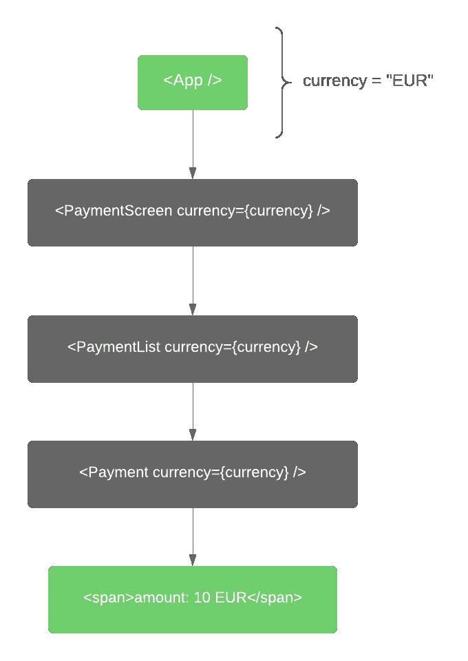
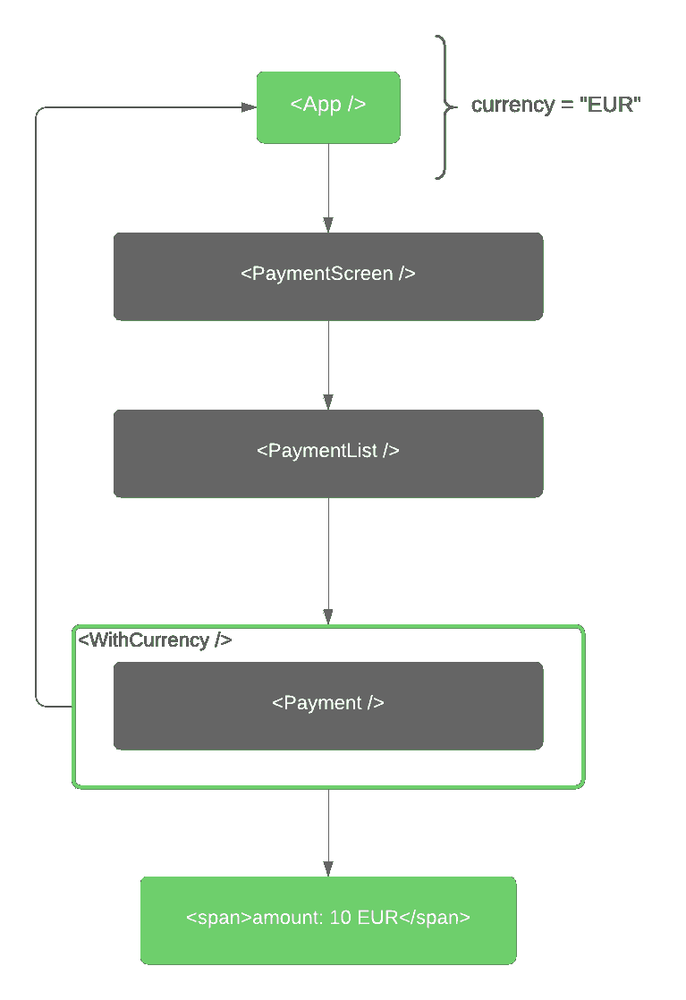
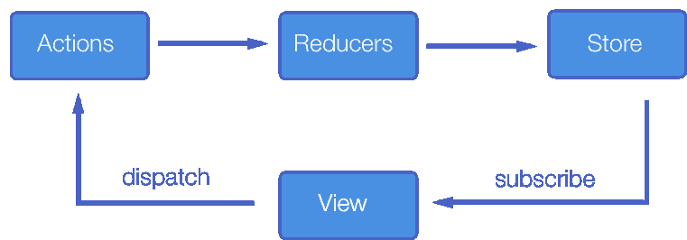
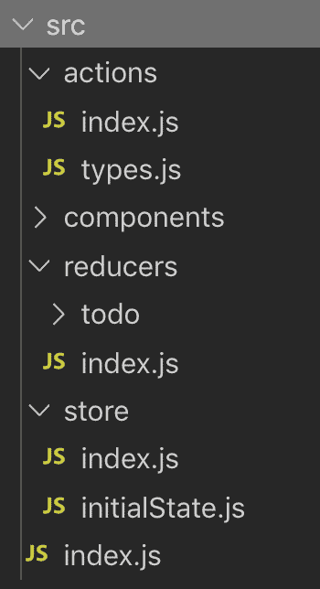

# 使用 react 挂钩和上下文进行全局状态管理

> 原文:[https://dev . to/vanderleisilva/global-state-management-with-react-hooks-and-context-5f6h](https://dev.to/vanderleisilva/global-state-management-with-react-hooks-and-context-5f6h)

> 从正确钻探到使用 react 进行集中式全局状态管理

这一切都始于令人惊叹的框架，如 react、vue、angular 和其他一些有着从文档对象模型(DOM)中抽象应用程序数据的绝妙想法的框架。具体来说，用你的[协调算法](https://reactjs.org/docs/reconciliation.html)和即将到来的[纤程架构](https://github.com/acdlite/react-fiber-architecture)来决定这些层(抽象和 DOM)更新的速度。有了它，我们可以专注于我们的组件，而不是“真正的”HTML 实现，然而，这也带来了一些其他新的挑战，让我们形象地说一下:

[T2】](https://res.cloudinary.com/practicaldev/image/fetch/s--KpkGZAFb--/c_limit%2Cf_auto%2Cfl_progressive%2Cq_auto%2Cw_880/https://thepracticaldev.s3.amazonaws.com/i/ak7lsuoiaf8gj97bgbh0.png)

这是经典的 prop drilling react 反模式，即遍历 react 组件树以便在它们之间传递属性的过程。如果你是一个更加面向对象的风格，更高阶的组件或装饰者，给我们更多的灵活性和一些其他的架构可能性。我们现在可以提取出我们想要共享功能，并修饰需要使用它的组件。

[T2】](https://res.cloudinary.com/practicaldev/image/fetch/s--ryTbzmav--/c_limit%2Cf_auto%2Cfl_progressive%2Cq_auto%2Cw_880/https://thepracticaldev.s3.amazonaws.com/i/hm8lrjy8ug62i8c6qj7f.png)

在处理很少有组件相互交互的小应用程序时，这一切都很好，但是当我们在一个巨大的组件生态系统之间进行复杂的通信时，这种方法就会变得复杂和容易出错。从这一现实出发，我们的单向数据流开始出现:

[T2】](https://res.cloudinary.com/practicaldev/image/fetch/s--F3hbAQwm--/c_limit%2Cf_auto%2Cfl_progressive%2Cq_auto%2Cw_880/https://thepracticaldev.s3.amazonaws.com/i/adxrxmo9fbz0kovolgjk.png)

到目前为止，没有什么新的东西，但是如果我们采用这个概念，并使用 react 上下文和钩子来应用它，会怎么样呢！？这就是你在这里的原因！

### [](#main-concept)主要概念

现在的主要亮点是我们伟大的新朋友 [react hooks](https://reactjs.org/docs/hooks-intro.html) ，以及您随后的功能方法:

> 钩子是 React 16.8 中的新增功能。它们允许您使用状态和其他 React 特性，而无需编写类。

然后，中心思想是使用[上下文 API](https://reactjs.org/docs/context.html) 和[使用上下文](https://reactjs.org/docs/hooks-reference.html#usecontext)和[使用证书](https://reactjs.org/docs/hooks-reference.html#usereducer)挂钩，使我们的存储对我们的组件可用。

```
import React, { createContext, useContext, useReducer } from 'react';

export const StateContext = createContext();

export const StoreProvider = ({ reducer, initialState, children }) => (
  <StateContext.Provider
    value={useReducer(reducer, initialState)}
    children={children}
  /> );

export const useStore = () => useContext(StateContext); 
```

我们从这个文件[源代码这里](https://github.com/vanderleisilva/react-context/blob/master/src/store/index.js)导出一个 **StoreProvider** (负责使上下文/存储在应用程序中可用)，它接收:

*   签名为**(状态，动作)= >新状态**的减速器功能；
*   应用初始状态；
*   以及申请内容(儿童)；

和负责从存储/上下文获取数据的 **useStore** 挂钩。

尽管术语不同，但从现在开始，我将把我们的上下文称为 store，因为概念是相同的，我们可以很容易地联想到我们众所周知的 redux 架构标准。

美丽就在于这种简单:

1.  **状态上下文。Provider** 接收一个值对象(你的当前状态)；
2.  **useReducer** 收到一个函数:(状态，动作)= > newState 和一个 initialState，然后从我们的应用程序发出的任何调度都将传递到这里，并更新我们的应用程序当前状态；
3.  **useContext** 获取我们的商店并使其在我们的应用程序中可用！

剩下的只是代码组织和小改动，没什么好担心的:)

### [](#going-into-details)进入细节

作为概念验证，我已经完成了这个基本的待办事项列表应用程序，[在这里检查源代码](https://github.com/vanderleisilva/react-context)和[在这里现场实现](https://vanderleisilva.github.io/react-context/)，它是一个基本的接口，包含了几个组件和当前的状态树，这样我们就可以看到状态随时间的变化。

项目结构如下所示:

[T2】](https://res.cloudinary.com/practicaldev/image/fetch/s--Czixna0s--/c_limit%2Cf_auto%2Cfl_progressive%2Cq_auto%2Cw_880/https://thepracticaldev.s3.amazonaws.com/i/tgrwmoymw57r81vfarlq.png)

结构非常简单(就像我们通常在 redux 应用程序中所做的那样)，我已经将 initialState 从 reducer 中移走，因为 reducer 是关于状态修改而不是定义的，除此之外，store 文件夹包含已经讨论过的 react 上下文/钩子实现。

减速器文件有一个完全不同的设计:

```
import * as todo from './todo';
import * as types from 'actions/types';

const createReducer = handlers => (state, action) => {
  if (!handlers.hasOwnProperty(action.type)) {
    return state;
  }

  return handlers[action.type](state, action);
};

export default createReducer({
  [types.ADD_TODO]: todo.add,
  [types.REMOVE_TODO]: todo.remove,
  [types.UPDATE_TODO]: todo.update,
  [types.FILTER_TODO]: todo.filter,
  [types.SHOW_STATE]: todo.showState,
}); 
```

这里的要点是避免那些通常在带有映射对象的 reducer 函数中看到的巨大的 switch 语句，所以基本上对于每个新的 reducer，我们只是在映射对象中添加一个新的入口。

但同样，这完全是一个实现的问题，这里的要求是函数需要有**(状态，动作)= >新状态**接口，就像我们已经习惯了 Redux 一样。

最后但同样重要的是，我们订阅商店的组件:

```
import React from 'react';

import { useStore } from 'store';
import { addTodo, filterTodo } from 'actions';

import uuid from 'uuid/v1';

import Button from '@material-ui/core/Button';

export default props => {
  const [{ filter }, dispatch] = useStore();

  const onClick = () => {
    dispatch(addTodo({ id: uuid(), name: filter, done: false }));
    dispatch(filterTodo(''));
  };

  return (
    <Button
      {...props}
      variant='contained'
      onClick={onClick}
      disabled={!filter}
      children='Add'
    />
  );
}; 
```

### [](#what-comes-next)接下来是什么

下一步将涉及中间件和类型检查，我们在这里如何工作？从技术上讲，中间件是一个在被分派的动作到达缩减器之前被调用的函数，所以上面的 **createReducer** 函数是一个很好的地方，那么类型检查呢！？打字稿在上面！很快再见！

*干杯！*

参考资料:
[https://github.com/acdlite/react-fiber-architecture](https://github.com/acdlite/react-fiber-architecture)
[https://reactjs.org/docs/reconciliation.html](https://reactjs.org/docs/reconciliation.html)
[https://reactjs.org/docs/hooks-intro.html](https://reactjs.org/docs/hooks-intro.html)
[https://github.com/vanderleisilva/react-context](https://github.com/vanderleisilva/react-context)