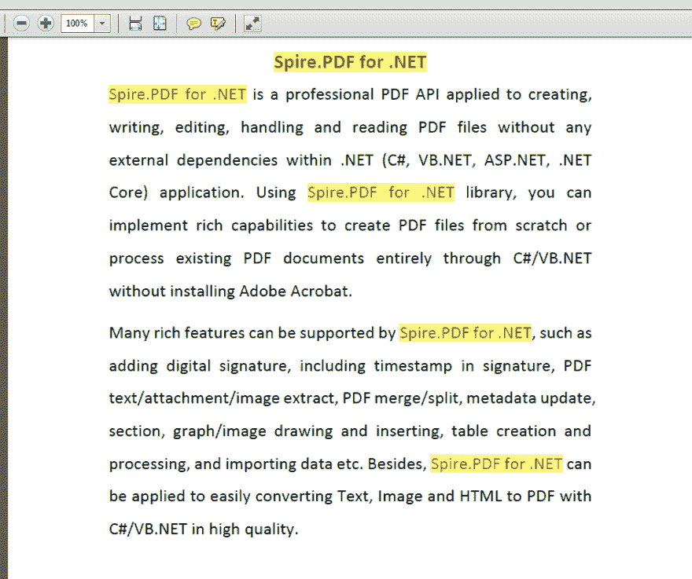
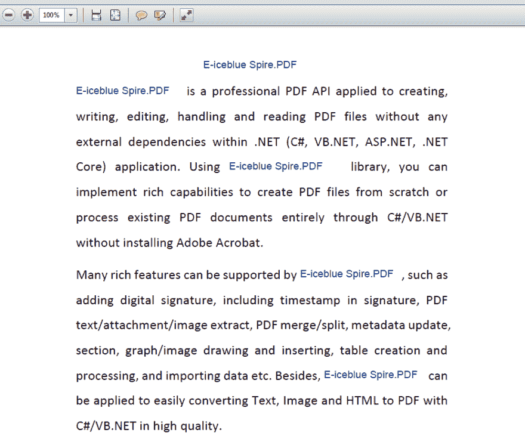

# 在 C#中查找、突出显示和替换 PDF 文档所有页面上的文本

> 原文：<https://dev.to/eiceblue/find-highlight-and-replace-text-on-all-the-pages-of-pdf-document-in-c-4doc>

简介
有时候，我们需要搜索 PDF 文件来获取特定的文本，但是可能会返回无数的结果。为了更方便地确认位置，我们需要在搜索时用背景色突出显示选中的文本。除了查找和突出显示功能，Spire.PDF 还支持替换所有 PDF 文档页面中的搜索文本。在这篇文章中，我们将给出如何在不使用任何第三方工具的情况下，用 C#编程来搜索、突出显示和替换 PDF 文件中的选定文本的解决方案。
在 PDF 文件的所有页面上查找并高亮显示搜索到的文本
查找 PDF 文档中的文本字符串并用新的文本字符串替换
**高亮显示搜索到的文本**
我们可以使用 page。FindText(string)方法和 foreach 语句要在整个 PDF 页面中查找指定的文本，请将搜索结果保存在 PdfTextFind 数组中，然后通过调用 find 突出显示选定的文本。ApplyHighLight()方法:

```
using Spire.Pdf;
using Spire.Pdf.General.Find;

namespace FindandHighlightTextonPDF
{
    class Program
    {
        static void Main(string[] args)
        {

            PdfDocument doc = new PdfDocument();
            doc.LoadFromFile("Sample.pdf");

            PdfTextFind[] result = null;

            foreach (PdfPageBase page in doc.Pages)
            {

                result = page.FindText("Spire.PDF for .NET",TextFindParameter.IgnoreCase).Finds;
                foreach (PdfTextFind find in result)
                {
                    //Apply highlight
                    find.ApplyHighLight();
                }
            }

            //Save the document
            doc.SaveToFile("Highlight.pdf");

        }
    } 
```

[](https://res.cloudinary.com/practicaldev/image/fetch/s--womr7BL4--/c_limit%2Cf_auto%2Cfl_progressive%2Cq_auto%2Cw_880/https://thepracticaldev.s3.amazonaws.com/i/hcz8fvrdfr01xw3iiffu.png)

**查找和替换:**
我们可以使用 page。FindText(string)方法和 foreach 语句在整个 PDF 页面中查找指定的文本，然后通过设置其字体和大小来绘制新的文本字符串以覆盖它们。

```
using Spire.Pdf;
using Spire.Pdf.Fields;
using Spire.Pdf.General.Find;
using System.Drawing;
using Spire.Pdf.Graphics;
using System;

namespace FindandReplaceTextonPDF
{
    class Program
    {
        static void Main(string[] args)
        {

            PdfDocument doc = new PdfDocument();
            doc.LoadFromFile("Sample.pdf");

            // Get the first page of pdf file
            PdfPageBase page = doc.Pages[0];

            //Searches "Spire.PDF for .NET" by ignoring case
            PdfTextFindCollection collection = page.FindText("Spire.PDF for .NET", TextFindParameter.IgnoreCase);

            String newText = "E-iceblue Spire.PDF";

            //Creates a brush
            PdfBrush brush = new PdfSolidBrush(Color.DarkBlue);
            //Defines a font
            PdfTrueTypeFont font = new PdfTrueTypeFont(new Font("Arial", 12f, FontStyle.Regular));

            RectangleF rec;
            foreach (PdfTextFind find in collection.Finds)
            {
                // Gets the bound of the found text in the first page
                rec = find.Bounds;

                page.Canvas.DrawRectangle(PdfBrushes.White, rec);
                // Draws new text use defined font and color
                page.Canvas.DrawString(newText, font, brush, rec);

            }

            //Save the document
            doc.SaveToFile("Result.pdf");

        }
    }
} 
```

[](https://res.cloudinary.com/practicaldev/image/fetch/s--Tsbq-JSC--/c_limit%2Cf_auto%2Cfl_progressive%2Cq_auto%2Cw_880/https://thepracticaldev.s3.amazonaws.com/i/dpuzqeplpa4bp06qftpw.png) 
结论

在 C#中，我们很容易使用查找、突出显示和替换 PDF 文件中的文本。感谢您的阅读，希望对您有所帮助。