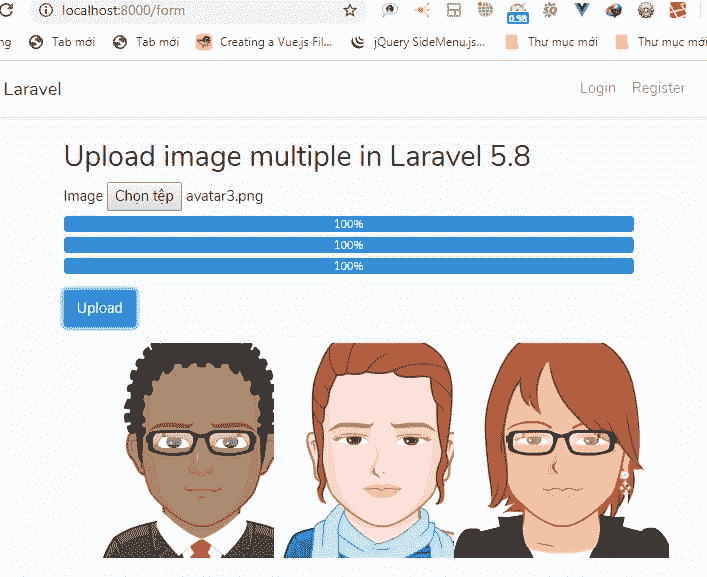

# 在 Laravel 5.8 中使用 Ajax 上传多张图片

> 原文:[https://dev . to/skip perhoa/multiple-image-upload-using-Ajax-with-laravel-5-8-1d 76](https://dev.to/skipperhoa/multiple-image-upload-using-ajax-with-laravel-5-8-1d76)

我与 laravel 5.8 分享使用 ajax 上传多张图片的方法。

[](https://res.cloudinary.com/practicaldev/image/fetch/s--1iJwtHfl--/c_limit%2Cf_auto%2Cfl_progressive%2Cq_auto%2Cw_880/https://thepracticaldev.s3.amazonaws.com/i/m3s7ga8schkpf43hbc0l.jpg) 
**安装工程**

```
composer create-project --prefer-dist laravel/laravel blog "5.8.*" 
```

当安装完项目 laravel 后，你可以在文件夹 Views/pages/upload . blade . PHP
中创建开始文件**upload.blade.php**

```
@extends('layouts.app')
@section('content')
<div class="container">
    <div class="row justify-content-center">
        <div class="col-md-10">
            <form action="" enctype="multipart/form-data" method="post" id="upload">
                <h2>Upload image multiple in Laravel 5.8</h2>
                <div class="form-group">
                    <label for="image 1">Image 1</label>
                    <input type="file" name="files"  class="selectImage" id="images"/>
                    <div class="show-progress">

                    </div>
                </div>
                <div class="form-group">
                    <button type="submit" class="btn btn-primary" id="uploadImage">Upload</button>
                </div>  
            </form>
        </div>
    </div>
    <div class="row justify-content-center" id="showImage">

    </div>
</div>
@endsection 
```

继续！您创建文件 js 并包含以下代码

```
 $(document).ready(function(){

            var i=0;
            var dataImage = new Array();
            var dataPosition = new Array();

            $("#images").change(function(){
                var checkImage = this.value;
                var ext = checkImage.substring(checkImage.lastIndexOf('.') + 1).toLowerCase();
                if (ext == "gif" || ext == "png" || ext == "jpg" || ext == "jpeg")
                {
                    change(this);
                    var file = document.getElementById('images').files[0];
                    dataImage[i]=file; //add push to array dataImage
                    dataPosition[i]=i;  //add push position to dataPosition
                   //created html progress
                    var html_progress = '<div class="progress" style="margin-bottom:5px;"><div class="progress-bar" id="progress-'+i+'" role="progressbar" style="width: 0%;" aria-valuenow="0" aria-valuemin="0" aria-valuemax="100">0%</div></div>';
                    $(".show-progress").append(html_progress);
                    i++;
                }
                else
                    alert("Please select image file (jpg, jpeg, png).")  
            });
            var change = function(input){
                if (input.files && input.files[0]) {
                    var reader = new FileReader();
                    reader.onload = function (e) {
                        var addImage = '<div class="col-md-3"></div>';

                        //add image to div="showImage"
                        $("#showImage").append(addImage);
                    }
                    reader.readAsDataURL(input.files[0]);
                }
            }
            var upload = function(data,position){
                var formData = new FormData();  
                   //append data to formdata 
                    formData.append('image',data);
                    var id = position;
                    $.ajaxSetup({
                        headers: {
                            'X-CSRF-TOKEN': $('meta[name="csrf-token"]').attr('content')
                        }
                    });
                    $.ajax({
                        type:'POST',
                        url:'http://localhost:8000/form/upload',
                        data:formData,
                        contentType: false,
                        dataType:'json',
                        processData: false,
                        cache:false,
                        xhr: function () {
                            console.log(id);
                            var xhr = new window.XMLHttpRequest();
                            xhr.upload.addEventListener("progress", function (evt) {
                                if (evt.lengthComputable) {
                                    var percentComplete = evt.loaded / evt.total;
                                    percentComplete = parseInt(percentComplete * 100);
                                    if(percentComplete==100){
                                        dataImage.splice(id, 1);
                                        dataPosition.splice(id, 1);
                                    }
                                    $("#progress-"+id).text(percentComplete + '%');
                                    $("#progress-"+id).css('width', percentComplete + '%');
                                }
                            }, false);
                            return xhr;
                        },
                        success:function(data){
                            console.log(data);
                        }

                    });
            }

            $("form#upload").submit(function( event ) {
                    event.preventDefault();
                    var k=0;
                    for(k=0; k<dataImage.length;k++){

                        /**
                         * Function Upload
                         * params 1: data image
                         * params 2: position[ progressbar-1 or progressbar-2,...]
                         */
                        upload(dataImage[k],dataPosition[k]);
                    }    
            });

        }); 
```

上面的代码，包括事件，当点击图片时，上传图片。
在 laravel 上传图片到文件夹的代码如下
在文件夹 App \ Http \ Controllers \ form controller . PHP
中创建文件**FormController.php**

```
<?php

namespace App\Http\Controllers;

use Illuminate\Http\Request;

class FormController extends Controller
{
    public function index(){

        return View('pages.upload');
    }
    /**
     * UPLOAD IMAGES
     */
    public function store(Request $request){
      if($request->hasFile('image')){
          $file = $request->file('image');
          $name = $file->getClientOriginalName();
          $exection = $file->getClientOriginalExtension();
          $file->move(public_path().'/uploads/', $name);
          //echo public_path().'/uploads/';
          return Response()->json(array('success'=>1,'message'=>'Upload success!'));
      }else{
        return Response()->json(array('success'=>0,'message'=>'Upload error!'));
      }
    }
} 
```

文件夹 routes/web.php 中的配置文件 web.php

```
Route::prefix('form')->group(function () {
    Route::get('/','FormController@index')->name('form.index');
    Route::post('/upload','FormController@store')->name('form.store');
}); 
```

成功！你运行命令

```
php artisan serve 
```

[http://localhost:8000/form](http://localhost:8000/form)

Post: [使用 Ajax 和 Laravel 5.8 上传多个图片](https://hoanguyenit.com/multiple-image-upload-using-ajax-with-laravel-58.html)